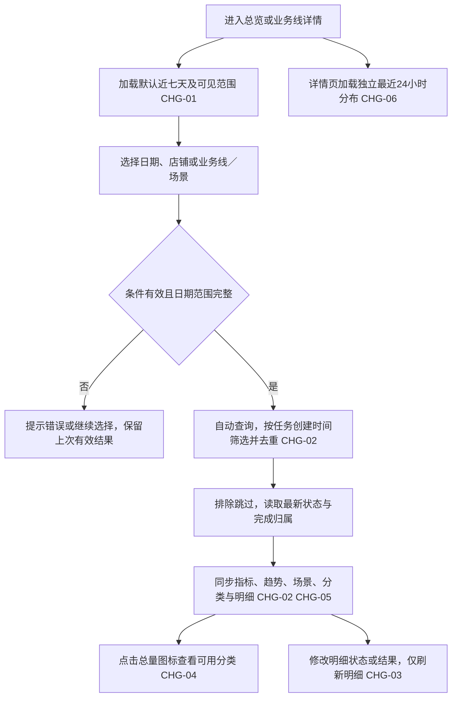

# 客服Agent看板｜抖音开发分册 V1.0

版本：2026-09-29。状态：PRD初版，供开发与测试评审；不代表已实现或上线。

本册面向：**抖音业务线开发**。无需阅读其他业务线分册。下方“统一实施契约”保留统一字段与验收；出现其他业务线的例子用于解释共享规则，不增加本线接入范围。页面归属按本册“必须交付”和“不负责”执行。

总文档：[统计口径与交互优化增量PRD](../客服Agent看板_统计口径与交互优化_增量PRD_V1.0.md)。原型：[业务确认原型](../dashboard-demo/index.html)。

## 本线必须交付

- **基线**：抖音退款／换货PRD及现有任务状态与OMS结果。
- **页面与能力**：本业务线详情及统一数据输出；覆盖退货退款、已／未发货退款和换货场景。
- **本线差异**：按明确业务类型映射退货退款、仅退款、换货；没有其他工单场景就不补第四类。换货完成沿用原PRD：补发订单与手工配货均取得有效结果，不以等待买家签收作为新的结束门槛。
- **不负责**：不修改抖音退款或OMS换货链路；不把只创建补发订单但配货未成功的任务算完成。
- **数据依赖**：对接原始创建时间、两段换货动作终态、人工处理闭环和实际结束时间；使用既有受控店铺身份键，不临时以展示别名代替。

## 本线验收重点

1. 按任务首次创建时间筛选、读取当前最新状态，重复扫描和重试不增总量，跳过排除。
2. 纯自动完成与人工完成互斥；人工完成必须已转人工、最终人工处理并结束。不能拿转人工数量替代。
3. 总量＝已完成＋尚未完成；已完成＝纯自动＋人工；自动化率＝纯自动／总量。
4. 分类按配置场景类型决定，有几类展示几类；前三类均不存在则隐藏入口，有类型但当期零数量仍显示0。
5. 日期、店铺、场景自动查询；趋势按日／周／月切换。明细局部筛选不改上方汇总；场景列表无下钻。
6. 提交本线真实字段与状态样本对账结果；演示数据、模拟接口通过不能代替生产数据验收。

## 统一实施契约（本册内完整保留）

## 1. 本期需求与 AI 能力概览及 CHG 索引

| CHG | 模块 | 功能点 | 类型 | AI能力变化 | 价值 |
|---|---|---|---|---|---|
| CHG-01 | 查询条件 | 今日、近七天、近30天、自定义及自动查询 | 调整 | — | 各业务线采用一致的查询方式 |
| CHG-02 | 汇总指标 | 有效工单去重、当前完成状态、纯自动与人工完成分离 | 调整 | — | 总量可核对，人工处理不计入纯自动贡献 |
| CHG-03 | 订单明细 | 实际处理完成时间及状态、结果筛选 | 优化 | — | 区分转交与实际结束，便于核查 |
| CHG-04 | 业务类型 | 总量与完成量图标浮层，按场景类型决定分类可见性 | 调整 | — | 支持多少类展示多少类，不制造空分类 |
| CHG-05 | 趋势图 | 依据所选跨度按日、自然周、自然月聚合 | 优化 | — | 长时间范围仍能看清变化 |
| CHG-06 | 时段分布 | 独立滚动最近24小时窗口 | 调整 | — | 保留近期处理时段观察能力 |
| CHG-07 | 场景分布 | 删除场景行点击下钻及提示 | 下线 | — | 场景区只承担统计展示 |
| CHG-08 | 查询区视觉 | 浅灰底色、左对齐条件、统一下拉浮层 | 优化 | — | 统一查询体验，保留既有卡片样式 |

本期不增加模型调用或Agent执行能力，AI能力变化均为“—”。

## 4. 本期范围边界

### 4.1 明确不做

- 不涉及质检会话需求，不新增质检指标。
- 不修改退款、拒绝、补发、换货的自动判断及执行规则。
- 不新增审批、消息通知、权限管理、批量处理、导出或工单操作能力。
- 不恢复查看方案按钮、顶部原型说明卡、拆分预览切换、查询／重置按钮或场景下钻。
- 不把原型里的店铺示例、数量、场景能力和固定演示日期当作生产事实。
- 不调整卡片边框、阴影和主体布局；本期视觉范围为页面底色和查询元素。

### 4.2 限制

原型现有自定义查询最多367天是演示保护，不是业务上限。生产查询最大跨度、历史可用起点、分页大小及性能约束由开发核实既有能力并在评审记录，不能因原型限制擅自删减已确认的按月聚合能力。

## 5. 用户、权限与主流程

### 5.1 角色前提

客服主管、运营及既有授权人员通过现有看板入口访问。店铺及业务线选项只列当前账号可见范围，“全部”仅指全部授权且已接入的数据。查询和查看浮层均为只读操作；不扩大既有业务权限。

### 5.2 主流程

### 5.3 请求与恢复

条件切换立即触发对应查询。连续切换时仅最后一次有效请求能更新页面，较早响应不能覆盖新条件。查询失败保留上一次结果并明确标记失败及其原查询范围，不能让新筛选标签和旧数据伪装成同一份结果。重新选择有效条件可重试；无需恢复查询按钮。

## 6. 页面与交互

| 区域 | 行为 | 关联 |
|---|---|---|
| 左侧导航 | 沿用平铺导航；总览进入业务线详情时保留日期与店铺，场景恢复全部；明细状态、结果恢复全部 | CHG-01 |
| 日期选项 | 今日／近七天／近30天／自定义；默认近七天，近N天包含当天；不显示“日期范围”前缀 | CHG-01 |
| 自定义日期 | 仅选自定义时显示起止输入框和双月日历；选完整个范围自动查询；反向选日自动排序；同日可选 | CHG-01 |
| 手工日期 | 完成输入并离开字段或按Enter时校验；日期非法或结束早于开始则不替换有效数据 | CHG-01 |
| 全局下拉 | 总览为店铺、业务线；详情为店铺、当前业务线场景；选择后自动更新整页，24小时图除外 | CHG-01 |
| 查询区 | 不显示查询、重置按钮；条件统一靠左，白底圆角下拉浮层，浅灰选中项、展开淡红描边与向上箭头 | CHG-08 |
| 指标卡 | 总量、已完成、纯自动完成、人工完成、尚未完成、自动化率 | CHG-02 |
| 分类浮层 | 仅总量、已完成两卡显示入口；点击打开，外部点击、Escape或查询更新关闭 | CHG-04 |
| 明细筛选 | 状态与结果为交集关系，选择后自动刷新明细并回第1页；不反向改变汇总、趋势和场景 | CHG-03 |
| 业务场景分布 | 展示每个场景的总量、Agent完成、人工完成、待完成；跟随全局条件，不可点击下钻 | CHG-07 |
| 页面底色 | #F5F7FA；主色沿用#D9353F | CHG-08 |

完成时间字段没有值且尚未完成时显示“—”；已完成但真实完成时间缺失属于数据缺失，不能补转交时间。未选中的分类不展示，已配置但当期零数量的分类展示0。数据请求失败不显示成“暂无数据”。

## 7. 业务与统计规则

### R-01 统计对象、去重与跳过排除（CHG-02）

统计对象是已进入对应Agent业务处理范围的有效工单／售后任务，不是订单商品件数，也不是扫描次数。关联订单号仅用于追溯；同一订单下两个独立售后单分别计数。

按现有业务任务唯一标识去重，并保留平台与店铺隔离。拼多多退款沿用“店铺ID＋售后编号”；物流工单沿用平台工单编号及店铺归属。跨平台汇总不能只按裸编号去重。同一任务重复扫描、重试和后续状态更新不增加总量；归属日期保持首次任务创建日期，不用重试时间覆盖。

直接跳过的非处理范围、已撤销、早已完成任务不进入本期总量、完成量、未完成量、分类、趋势和核心明细。不得因为系统把跳过记录关闭就视为业务完成。已转人工并经人工处理后关闭的有效工单，按人工完成统计，保留其退款、拒绝、撤销等实际结果。

### R-02 日期归属与状态快照（CHG-01、CHG-02）

整页核心统计按工单任务创建时间created_at归属，不按交易订单下单时间、扫描重试时间或完成时间归属。选定起止日期后，取这批有效唯一任务在本次查询时的最新业务状态。

日期按北京时间Asia/Shanghai解释，范围为开始日00:00:00至结束日次日00:00:00，左闭右开。今日取当天；近七天为当天及之前6天；近30天为当天及之前29天。显示完整自然日期，但不制造当前时刻之后的业务数据。

例：9月28日创建、9月29日完成，查询9月28日的结果中已完成量会更新，明细显示9月29日的完成时间；查询9月29日创建的任务不包含这单。历史查询是“该批任务当前结果”，不是历史日终快照，因此完成量可以随后续处理更新。

### R-03 完成与处理归属（CHG-02、CHG-03）

- 工单按对应业务流程实际结束后才计入已完成；任务阶段提交成功、待物流反馈、待重试、已转人工或待验证均不能直接等同于结束。
- **纯自动完成**：Agent独立处理并结束，未发生人工介入完成；有可核验的业务终态和完成归属。
- **人工完成**：同时满足已转人工、最终由人工实际处理、工单已结束。仅发通知、人工已接单或人工处理中都不计入。
- 两类互斥。按最新有效完成归属归一，每单只计一次；不可先计自动、再计人工造成重复。转人工后按既有SOP停止自动执行并追踪人工结果。
- 退款拒绝、人工撤销等不必等同于退款成功，但经人工处理并真实关单时可计人工完成；处理结果仍明确展示拒绝或撤销，不改写成退款成功。
- 原始结果未知后人工核验并完成闭环的任务，按旧PRD的manual_assisted规则归人工完成；自动动作已经发生不等于整单纯自动完成。

### R-04 指标公式（CHG-02）

设S为R-01、R-02及当前授权、店铺、业务线／场景筛选所得的有效去重集合，T为其任务数，A为其中纯自动完成数，M为其中人工完成数。

| 指标 | 规则 |
|---|---|
| 所选时段业务总量 | T＝S中的唯一任务数 |
| 已完成总量 | C＝A＋M，亦为S中符合结束规则的任务数 |
| Agent纯自动完成 | A |
| 人工完成 | M |
| 尚未完成 | U＝T－C，包含处理中、待人工、等待、待验证、暂停或未闭环异常 |
| 自动化率 | A／T×100%，保留1位小数；T＝0显示“—” |

自动化率既不使用(A＋M)／T，也不使用A／C。跨平台比例先合并计数再计算，不对各业务线百分比求平均。排名按未四舍五入的比率比较，图中统一保留1位小数；无分母的业务线不参与排名，显示暂无数据。

必须核验T＝C＋U、C＝A＋M。若结束状态与完成归属冲突、归属缺失或同一任务存在多个最终主体，则属于数据异常，不能用“总量－Agent量”强补人工完成，也不能把已结束任务伪装成尚未完成。受影响的拆分和比率显示不可用，保留可核验总量并明确提示数据不完整，待源数据补齐后恢复。

### R-05 类型映射与浮层（CHG-04）

业务类型为退货退款、仅退款、换货、其他工单，采用业务场景配置中的明确类型字段／映射，不根据场景名称关键词、订单数量或成功结果倒推。已明确不属于前三类的场景归其他工单；字段缺失且无法核实的映射不静默归其他，应先完成取数映射核验。

每条业务线依据已配置的场景类型确定可展示类别，有几类显示几类。可见性不受当期任务数量、状态或明细筛选影响。前三类均不存在时，两卡均不显示拆分入口；仅有其他工单不单独弹出拆分。

本线分类要求见本册“本线必须交付”。生产场景ID和类型映射需与业务配置核对，原型名称不替代接口字段。

总量浮层在S中按类型计数、占比以T为分母；完成量浮层只在S中已完成任务中按类型计数、占比以C为分母。类型互斥，完整分类合计等于对应卡片数量；零分母占比为“—”。跨平台总览取可见业务线的类型并集，保留实际其他工单，不用差额补齐分类；能力或映射缺失时说明覆盖范围，不展示虚构的0。

### R-06 业务量趋势聚合（CHG-05）

粒度根据所选日期范围的完整跨度判断，含起止日；不能根据有数据的天数判断。数据仍按创建时间聚合。

| 范围天数 | 粒度 | 分桶 |
|---|---|---|
| 1—31 | 日 | 每个自然日 |
| 32—180 | 周 | 自然周，周一至周日 |
| ≥181 | 月 | 自然月 |

首尾桶与查询范围求交集，只统计交集内任务。示例：选9月2日—10月10日，按周展示，首桶仅覆盖9月2日起的当周部分，尾桶截止10月10日，不查询范围外记录。

横轴按时间正序，跨年时标明年份；标题或副标题标注按日／按周／按月。悬停显示桶实际起止日期、业务线和去重数量。无业务的完整桶补0；各桶数值相加等于同口径总量。调整粒度仅改变汇总展示，不改变原始任务数和筛选范围。

### R-07 独立最近24小时分布（CHG-06）

确认范围为滚动最近24小时，独立于顶部日期、店铺、场景及明细筛选；切换业务线时切换该业务线，仍遵循账号的数据可见权限。

**本版细化供技术评审：**该图标题为“24小时处理时段分布”，采用有效工单的实际完成时间观察近期处理量，统计纯自动与人工实际完成的去重工单；查询时刻t对应窗口[t－24小时，t)，按1小时分24桶，首尾不扩大到自然日。悬停展示每桶实际起止日期及数量，横轴不能仅显示固定0—23点而丢失跨日关系。其时间基准独立于R-02的创建日期筛选。实施前需核实既有24小时图采用的事件字段；若原系统取的是开始处理事件，须提交此项差异给产品确认，不能在接口映射时悄悄替换。

### R-08 明细与场景联动（CHG-03、CHG-07）

明细取S后再叠加状态、结果过滤，两个条件为“且”，不反向改变S。保持现有倒序与分页方式，查询变化回第1页。展示工单／任务编号、任务创建时间、店铺、场景、处理状态、处理结果、实际完成时间；沿用字段的物理名称由接口映射，不编造来源。

完成时间必须来自对应业务实际结束时刻，人工任务取人工完成时刻，纯自动任务取自动完成时刻。检测到完成的轮询时刻或记录更新时间不是实际完成时间；历史记录取不到时显示“—”并标注数据缺失，不回填猜测值。

场景列表按全局场景条件缩小展示，逐场景使用与指标相同的T、A、M、U定义。列表是静态统计行，无点击处理、跳转、自动选择筛选项或下钻提示。

## 8. 状态、异常与边界

以下为看板映射约束，不新建Agent状态机。

| 源业务事实 | 看板归属 | 完成时间 | 关键约束 |
|---|---|---|---|
| 自动独立结束 | 纯自动完成、已完成 | 实际自动结束时间 | 无人工完成介入 |
| 已转人工且人工最终处理结束 | 人工完成、已完成 | 实际人工结束时间 | 转交和终态证据同时存在 |
| 仅转人工／人工接单 | 尚未完成 | — | 不计人工完成 |
| 处理中／等外部结果／待重试／暂停 | 尚未完成 | — | 阶段性成功不能提前结束 |
| 待验证、未闭环异常 | 尚未完成 | — | 后续闭环后按最终归属计一次 |
| 直接跳过而关闭 | 排除核心集合 | 核心明细不展示 | 不计成功、失败或尚未完成 |
| 历史完成但归属、时间或类型缺失 | 数据不完整 | 缺失字段为— | 不伪造分类、归属或完成时间 |

暂无匹配数据时数量显示0、比率显示“—”、明细显示“暂无符合条件的订单”；有场景类型但没有业务仍显示该分类的0。无权限的数据不能通过筛选或汇总推测得到。数据同步失败与真实零业务必须区分。

## 9. 数据对象与字段契约

下表为报表适配所需逻辑字段；已在旧PRD存在的字段名注明“沿用”，其他名称为建议，不指定表名、接口路径或存储架构。

| 字段 | 含义／类型 | 必要性与校验 | 来源 |
|---|---|---|---|
| platform、business_line | 平台与业务线标识／string | 必须稳定，区分平台和业务线，防跨线重复聚合 | 现有业务配置，物理字段待核验 |
| store_id | 店铺标识／string | 必须稳定；不能用展示别名代替唯一键 | 沿用店铺配置 |
| task_key | 报表唯一任务键／string | 平台命名空间＋店铺＋业务任务编号；同单多个售后不可错误合并 | 现有工单／售后系统，建议逻辑字段 |
| created_at | 首次任务创建时间／datetime | 必填；不可使用重试或最后更新时间覆盖 | 沿用旧PRD字段 |
| eligible、skip_reason | 是否纳入核心业务及跳过原因／bool、enum | 必填；排除直接跳过 | 建议逻辑字段，映射旧任务及范围规则 |
| scene_id、scene_type | 场景ID、分类／string、enum | 分类映射需完整且互斥；不由订单数量决定 | 场景配置，实际枚举待核验 |
| task_status、result | 当前业务状态与结果／enum、string | 状态、结果分开；必须能判断是否业务结束 | 沿用旧状态／业务结果 |
| handoff_status | 人工接管状态／enum | 沿用none/pending/accepted/closed等现有映射；仅接管不代表完成 | 旧PRD及人工工单系统 |
| completion_mode | 最终完成方式／enum | 沿用pure_auto/manual_assisted；已完成必有且二者互斥，人工归属还须通过R-03条件 | 旧PRD及处理日志 |
| actual_completed_at | 实际业务结束时间／datetime | 完成后需要；未知保留空并标缺失，不以扫描时间替代 | 建议逻辑字段，现有业务完成证据映射 |
| updated_at | 记录最后更新时间／datetime | 用于同步和最新状态选择，不作统计日期 | 沿用旧PRD字段 |
| data_as_of | 本次统计数据截至时间／datetime | 整页响应使用一致统计截点，明确新旧结果 | 建议响应字段 |

## 10. 依赖、历史兼容与安全

本期只读取业务、状态、接管和完成结果，不新增AI职责或模型输入输出契约。

| 项目 | 处理要求 |
|---|---|
| 历史任务 | 使用既有唯一键、原始创建时间与可核验最新状态；能从原始证据补齐的字段由开发核验后迁移，不按旧指标差值反推归属 |
| 缺失字段 | 接口返回明确的数据缺失状态；不能把未知当0、把全部人工协助当人工完成或把更新时刻当完成时刻 |
| 字段切换 | 保留旧报表指标语义映射，不能将旧“自动化成功率”直接重命名后交付；切换前用同一数据集双算核对 |
| 账号权限 | 复用现有服务端权限，全部店铺不突破授权范围；本期不新增独立权限体系 |
| Agent及通知 | 沿用各业务PRD的接管、通知、重试和终态规则；看板不触发退款、重试或通知 |
| 同步时效 | 沿用现有看板同步链路；拼多多旧目标为5分钟刷新、状态1分钟内可见，原文仍需技术核实，不能据此承诺全平台SLA |
| 自动查询 | 条件切换立即发起有效查询；与后台周期同步是两件事，不将“切换自动查询”写成数据实时到账保证 |
| 隐私 | 沿用现有内部访问与脱敏，报告只使用必要标识，不新增客户身份、凭据或原始聊天内容展示 |

## 11. 验收标准

| AC | 关联 | 前置／操作 | 可观察预期 |
|---|---|---|---|
| AC-01 | CHG-01/R-02 | 进入总览，切今日、近七天、近30天 | 默认近七天；每次选择自动更新对应创建日期集合；无查询／重置按钮 |
| AC-02 | CHG-01/R-02 | 自定义只选第一个日期，再选第二个日期 | 首次不应用不完整范围；选完后自动查询；反向排序、同日均可用 |
| AC-03 | CHG-01/R-02 | 输入非法日期或结束早于开始 | 提示错误，保留上次有效结果；合法输入后恢复 |
| AC-04 | CHG-02/R-01 | 同一售后任务扫描3次、重试2次 | 总量计1；两个不同售后编号即使同订单仍计2；跨平台同裸编号分别计数 |
| AC-05 | CHG-02/R-01 | 10条扫描记录中2条直接跳过，其余8条有效 | 核心总量8；两个跳过项不进入趋势、分类、明细和完成／未完成 |
| AC-06 | CHG-02/R-02 | 28日创建、29日完成，查询28日 | 包含该任务且计已完成，实际完成时间为29日；查29日创建集合不含此单 |
| AC-07 | CHG-02/R-03 | 10条有效任务：自动完成4、人工完成3、待人工2、处理中1 | 总量10、已完成7、纯自动4、人工3、尚未完成3、自动化率40.0% |
| AC-08 | CHG-02/R-03 | 工单转人工，仅通知或已接单；之后人工实际关单 | 关单前人工完成不增加；关单后增加1、未完成减少1，总量不变 |
| AC-09 | CHG-02/R-03 | 自动结果未知后转人工，人工核验并闭环 | 只计人工完成1，不重复计纯自动；结果记录保留实际核验结论 |
| AC-10 | CHG-02/R-03 | 物流动作已提交但仍等待外部跟进 | 不因旧“处理成功”标签提前计已完成 |
| AC-11 | CHG-03/R-08 | 修改明细状态与结果，翻页，再变条件 | 两条件取交集；只影响明细；变条件回第1页，汇总不变 |
| AC-12 | CHG-03/R-08 | 待人工时间已知但尚未完成；历史完成时间缺失 | 未完成显示—；缺失时间不填转交或同步时刻，并标数据缺失 |
| AC-13 | CHG-04/R-05 | 本线仅配置其他工单的测试场景，无前三类 | 总量卡、完成卡均无拆分入口，非因为订单数为0 |
| AC-14 | CHG-04/R-05 | 本线测试配置包含退货退款与换货，所选时段换货为0 | 两类均显示；不显示仅退款；换货显示0 |
| AC-15 | CHG-04/R-05 | 其他工单场景名包含“退款” | 按场景类型显示其他工单，不能按名称归仅退款 |
| AC-16 | CHG-04/R-05 | 总量10、完成7，点击两张卡图标 | 分别以10、7为分母，分类计数取对应集合；外部点击／Escape关闭 |
| AC-17 | CHG-05/R-06 | 依次选择31、32、180、181天 | 分别按日、周、周、月；按所选跨度决定，不受样本只有60天影响 |
| AC-18 | CHG-05/R-06 | 范围横跨周／月／年、首尾不是周期边界 | 不扩展查询范围；空桶0；标签及悬停有实际日期；各桶合计等于总量 |
| AC-19 | CHG-06/R-07 | 刷新时刻跨日；修改顶部日期、店铺、场景 | 仍为该业务线独立滚动24小时；不随上述条件缩放；切业务线后切换数据 |
| AC-20 | CHG-06/R-07 | 完成时刻恰在窗口起点、终点或桶边界 | 左闭右开：起点纳入、终点排除，中间边界只落入一个桶；以评审确认的事件字段核验 |
| AC-21 | CHG-07/R-08 | 点击／悬停业务场景统计行 | 无下钻、无筛选变化、无按钮式悬停提示 |
| AC-22 | CHG-08 | 宽屏及窄屏查看查询区 | 条件靠左且可换行，下拉浮层可选；卡片边框和阴影保留 |
| AC-23 | CHG-01、CHG-02 | 连续切换条件，旧请求后返回；另模拟查询失败 | 旧响应不覆盖新结果；失败不当作零业务，新旧查询范围不混用 |
| AC-24 | CHG-02、CHG-04 | 无数据、零分母、缺失完成归属分别查询 | 真零数量为0、比率—；已配置分类保留0；未知归属不能被推成人工或显示假比例 |
| AC-25 | CHG-01、CHG-02 | 仅有部分店铺权限的账号选择全部 | 全部指标、下拉与独立24小时图均不含越权数据 |

数据验收采用可追溯的脱敏任务清单、统计结果和截图；原型脚本检查只能证明演示逻辑，不替代生产字段核验与业务UAT。

## 12. 技术评审与交接事项

| 编号 | 类型 | 事项 | 约束及不确认影响 | 责任角色 |
|---|---|---|---|---|
| T-01 | 技术取数 | 各平台任务创建、业务终态、人工接管、最终主体、实际完成时间映射 | 缺乏完成或主体证据则无法准确计算，不得沿用旧转人工时间冒充 | 开发、数据对接、测试 |
| T-02 | 技术取数 | 现有场景ID与四类映射，以及业务线归属 | 不按名称关键词推断；上线前核对业务配置，不把原型场景名当生产ID | 开发、业务配置负责人 |
| T-03 | 技术兼容 | 历史回填、最大查询跨度、同步刷新与一致快照能力 | 明确可用日期和数据缺失；不编造全平台性能或SLA | 开发、测试 |
| T-04 | 细化评审 | 24小时图既有事件字段与本版“实际完成时间”细化定义 | 滚动最近24小时与独立范围已确认；若旧图采用开始处理时刻，先提交差异由产品确认，再实施 | 产品、开发 |
| T-05 | 技术验证 | 生产状态、人工闭环及跳过映射的样例对账 | 覆盖拒绝、撤销、待验证、跳过关闭，验证A＋M覆盖真实完成集合；缺失或冲突必须标异常 | 开发、测试、业务 |

交付顺序：评审本文及原型 → 完成字段和历史兼容核验 → 对账与开发 → 按AC清单测试及业务验收。旧PRD原件保留，本期看板变化以本文为准；接口、表结构和部署方案由开发设计，不能扩展到Agent业务操作。

## 本线交付检查

- 字段映射与场景类型清单。
- 核心统计及完成归属样例对账。
- 本线页面和接口自测，覆盖正常、零业务、无权限、缺失与请求失败。
- 与跨平台总览核对同条件总量、自动、人工、未完成及类型合计。
