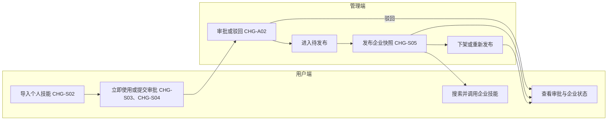
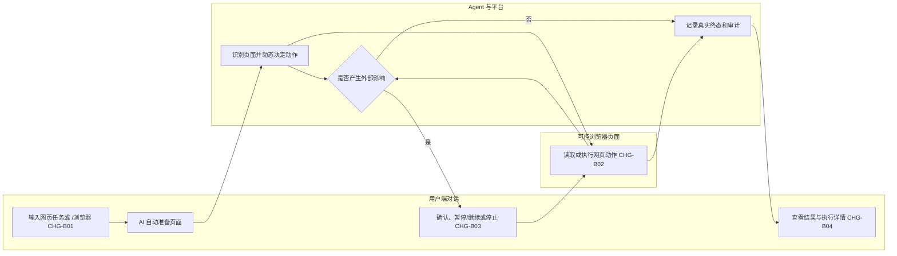
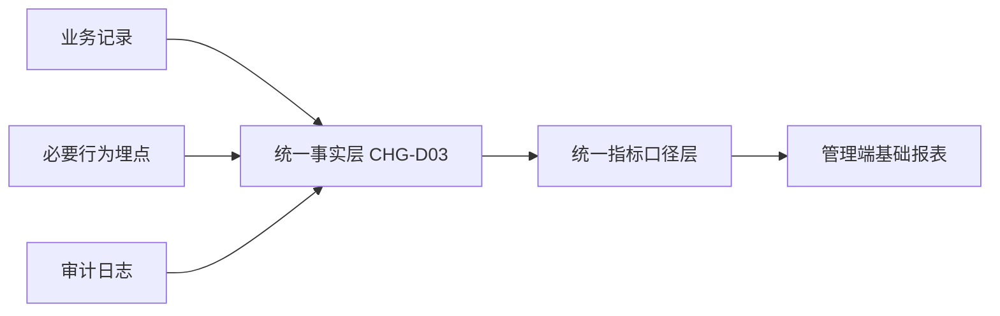

# 《先马·AI Studio｜V1.1｜技能库、浏览器自动化与数据埋点 增量 PRD》

## 0. 文档信息

| 项目 | 内容 |
| --- | --- |
| 所属项目/模块 | 先马·AI Studio / 用户端技能库与浏览器自动化、管理端治理与基础统计 |
| 目标版本 | V1.1（2026 年 8 月范围） |
| 需求类型 | 技能库优化 + 浏览器自动化新增 + 数据埋点与基础统计新增 |
| 文档版本与状态 | V1.3 / 已确认，可交开发技术评审与任务拆分 |
| 当前有效 PRD | 本文档 |
| 对应原型 | [V1.1 交互原型目录](先马·AI%20Studio-V1.1-交互原型/)、[UI 规范](先马·AI%20Studio-V1.1-交互原型/UI_SPEC.md)；管理端技能开发以[管理后台_技能管理.html](先马·AI%20Studio-V1.1-交互原型/管理后台/管理后台_技能管理.html)为正式依据，“交互草稿”不作为开发、验收或截图依据 |
| 当前实现证据 | 原型可验证；生产实现未核验，不据此判断已开发、已验证、已部署或已上线 |

### 版本记录

| 版本 | 日期 | 状态 | 变更摘要 | 确认依据 |
| --- | --- | --- | --- | --- |
| V1.5 | 2026-08-14 | 可交开发技术评审与任务拆分 | 管理端技能列表在分类后展示标签；我的技能补齐“企业已发布”状态展示 | 用户确认 |
| V1.4 | 2026-08-14 | 可交开发技术评审与任务拆分 | 技能库按来源区分可调用集合；全部页取消状态筛选，分类改为横向标签栏 | 用户确认方案 A |
| V1.3 | 2026-08-14 | 可交开发技术评审与任务拆分 | 浏览器改为 AI 自动准备页面；运行控制收敛为查看页面与暂停/继续；结果按网页、内容或文件分支展示；新增斜杠关键词模糊检索 | 用户确认 |
| V1.2 | 2026-08-13 | 可交开发技术评审与任务拆分 | 保留旧版累计用户、当前在线、设备与版本分布能力；拆分累计用户和当前有效用户，补齐近 30 天活跃设备、版本快照、历史迁移及异常规则 | 用户确认旧统计保留方案及完整口径 |
| V1.1 | 2026-08-13 | 可交开发技术评审与任务拆分 | 补齐首页逐指标口径、趋势与排行展示契约、业务状态枚举、统一时间和空值规则 | 用户确认立即补齐统计与枚举定义 |
| V1.0 | 2026-08-13 | 可交开发技术评审与任务拆分 | 补齐技能校验产品边界、页面级关键操作清单及采集来源；分类筛选统一为 12 类多选；明确正式原型入口与 REQ 非阻塞口径 | 用户本轮确认 |

## 1. 本期需求与 AI 能力概览及 CHG 索引

> 本节是本期唯一 CHG 索引。适用端固定使用“用户端 / 管理端 / 用户端 + 管理端”。

### 1.1 用户端

| CHG编号 | 适用端 | 功能模块 | 本期功能点 | 变更类型 | AI 能力变化 | 预期价值 |
| --- | --- | --- | --- | --- | --- | --- |
| CHG-S01 | 用户端 | 技能库 | 全部技能、我的技能、企业技能三个页签及个人已发布状态展示 | 优化 | — | 清晰区分个人能力与企业资产 |
| CHG-S02 | 用户端 | 技能导入 | 文件夹、公开 GitHub、ZIP 和在线技能安装 | 新增 | — | 降低个人工作方法沉淀门槛 |
| CHG-S03 | 用户端 | 个人技能 | 导入后立即使用、编辑、删除及 `/技能名` 调用 | 新增 | Agent 工具调用 | 无需等待审批即可服务本人 |
| CHG-B01 | 用户端 | 浏览器调用 | 自然语言识别与 `/浏览器` 显式调用 | 新增 | 理解与识别、Agent 工具调用 | 从对话直接发起网页任务 |
| CHG-B02 | 用户端 | 浏览器执行 | 页面接管、读取、点击、输入、选择、上传和下载 | 新增 | 推理与决策、Agent 工具调用 | 减少重复网页操作 |
| CHG-B03 | 用户端 | 浏览器控制 | 风险确认、跨域确认、暂停/继续与对话式停止 | 新增 | 人工介入、AI 治理与安全 | 保持外部操作可控 |
| CHG-B04 | 用户端 | 结果追溯 | 按网页、内容或文件展示任务结果，并提供执行详情 | 新增 | 效果评估与反馈 | 真实表达执行结果并支持恢复 |

### 1.2 管理端

| CHG编号 | 适用端 | 功能模块 | 本期功能点 | 变更类型 | AI 能力变化 | 预期价值 |
| --- | --- | --- | --- | --- | --- | --- |
| CHG-A01 | 管理端 | 后台架构 | 嵌入聚合后台，首页承载核心数据与处理入口 | 调整 | — | 统一管理入口，避免重复建设后台 |
| CHG-A02 | 管理端 | 技能治理 | 审批、驳回、待发布、发布、下架、重新发布、直接发布及列表标签展示 | 新增 | AI 治理与安全 | 形成企业技能发布闭环 |
| CHG-A03 | 管理端 | 用户管理 | 用户状态、在线状态和使用概况 | 新增 | — | 了解真实覆盖与使用情况 |
| CHG-A04 | 管理端 | 基础配置 | 分类与标签统一维护 | 新增 | — | 统一检索和运营口径 |
| CHG-A05 | 管理端 | 版本发布 | 保留已有客户端版本发布能力并统一 UI | 调整 | — | 保持已有更新流程连续 |
| CHG-D02 | 管理端 | 基础报表 | 首页覆盖、在线、设备、版本、任务趋势和功能使用排行 | 新增 | — | 保留既有统计并支撑基础运营判断 |

### 1.3 跨端与公共能力

| CHG编号 | 适用端 | 功能模块 | 本期功能点 | 变更类型 | AI 能力变化 | 预期价值 |
| --- | --- | --- | --- | --- | --- | --- |
| CHG-S04 | 用户端 + 管理端 | 技能流转 | 提交、撤回、审批、驳回、发布与状态同步 | 新增 | AI 治理与安全 | 个人能力可控转为企业资产 |
| CHG-S05 | 用户端 + 管理端 | 技能对象 | 个人副本与企业发布快照独立、删除互不级联 | 调整 | AI 治理与安全 | 避免个人删除影响企业运行 |
| CHG-S06 | 用户端 + 管理端 | 名称与分类标签 | 分层唯一性、分类单选、标签检索多选新增 | 优化 | — | 保证跨端数据一致 |
| CHG-D01 | 用户端 + 管理端 | 数据采集 | 用户、任务、技能和模块关键行为口径 | 新增 | 效果评估与反馈 | 建立可信行为数据基础 |
| CHG-D03 | 用户端 + 管理端 | 数据框架 | 事实、指标、报表分层及口径版本兼容 | 新增 | — | 支撑后续扩展，降低推翻式改造风险 |

## 2. 背景、目标与成功标准

### 2.1 当前问题和基线

- V1.0 以预置技能和主对话为主，未包含员工自主导入及企业治理闭环。
- 浏览器自动化尚无生产接入或验收证据；V1.1 原型只验证产品交互。
- 管理端已确定嵌入聚合管理后台，生产实现状态未核验。
- 用户、任务、技能与模块使用尚无统一统计口径，真实业务基线待上线后采集。

### 2.2 本次目标

1. 用户端完成个人技能导入、立即使用、编辑、删除、提交审批和状态查看。
2. 管理端完成技能审批、企业发布、下架、重新发布、直接发布及分类标签治理。
3. 用户端可在对话中调用浏览器，在可控页面完成受控网页任务。
4. 跨端保持个人技能、企业副本、名称、状态、权限和审计一致。
5. 建立可扩展的采集与指标框架，并在管理端首页展示基础数据。

### 2.3 成功标准

| 编号 | 适用端 | 成功标准 | 可观察证据 | 当前目标 |
| --- | --- | --- | --- | --- |
| SS-01 | 用户端 | 个人技能可导入并立即创建任务调用 | 录屏、任务记录 | 端到端走通 |
| SS-02 | 用户端 + 管理端 | 技能可走完提交、审批、发布、搜索调用、下架和重新发布 | 双端状态、审计与调用记录 | 状态一致，无重复企业对象 |
| SS-03 | 用户端 + 管理端 | 删除个人副本不影响已形成企业快照，管理员不删除员工个人技能 | 删除前后双端记录 | 无级联误删 |
| SS-04 | 用户端 | 浏览器在指定验收网站完成一个受控任务 | 对话记录、浏览器录屏、结果文件 | 首批网站待确认 |
| SS-05 | 用户端 | 外部写入、文件上传和跨域操作均按规则确认 | 负向用例、确认记录 | 不得未经确认执行 |
| SS-06 | 用户端 | 暂停/继续、对话停止、重试、部分成功和状态待确认可正确结束或恢复 | 状态与事件记录 | 不掩盖外部影响 |
| SS-07 | 管理端 | 首页基础数据和技能/用户列表符合统一口径 | 页面截图、业务记录对账 | 不以登录替代平台价值 |
| SS-08 | 用户端 + 管理端 | 新增模块或指标可沿用现有事实与指标主链路 | 扩展方案、回归对账 | 历史缺失明确不可补算 |

## 3. 当前能力与差异基线

| 编号 | 适用端 | 当前能力/规则 | 产品状态 | 当前实现 | 事实来源 | 本次处理 |
| --- | --- | --- | --- | --- | --- | --- |
| BASE-01 | 用户端 | V1.0 提供预置技能调用 | 历史基线 | 未核验 | V1.0 PRD | 扩展为个人与企业技能 |
| BASE-02 | 用户端 + 管理端 | V1.0 不做业务侧自主配置技能库 | 历史规则 | 未核验 | V1.0 PRD | V1.1 覆盖旧规则 |
| BASE-03 | 管理端 | 管理后台承担用量和权限治理 | 历史规划 | 未核验 | V1.0 PRD | 承接技能治理和基础统计 |
| BASE-04 | 用户端 | 浏览器自动化无生产能力 | 已确认现状 | 尚未开发 | 浏览器 REQ、项目记忆 | 新增 V1 能力 |
| BASE-05 | 用户端 + 管理端 | V1.1 原型 | 当前原型 | 本地模拟数据 | 原型与说明 | 承接交互，不作为上线证据 |
| BASE-06 | 用户端 + 管理端 | 关键埋点和基础统计 | 需求已确认 | 未核验 | 埋点 REQ | 新增产品口径和框架 |
| BASE-07 | 管理端 | 客户端版本发布 | 已有能力，证据待补 | 原型按已有流程保留 | 项目记忆、后台原型 | 仅统一 UI，不重做业务能力 |
| BASE-08 | 管理端 | 旧版使用统计展示累计用户、当前在线、今日活跃、近 7 天活跃、设备总数和版本分布 | 当前旧版能力 | 页面可见，底层明细与历史可回算范围待开发核验 | 用户截图、旧版页面 | 统计能力和真实数据迁入新版首页，不保留重复旧页面 |

### 3.1 事实冲突与处理

| 编号 | 适用端 | 冲突/差异 | 高优先级事实 | 历史表现 | 本次处理 |
| --- | --- | --- | --- | --- | --- |
| DIFF-01 | 用户端 | 是否允许自主导入 | V1.1 已确认允许 | V1.0 不做 | 采用 V1.1 |
| DIFF-02 | 用户端 + 管理端 | 分类能否由用户新增 | 仅管理端维护 | 路线图曾写申请新增 | 用户端只能选择 |
| DIFF-03 | 用户端 | 浏览器状态显示位置 | 状态与控制均在原对话 | 早期方案曾放浏览器侧栏 | 浏览器仅承载网页 |
| DIFF-04 | 用户端 + 管理端 | 技能版本能力 | 本期不做更新、历史版本和回退 | V1.6 PRD 曾纳入 | 删除版本操作，仅后台显示 `v1.0` 预留字段 |
| DIFF-05 | 用户端 + 管理端 | 个人技能能否删除 | 员工可删除自己的个人技能，企业快照不受影响 | V1.6 PRD 曾禁止删除已提交技能 | 采用最终确认规则 |
| DIFF-06 | 用户端 | 浏览器新任务所在窗口 | 在当前对话创建新 `taskId` | “新任务”可能被理解为新对话 | 明确不新开对话 |
| DIFF-07 | 管理端 | 旧版累计用户与新版当前用户总数含义不同 | 累计用户永久保留历史覆盖；当前有效用户只表示当前仍有资格的用户 | 新版原型曾合并为“当前用户总数” | 拆成两个指标并按 12.2.2 分别统计 |

## 4. 本期范围边界

### 4.1 明确不做

| 适用端 | 不做事项 | 原因/依据 |
| --- | --- | --- |
| 用户端 + 管理端 | 技能版本更新、创建新版本、历史版本和版本回退 | 本期先完成上传发布闭环；后台仅显示 `v1.0` 预留字段 |
| 用户端 + 管理端 | 部门、岗位和人员级企业技能权限配置 | 本期默认全员可见，只预留扩展字段 |
| 用户端 | 私有 GitHub、自动同步和第三方技能市场 | 在线技能仅支持 GitHub 公开仓库一次性复制 |
| 用户端 | 浏览器流程录制、可视化编排、定时及无人值守执行 | 不属于浏览器自动化 V1 |
| 用户端 | 支付、转账、密码/安全设置、权限变更、批量删除、合同确认 | 高风险绝对禁止，不能通过确认解锁 |
| 管理端 | 独立数据页面、复杂漏斗、留存、路径、自定义看板和部门对比 | 本期报表只在首页基础展示 |
| 管理端 | 运行管理等偏开发运维菜单 | 本期产品菜单不体现 |
| 用户端 + 管理端 | 完整数仓、自助 BI 和通用实时指标平台 | 本期只搭最小可扩展框架 |

### 4.2 限制事项

| 适用端 | 限制事项 | 限制说明 |
| --- | --- | --- |
| 用户端 | 浏览器兼容范围 | 不承诺任意网站完全兼容，不绕过验证码、反自动化和安全拦截 |
| 用户端 | 原型快捷口令 | “新增一条服务记录”只用于虚构服务工作台演示，正式产品上下文不足必须追问 |
| 管理端 | 版本发布 | 仅保留已有客户端版本发布流程，不代表本期新增开发 |
| 用户端 + 管理端 | 历史统计 | 未采集字段标记历史不可补算，不推测生成 |

## 5. 角色、端关系与总体流程

### 5.1 角色与权限前提

| 角色 | 使用端 | 可见范围 | 可执行操作 | 限制 |
| --- | --- | --- | --- | --- |
| 员工 | 用户端 | 自己的个人技能、已发布企业技能、自己的任务与执行详情 | 导入、安装、使用、编辑、提交、撤回、删除个人技能；发起和控制浏览器任务 | 不审批、不发布；不访问其他员工任务或登录状态 |
| 管理员 | 管理端 | 审批记录、企业副本、分类标签、用户与基础统计、必要审计 | 审批、驳回、发布、下架、重新发布、直接发布、配置分类标签 | 不删除或改写员工个人技能；不查看员工正文与文件内容 |

### 5.2 跨端总流程





## 6. 用户端需求

### 6.1 用户端信息架构与页面

| 页面/区域 | 主要内容 | 用户操作 | 系统反馈 | 关联CHG |
| --- | --- | --- | --- | --- |
| 技能库 | 全部技能、我的技能、企业技能、在线技能库 | 切换、搜索、筛选、进入详情 | 同页更新列表与数量 | CHG-S01、CHG-S02 |
| 技能导入 | 来源、校验结果、名称、分类、标签 | 选择文件夹/GitHub/ZIP，完成导入 | 失败定位原因；成功进入我的技能 | CHG-S02、CHG-S03 |
| 个人技能详情 | 状态、编辑、使用、提交、撤回、删除 | 按状态执行可用动作 | 更新个人状态与时间线 | CHG-S03、CHG-S04、CHG-S05 |
| 新对话 | `/技能名`、`/浏览器`、描述和附件 | 选中工具或技能并发送 | 命令标签保留，进入任务 | CHG-S03、CHG-B01 |
| 浏览器任务对话 | 状态、确认、控制、结果 | 查看页面、暂停/继续、对话停止 | 展示当前动作与真实终态 | CHG-B01、CHG-B02、CHG-B03、CHG-B04 |
| 可控浏览器页面 | 目标网页 | 登录、查看或员工自行操作 | 只展示网页，不显示任务侧栏 | CHG-B02、CHG-B03 |

### 6.2 技能库规则

| 规则 | 关联变更 |
| --- | --- |
| R-U-S01 | CHG-S01 |
| R-U-S02 | CHG-S02 |
| R-U-S03、R-U-S04 | CHG-S03、CHG-S06 |
| R-U-S05 | CHG-S04 |
| R-U-S06 | CHG-S05 |
| R-U-S07 | CHG-S03、CHG-S06 |
| R-U-S08 | CHG-S04、CHG-S05 |

#### R-U-S01 技能范围、来源与分类

- 技能库是同页三个页签：“全部技能 / 我的技能 / 企业技能”。
- 全部技能只展示当前员工可调用的集合：已发布企业技能加上该员工自己的个人技能；不展示其他员工个人技能，也不展示已下架企业技能。
- 全部技能卡片以“企业技能 / 我的技能”来源标签区分；不提供状态筛选，不把审批、驳回、待发布等流转状态作为筛选维度。
- 我的技能只显示当前员工个人对象，并展示五种用户状态和对应管理操作；企业技能只显示当前可调用的已发布企业副本。
- 员工本人提交的个人技能完成企业发布后，仍归属“我的技能”，卡片状态显示“企业已发布”，并保留“使用、管理”入口；该状态不改变个人对象归属，也不以企业副本替换个人副本。
- 分类采用横向一级标签栏，默认“全部”，读取后台启用分类；超出可视宽度时横向滚动或点击箭头查看更多。分类在三个页签内均按单选筛选。

#### R-U-S02 导入与在线安装

- 支持本地 Skill 文件夹、公开 GitHub 仓库地址和 ZIP；根目录必须可识别 `SKILL.md`。
- 导入前必须满足最低产品校验：来源可读取且根目录可识别 `SKILL.md`；必要元数据与技能说明可解析；与当前客户端及已授权工具范围兼容；不包含明文敏感凭据、越权访问包外路径或本期明确禁止的能力。
- 校验失败不得创建、安装或发布技能；页面必须给出可定位的失败类型和处理建议，不得只显示“校验失败”。
- 目录递归方式、ZIP 安全解压、文件大小与数量阈值、脚本或二进制检测、依赖扫描及具体扫描工具由开发与安全设计；技术方案必须满足前述产品结果和安全边界，不在原型中展开。
- 在线技能库只来自 GitHub 公开仓库，展示名称、简介、所有者、仓库来源、兼容状态和安装状态，不展示无可靠口径的下载量。
- GitHub 安装是当前内容一次性复制，不自动同步。

#### R-U-S03 个人技能立即可用

- 导入成功后状态为“未提交”，仅本人可见并立即可使用。
- 我的技能卡片始终提供“使用”；管理入口用于编辑和企业流转。
- 使用后在新对话带入山茶红 `/技能名称`，用户补充描述或附件后发送。

#### R-U-S04 编辑规则

- 未提交、已撤回、已驳回可编辑名称、简介、分类、标签和技能说明。
- 审批中必须先撤回；待发布、已发布、已下架本期不支持内容更新。
- 分类使用可检索单选且不可新增；标签支持检索、多选和无匹配新增。

#### R-U-S05 提交、撤回与驳回后重提

- 提交时形成独立审批申请，个人技能仍可调用；状态进入审批中。
- 审批中可撤回，撤回后进入“已撤回”，可编辑、删除或重新提交。
- 驳回不影响个人调用；页面显示驳回原因，可修改后重新提交。

#### R-U-S06 删除个人技能

- 员工只能删除自己的个人技能，管理员不能代删。
- 未提交、已撤回、已驳回可直接删除；审批中必须先撤回。
- 待发布、已发布、已下架也可删除个人技能，但只删除个人副本；已形成的企业发布快照不受影响。
- 删除后本人不能再调用且不可恢复；保留最小审批与审计记录。

#### R-U-S07 技能名称与调用来源

- 同一员工个人技能名称唯一；去除首尾空格，英文字母不区分大小写。
- 不同员工可有同名个人技能；个人技能与企业技能也可同名。
- 斜杠菜单显示“我的技能 / 企业技能”来源；实际调用使用稳定 `skillId`，不得按名称猜测。

#### R-U-S08 企业技能使用和下架

- 已发布企业技能默认全员可见并可调用；下架后员工不能发起新的企业调用。
- 创建者若仍保留个人副本，可继续调用个人技能；个人副本已删除则不可调用。
- 企业技能执行中被下架或权限回收时立即暂停，停止新的读取、生成和外部变更；已完成结果保留。

### 6.3 浏览器自动化规则

| 规则 | 关联变更 |
| --- | --- |
| R-U-B01、R-U-B02、R-U-B03 | CHG-B01 |
| R-U-B04、R-U-B05、R-U-B06、R-U-B07、R-U-B08 | CHG-B02、CHG-B03 |
| R-U-B09、R-U-B10、R-U-B11 | CHG-B03、CHG-B04 |

#### R-U-B01 触发与不触发

- 明确要求访问网页并执行登录、导航、点击、输入、选择、上传、下载、新增、修改、删除、提交、发送或发布时自动触发。
- 输入 `/浏览器` 为显式触发，必须继续补充任务描述或附件。
- 系统按固定顺序判断：绝对禁止项 → 仅网址或仅命令 → 目标是否明确 → 只导航/只读/执行任务；命中前一项后不再进入后续分支。
- 创建浏览器任务的最低条件是目标页面可定位、用户目标明确、操作对象明确；任一条件不满足时先追问，不生成 `taskId`。
- 只发送网址时保存为上下文并追问“你希望我在这个网站完成什么？”，不自动打开、读取或进入完成态；只发送 `/浏览器` 时提示补充任务描述。
- “打开/访问 + 可定位页面”只创建导航任务；“总结/读取/查看 + 可定位页面”只创建只读任务，不扩展为点击、填写或提交。
- 页面可定位且目标、对象明确时才开始执行；写操作信息不足时可先做安全读取，遇到阻塞再追问。
- 查询系统数据优先使用已接入 API/连接器；无法完成且需要真实 UI 时才用浏览器。

| 用户表达 | 是否调用浏览器 | 授权边界 |
| --- | --- | --- |
| 打开客服平台，新增一条客户记录 | 是 | 可导航、读取和填写；最终新增前确认 |
| 进入这个网址，点击订单管理 | 是 | 只授权访问该网址和点击目标入口 |
| 帮我下载这个后台的报表 | 需要真实 UI 时是 | 可导航、筛选和下载，文件进入授权工作区 |
| 查询客服系统的数据 | API/连接器优先 | 默认只读，不扩展为修改 |
| 只发送一个网址 | 否 | 追问希望完成的任务，不自动打开 |
| 这个网址是什么 | 按需只读 | 可读取理解，不点击、填写或提交 |
| 用 Chrome 操作当前页面 | 是 | 必须使用指定且可控的 Chrome；不可用时提示，不静默切换 |
| 未指定浏览器，但任务必须操作网页 | 是 | 自动选择当前可用浏览器并按页面选择规则执行 |

#### R-U-B02 命令展示

- 显式调用时，输入框及发送后的用户消息保留山茶红 `/浏览器` 或 `/技能名` 标签。
- 自然语言自动调用不改写用户原话，只在 AI 回复中标明调用浏览器。
- 新对话、执行中、完成、失败和取消后的斜杠菜单始终提供权限内技能与工具。

#### R-U-B03 浏览器与页面自动决策

- 用户指定 Chrome 等浏览器时优先使用指定且可控的浏览器；不可用时在原对话说明，禁止静默切换。
- 用户说“当前页面”时优先使用当前可控页面；提供网址时优先复用同网址的可控页面；其余情况由 AI 选择可用页面或自动打开受控页面。
- 页面选择是 Agent 内部决策，不向用户展示“选择页面、打开新页面、接管、交还”等操作入口；原对话不自动跳转或抢焦点。
- 仅输入浏览器命令、仅发送网址、或任务无法定位目标网站/当前页面时，在原对话追问，且不创建正式任务、不打开浏览器。

#### R-U-B04 页面职责和动态执行

- 原对话是任务状态与控制中心；浏览器页面只承载网页、登录、查看和人工操作。
- Agent 每次动作后读取真实页面状态并决定下一动作，不要求预先拆出固定步骤，不展示虚假百分比。
- 当前页面关闭、断开或不可控时在原对话提示页面暂时不可用；用户修复页面后点击“继续”，AI 重新读取页面再继续。

#### R-U-B05 登录和账号边界

- 登录由员工在浏览器页面手动完成；AI 不读取、记录或回显密码和验证码。
- 不跨员工共享登录状态；账号隔离和本地会话清理方案待技术设计。
- 遇到验证码、反自动化限制或安全拦截时停止网页动作并提示员工自行处理，完成后点击“继续”，不绕过。

#### R-U-B06 动作范围与确认

- V1 支持读取、导航、点击、输入、选择、上传和下载。
- 新增、修改、单条普通记录删除、发送、发布、提交、上传等写操作在最终执行前展示网站、对象、动作、关键字段和文件摘要并等待确认。
- 确认后关键字段、目标对象、网站或动作发生变化，旧确认立即失效并重新确认。
- 跨域前展示来源与目标域名并确认；同域路由切换不重复确认。
- 支付、转账、密码/安全设置、权限变更、批量删除和合同确认属于绝对禁止项，在创建浏览器任务前直接拒绝，不生成 `taskId`，且不提供“确认后继续”。

#### R-U-B07 文件与结果边界

- 只上传用户明确选择或本任务明确生成并确认的文件。
- 任务结果可为网页操作成功、查询/结构化内容、截图或文件，不要求每个任务产生下载文件。
- 下载只进入授权工作区；仅在实际生成或下载文件时展示“打开文件 / 在文件夹中显示”，无文件时只展示结果摘要和执行详情。
- 生产客户端通过桌面桥接调用默认应用打开文件，并在 Windows 资源管理器定位文件；静态原型仅演示有文件/无文件分支。
- 执行详情不保存文件正文和完整本地路径。

#### R-U-B08 重试与写操作核验

- 读取、查找、导航和普通加载失败最多自动重试 2 次。
- 写操作响应不明确时禁止直接重复提交；先重新读取页面、搜索目标记录或核验状态。
- 确认失败后才可重试；确认成功则继续；仍无法判断时暂停并标记“状态待确认”。

#### R-U-B09 暂停、继续与停止

- 运行中只提供“查看页面”和“暂停”两个任务控制；暂停后同一按钮切换为“继续”。
- 暂停后 AI 立即停止新动作，员工可自行在浏览器页面操作；点击“继续”后 AI 重新读取页面再继续。
- 用户在对话输入“停止”或“取消”也可结束当前任务；不提供接管、交还、选择页面或打开新页面等按钮。
- 停止只终止后续动作，不承诺回退外部系统已发生的变化。

#### R-U-B10 结果状态

- 无外部影响且取消，终态为“已取消”。
- 已产生部分外部影响，终态为“部分成功”，列出已完成、未完成和人工处理项。
- 写入结果无法确认，终态为“状态待确认”，不得直接重复执行。
- 任务结果表示网站业务产物；执行详情是平台追溯摘要，不默认生成 CSV。
- 执行详情至少包含任务编号、发起/完成时间与耗时、调用方式、目标网站、已发生动作、风险确认、暂停/接管等人工控制、最终状态、结果摘要、文件元数据和异常信息。

#### R-U-B11 补充指令与任务隔离

- 同网站、同核心目标的补充字段沿用当前 `taskId`。
- 更换网站、改变核心目标或推翻已确认内容时，旧确认失效，在当前对话创建新 `taskId` 和独立任务卡片，不新开对话。
- 已结束任务再次调用也创建新 `taskId`；任务状态、确认、窗口和日志必须隔离。

### 6.4 用户端状态

后台保留完整业务状态用于流转和审计；用户端列表、筛选和详情一级状态统一展示以下 5 个用户状态，不直接暴露全部中间状态。

| 对象 | 用户端展示状态 | 后台业务状态映射 | 用户可见操作 | 辅助说明 |
| --- | --- | --- | --- | --- |
| 个人技能 | 仅自己可用 | 未提交、已撤回 | 使用、编辑、提交、删除 | 已撤回时可在时间线保留撤回动作 |
| 个人技能 | 发布处理中 | 审批中、待发布 | 使用；审批中可撤回 | 审批中显示“等待管理员审批”；待发布显示“已通过，等待发布” |
| 个人技能 | 需修改 | 已驳回 | 使用、编辑、重提、删除 | 展示驳回原因 |
| 个人技能 | 企业已发布 | 已发布 | 使用、删除个人副本 | 企业副本已对全员开放 |
| 个人技能 | 企业已下架 | 已下架 | 使用个人副本、删除个人副本 | 企业副本不可再发起调用 |
| 浏览器任务 | 准备页面 | 确认需浏览器 | 查看页面、暂停 | AI 自动绑定或打开受控页面 |
| 浏览器任务 | 执行中/自动重试/核验中 | 页面已绑定 | 查看页面、暂停 | 下一状态或终态 |
| 浏览器任务 | 等待确认 | 即将外部变更 | 确认或取消 | 执行或终止 |
| 浏览器任务 | 已暂停 | 用户点击暂停 | 查看页面、继续 | 继续执行或对话停止 |
| 浏览器任务 | 已完成/已取消/部分成功/失败/状态待确认 | 任务结束 | 查看详情、按剩余事项重试 | 新任务 |

### 6.5 用户端关键文案

| 场景 | 文案 |
| --- | --- |
| 导入完成 | 技能已导入，可以立即使用 |
| 删除有企业快照的个人技能 | 仅删除你的个人副本；已形成的企业技能及发布状态不受影响 |
| 页面暂时不可用 | 页面暂时不可用，请检查网页登录或页面状态；完成后点击“继续” |
| 写入核验 | 提交响应不明确，正在重新读取页面确认外部系统状态，不会直接重复提交 |
| 部分成功 | 部分操作已完成，剩余操作已停止；已完成内容不会自动回退 |

## 7. 管理端需求

### 7.1 信息架构

管理端嵌入现有聚合管理后台：保留宿主左侧导航，AI Studio 内部使用顶部导航。

```text
先马·AI Studio
├─ 首页
├─ 技能管理
│  ├─ 技能审批
│  ├─ 待发布
│  └─ 企业技能
├─ 用户管理
├─ 基础配置
│  ├─ 分类管理
│  └─ 标签管理
└─ 版本发布（已有能力）
```

### 7.2 首页

| 规则 | 关联变更 |
| --- | --- |
| R-A-01 | CHG-A01、CHG-A02 |
| R-A-02、R-A-03、R-A-04、R-A-04A | CHG-D02、CHG-D03 |

#### R-A-01 实时累计与处理入口

- 实时概况按“平台覆盖”和“技能治理”组织：平台覆盖展示累计用户、当前有效用户、当前在线、近 30 天活跃设备；技能治理展示企业技能数、待审批数、待发布数。
- 待审批、待发布卡片分别提供“去审批 / 去发布”，进入技能管理对应页签；不设置独立待处理工作台。
- 实时累计不随周期筛选变化，数字与对应业务列表读取同一状态源。
- 七项的统计对象、状态范围、去重键和刷新规则统一按 12.2.2，不允许页面自行另算。

#### R-A-02 周期指标

- 展示访问用户、活跃用户、任务用户、任务数、成功数、失败数、成功率和企业技能调用次数。
- 默认今日，支持近 7 天、近 30 天和自定义；仅刷新周期指标、趋势和排行。
- 成功率 = 成功数 /（成功数 + 失败数）；分母为 0 显示 `—`。
- 八项指标的时间字段、去重键、包含及排除状态统一按 12.2.3；所有指标使用同一个已生效时间范围。

#### R-A-03 任务趋势

- 今日与自定义 1 天按 2 小时；近 7 天及自定义 2-14 天按天；近 30 天及自定义 15-90 天按北京时间自然周；91 天及以上按自然月。
- 周粒度首尾不足一周分别展示；标题旁显示当前粒度。
- 任务按首次进入执行时间归桶，后续重试和终态更新原时间桶，不迁移。
- 三条序列、补零、横轴、提示信息、图例、空态和失败态统一按 12.2.4。

#### R-A-04 功能使用排行

- 按“模块访问人数 + 关键操作人数/次数”展示，不按普通页面点击总和排行。
- 关键操作是实际产生业务价值的动作，如创建任务、调用技能并创建任务、导入技能；刷新、悬停、展开不计。
- 本期按关键操作人数排序并展示前 5 个模块；完整排序、并列和转化率规则按 12.2.5。

#### R-A-04A 客户端版本分布

- 首页在任务趋势与功能排行之后展示客户端版本分布，基数与“近 30 天活跃设备”完全一致。
- 每项展示版本号、设备数、占比和是否为当前最新版本；版本号不可识别时归入“未知版本”。
- 最新版本优先，其余按可比较版本号从高到低，“未知版本”最后；设备数之和必须等于近 30 天活跃设备。
- 点击版本项进入已有“版本发布”页面；本期不新增设备明细、历史趋势或升级漏斗。
- 详细取值、设备去重、版本快照与迁移规则统一按 12.2.2A 和第 11 节。

### 7.3 技能管理

| 规则 | 关联变更 |
| --- | --- |
| R-A-05、R-A-06、R-A-07、R-A-08 | CHG-A02、CHG-S04、CHG-S05、CHG-S06 |
| R-A-09 | CHG-D01、CHG-D02 |

#### R-A-05 审批与驳回

- 有管理后台权限的管理员执行一级审批，可审批自己提交的技能。
- 审批详情展示提交人、版本 `v1.0`、说明、原分类标签和校验结果。
- 审批可规范企业副本分类和标签，但不改员工个人元数据。
- 通过后进入待发布，不自动发布；驳回原因必填。

#### R-A-06 待发布与企业发布

- 发布前校验企业名称全局唯一；冲突时允许修改企业发布名称，不影响个人名称。
- 发布形成独立企业快照，默认全员可见；创建人保留员工花名，审批人和发布人单独审计。
- 本期首次发布统一显示 `v1.0`，不提供更新版本、历史版本和回退入口。

#### R-A-07 管理员直接发布

- 支持文件夹、公开 GitHub、ZIP；必须填写企业名称、分类和至少一个标签。
- 校验通过后直接发布，不进入审批队列；创建人显示管理员用户名。
- 企业名称冲突或校验失败时禁止发布。

#### R-A-08 企业技能治理

- 企业技能列表展示企业名称、创建人、分类、标签、当前版本、累计调用次数、更新时间和状态。
- 技能审批、待发布、企业技能三个列表均在“分类”后展示“标签”列；标签取对应技能对象当前 `tagIds`，按标签样式逐项展示，无标签时显示 `—`。标签列仅展示元数据，不提供行内编辑或筛选；表格宽度不足时横向滚动，原有字段和操作列顺序不变。
- 已发布可下架，已下架可重新发布；两者都需二次确认并说明影响。
- 重新发布恢复同一份内容和 `v1.0`，不产生新版本。
- 管理员不得删除员工个人技能；本期企业技能不提供彻底删除入口，违规或高风险内容先下架并保留审计，后续处置另行迭代。

#### R-A-09 累计调用次数

- 只在成功创建任务且该企业技能实际开始执行后增加 1。
- 搜索、点击、查看详情、只选择技能不计；同一任务内重试不重复，不同任务分别计数。
- 调用失败仍计实际调用；累计值不受首页周期筛选影响。

### 7.4 用户管理

| 规则 | 关联变更 |
| --- | --- |
| R-A-10 | CHG-A03、CHG-D02 |

#### R-A-10 用户列表与详情

- 不重复建设账号体系，不提供新增/删除账号、重置密码。
- 列表展示姓名/账号标识、账号状态、在线状态、累计任务数、首次登录、最后登录和最近活跃。
- 详情展示任务数、成功数、失败数、成功率和技能调用次数。
- 用户列表和详情均为截至数据更新时间的累计值，具体定义按 12.2.7；不跟随首页周期筛选。
- 不查看员工对话、提示词、网页或文件正文。

### 7.5 基础配置

| 规则 | 关联变更 |
| --- | --- |
| R-A-11、R-A-12 | CHG-A04、CHG-S06 |

#### R-A-11 分类管理

- 分类支持搜索、新增、编辑、启用和停用；名称不可重复。
- 默认分类：办公协同、开发工具、投资理财、效率工具、内容创作、信息资讯、教育学习、数据分析、网站部署、生活服务、商业运营、知识与学习。
- 技能管理列表的分类筛选读取全部启用分类，支持检索和多选；选择多个分类时按“任一匹配（OR）”筛选。
- 技能导入、审批规范和直接发布仍为分类单选，选项同样读取全部启用分类；标签保持多选。
- 已被引用的分类不能删除，必须先迁移引用。

#### R-A-12 标签管理

- 标签支持搜索、新增、编辑、合并、停用和删除。
- 合并前展示目标标签和受影响技能数，确认后迁移全部引用。
- 有引用时删除按钮禁用，只能先合并、迁移或停用；无引用时可删除，删除前必须二次确认。

### 7.6 版本发布（已有能力）

| 规则 | 关联变更 |
| --- | --- |
| R-A-13 | CHG-A05 |

#### R-A-13 客户端版本发布保留

- 保留显示版本、系统建议的内部更新版本、渠道、标题、更新内容、Windows 安装包、强制更新、发布列表和撤回。
- 内部版本由系统建议且不可手改；显示版本、标题、内容和安装包必填。
- 强制更新默认关闭；开启时确认文案说明员工不能稍后更新。
- 撤回后未更新客户端不再看到该版本，已更新客户端不自动降级。
- 本项是已有能力样式统一，不是技能版本管理。

### 7.7 管理端页面与状态

| 页面 | 列表/控件 | 关键状态与反馈 | 关联CHG |
| --- | --- | --- | --- |
| 首页 | 实时卡、周期筛选、趋势、排行、客户端版本分布 | 加载、空、失败均在原区域展示；版本项进入版本发布 | CHG-A01、CHG-D02、CHG-A05 |
| 技能管理 | 审批/待发布/企业技能页签，分类后的标签列 | 页签数量联动；标签按当前 `tagIds` 展示；并发冲突提示刷新 | CHG-A02、CHG-S04、CHG-S05、CHG-S06 |
| 直接发布 | 来源、名称、分类、标签 | 校验中禁重；成功更新企业列表 | CHG-A02、CHG-S06 |
| 用户管理 | 用户列表、详情抽屉 | 分母为 0 时成功率显示 `—` | CHG-A03、CHG-D02 |
| 基础配置 | 分类/标签页签 | 有引用时禁删并说明原因 | CHG-A04、CHG-S06 |
| 版本发布 | 发布表单、历史列表 | 上传失败保留表单；撤回二次确认 | CHG-A05 |

所有正式后台列表及记录时间按北京时间显示为补零的 `YYYY-MM-DD HH:mm`，不使用相对时间。

## 8. 跨端公共规则

| 规则 | 关联变更 |
| --- | --- |
| R-C-01 | CHG-S05 |
| R-C-02、R-C-03 | CHG-S06 |
| R-C-04、R-C-05 | CHG-S04、CHG-S05 |
| R-C-06 | CHG-S04、CHG-D01 |

### R-C-01 个人技能与企业快照

- 个人技能和企业技能是两个稳定对象，分别维护可用性、状态和标识。
- 发布时复制审批通过的内容形成企业快照；后续个人删除不影响企业运行。
- 企业下架不级联删除个人技能；本期无企业技能彻底删除动作。

### R-C-02 名称唯一性

- 同一员工个人技能唯一；不同员工可重名。
- 企业技能全局唯一；比较统一去首尾空格、英文字母不区分大小写。
- 员工提交与企业现有技能重名可进入审批，但发布前必须改为唯一企业名称。

### R-C-03 分类与标签跨端契约

- 分类只由管理端维护；用户端可检索单选，不可新增。
- 标签用户端和审批/直接发布均支持检索、多选、新增；进入企业库前管理员可规范企业标签。
- 管理员规范只写企业副本，不覆盖个人元数据。

### R-C-04 撤回与审批并发

- 使用 `submissionId + 状态版本` 或等效并发控制。
- 员工撤回和管理员审批以服务端第一笔成功状态变更为准；后提交方提示“状态已变化，请刷新”。
- 禁止重复生成待发布记录。

### R-C-05 状态同步与权限变化

- 用户端企业状态、管理端队列和首页数量读取同一业务状态源。
- 企业下架后用户端新调用立即拒绝；执行中任务暂停并记录真实终态。

### R-C-06 审计边界

- 提交、撤回、审批、驳回、发布、下架、重新发布及浏览器风险确认均记录操作人、对象、时间、原因和结果；违规或高风险内容的下架原因必须记录。
- 个人删除后保留最小审批/审计关系，不保留已删除技能正文的非必要副本。
- 审计不计作用户功能使用埋点。

## 9. 数据对象与字段契约

> 字段名为产品建议，技术可调整名称但不得改变业务关系和统计口径。

### 9.1 技能相关对象

| 对象 | 字段 | 业务含义 | 必填 | 枚举/校验 | 适用端 |
| --- | --- | --- | --- | --- | --- |
| 个人技能 | personalSkillId | 个人对象稳定标识 | 是 | 全局唯一 | 用户端 + 管理端 |
| 个人技能 | ownerUserId | 所有人 | 是 | 当前员工 | 用户端 + 管理端 |
| 个人技能 | name | 个人显示名 | 是 | 员工内唯一 | 用户端 |
| 个人技能 | status | 个人及企业流转状态 | 是 | 未提交/审批中/已撤回/已驳回/待发布/已发布/已下架 | 用户端 + 管理端 |
| 审批申请 | submissionId | 一次提交标识 | 是 | 独立且可并发校验 | 用户端 + 管理端 |
| 审批申请 | stateVersion | 状态版本 | 是 | 单调递增或等效机制 | 用户端 + 管理端 |
| 企业技能 | enterpriseSkillId | 企业对象稳定标识 | 是 | 企业全局唯一 | 用户端 + 管理端 |
| 企业技能 | sourcePersonalSkillId | 来源个人技能 | 否 | 管理员直接发布为空 | 管理端 |
| 企业技能 | publishedSnapshot | 独立发布内容快照 | 是 | 不依赖个人对象存续 | 管理端 |
| 企业技能 | versionDisplay | 版本展示 | 是 | 本期固定 `v1.0` | 管理端 |
| 企业技能 | creatorName | 创建人显示 | 是 | 员工花名或管理员用户名 | 管理端 |
| 企业技能 | cumulativeCalls | 累计调用次数 | 是 | 非负整数，按 R-A-09 | 管理端 |
| 技能 | categoryId/tagIds | 分类与标签引用 | 是 | 分类单选、标签多选 | 用户端 + 管理端 |

### 9.2 浏览器任务对象

| 字段 | 业务含义 | 必填 | 格式/枚举 | 适用端 |
| --- | --- | --- | --- | --- |
| browserTaskId | 独立浏览器任务 | 是 | 全局唯一 | 用户端 |
| conversationId | 所在对话 | 是 | 同一对话可有多个任务 | 用户端 |
| triggerType | 触发方式 | 是 | natural/command | 用户端 |
| targetBrowser/pageId/url | 目标浏览器与页面 | 按场景 | 不存凭据 | 用户端 |
| state | 当前状态 | 是 | `WAITING_PAGE/RUNNING/AUTO_RETRYING/WAITING_CONFIRMATION/VERIFYING/TAKEN_OVER/SUCCEEDED/PARTIAL_SUCCESS/FAILED/CANCELED/RESULT_UNCERTAIN`，展示映射见 9.4 | 用户端 |
| externalEffects | 是否已产生外部影响 | 是 | 布尔或等效记录 | 用户端 |
| completedActions/pendingActions | 已完成与未完成事项 | 部分成功时是 | 脱敏摘要 | 用户端 |
| confirmation | 风险确认摘要 | 写操作时是 | 对象、动作、字段、文件，不含敏感正文 | 用户端 |
| result/fileMetadata/error | 结果、文件元数据和异常 | 按结果 | 文件只记录必要元数据 | 用户端 |

### 9.3 用户与统计对象

| 对象 | 必须可识别的信息 | 用途 | 适用端 |
| --- | --- | --- | --- |
| 用户事实 | 用户、首次登录、最后登录、心跳、账号状态 | 覆盖和在线状态 | 用户端 + 管理端 |
| 任务事实 | taskId、首次执行时间、最终状态、发起用户 | 任务数和最终成功率 | 用户端 + 管理端 |
| 执行事实 | executionId、taskId、结果、耗时、重试关系 | 运行质量 | 用户端 + 管理端 |
| 技能调用事实 | taskId、skillId、个人/企业来源、调用入口、是否实际开始、结果 | 调用、复用及技能库关键操作统计 | 用户端 + 管理端 |
| 模块行为 | 用户、模块、访问/触达方式、关键操作、时间、去重关系 | 模块使用排行 | 用户端 + 管理端 |

### 9.4 统一业务状态枚举

> 下列机器标识为产品建议值，技术可沿用等价现有值，但机器状态、中文展示和统计含义必须一一映射，不得用同一状态同时表达任务与执行。

#### 9.4.1 用户与配置状态

| 对象 | 机器枚举 | 中文展示 | 进入条件 | 统计/操作影响 |
| --- | --- | --- | --- | --- |
| AI Studio 用户账号 | `ACTIVE` | 已激活 | 至少成功进入 AI Studio 一次，且聚合账号当前可用并拥有 AI Studio 使用资格 | 同时纳入累计用户和当前有效用户，可进入平台 |
| AI Studio 用户账号 | `DISABLED` | 已停用 | 聚合账号已停用或取消 AI Studio 使用资格 | 仍保留在累计用户和历史统计中；不纳入当前有效用户，不能进入平台，在线状态强制离线 |
| 用户在线状态 | `ONLINE` | 在线 | 客户端连接且最近 5 分钟存在有效心跳 | 只表示当前连接，不等于活跃用户 |
| 用户在线状态 | `OFFLINE` | 离线 | 无连接、最后心跳超过 5 分钟或账号已停用 | 不影响历史访问和任务统计 |
| 分类/标签 | `ENABLED` | 启用 | 配置可供新建、编辑和筛选选择 | 可被新技能引用 |
| 分类/标签 | `DISABLED` | 停用 | 管理员停用 | 历史引用保留；新建、编辑时不可选择 |

- 尚未成功进入过 AI Studio 的聚合账号不创建 AI Studio 用户事实，不纳入首页累计用户和用户管理列表。已从聚合账号体系删除的历史用户仍保留不可逆的累计用户事实，但不纳入当前有效用户。
- 分类或标签“删除”表示对象已不存在，不是状态；标签合并成功后原标签进入停用，引用全部迁移到目标标签。

#### 9.4.2 任务、执行与浏览器状态

| 对象 | 机器枚举 | 中文展示 | 进入条件 | 统计含义 |
| --- | --- | --- | --- | --- |
| 任务 | `RUNNING` | 执行中 | 任务首次进入实际执行且尚未终结 | 计任务数，不计成功/失败数 |
| 任务 | `SUCCEEDED` | 成功 | 任务目标全部完成且结果可确认 | 计任务数和成功数 |
| 任务 | `PARTIAL_SUCCESS` | 部分成功 | 已产生至少一项有效结果，但仍有未完成事项 | 计任务数，不计成功/失败数 |
| 任务 | `FAILED` | 失败 | 任务未产生有效完成结果且已终结 | 计任务数和失败数 |
| 任务 | `CANCELED` | 已取消 | 未产生外部有效结果即由用户或系统终止 | 计任务数，不计成功/失败数 |
| 任务 | `RESULT_UNCERTAIN` | 状态待确认 | 已执行写操作，但外部系统结果经核验仍无法确认 | 计任务数，不计成功/失败数；禁止直接重复写入 |
| 执行 | `RUNNING` | 执行中 | 单次执行已开始未结束 | 只用于执行质量，不直接改变任务数 |
| 执行 | `SUCCEEDED` | 成功 | 单次执行成功结束 | 保留执行结果；任务最终状态可另行确定 |
| 执行 | `FAILED` | 失败 | 单次执行失败结束 | 保留失败；后续重试成功不覆盖该执行 |
| 执行 | `CANCELED` | 已取消 | 单次执行被终止 | 保留执行记录 |

浏览器任务是任务的专用过程状态，中文映射为：`PREPARING` 准备页面、`RUNNING` 执行中、`AUTO_RETRYING` 自动重试、`WAITING_CONFIRMATION` 等待确认、`VERIFYING` 核验中、`PAUSED` 已暂停、`SUCCEEDED` 已完成、`PARTIAL_SUCCESS` 部分成功、`FAILED` 失败、`CANCELED` 已取消、`RESULT_UNCERTAIN` 状态待确认。前六项为过程状态，后五项为终态；后五项同步映射为通用任务同名终态。技术实现可保留等价内部状态，但用户只见上述中文状态。进入终态后再次执行须创建新 `taskId`，不得复用旧确认。

#### 9.4.3 技能状态

- 后台技能流转机器状态必须一一映射：`DRAFT` 未提交、`IN_REVIEW` 审批中、`WITHDRAWN` 已撤回、`REJECTED` 已驳回、`PENDING_PUBLISH` 待发布、`PUBLISHED` 已发布、`OFFLINE` 已下架。
- 用户端不直接展示以上七种后台状态，继续按 6.4 映射为五种一级状态：仅自己可用、发布处理中、需修改、企业已发布、企业已下架。
- 技能对象来源为 `PERSONAL` 个人技能、`ENTERPRISE` 企业技能，用于同名调用菜单和权限判断；来源不能通过改名改变。
- 技能导入来源为 `LOCAL_FOLDER` 本地文件夹、`GITHUB_URL` GitHub 地址、`ZIP_UPLOAD` ZIP 压缩包、`ONLINE_GITHUB` 在线技能库安装。`GITHUB_URL` 与 `ONLINE_GITHUB` 均只接受公开 GitHub 来源，区别仅为用户直接粘贴地址或从在线列表选择。

#### 9.4.4 客户端版本状态与固定选项

- 客户端版本发布状态为 `PUBLISHED` 已发布、`WITHDRAWN` 已撤回；撤回是终止后续分发，不等于删除版本，也不回退已更新客户端。
- 更新策略为 `NORMAL` 普通更新、`FORCED` 强制更新；强制更新时员工不能选择稍后提醒。
- 更新渠道使用聚合后台已有渠道配置。本期原型展示 `stable-v2` 统一版本、`internal` 内部验证；开发读取现有有效渠道，不得将这两个示例写死为永久枚举。
- 浏览器触发方式固定为 `natural` 自然语言自动识别、`command` `/浏览器` 显式调用；二者只影响调用标识，不改变权限、确认和审计规则。

#### 9.4.5 功能排行模块枚举

| 模块编码 | 展示名称 | 类型 |
| --- | --- | --- |
| `AI_CHAT` | AI 对话 | 页面型 |
| `SKILL_LIBRARY` | 技能库 | 页面 + 工具型 |
| `BROWSER_TOOL` | 浏览器工具 | 工具型 |
| `SEARCH` | 搜索 | 页面型 |
| `PROMPT_LIBRARY` | 提示词库 | 页面型 |
| `SCHEDULED` | 已安排 | 页面型 |
| `TASK_RESULT` | 任务结果 | 页面型 |

- 模块编码是统计稳定标识，页面改名不改变历史编码；新增模块必须使用新编码并补齐 12.1 的访问、关键操作与非关键操作规则。

## 10. AI 产品契约

### 10.1 职责、输入与输出

| 关联CHG | AI负责 | AI不负责 | 输入 | 输出 | 用户可见说明 |
| --- | --- | --- | --- | --- | --- |
| CHG-S03 | 按稳定技能标识调用技能并生成任务结果 | 决定企业发布、修改权限 | 用户描述、附件、技能内容 | 任务状态与结果 | 显示技能来源 |
| CHG-B01、CHG-B02 | 判断是否需浏览器、读取页面并动态选择动作 | 绕过登录/验证码、执行绝对禁止项 | 用户目标、授权页面、已选文件 | 当前动作、网页结果、文件 | 显示 `/浏览器` 调用 |
| CHG-B03、CHG-B04 | 暂停、等待确认、记录真实终态 | 代替用户确认风险、掩盖部分成功 | 页面状态、用户控制、执行结果 | 确认摘要、执行详情 | 对话中持续可见 |

### 10.2 不确定性与人工控制

| 场景 | 自动处理 | 人工操作 | 最终状态 | 记录 |
| --- | --- | --- | --- | --- |
| 页面选择不唯一 | 自动选择当前、匹配或新开的受控页面 | 无 | 准备页面或继续 | 页面决策与绑定结果 |
| 页面加载失败 | 最多重试 2 次 | 修复页面后点击继续 | 继续/失败 | 次数和原因 |
| 写操作响应不明 | 查询目标状态，不直接重提 | 确认结果 | 完成/失败/状态待确认 | 核验过程 |
| 用户暂停 | 立即停止动作 | 点击继续或在对话输入停止/取消 | 执行/终态 | 控制记录 |
| 已有外部影响后取消 | 停止后续动作 | 查看或处理剩余项 | 部分成功 | 已完成与未完成事项 |

### 10.3 AI 安全约束

- 工具权限、风险确认和停止机制必须由系统级能力约束，不能只靠模型提示词。
- 每个任务隔离页面、确认、状态和日志；不得跨员工读取任务内容或登录状态。
- 不记录密码、验证码、Cookie、Token、完整网页源码、提示词全文或文件正文。
- OpenClaw 能力适配、浏览器控制和系统级拦截必须通过技术 Spike 后才能进入开发验收。

## 11. 依赖、联动与历史兼容

| 维度 | 适用端 | 本次处理 | 历史兼容/限制 | 待确认 |
| --- | --- | --- | --- | --- |
| 账号身份 | 用户端 + 管理端 | 复用现有身份 | 不重复建设账号体系 | 在线心跳和账号映射 |
| 旧版使用统计 | 管理端 | 迁入累计用户、在线、设备和版本事实 | 优先复用真实明细；只有汇总值时作为切换日累计基线，不反向制造明细 | 明细可用范围与切换日期由开发核验并记录 |
| V1.0 技能 | 用户端 + 管理端 | 迁移到个人/企业模型 | 不覆盖旧对象与调用历史 | 迁移方案 |
| OpenClaw | 用户端 | 复用技能和浏览器能力 | 历史 Anthropic 方案不作为默认 | 接口、隔离、确认拦截 |
| 授权工作区 | 用户端 | 复用文件安全边界 | 下载与上传不越权 | 路径与文件权限 |
| 旧客户端 | 用户端 | 不兼容技能在在线库过滤 | 企业技能需最低兼容策略 | 兼容版本 |
| 聚合管理后台 | 管理端 | 复用外壳、账号和已有版本发布 | 不新建独立后台 | 实际复用接口 |

## 12. 数据统计、埋点与基础报表

### 12.1 采集原则

| 规则 | 关联变更 |
| --- | --- |
| R-D-01、R-D-02、R-D-03、R-D-04 | CHG-D01、CHG-D02、CHG-D03 |

#### R-D-01 数据来源

- 用户、登录、任务、执行、技能和调用优先使用服务端业务记录；不为已有业务事实重复埋点。
- 行为埋点只补充业务记录无法还原的模块访问与关键操作。
- 审计日志用于责任追溯，不代替业务事实或行为埋点。
- 重复上报、离线补传不得重复计数；冲突时服务端业务记录优先。
- 产品定义业务含义和关系，具体技术字段名、表结构和事件名由开发设计。

#### R-D-02 用户口径

- 累计用户为历史上至少成功进入过 AI Studio 的去重用户，停用、离职、取消权限或账号删除后仍保留，数值只增不减；当前有效用户仅统计当前账号存在且拥有 AI Studio 使用资格的用户。从未进入过 AI Studio 的聚合账号两项均不纳入。
- 访问用户为周期内至少发生一次有效前台访问的去重人数；客户端启动或从后台恢复为前台且身份有效时产生访问，Token 刷新和后台心跳不计。
- 登录次数为实际新登录会话次数，Token 刷新不计；人均登录次数 = 登录次数 / 登录用户数，分母为 0 显示 `—`。
- 登录用户数、登录次数和人均登录次数本期完成采集与统一口径，但不进入首页八项指标；后续报表迭代可直接复用，不得用访问用户替代登录用户。
- 活跃用户为周期内至少完成一次关键操作的去重用户；任务用户为至少发起一个有效任务的去重用户。
- 首次登录作为“注册时间”展示；最近一次关键操作为最近活跃时间。
- 当前有效用户的客户端最近 5 分钟有有效心跳时计在线，同一用户多设备只计 1 人；超过 5 分钟或账号无效时离线。近 30 天活跃设备按稳定设备标识去重，同一设备切换账号仍计 1 台，同一账号多设备分别计数。

#### R-D-03 任务与技能口径

- 用户发起且任务首次进入实际执行后计 1 个任务；草稿、仅输入未发送、仅选择技能不计。
- 任务最终成功率 = 成功任务 /（成功任务 + 失败任务）；部分成功、取消和执行中单列，不进分母。
- 技能调用只在任务成功创建且技能实际开始执行后计 1；同任务重试不重复主调用，但执行次数可增加。
- 企业技能累计调用按企业 `skillId` 统计，不随首页周期筛选变化。

#### R-D-04 模块与关键操作

- 模块访问统计访问人数与访问次数；关键操作统计人数与次数，两者不相加成一个总分。
- 页面型模块在用户首次打开，或从其他模块返回并成为当前前台页面时计 1 次访问；工具型能力按下表的“访问/触达入口”计 1 次。同一页面刷新、组件重渲染、页签内筛选和前后台切换不重复计。同一用户同一周期多次有效进入可贡献多次访问，但访问人数只计 1 人。
- 功能排行按访问人数、关键操作人数/次数共同展示，用于区分“看过”和“实际使用”。
- 页面刷新、悬停、展开、普通点击不属于关键操作。
- 管理端首页“功能使用排行”本期只统计用户端模块；管理端治理动作保留业务事实或审计记录，不与员工使用排行混排。
- 任务、技能调用等能够由服务端业务记录还原的行为直接使用业务事实，不再重复上报同义行为埋点。

##### 页面级访问与关键操作清单

| 用户端功能/模块 | 计为访问/触达 | 计为关键操作 | 不计为关键操作 | 事实来源 |
| --- | --- | --- | --- | --- |
| AI 对话 | 新对话或已有对话成为当前前台页面 | 发送内容后成功创建有效任务，且任务首次进入实际执行 | 输入未发送、只选择技能/工具、发送后未创建任务 | 页面访问埋点 + 任务业务记录 |
| 技能库 | 技能库页面成为当前前台页面 | 成功导入个人技能、成功安装在线技能；从技能库点击使用后技能实际开始执行 | 搜索、筛选、切换页签、查看详情、只选择技能、导入失败；在对话中直接调用技能不重复计入技能库排行 | 页面访问埋点 + 技能及技能调用业务记录 |
| 浏览器工具 | 用户发送显式 `/浏览器`，或自然语言识别后 AI 在原对话展示浏览器工具调用；同一浏览器任务只计 1 次触达 | 浏览器任务成功创建并首次进入实际执行 | 输入 `/浏览器` 但未发送、目标不清只进入追问、只选择页面后取消 | 浏览器任务业务记录；确认与接管另记审计 |
| 搜索 | 搜索模块成为当前前台页面 | 从搜索结果进入一个明确目标对象 | 输入关键词、翻页、筛选、无结果、仅停留在结果页 | 页面访问及必要行为埋点 |
| 提示词库 | 提示词库成为当前前台页面 | 选择“使用”并成功带入新对话 | 搜索、筛选、查看详情、复制但未进入使用流程 | 页面访问及必要行为埋点 |
| 已安排 | 已安排模块成为当前前台页面 | 本期不定义关键操作 | 查看列表、筛选、翻页、打开已有记录 | 页面访问埋点 |
| 任务结果 | 任务结果页面成为当前前台页面 | 成功复制结果、下载结果文件或继续执行任务 | 仅打开或浏览结果、展开执行详情 | 页面访问及必要行为埋点；继续执行产生的新任务另用任务记录 |

- 同一用户在统计周期内完成任一关键操作即计为活跃用户。同一个服务端业务事实可用于不同分析维度，例如一个浏览器任务同时证明“AI 对话创建任务”和“浏览器工具实际使用”，但同一维度不得因前端点击和服务端结果重复计数。
- 每次关键操作必须对应同一功能流程中的访问/触达；若关键操作人数大于访问人数，标记该模块“数据异常”并进入质量检查，不截断、不补造也不展示失真的转化率。
- 后续新增用户端模块时，必须先补充“模块、关键操作、不计行为、事实来源”后才可进入功能排行；调整口径需增加口径版本，不覆盖历史定义。

### 12.2 基础报表范围

| 报表位置 | 适用端 | 本期展示 | 时间筛选 | 限制 |
| --- | --- | --- | --- | --- |
| 首页实时卡 | 管理端 | 累计用户、当前有效用户、当前在线、近 30 天活跃设备、企业技能数、待审批、待发布 | 不受周期影响 | 用户、心跳、设备与技能业务事实同源 |
| 首页周期指标 | 管理端 | 访问、活跃、任务用户；任务和结果；企业技能调用 | 今日/7天/30天/自定义 | 不做独立数据页 |
| 首页任务趋势 | 管理端 | 任务数、成功数、失败数 | 自动粒度 | 按首次执行归桶 |
| 功能排行 | 管理端 | 模块访问与关键操作 | 同首页周期 | 不排行无业务价值点击 |
| 客户端版本分布 | 管理端 | 近 30 天活跃设备的当前版本快照 | 固定近 30 天 | 不做历史趋势、升级漏斗和设备明细 |
| 用户列表/详情 | 管理端 | 状态、在线、累计任务、登录、活跃和累计成功率 | 截至数据更新时间的累计值 | 不读取员工正文 |
| 企业技能列表 | 管理端 | 累计调用次数 | 累计 | 查看与选择不计 |

#### 12.2.1 统一时间范围、刷新与归属规则

| 选择项 | 北京时间范围（包含边界） | 趋势粒度 |
| --- | --- | --- |
| 今日 | 当日 `00:00:00` 至本次查询时刻 | 每 2 小时 |
| 近 7 天 | 当日及向前 6 个自然日，自首日 `00:00:00` 至本次查询时刻 | 自然日 |
| 近 30 天 | 当日及向前 29 个自然日，自首日 `00:00:00` 至本次查询时刻 | 自然周 |
| 自定义 1 天 | 开始日 `00:00:00` 至结束日 `23:59:59`；结束日为今日时截止查询时刻 | 每 2 小时 |
| 自定义 2-14 天 | 同上，天数包含开始日和结束日 | 自然日 |
| 自定义 15-90 天 | 同上，天数包含开始日和结束日 | 自然周 |
| 自定义 91 天及以上 | 同上，天数包含开始日和结束日 | 自然月 |

- 自定义开始日不得晚于结束日，结束日不得晚于今日；校验失败时不应用范围并保留已生效数据。
- 周期切换和自定义应用同时刷新八项周期指标、任务趋势和功能排行，不主动刷新实时卡或客户端版本分布；手动刷新同时重新读取全部区域。实时卡是最近一次成功取数时的当前状态快照，不承诺秒级自动刷新。
- 页面“数据更新时间”表示实时卡、周期指标、趋势、排行和客户端版本分布全部成功取数完成的北京时间；只有五类区域均成功才更新时间。任何区域刷新失败时保留原页面时间，该区域保留上次成功值并显式标注“更新失败/上次成功数据”，不得把旧值伪装为当前值。
- 统计事件以服务端记录时间为准；客户端离线补传的模块行为使用行为真实发生时间，无法可靠取得时不进入历史周期并记录数据质量异常。
- 任务成功、失败等迟到终态归属任务首次执行时间；终态变化更新原周期和原趋势桶，不迁移到完成日。技能调用以该企业技能在任务中首次实际开始执行时间归属周期。
- 周期指标与趋势均表示“截至数据更新时间可确认的最新状态”。因此历史周期的成功数、失败数和成功率可在任务终态补齐后变化。

#### 12.2.2 首页实时指标数据字典

| 指标 | 统计对象与公式 | 去重键 | 包含范围 | 排除范围 | 点击/辅助展示 |
| --- | --- | --- | --- | --- | --- |
| 累计用户 | 历史上至少成功进入过一次 AI Studio 的用户对象数；停用、离职、取消权限或删除账号后仍保留累计事实，数值只增不减 | 稳定 `userId`；旧系统仅有汇总值时使用已确认基线值加新用户增量 | 全部曾成功进入用户及旧版累计基线 | 从未成功进入 AI Studio 的聚合账号 | 不跳转；说明“历史累计，停用后仍保留” |
| 当前有效用户 | 当前聚合账号仍存在且拥有 AI Studio 使用资格的用户数 | `userId` | `ACTIVE` | 已停用、离职、取消权限、账号删除、从未进入 | 不跳转；说明“当前仍可使用” |
| 当前在线 | 查询时最近 5 分钟存在有效客户端心跳的去重用户数 | `userId` | 当前有效用户的有效心跳；同一用户多设备只计 1 人 | 心跳超时、账号无效、仅历史心跳 | 不跳转；说明“最近 5 分钟有效心跳” |
| 近 30 天活跃设备 | 查询时向前 30×24 小时内至少存在一次有效客户端心跳的去重设备数 | 稳定 `deviceId` | 有效心跳设备；同设备切换账号仍计 1 台，同账号多设备分别计数 | 30 天前最后心跳、无稳定设备标识的无效记录 | 不跳转；说明“近 30 天有效心跳设备” |
| 企业技能数 | 已创建企业技能对象数 | `enterpriseSkillId` | 已发布、已下架 | 审批中、已驳回、已撤回、待发布、个人技能 | 辅助展示其中当前已发布数 |
| 待审批 | 当前状态为“审批中”的有效审批申请数 | `submissionId` | 审批中 | 其他全部技能流转状态 | “去审批”进入技能审批页签并默认筛选审批中 |
| 待发布 | 当前状态为“待发布”的有效发布候选数 | `submissionId` | 待发布 | 其他全部技能流转状态 | “去发布”进入待发布页签 |

- 实时指标不存在同比或环比；本期不得显示“较前期上涨/下降”。
- 企业技能首次发布时创建企业对象；下架不删除对象，因此企业技能数不减少，当前已发布数减少。重新发布沿用同一企业对象，两项均不重复增加。

#### 12.2.2A 客户端版本分布数据字典

| 数据项 | 统计对象与公式 | 去重/取值规则 | 展示规则 | 排除/异常 |
| --- | --- | --- | --- | --- |
| 版本设备数 | 近 30 天活跃设备中，最后一次有效心跳上报指定版本的设备数 | 每个 `deviceId` 只取统计时最后一次有效心跳的客户端版本 | 最新版本优先，其余按可比较版本号从高到低，未知最后 | 同一设备历史版本不重复计数 |
| 版本占比 | 该版本设备数 / 近 30 天活跃设备 | 分母必须等于 12.2.2 的近 30 天活跃设备 | 百分比保留 1 位小数 | 分母为 0 显示 `—` |
| 未知版本 | 最后一次有效心跳未上报版本或版本号不可识别的活跃设备 | 按 `deviceId` 去重并归入单独分组 | 名称固定“未知版本”，排在最后 | 仍计入近 30 天活跃设备和占比分母 |
| 最新版本标识 | 当前有效版本发布记录中最高的正式显示版本 | 复用版本发布业务事实，不由首页自行推断 | 对匹配版本显示“最新版本” | 无有效发布版本时不显示标识 |

- 所有版本设备数之和必须等于近 30 天活跃设备；不一致时版本区域显示“数据异常”，保留上次成功数据并进入质量检查。
- 页面不展示设备标识、硬件序列号、账号与设备映射等明细；点击任一版本项进入“版本发布”页面。
- 旧版真实用户、心跳、设备和版本明细可可靠映射时优先迁入；只有累计汇总值时仅作为切换日累计用户基线，不能反向生成用户、设备或版本明细。
- 旧数据与新口径不一致时，以新口径和记录的切换日期为准；旧系统无法还原的历史活跃与版本分布明确不补算。

#### 12.2.3 首页周期指标数据字典

| 指标 | 统计公式 | 时间字段 | 去重键 | 包含状态/行为 | 排除状态/行为 |
| --- | --- | --- | --- | --- | --- |
| 访问用户 | 周期内至少发生一次有效前台访问且身份有效的去重用户数 | 本次有效前台访问时间 | `userId` | 客户端启动或从后台恢复为前台；同一用户多次访问只计 1 人 | 身份校验失败、仅 Token 刷新、后台静默心跳 |
| 活跃用户 | 周期内至少完成一次 12.1 页面级关键操作的去重用户数 | 关键操作实际发生时间 | `userId` | 任一已定义关键操作 | 仅访问、刷新、搜索筛选等非关键行为 |
| 任务用户 | 周期内至少有一个任务首次进入实际执行的去重用户数 | 任务首次执行时间 | `userId` | 任意最终或过程状态的有效任务 | 草稿、未发送、只选技能、追问阶段未执行 |
| 任务数 | 周期内首次进入实际执行的任务数 | 任务首次执行时间 | `taskId` | 执行中、成功、部分成功、失败、已取消、状态待确认 | 未进入执行的任务；同任务重试产生的执行 |
| 成功数 | 周期任务中当前最终状态为成功的任务数 | 归属任务首次执行时间 | `taskId` | `SUCCEEDED` | 执行中、部分成功、失败、已取消 |
| 失败数 | 周期任务中当前最终状态为失败的任务数 | 归属任务首次执行时间 | `taskId` | `FAILED` | 执行中、部分成功、成功、已取消 |
| 成功率 | `成功数 /（成功数 + 失败数）× 100%` | 与成功数、失败数一致 | 不单独去重 | 分母只含成功和失败 | 执行中、部分成功、已取消不进分母；分母为 0 显示 `—` |
| 企业技能调用次数 | 周期内企业技能实际开始执行的主调用数 | 企业技能在任务中首次实际执行时间 | `taskId + enterpriseSkillId` | 任务已创建且企业技能已实际开始；调用后失败仍计 | 搜索、点击、详情、只选择、未执行；同一任务同一技能重试 |

- 访问用户、活跃用户、任务用户均为人数，不能相加；必须满足任务用户不大于活跃用户、活跃用户不大于访问用户。关键操作发生时若当前周期尚无有效前台访问事实，先按同一有效会话补记一次访问；仍出现反向关系时保留事实并产生数据质量告警，不通过篡改数字修正。
- 同一任务调用两个不同企业技能时分别计 1 次；两个不同任务调用同一企业技能分别计 1 次。
- 任务最终状态由失败变为重试成功时，任务数仍为 1，失败数减 1、成功数加 1；失败执行记录仍保留在执行事实中。

#### 12.2.4 任务趋势展示契约

- 固定展示任务数、成功数、失败数三条序列，定义与 12.2.3 完全一致；任一时间桶内 `任务数 >= 成功数 + 失败数`，差额可由执行中、部分成功、已取消和状态待确认任务构成。
- 每 2 小时桶从北京时间偶数整点开始，依次为 `00:00-01:59`、`02:00-03:59`。选择今日时展示至当前所在桶，未来桶不展示；选择历史单日时展示完整 12 个桶。自然周为周一至周日，筛选首尾不足一周时分别保留为独立桶；自然月首尾不足整月同样保留。
- 横轴格式：2 小时为 `HH:mm-HH:mm`，自然日为 `MM-DD`，自然周为 `MM-DD~MM-DD`，自然月为 `YYYY-MM`。横轴可抽样显示标签，但不得合并或丢失统计桶。
- 同一范围中某个桶无任务时三条序列补 `0`；整个范围任务数均为 0 时不绘制误导性折线，展示“当前周期暂无任务数据”。
- 悬停提示显示该桶完整起止时间、任务数、成功数和失败数；图例默认三项全开，点击图例只控制对应序列显隐，不改变统计值和纵轴数据源。
- 加载中在图表原区域显示骨架；取数失败显示“任务趋势加载失败”和“重试”；不得用全 0 代替失败。迟到终态更新原桶，当前筛选仍覆盖该桶时，在下一次成功刷新后反映。

#### 12.2.5 功能使用排行展示契约

- 首期纳入固定模块：AI 对话、技能库、浏览器工具、搜索、提示词库、已安排、任务结果；模块定义与关键操作以 12.1 页面级清单为准。
- 每个模块同时展示访问人数、访问次数、关键操作人数、关键操作次数和关键操作转化率；转化率为 `关键操作人数 / 模块访问人数 × 100%`，分母为 0 时显示 `—`。访问与关键操作不相加为总数。
- 本期首页展示前 5 个模块，主排序按关键操作人数降序；并列时依次按关键操作次数、访问人数降序，仍并列时按本条第一项的固定模块顺序排列。
- 模块访问人数和关键操作人数均按 `userId + moduleCode + 当前周期` 去重；访问次数和关键操作次数按去重后的有效行为次数累计。一个用户一天多次使用可贡献多次，但人数只计 1 人。
- 访问人数为 0 且关键操作次数为 0 的模块排在末尾；所有模块均无访问和关键操作时展示“当前周期暂无模块使用数据”。加载失败显示失败原因和重试，不展示旧排行为新结果。

#### 12.2.6 数值、空值与异常显示

| 场景 | 展示规则 |
| --- | --- |
| 有完整数据且结果为零 | 显示 `0`；计数使用十进制整数，千位起加千分位 |
| 比例分母为零或字段对当前对象不适用 | 显示 `—`，不得显示 `0%` |
| 上线前未采集且无法从业务事实重算 | 显示“历史不可补算”，不得推测或填 0 |
| 时间字段从未发生 | 显示 `—` |
| 计数 | 整数；不使用 `1.2k` 等缩写 |
| 百分比 | 保留 1 位小数，如 `91.0%` |
| 正式后台时间 | 北京时间、补零格式 `YYYY-MM-DD HH:mm` |
| 加载中 | 原区域骨架或加载状态，不先显示 0 |
| 取数失败 | 明确失败状态、保留上次成功时间并提供重试；上次值如保留必须标“上次成功数据” |
| 部分区域无权限 | 显示“暂无权限”，不显示 0 或空白 |

- 页面不得自行增加无定义的同比、环比、平均值或总分。后续新增指标前必须补齐名称、业务问题、对象、公式、时间字段、去重键、状态范围、刷新和空值规则，并增加口径版本。

#### 12.2.7 用户管理累计指标字典

| 字段/指标 | 定义 |
| --- | --- |
| 账号状态 | 按 9.4.1 展示已激活或已停用 |
| 在线状态 | 按 9.4.1 的 5 分钟有效心跳规则展示在线或离线 |
| 累计任务数/任务数 | 该用户自首次进入 AI Studio 起，首次进入实际执行的去重 `taskId` 数；状态待确认也计入 |
| 成功数 | 上述累计任务中当前最终状态为 `SUCCEEDED` 的任务数 |
| 失败数 | 上述累计任务中当前最终状态为 `FAILED` 的任务数 |
| 成功率 | `累计成功数 /（累计成功数 + 累计失败数）×100%`；其他任务状态不进分母，分母为 0 显示 `—` |
| 技能调用次数 | 该用户发起的任务中，个人或企业技能实际开始执行的主调用总数；按 `taskId + skillId` 去重，同任务同技能重试不重复 |
| 首次登录 | 用户首次成功完成 AI Studio 身份校验并进入平台的北京时间；同时作为本期“注册时间” |
| 最后登录 | 最近一次新登录会话成功建立的北京时间；Token 刷新、后台心跳不更新 |
| 最近活跃 | 最近一次 12.1 已定义关键操作的发生时间；从未产生关键操作显示 `—`，不使用最后登录代替 |

- 用户停用后历史累计值保留，在线状态强制离线；重新激活不重置首次登录和历史累计值。
- 用户详情“最近使用模块”按该用户模块访问的最近发生时间倒序展示有记录的前 3 个模块；访问次数和关键操作次数使用 R-D-04 的累计口径，不读取业务正文。

### 12.3 可持续扩展框架



- 事实层保留稳定对象关系和最小可追溯事实；页面改名、技能下架、指标调整不得覆盖历史事实。
- 指标层集中定义成功率、活跃、重复使用等口径；各页面不得独立计算同名指标。
- 报表层只消费统一指标结果，不直接拼接原始客户端埋点。
- 采集与指标可识别版本；口径调整支持基于已保留事实重算，新旧口径可区分。
- 历史未采集信息标记不可补算；质量检查覆盖重复、漏采、延迟补传和业务对账差异。

### 12.4 平台价值与隐私

- 本期以有效任务数、任务最终成功率、重复使用用户和企业技能复用作为价值代理指标。
- 登录次数仅反映访问频率，不替代有效使用和经营结果。
- 节省工时、业务转化和具体经营收益待建立业务基线，本期不统计、不承诺。
- 管理端不得通过统计、埋点或审计读取员工对话、提示词、网页、文件正文及敏感凭据。

## 13. 非功能、安全与技术待确认

| 维度 | 适用端 | 产品约束 | 技术待确认 | 不确认影响 |
| --- | --- | --- | --- | --- |
| 并发 | 用户端 + 管理端 | 状态更新第一笔成功生效 | 状态版本实现 | 重复待发布或状态覆盖 |
| 浏览器停止 | 用户端 | 暂停/取消/接管后立即停止 | kill switch 与进程边界 | 外部误操作 |
| 写操作幂等 | 用户端 | 响应不明先核验，不直接重提 | 目标查询与业务唯一键 | 重复新增/发送 |
| 权限隔离 | 用户端 + 管理端 | 员工任务、登录态和内容隔离 | 会话和存储方案 | 串账号或越权 |
| 数据保留 | 用户端 + 管理端 | 最小必要、脱敏、可追溯 | 保留周期和清理 | 隐私与审计冲突 |
| 兼容升级 | 用户端 + 管理端 | V1.0 数据不丢失，旧客户端不展示不可用技能 | 迁移和最低版本 | 技能重复或丢失 |
| 性能反馈 | 用户端 + 管理端 | 操作有加载、失败和重试反馈 | 目标值待基线 | 体验不可验收 |

- 在数据保留周期完成安全、法务与技术确认前，不得自动清理用于本期累计统计、状态流转和审计对账的最小事实；确认后应按对象类型配置保留与匿名化策略，不改变已发布指标口径。

### 13.1 停机红线

出现以下任一情况立即停止相关能力并保留最小审计：

1. 未确认执行外部数据变更、跨域或文件上传。
2. 读取/写入未授权目录或上传未选择文件。
3. 暂停或停止后 AI 继续操作。
4. 任务间共享确认、状态、窗口或日志。
5. 企业下架后仍可新调用，或管理员删除员工个人技能。
6. 校验失败或不兼容技能仍被开放。
7. 写操作响应不明确时直接重复提交。

## 14. 验收标准

### 14.1 用户端验收

| 编号 | 适用端 | 关联规则 | 前置条件 | 操作步骤 | 可观察预期结果 | 类型 | 证据 |
| --- | --- | --- | --- | --- | --- | --- | --- |
| AC-U01 | 用户端 | R-U-S01/R-U-S02/R-U-S03 | 准备有效与无效的三种来源 | 分别导入并使用 | 有效来源进入我的技能且立即创建任务；无效来源不创建技能 | 正常/异常 | 录屏、校验与任务记录 |
| AC-U02 | 用户端 | R-U-S01/R-U-S04/R-U-S05 | 准备全部后台业务状态 | 查看列表、筛选与详情，并执行编辑、提交、撤回和驳回后重提 | 一级状态只显示 5 个用户状态；审批中与待发布均为“发布处理中”且辅助文案可区分；本人技能发布为企业副本后显示“企业已发布”并仍可使用、管理；个人调用不因审批或驳回失效 | 状态 | 状态截图、调用记录 |
| AC-U03 | 用户端 | R-U-S06/R-C-01 | 分别准备七种状态及已有企业快照的个人技能 | 执行删除 | 审批中要求先撤回；其他允许状态删除个人副本，企业快照不受影响 | 关键边界 | 双端截图、审计记录 |
| AC-U04 | 用户端 | R-U-S07/R-C-02 | 存在个人/企业同名和跨员工同名技能 | 导入、编辑并从斜杠菜单分别调用 | 同员工重名被拦截；菜单显示来源并按稳定 ID 调用 | 命名边界 | 校验与调用记录 |
| AC-U05 | 用户端 | R-U-S08 | 企业技能已发布且创建者保留个人副本 | 下架前后由普通员工和创建者调用 | 新企业调用被拒绝；创建者仍可调用个人副本 | 权限 | 两角色录屏 |
| AC-U06 | 用户端 | R-U-B01/R-U-B02 | 新对话可用 | 分别发送自然语言、仅 `/浏览器`、仅网址、目标模糊、打开网址和总结页面 | 仅命令、仅网址和模糊目标先追问且不创建任务；打开只导航、总结只读；显式标签保留，自然语言原话不改写 | 触发边界 | 对话截图、调用记录 |
| AC-U07 | 用户端 | R-U-B03/R-U-B04 | 准备当前页、匹配页、多候选和无页面场景 | 分别发起网页任务 | AI 自动绑定或打开受控页面；目标无法定位时在对话追问；不展示选页/新开/接管入口 | 页面选择 | 录屏、页面绑定记录 |
| AC-U08 | 用户端 | R-U-B05/R-U-B06/R-U-B07 | 准备登录、跨域、写入、文件及禁止项测试 | 登录并执行读取、写入、跨域、上传、下载和禁止项 | 凭据不记录；风险动作执行前确认；禁止项在创建任务前被拒绝且无 `taskId`；文件不越权 | 安全 | 录屏、负向测试、文件记录 |
| AC-U09 | 用户端 | R-U-B08 | 可模拟读取失败和写入响应不明 | 执行并观察恢复 | 读取最多重试 2 次；写入先核验，无法判断进入状态待确认 | 异常 | 事件与页面记录 |
| AC-U10 | 用户端 | R-U-B09/R-U-B10 | 准备有/无外部影响的执行中任务 | 暂停、继续与对话停止 | 暂停后按钮切换为继续；AI 立即停止；停止后终态为已取消或部分成功并列明事项 | 控制/结果 | 录屏、执行详情 |
| AC-U11 | 用户端 | R-U-B11 | 浏览器任务执行中且存在确认 | 补充同目标，再改变网站或目标 | 同目标沿用 taskId；改变目标在当前对话创建新 taskId，旧确认失效 | 隔离 | 任务与确认记录 |
| AC-U12 | 用户端 | R-U-B01/R-U-B02/R-U-B03/R-U-B04/R-U-B05/R-U-B06/R-U-B07/R-U-B08/R-U-B09/R-U-B10/R-U-B11 | 首批网站、测试账号和脱敏数据已准备 | 分别完成网页操作、查询内容和下载任务 | 返回可检查结果、确认记录和完整执行详情；仅下载任务有真实文件及文件操作 | 端到端 | 录屏、文件、任务记录 |

### 14.2 管理端验收

| 编号 | 适用端 | 关联规则 | 前置条件 | 操作步骤 | 可观察预期结果 | 类型 | 证据 |
| --- | --- | --- | --- | --- | --- | --- | --- |
| AC-A01 | 管理端 | R-A-01/R-A-02/R-A-04/R-A-04A | 首页已有用户、心跳、设备、版本和待处理测试数据 | 切换周期、点击待审批/待发布并点击版本项 | 七项实时概况与版本分布不随周期变化，周期数据刷新；处理入口和版本发布入口正确 | 首页 | 页面截图、列表对账 |
| AC-A02 | 管理端 | R-A-03、12.2.1、12.2.4 | 准备跨时段、日、周、月及空桶任务数据 | 覆盖今日/7天/30天/各自定义范围，并切换图例、查看提示 | 按 2小时/天/周/月展示；空桶补 0、未来桶不展示；提示信息完整；任务不因重试和迟到终态跨桶 | 统计边界 | 趋势截图、对账表 |
| AC-A03 | 管理端 | R-A-05/R-C-04 | 管理员提交技能且员工端可同时撤回 | 管理员自审并模拟同时撤回 | 允许自审；第一笔生效，另一端提示刷新，不重复待发布 | 权限/并发 | 双端录屏、状态记录 |
| AC-A04 | 管理端 | R-A-05 | 技能待审批 | 分别以空原因和有效原因驳回 | 空原因不能提交；有效驳回有记录且不影响个人调用 | 异常 | 录屏、审计记录 |
| AC-A05 | 管理端 | R-A-06/R-C-02 | 企业库已有同名技能 | 发布同名待发布技能后修改企业名称 | 冲突禁止发布；唯一后成功，个人名称不变 | 命名边界 | 发布记录、双端截图 |
| AC-A06 | 管理端 | R-A-07 | 准备有效和无效导入来源 | 用文件夹/GitHub/ZIP直接发布 | 名称、分类、标签及校验通过后直接发布，无审批记录 | 正常/异常 | 录屏、企业列表、审计 |
| AC-A07 | 管理端 | R-A-08 | 企业技能已发布 | 下架并重新发布 | 状态、用户端调用和审计同步；版本仍为 `v1.0`；页面无彻底删除入口 | 治理 | 双端录屏、审计记录 |
| AC-A08 | 管理端 | R-A-09 | 企业技能可创建多个测试任务 | 依次查看、选择、失败、重试及不同任务调用 | 仅不同任务实际开始执行累计；周期筛选不改变累计 | 口径 | 技能列表、任务对账 |
| AC-A09 | 管理端 | R-A-10 | 存在不同状态用户和任务数据 | 查看用户列表和详情 | 字段完整、成功率统一，不含员工内容 | 隐私 | 页面截图、数据抽检 |
| AC-A10 | 管理端 | R-A-11/R-A-12 | 存在有引用和无引用分类标签 | 新增、合并、停用和删除 | 有引用标签删除入口禁用，只能先合并、迁移或停用；无引用标签二次确认后删除；状态和引用可追溯 | 配置 | 录屏、引用记录 |
| AC-A11 | 管理端 | R-A-13 | 已有版本发布测试能力 | 发布、强制更新并撤回测试版本 | 沿用已有字段和流程；撤回不自动降级已更新客户端 | 兼容 | 发布与客户端记录 |
| AC-A12 | 管理端 | R-A-01、12.2.2 | 准备活跃、停用、离职/取消权限、多设备及心跳超时用户 | 对照累计用户、当前有效用户、当前在线和近 30 天活跃设备 | 累计用户只增不减；当前有效排除无资格账号；在线按 5 分钟用户去重；设备按稳定设备标识去重 | 覆盖口径 | 用户、心跳、设备对账表 |
| AC-A13 | 管理端 | R-A-04A、12.2.2A | 准备同设备多版本、同账号多设备、未知版本和 30 天外心跳 | 查看版本分布并点击任一版本 | 每台活跃设备只归入最后版本；未知单列；版本设备数总和等于活跃设备；进入版本发布 | 版本口径 | 页面截图、心跳与版本对账 |
| AC-A14 | 管理端 | 第 11 节、12.2.2A | 分别准备旧版明细可映射、只有累计汇总和不可还原历史三类数据 | 执行迁移并核对切换日前后 | 真实明细按新口径复用；汇总值只作为累计基线；不生成虚假明细；不可还原历史标记不补算 | 历史兼容 | 迁移记录、切换日对账 |
| AC-A15 | 管理端 | R-A-08 | 分别准备带多个标签和无标签的审批、待发布、企业技能记录 | 切换三个页签并查看列表 | 三个列表均在分类后显示标签列；标签与当前 `tagIds` 一致，无标签显示 `—`；宽度不足可横向滚动且原有操作不丢失 | 列表展示 | 三个页签截图、数据对账 |

### 14.3 跨端与数据验收

| 编号 | 适用端 | 关联规则 | 前置条件 | 操作步骤 | 可观察预期结果 | 类型 | 证据 |
| --- | --- | --- | --- | --- | --- | --- | --- |
| AC-C01 | 用户端 + 管理端 | R-C-01 | 个人技能已形成企业快照 | 删除个人技能后调用企业技能 | 企业快照继续可用，个人技能不可恢复，审计关系保留 | 对象边界 | 双端录屏、审计记录 |
| AC-C02 | 用户端 + 管理端 | R-C-03 | 个人技能有分类标签且进入审批 | 审批时规范企业分类标签 | 企业元数据更新但个人元数据不变 | 元数据边界 | 双端前后截图 |
| AC-C03 | 用户端 + 管理端 | R-C-05 | 技能可发布与下架 | 操作并观察双端及首页数量 | 用户状态、管理队列和首页数值同步 | 联动 | 双端截图、业务记录 |
| AC-D01 | 用户端 + 管理端 | R-D-01/R-D-02 | 同一用户可反复进入平台 | 多次访问、登录并模拟 Token 刷新 | 访问人数去重，登录按新会话计，人均公式正确 | 用户口径 | 登录记录、报表对账 |
| AC-D02 | 用户端 + 管理端 | R-D-03 | 可失败并重试的测试任务 | 任务失败后重试成功 | 任务数 1、最终成功 1；执行次数和结果分别记录 | 任务口径 | 任务/执行记录 |
| AC-D03 | 用户端 + 管理端 | R-D-03 | 测试技能已发布 | 查看、选择、实际调用并同任务重试 | 查看和选择不计，实际开始计主调用，同任务重试不重复 | 技能口径 | 调用与任务记录 |
| AC-D04 | 用户端 + 管理端 | R-D-04 | 已配置模块和关键操作 | 访问、刷新、展开并完成关键操作 | 访问和关键操作分列，普通点击不进入排行 | 行为口径 | 埋点与报表对账 |
| AC-D05 | 用户端 + 管理端 | R-D-01 | 可重复上报和离线补传 | 提交相同业务行为 | 同一行为只计一次，服务端事实优先 | 去重 | 原始与聚合记录 |
| AC-D06 | 用户端 + 管理端 | 12.3 | 已有可重算历史测试事实 | 新增测试模块和指标并调整口径版本 | 既有主链路不改，新旧口径可区分，缺失历史不补造 | 扩展性 | 技术方案、回归对账 |
| AC-D07 | 管理端 | 12.2.2/12.2.2A/12.2.3 | 准备已停用用户、未进入平台账号、设备版本、下架技能、不同任务状态和重复调用 | 对照实时卡、版本分布和八项周期指标 | 每项按对象、时间字段、去重键和包含状态计数；实时卡无同比环比；累计/有效用户、设备版本、下架技能和重试数据符合口径 | 指标字典 | 页面截图、业务事实对账 |
| AC-D08 | 管理端 | 12.2.5 | 七个模块均准备访问、关键操作及并列数据 | 切换周期并核对排行 | 展示前 5；按关键操作人数、次数、访问人数和固定顺序排列；人数去重，转化率公式正确 | 排行 | 页面截图、行为对账 |
| AC-D09 | 管理端 | 12.2.6 | 准备零数据、分母为零、历史不可补算、加载失败和无权限场景 | 分别打开首页和用户详情 | 依次显示 `0`、`—`、历史不可补算、失败重试和暂无权限；百分比 1 位小数，时间补零且为北京时间 | 展示边界 | 页面截图、接口响应对照 |

## 15. 待确认与开发交接

| 编号 | 类型 | 适用端 | 事项 | 当前约束/建议 | 责任角色 | 状态 |
| --- | --- | --- | --- | --- | --- | --- |
| GOV-01 | 需求治理 | 用户端 + 管理端 | REQ 数智审核与项目需求入口 | 当前已有可核验需求来源，不阻塞开发评审；后续补建入口并保持链接一致 | 产品/数智 | 非开发阻塞 |
| GOV-02 | 需求治理 | 用户端 + 管理端 | 技能库独立 REQ | 当前以已确认需求说明为等价来源；无需为本次开发重复建档 | 产品 | 已明确 |
| TBD-03 | 技术 Spike | 用户端 | OpenClaw 技能与浏览器自动页面策略 | 不改变自动页面策略和安全规则 | 开发 | 待 Spike |
| TBD-04 | 技术/安全 | 用户端 | 确认令牌、kill switch、任务隔离 | 必须系统级拦截 | 开发/安全 | 待 Spike |
| TBD-05 | 测试/业务 | 用户端 | 首批验收网站、账号和脱敏数据 | 覆盖登录、新增、上传/下载和异常 | 产品/测试/业务 | 待确认 |
| TBD-06 | 技术 | 用户端 + 管理端 | V1.0 技能迁移与最低兼容版本 | 不覆盖旧技能和历史调用 | 开发/测试 | 待设计 |
| TBD-07 | 技术/数据 | 用户端 + 管理端 | 采集字段、去重补传、保留与分层实现 | 满足 R-D-01 至 R-D-04 和 12.3 | 开发/数据 | 待设计 |

### 15.1 开发交付边界

- 用户端必须实现：CHG-S01、CHG-S02、CHG-S03、CHG-B01、CHG-B02、CHG-B03、CHG-B04，以及关联跨端规则。
- 管理端必须实现：CHG-A01、CHG-A02、CHG-A03、CHG-A04、CHG-D02；CHG-A05 仅对已有版本发布能力统一 UI 和交互，不重写业务。
- 公共能力必须实现：CHG-S04、CHG-S05、CHG-S06、CHG-D01、CHG-D03。
- 明确不实现：技能版本更新/回退、部门权限、私有 GitHub、自动同步、第三方技能市场、定时浏览器、无人值守、流程编排和复杂经营看板。
- 技术可自行设计字段名、接口和存储，但不得改变本 PRD 的对象关系、状态、统计、安全及验收口径。
- 本 PRD、已确认需求说明和正式原型可用于开发技术评审、任务拆分与排期；是否建立独立 REQ 不作为本期开发门禁。
- 完成文档不等于功能已开发、已验证、已部署或已上线；各状态仍须依据真实开发和验收证据变更。
