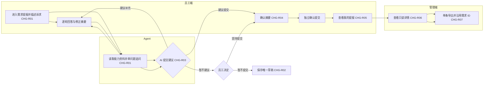
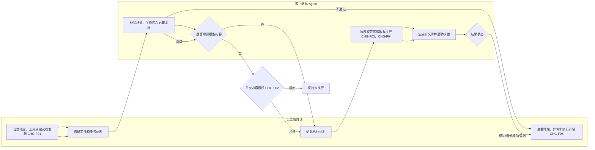
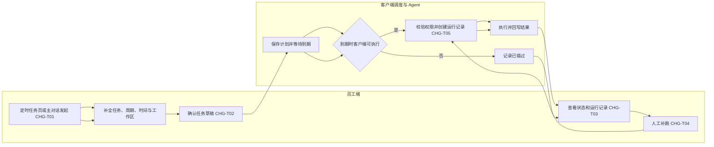

# 《先马·AI Studio｜V2.1.0｜需求提报、本地文件自动化与定时任务 增量 PRD》

## 0. 文档信息

| 项目 | 内容 |
| --- | --- |
| 所属项目/模块 | 先马·AI Studio / 需求提报、本地文件自动化、定时任务及公共能力 |
| 目标产品版本 | V2.1.0 |
| 需求类型 | 新增 + 调整 |
| PRD 修订版本与状态 | R1.1 / 产品规则已确认，待技术评审 |
| 当前有效基线 PRD | [V2.0.0 技能库、浏览器自动化与数据埋点 PRD](related/V2.0.0-基线PRD.md) |
| 对应方案/原型 | [需求分析 Skill 产品接入契约](related/先马·AI%20Studio-V2.1.0-需求分析Skill产品接入契约.md)、[需求提报原型说明](related/V2.1.0-需求提报原型说明.md)、[本地文件自动化 MVP 原型说明](related/本地文件自动化MVP-原型说明.md)、[定时任务 MVP 原型说明](related/定时任务MVP-原型说明.md)、[V2.1.0 UI 规范](related/UI_SPEC.md)、[原型统一入口](prototype/index.html) |
| 当前实现证据 | 静态原型已验证或待页面复核；生产 Agent、真实文件处理、生产调度、持久化与接口均未核验 |

### 版本记录

| 版本 | 日期 | 状态 | 变更摘要 | 确认依据 |
| --- | --- | --- | --- | --- |
| R1.1 | 2026-09-17 | 产品规则已确认，待技术评审 | 固化提交生成需求 ID、ID 与标题分列/可查询、导出沿用 ID、Skill 统一业务判断和版本发布自动刷新能力快照 | 用户确认按该方案同步原型与文档 |
| R1.0 | 2026-09-17 | 待技术评审 | 补齐需求分析 Skill 的 AI Studio 专用模式、输入输出、能力资料、建议判定、恢复和验收契约 | 用户要求按产品角度补齐并交开发接入 |
| R0.9 | 2026-09-17 | 待评审 | 汇总 V2.1.0 需求提报、本地文件自动化、基础定时任务及跨模块约束，形成开发与测试契约 | 用户确认三项方案及本次 PRD 输出范围 |

## 1. 本期需求与 AI 能力概览及 CHG 索引

> 本节是本期唯一 CHG 索引。提示词库、技能库、浏览器自动化、数据埋点和管理后台基础模块沿用 V2.0.0 基线，不在本期重复立项。

### 1.1 需求提报

| CHG编号 | 适用端 | 本期功能点 | 变更类型 | AI 能力变化 | 预期价值 |
| --- | --- | --- | --- | --- | --- |
| CHG-R01 | 用户端 | 独立需求分析入口与 Agent 分析 | 新增 | 理解与识别、知识检索、推理与决策 | 降低非产品岗位描述需求的门槛 |
| CHG-R02 | 用户端 | 单草稿保存、恢复、继续与放弃 | 新增 | 记忆与上下文 | 避免跨页面后丢失分析进度 |
| CHG-R03 | 用户端 | AI 建议、用户确认及坚持提交分支 | 新增 | 推理与决策、人工接管 | 保留 AI 辅助价值和用户最终决定权 |
| CHG-R04 | 用户端 | 摘要确认与正式提交分离 | 新增 | AI 治理与安全 | 减少误提交和未经确认的需求记录 |
| CHG-R05 | 用户端 | “我的提报”只读列表与详情 | 新增 | — | 让员工可追溯本人已提交需求 |
| CHG-R06 | 管理端 | 需求管理列表与只读详情 | 新增 | — | 以最低管理成本集中查看需求 |
| CHG-R07 | 管理端 | 单条 Markdown 导出及导出记录 | 新增 | — | 形成可进入后续需求流程的标准文件 |

### 1.2 本地文件自动化

| CHG编号 | 适用端 | 本期功能点 | 变更类型 | AI 能力变化 | 预期价值 |
| --- | --- | --- | --- | --- | --- |
| CHG-F01 | 用户端 | 自然语言、`/本地文件`、建议项三种入口 | 新增 | 理解与识别、Agent 工具调用 | 统一从主对话发起本地文件任务 |
| CHG-F02 | 用户端 | 工作区授权与模型内容单次授权 | 新增 | AI 治理与安全、人工接管 | 确保本地内容访问范围可知、可控、可审计 |
| CHG-F03 | 用户端 | Excel 固定源表转填固定模板完整流程 | 新增 | Agent 工具调用、工作流自动化 | 减少重复表格转填和人工校验 |
| CHG-F04 | 用户端 | Word 结构化整理与 PPT 生成简化流程 | 新增 | 内容生成与编辑、Agent 工具调用 | 验证常见文档整理与演示生成闭环 |
| CHG-F05 | 用户端 | 结果、异常、覆盖确认与执行详情 | 新增 | 人工接管、效果评估与反馈 | 保留原件并使执行结果可恢复、可追溯 |

### 1.3 定时任务

| CHG编号 | 适用端 | 本期功能点 | 变更类型 | AI 能力变化 | 预期价值 |
| --- | --- | --- | --- | --- | --- |
| CHG-T01 | 用户端 | “已安排”调整为“定时任务”并提供页面、对话双入口 | 调整 | 理解与识别 | 让用户可直接创建而非只查看计划 |
| CHG-T02 | 用户端 | 单次、每天、每周任务创建与编辑 | 新增 | 工作流自动化 | 覆盖首批固定周期任务 |
| CHG-T03 | 用户端 | 启停、立即运行、删除、状态与运行记录 | 新增 | 人工接管、效果评估与反馈 | 提供最小可管理、可追溯闭环 |
| CHG-T04 | 用户端 | 客户端在线执行、已错过与人工补跑 | 新增 | 工作流自动化、人工接管 | 在不建设云端调度的前提下处理错过任务 |
| CHG-T05 | 用户端 | 定时运行权限、授权与结果回写 | 新增 | Agent 工具调用、AI 治理与安全 | 避免计划任务绕过授权或失去结果来源 |

### 1.4 公共能力

| CHG编号 | 适用端 | 本期功能点 | 变更类型 | AI 能力变化 | 预期价值 |
| --- | --- | --- | --- | --- | --- |
| CHG-C01 | 用户端 + 管理端 | 导航、公共外壳、图标与响应式规范统一 | 调整 | — | 降低切页跳动和跨页面认知成本 |
| CHG-C02 | 用户端 + 管理端 | 复用 V2.0.0 任务、执行事实与埋点框架 | 优化 | 效果评估与反馈 | 支撑新能力追溯和上线后基线采集 |

## 2. 背景、目标与成功标准

### 2.1 当前问题和基线

1. V2.0.0 已定义主对话、技能、浏览器任务、任务结果、管理后台和基础埋点，但没有 AI Studio 自身需求的标准化提报闭环。
2. 员工需要在本机 Excel、Word、PPT 上完成重复性操作，当前没有经授权的统一 Agent 流程。
3. 原“已安排”主要是展示能力，不能完成创建、管理、执行记录和错过任务补跑。
4. V2.1.0 静态原型已用于验证交互，不代表生产 Agent、Office 文件处理、本地调度或服务端持久化已实现。
5. 当前缺少真实生产基线，不能预设节省工时、任务成功率或使用率目标。

### 2.2 本次目标

1. 形成“分析需求 → 用户确认 → 提交 → 管理员查看 → 单条导出”的需求提报 MVP。
2. 形成“描述文件任务 → 明确授权 → 执行 → 校验 → 获取新文件”的本地文件自动化 MVP。
3. 形成“创建计划 → 在线执行 → 记录结果 → 错过后补跑”的基础定时任务 MVP。
4. 三项能力复用现有主对话、任务结果、执行详情、公共侧栏、图标和数据事实，不建设平行框架。
5. 上线后采集首个观察周期基线，为效率、质量、人工接管和复用率目标提供证据。

### 2.3 非目标

- 不重写 V2.0.0 技能库、浏览器自动化、数据埋点和管理后台基础能力。
- 不把提示词库继承能力包装为 V2.1.0 新增功能。
- 不在本期实现完整需求管理、通用 Office 编辑器、云端无人值守调度或自动化编排。

### 2.4 成功标准

| 编号 | 成功标准 | 可观察证据 | 本期门槛 |
| --- | --- | --- | --- |
| SS-01 | 需求提报三类建议分支均可完成或安全退出 | 提交记录、草稿状态、后台详情、导出文件 | 无误提交；用户坚持提交不被 AI 拦截 |
| SS-02 | Excel 正常、部分成功、覆盖和失败分支可判定 | 新文件、异常清单、授权记录、执行详情 | 原件默认不变；异常不静默丢弃 |
| SS-03 | Word、PPT 可完成简化闭环 | 输入元数据、授权记录、结果文件与摘要 | 拒绝授权后无读取、上传或结果 |
| SS-04 | 定时任务双入口生成同一结构任务 | 任务记录、运行记录、对话回写 | 未确认不创建；立即运行/补跑不改原计划 |
| SS-05 | 公共导航和工作台在目标宽度稳定 | 1024px/1280px 截图、控制台记录 | 无整页横向滚动、遮挡、侧栏跳动或缺失图标 |
| SS-06 | 上线后可形成真实经营基线 | 任务、执行、授权、结果、回访数据 | 先采集基线，再评审量化目标；不以登录次数替代价值 |

## 3. 当前能力与差异基线

| 编号 | 当前能力/规则 | 产品状态 | 当前实现 | 事实来源 | 本次处理 |
| --- | --- | --- | --- | --- | --- |
| BASE-01 | 主对话、任务卡、结果页和执行详情 | V2.0.0 已确认基线 | 生产状态未核验 | V2.0.0 PRD | 复用并扩展场景 |
| BASE-02 | 技能库、浏览器自动化、管理后台基础模块 | V2.0.0 已确认基线 | 回归仍有遗留缺陷 | V2.0.0 PRD、项目记忆 | 不重写，按依赖处理 |
| BASE-03 | 需求提报与后台需求管理 | V2.1.0 已确认方案 | 静态原型已验证，生产未核验 | 需求提报原型说明 | 进入本 PRD |
| BASE-04 | 本地文件自动化 | V2.1.0 已确认方案 | 静态原型已验证，真实文件未接入 | 本地文件原型说明 | 进入本 PRD |
| BASE-05 | 基础定时任务 | V2.1.0 已确认方案 | 静态原型已完成，1024px 待页面复核，生产调度未接入 | 定时任务原型说明 | 进入本 PRD |
| BASE-06 | 应用端公共外壳与图标体系 | V2.1.0 已确认规范 | 原型公共组件已接入 | V2.1.0 UI 规范 | 强制沿用 |
| BASE-07 | 用户、任务、执行、技能和模块使用事实 | V2.0.0 已确认口径 | 生产采集未核验 | V2.0.0 PRD | 扩展事件与维度，不另建统计链路 |

### 3.1 事实冲突与原型差异

| 编号 | 差异 | 高优先级事实 | 当前表现 | 本次处理 | 影响 |
| --- | --- | --- | --- | --- | --- |
| DIFF-01 | 后台需求管理是否保留概览统计卡 | MVP 只保留搜索、导出状态筛选、列表、详情和单条导出 | 早期原型说明曾列概览统计 | 开发按 MVP 收敛范围 | 减少本期工作量 |
| DIFF-02 | 需求分析是否真实调用 Skill | 正式产品由 Agent 调用；静态原型只模拟 | 原型以预设分支演示 | 开发不得把演示口令实现为业务判断 | 避免错误规则固化 |
| DIFF-03 | 定时任务 1024px 验证状态 | 必须完成真实浏览器验收 | 当前仅完成断点和结构检查 | 进入验收前补测 | 不阻塞产品规则，阻塞验收关闭 |

## 4. 本期范围边界

### 4.1 明确不做

| 模块 | 不做事项 | 原因/依据 |
| --- | --- | --- |
| 需求提报 | 审核、负责人、优先级、排期、评论、开发状态、批量导出 | 本期只验证提交和单条移交闭环 |
| 需求提报 | 多草稿、未提交历史、草稿搜索/归档 | 本期最多保留一条未提交草稿 |
| 本地文件 | 旧版 Office、宏、加密文件、通用复杂编辑 | MVP 风险和兼容范围收敛 |
| 本地文件 | 控制已安装 Office/WPS 或其他桌面软件 | 本期只处理文件，不做 GUI 自动化 |
| 定时任务 | 每月、自定义 Cron、事件触发、自动重试 | MVP 仅单次、每天、每周和人工补跑 |
| 定时任务 | 云端无人值守、多设备同步、共享模板、技能编排、多任务依赖 | 本期只在客户端在线或后台常驻时执行 |
| 公共能力 | 新建独立文件工作台、运行管理后台或第二套任务事实 | 复用现有对话和任务体系 |

### 4.2 限制事项

| 限制事项 | 适用范围 | 限制说明 |
| --- | --- | --- |
| 原型演示参数和口令 | 全部模块 | 仅用于评审，不是生产判断条件或正式字段 |
| 静态原型状态 | 全部模块 | 可证明交互可见，不证明真实模型、文件、调度、接口已实现 |
| 文件授权 | 本地文件、定时任务 | 工作区授权不等于模型内容授权；后者每次按内容范围单独确认 |
| 客户端在线 | 定时任务 | 客户端关闭期间不执行，到期记录为已错过 |
| 生产持久化 | 全部模块 | 浏览器本地存储只用于原型；生产必须采用可靠持久化并处理并发和隔离 |

## 5. 用户、角色与完整流程

### 5.1 角色和权限前提

| 角色 | 使用入口 | 可见数据范围 | 可执行操作 | 限制 |
| --- | --- | --- | --- | --- |
| 员工 | 用户端 | 本人需求、本人授权工作区、本人任务与运行记录 | 分析/提交需求，查看本人需求 ID，发起文件任务，创建和管理本人定时任务 | 不查看他人数据，不自行编号，不绕过授权 |
| 需求管理员 | 管理端 | 有权限范围内的已提交需求及导出记录 | 搜索、筛选、查看、单条导出 Markdown | 不修改提交正文，不在本期审核或排期 |
| Agent | 用户端运行层 | 当前会话、允许的能力资料、授权文件范围 | 分析、追问、建议、工具调用、生成和执行 | 不代替用户提交，不越界读取，不自行放宽权限 |
| 客户端调度器 | 桌面客户端 | 本机当前用户的有效计划与授权元数据 | 到期触发、记录运行、回写结果 | 客户端关闭时不执行，不自动重试 |

### 5.2 需求提报主流程

### 5.3 本地文件自动化主流程

### 5.4 定时任务主流程

### 5.5 分支、异常和再次使用

- 需求提报：已有能力可直接解决且员工确认已解决时结束，不生成记录；范围外、主动放弃同样不进入“我的提报”或后台。
- 本地文件：只有附件或只有 `/本地文件` 时先追问任务目标，不创建任务；部分成功保留成功结果并单列异常项。
- 定时任务：只有时间没有任务内容时追问；未确认草稿不写入任务列表；立即运行和补跑生成独立运行记录且不改变原计划。
- 所有模块：权限失效时停止当前动作，保留可恢复状态和错误原因；不得把失败显示为成功。

## 6. 页面与交互变化

| 页面/区域 | 控件/内容 | 触发条件 | 用户操作 | 系统反馈 | 后续状态 | 关联变更 |
| --- | --- | --- | --- | --- | --- | --- |
| 应用端公共侧栏 | “定时任务”“需求提报”入口 | 登录后 | 点击切页 | 公共外壳与选中态稳定 | 对应页面 | CHG-T01、CHG-C01 |
| 新对话/技能与工具 | “本地文件”“定时任务” | 打开工具菜单 | 选择并补充描述 | 显示工具标签；信息不足追问 | 草稿或任务 | CHG-F01、CHG-T01 |
| 需求提报 | 独立分析对话、理解面板、保存/提交动作 | 点击入口 | 对话、确认、提交或放弃 | 单问题追问、建议、草稿/提交反馈 | 草稿/待提交/已提交 | CHG-R01、CHG-R02、CHG-R03、CHG-R04 |
| 我的提报 | 本人记录列表和只读详情 | 从需求提报页进入 | 切换记录 | 展示需求 ID 和提交内容 | 只读 | CHG-R05 |
| 管理后台需求管理 | 搜索、导出状态筛选、列表、详情 | 有需求管理权限 | 搜索/筛选/查看 | 列表结果和只读详情 | 只读 | CHG-R06 |
| 管理后台需求详情 | 导出 Markdown | 记录已提交 | 点击导出 | 首次生成 REQ；重复导出沿用 | 未导出/已导出 | CHG-R07 |
| 任务执行结果页 | 文件计划、授权、执行、异常、结果卡 | 本地文件任务 | 确认/取消/打开结果 | 阶段、结果和恢复动作 | 未执行/执行中/终态 | CHG-F02、CHG-F03、CHG-F04、CHG-F05 |
| 定时任务页 | 新增、筛选、编辑、启停、立即运行、删除、记录 | 点击入口 | 管理本人任务 | 状态和运行记录即时更新 | 运行中/暂停/错过/完成 | CHG-T02、CHG-T03、CHG-T04 |
| 对话任务草稿卡 | 任务指令、周期、时间、工作区 | 识别到定时意图 | 确认或取消 | 确认后才创建并回写 | 已创建/未创建 | CHG-T01、CHG-T02 |

### 6.1 关键用户可见文案

| 场景 | 文案要点 | 展示方式 | 状态 |
| --- | --- | --- | --- |
| 摘要确认后 | “摘要已确认，尚未提交” | 状态提示 + 独立提交按钮 | 已确认 |
| AI 暂不建议 | 说明原因，提供“继续补充”“暂不提交”“坚持提交” | 分支卡 | 已确认 |
| 内容授权 | 文件、Sheet/段落、字段范围、用途和“允许本次/取消” | 确认弹窗 | 已确认 |
| 覆盖文件 | 提示覆盖目标与不可恢复风险 | 二次确认弹窗 | 已确认 |
| 错过任务 | 说明客户端关闭期间未执行并提供“补跑” | 状态标签 + 操作 | 已确认 |
| 原型演示口令 | 不出现在生产界面 | 仅原型内部 | 非产品规则 |

## 7. 功能与业务规则

### 7.1 需求提报规则

#### R-R01 提报范围

- 关联变更：CHG-R01。
- 仅收集先马·AI Studio 自身产品需求。范围外诉求应说明原因并结束，不生成需求记录。
- 正式产品分析前读取随版本部署的 `docs/AI_CAPABILITIES.md`；资料不可用、过期或版本无法识别时不得强判“已有能力/无能力”，应提示资料状态并允许继续补充或稍后重试。

#### R-R02 单草稿

- 关联变更：CHG-R02。
- 每名员工最多保留一条未提交草稿，包含对话、当前问题、分析阶段、需求理解和已确认摘要状态。
- 从需求提报切换到其他页面时自动保存；再次进入自动恢复。
- 已有草稿时新建需求，必须先选择继续当前需求或放弃并新建；放弃需二次确认且确认后不可恢复。

#### R-R03 AI 建议与用户决定

- 关联变更：CHG-R03。
- AI 建议枚举为：`建议提交`、`建议补充`、`暂不建议提交`。
- `建议补充` 不进入普通提交；用户需继续补充后重新判断。
- `暂不建议提交` 时，用户可暂不提交并保留草稿，也可填写坚持提交理由后继续。
- AI 只有建议权，不得阻止用户坚持提交，也不得代替用户确认。
- 需求理解、能力关系、建议解决方向、MVP范围、风险、验证方式及 `submit/supplement/not_recommended/not_applicable` 统一由需求分析 Skill 判断；技术编排层只校验 schema、枚举、状态、权限、版本、跨字段一致性和幂等，不得另做业务判断或改写 Skill 结论。

#### R-R04 摘要确认与正式提交

- 关联变更：CHG-R04。
- 摘要确认只冻结当前摘要，不生成已提交记录；必须再执行一次明确的“确认提交”。
- 摘要实质内容、能力资料版本或用户输入发生变化时，旧摘要确认和提交授权失效。
- 提交失败保留待提交状态与重试入口；成功后由提交服务原子生成唯一需求 ID `REQ-YYYYMMDD-NNN`，并清除当前草稿。

#### R-R05 已提交记录与后台导出

- 关联变更：CHG-R05、CHG-R06、CHG-R07。
- 用户端仅展示本人已提交记录和需求 ID，内容只读；修改需求必须重新发起。
- 后台仅展示有权限范围内的已提交记录，正文和 AI 判断只读。
- 后台 MVP 列表字段固定为需求 ID、需求标题、提报人、AI 判断与提交方式、提交时间、导出状态和操作；需求 ID 与标题必须分列。筛选只含关键词搜索和导出状态，关键词至少支持完整需求 ID 精确查询并兼容标题、真实问题和提报人。
- 单条导出 Markdown 沿用提交时生成的需求 ID，不生成或替换编号；重复导出更新导出次数和最近导出时间，导出失败不改变原导出状态。
- 导出 Markdown 至少包含需求 ID、标题、提报人、提交时间、原始诉求摘录、结构化需求摘要、能力资料版本与现有能力对比、建议解决方向、范围、依赖、风险、验证方式、AI 建议、提交方式/坚持理由及导出元数据；正文内容按权限和脱敏规则输出。
- 导出不代表审核通过、立项、优先级或排期。

### 7.2 本地文件规则

#### R-F01 入口和格式

- 关联变更：CHG-F01。
- 三种入口进入同一任务结构：自然语言、`/本地文件`、首页建议项。
- 支持 `.xlsx`、`.csv`、`.docx`、`.pptx`；旧版 Office、宏和加密文件在执行前明确拒绝。
- 只有附件或只有命令时追问任务描述，不创建正式任务。

#### R-F02 两级授权

- 关联变更：CHG-F02。
- 工作区授权限定客户端可访问的本地路径范围；越界文件必须重新选择，不能沿用其他工作区权限。
- 需要把内容发送给模型时，单独展示文件、Sheet/段落、字段范围与用途，只提供“允许本次”和“取消”。
- 用户拒绝且任务依赖模型时保持未执行，不读取、不上传、不生成，不静默降级。
- 高风险文件操作继续沿用单独确认；创建任务不等于永久授权未来运行读取正文。

#### R-F03 Excel 完整流程

- 关联变更：CHG-F03。
- MVP 主场景为固定源表转填固定登记模板，执行前校验文件格式、工作表和必要字段。
- 执行计划必须展示输入文件、映射范围、输出位置和潜在异常，用户确认后开始。
- 默认输出 `新品登记表_处理后.xlsx`，不得修改源表和原模板。
- 缺失、重复和格式错误进入异常清单，不静默补值；成功项可在部分成功结果中保留。

#### R-F04 Word 与 PPT 简化流程

- 关联变更：CHG-F04。
- Word：读取一份 `.docx` 的已授权段落，生成结构化整理版 Word，结果展示摘要和新文件。
- PPT：读取用户提供的提纲或 Word，并结合用户选择的模板生成 PPT，结果展示页数、页面提纲和新文件。
- 两类流程均必须覆盖选择文件、授权、处理中、成功和失败，不在本期提供复杂页面级编辑。

#### R-F05 输出、覆盖与详情

- 关联变更：CHG-F05。
- 默认生成新文件；同名文件默认保存为副本。用户选择覆盖时必须二次确认。
- 结果状态区分成功、部分成功、失败、未执行；成功或部分成功才可展示真实存在的结果文件操作。
- 结果提供“打开文件”“在文件夹中显示”“查看执行详情”；由桌面客户端桥接本机默认应用和资源管理器。
- 执行详情仅保存路径元数据、动作、授权、结果和错误，不展示文件正文。

### 7.3 定时任务规则

#### R-T01 双入口与任务草稿

- 关联变更：CHG-T01、CHG-T02。
- 用户可从定时任务页直接新增，也可在普通对话中用自然语言或 `/定时任务` 创建。
- 对话入口必须识别任务内容、周期和时间；信息不足时逐项追问。
- 草稿至少展示任务名称、任务指令、周期、首次运行时间、工作区和创建后状态；用户确认后才写入任务列表。

#### R-T02 周期与编辑

- 关联变更：CHG-T02。
- 周期仅支持单次、每天、每周；不接受过去时间作为新的首次执行时间。创建和编辑时展示客户端系统时区，并把该时区写入周期规则，后续在本机按已保存时区计算。
- 创建后任务指令、周期和工作区不会被普通对话消息隐式修改；只能通过明确编辑动作更新。
- 编辑只影响尚未开始的后续运行，不改写历史运行记录。

#### R-T03 管理动作和状态

- 关联变更：CHG-T03。
- 支持新增、编辑、暂停、恢复、立即运行、删除确认和查看运行记录。
- 任务状态为：运行中、已暂停、已错过、已完成；运行状态为：待确认、执行中、执行成功、执行失败。
- 立即运行生成独立运行记录，不改变下一次计划；删除任务需二次确认，删除后停止未来触发，历史运行记录保留只读，具体保留时长按统一审计策略执行。

#### R-T04 在线执行和补跑

- 关联变更：CHG-T04。
- 任务只在客户端在线或后台常驻时执行。关闭期间到期的运行记为已错过，不在重新打开时自动补跑。
- 已错过任务由用户手动补跑；补跑生成独立记录，不改变原计划。
- 单次任务执行成功后进入已完成；周期任务成功后保持运行中并计算下一次计划。
- 失败不自动重试，只提供人工补跑。

#### R-T05 权限和结果回写

- 关联变更：CHG-T05。
- 每个任务最多绑定一个授权工作区；越界文件要求重新选择。
- 到期执行前必须重新校验账号、工作区和工具权限。高风险动作或缺少授权时进入待确认，不继续执行。
- 文件正文需发送模型时仍采用单次内容授权，创建计划不构成永久内容授权。
- 每次运行形成独立 `runId`，结果摘要回写创建任务的对话，并可进入现有任务结果页。

### 7.4 公共规则

#### R-C01 公共 UI 与图标

- 关联变更：CHG-C01。
- 应用端一级导航固定为“新对话、搜索、技能库、提示词库、定时任务、需求提报”；需求提报在分隔线后。
- 正式应用页面首屏复用公共外壳、`xianma-app-sidebar` 和 `assets/ui-tokens.css`，不得在页面内自建侧栏或等待页面末尾脚本补齐。
- 系统导航、操作、状态和工具图标统一调用 `<xianma-icon>`；技能、提示词等业务内容图标沿用已登记彩色 Emoji。
- 目标宽度为 1280px，最低验证宽度为 1024px；不新增移动端专属流程。

#### R-C02 任务事实和埋点复用

- 关联变更：CHG-C02。
- 新能力沿用 V2.0.0 的 `taskId`、`runId`、任务终态、执行事实和事件框架；不得用页面点击替代任务或执行事实。
- 埋点、日志和执行详情不得包含对话正文、文件正文、凭据或超出用途的本地路径信息。

## 8. 状态、边界与异常

### 8.1 状态模型

| 对象 | 业务状态 | 建议枚举 | 进入条件 | 可执行操作 | 退出条件 |
| --- | --- | --- | --- | --- | --- |
| 需求草稿 | 分析中 | `analyzing` | 首条有效诉求发送后 | 回答、离开自动保存、放弃 | 形成建议或结束 |
| 需求草稿 | 待补充 | `supplement_required` | AI 判断信息不足 | 继续补充 | 重新分析 |
| 需求草稿 | 已暂存 | `saved` | 用户暂不提交或离开页面 | 恢复、放弃并新建 | 恢复或删除 |
| 需求 | 待提交 | `submission_pending` | 摘要确认完成 | 确认提交、修改摘要 | 提交成功或确认失效 |
| 需求 | 已提交 | `submitted` | 服务端提交成功 | 查看 | 永久只读 |
| 文件任务 | 未执行 | `not_started` | 未授权、取消或校验失败 | 修改输入、重新授权 | 开始执行 |
| 文件任务 | 执行中 | `running` | 用户确认计划且授权有效 | 查看进度、按规则取消 | 进入终态 |
| 文件任务 | 成功/部分成功/失败 | `succeeded/partial/failed` | 执行结束 | 打开结果、查看详情、重试 | 新建独立执行 |
| 定时任务 | 运行中/已暂停/已错过/已完成 | `active/paused/missed/completed` | 按规则创建或运行变化 | 编辑、启停、立即运行、补跑、删除 | 状态动作或执行结果 |
| 任务运行 | 待确认/执行中/成功/失败 | `confirmation_required/running/succeeded/failed` | 调度触发或人工运行 | 确认、查看、补跑 | 进入终态 |
| 导出 | 未导出/已导出 | `not_exported/exported` | 提交成功/首次导出成功 | 导出/重复导出 | 仅导出结果变化，需求 ID 不变 |

### 8.2 边界规则

| 边界场景 | 处理规则 | 用户反馈 | 验收关联 |
| --- | --- | --- | --- |
| 重复点击提交/导出/确认 | 前一请求处理中禁用重复动作；服务端保证幂等 | 显示处理中，不生成重复记录 | AC-R08、AC-R12 |
| 能力资料不可用 | 不输出确定能力关系；保留输入 | 显示资料状态和重试/继续补充 | AC-R03 |
| 文件越界 | 禁止读取并要求重新选择授权范围 | 明确越界文件 | AC-F04 |
| 文件同名 | 默认保存副本；覆盖二次确认 | 展示目标路径和风险 | AC-F09 |
| 加密/损坏/占用 | 执行前或执行中失败，保留原件 | 指明文件和恢复动作 | AC-F11 |
| 客户端关闭到期 | 不执行，记为已错过 | 提供人工补跑 | AC-T09 |
| 权限在计划创建后失效 | 到期时转待确认或失败，不继续工具调用 | 提示重新授权 | AC-T11 |
| 公共侧栏切页 | 保持相同尺寸、位置和组件 | 无跳动、遮挡 | AC-C01 |

### 8.3 异常与恢复

| 异常 | 已产生影响 | 自动处理 | 用户操作 | 最终状态 | 记录 |
| --- | --- | --- | --- | --- | --- |
| 需求提交失败 | 草稿和摘要已存在 | 保留待提交，不重复建记录 | 重试或返回修改 | 待提交/已提交 | 错误码、时间、重试结果 |
| 导出失败 | 无成功文件 | 回滚本次导出状态 | 重新导出 | 原状态 | 失败原因和操作人 |
| 文件部分成功 | 可能已有结果文件 | 保留成功项并生成异常清单 | 打开结果或修正后重试 | 部分成功 | 项目级结果与错误 |
| 内容授权拒绝 | 无内容读取和结果 | 停止任务 | 修改为不依赖模型的任务或取消 | 未执行 | 授权拒绝事件，不记正文 |
| 定时运行失败 | 可能有部分外部影响 | 不自动重试 | 查看详情后补跑 | 失败 | 每次独立 runId |
| 高风险动作待确认超时 | 不继续风险动作 | 保持待确认 | 重新确认或取消 | 待确认/失败 | 确认范围与决定 |

## 9. 数据对象与字段契约

> 下列是产品字段契约，不指定数据库表名或接口路径。长度、存储类型和索引由技术设计确认。

通用字段约束：唯一标识使用字符串且无默认值；状态使用本节给出的枚举字符串；时间使用带时区的时间戳；次数使用大于等于 0 的整数并默认 `0`；列表默认空数组；非必填对象默认 `null`。正文类字段使用字符串，最大长度由技术评估后回到产品评审，截断不得静默发生。

### 9.1 需求对象

| 对象 | 字段名 | 业务含义 | 必填 | 格式/枚举 | 校验与来源 |
| --- | --- | --- | --- | --- | --- |
| DemandDraft | `draftId` | 唯一草稿标识 | 是 | 唯一标识 | 服务端生成；每用户最多一个有效草稿 |
| DemandDraft | `conversationId` | 独立分析会话 | 是 | 唯一标识 | 不与普通 AI 对话混用 |
| DemandDraft | `analysisStage` | 当前分析阶段 | 是 | 产品阶段枚举 | Agent 更新，恢复时原样返回 |
| DemandDraft | `capabilityVersion` | 能力资料版本 | 否 | 版本字符串 | 无法读取时记录异常状态 |
| DemandDraft | `summary` | 用户待确认的结构化摘要 | 否 | 结构化对象 | 提交前必须存在且最新 |
| DemandDraft | `aiRecommendation` | AI 提交建议 | 否 | `submit/supplement/not_recommended/not_applicable` | 由需求分析 Skill 输出，编排层只做硬校验 |
| DemandSubmission | `requirementId` | 需求 ID | 是 | `REQ-YYYYMMDD-NNN` | 提交服务在提交成功时原子生成并保证唯一 |
| DemandSubmission | `submitMode` | 提交方式 | 是 | `recommended/insisted` | 坚持提交需理由 |
| DemandSubmission | `insistReason` | 坚持提交理由 | 条件必填 | 文本 | `submitMode=insisted` 时必填 |
| DemandSubmission | `submittedAt` | 提交时间 | 是 | 时间戳 | 服务端时间 |
| ReqExport | `exportCount` | 成功导出次数 | 是 | 非负整数 | 仅成功后加一 |
| ReqExport | `firstExportedAt` | 首次成功导出时间 | 否 | 时间戳 | 首次成功后写入，后续不变 |
| ReqExport | `lastExportedAt` | 最近成功导出时间 | 否 | 时间戳 | 失败不更新 |

### 9.2 本地文件任务对象

| 对象 | 字段名 | 业务含义 | 必填 | 格式/枚举 | 校验与来源 |
| --- | --- | --- | --- | --- | --- |
| LocalFileTask | `taskId` | 文件任务标识 | 是 | 唯一标识 | 复用公共任务事实 |
| LocalFileTask | `taskType` | 任务类型 | 是 | `excel/word/ppt` | 从用户任务确认结果取得 |
| LocalFileTask | `inputFiles` | 输入文件元数据 | 是 | 文件名、类型、路径引用 | 不在埋点存正文 |
| LocalFileTask | `workspaceScope` | 授权工作区 | 是 | 路径范围引用 | 必须覆盖全部输入/输出 |
| LocalFileTask | `contentScope` | 模型内容范围 | 条件必填 | Sheet/段落/字段 | 需要模型时由用户单次确认 |
| LocalFileTask | `outputPath` | 结果文件路径 | 是 | 本地路径引用 | 默认不覆盖原件 |
| LocalFileTask | `overwriteDecision` | 同名处理 | 否 | `copy/overwrite/cancel` | 覆盖需二次确认 |
| LocalFileTask | `resultStatus` | 结果状态 | 是 | `not_started/running/succeeded/partial/failed` | 由执行事实更新 |
| LocalFileTask | `errorItems` | 异常项 | 否 | 结构化列表 | 缺失、重复、格式、占用等 |
| FileAuthorization | `decision` | 单次授权决定 | 是 | `allowed/denied` | 含范围、用途、时间，不存正文 |

### 9.3 定时任务对象

| 对象 | 字段名 | 业务含义 | 必填 | 格式/枚举 | 校验与来源 |
| --- | --- | --- | --- | --- | --- |
| ScheduledTask | `scheduledTaskId` | 定时任务标识 | 是 | 唯一标识 | 确认创建后生成 |
| ScheduledTask | `name` | 任务名称 | 是 | 文本 | 用户确认，可由 Agent 建议 |
| ScheduledTask | `instruction` | 冻结的任务指令 | 是 | 文本 | 普通消息不隐式修改 |
| ScheduledTask | `scheduleType` | 周期类型 | 是 | `once/daily/weekly` | MVP 固定枚举 |
| ScheduledTask | `scheduleRule` | 首次时间、周期与创建时区 | 是 | 结构化对象 | 必须可计算并展示下次运行 |
| ScheduledTask | `workspaceScope` | 绑定工作区 | 否 | 单一范围引用 | 文件任务需要时必填 |
| ScheduledTask | `status` | 任务状态 | 是 | `active/paused/missed/completed` | 按运行和操作更新 |
| ScheduledTask | `nextRunAt` | 下次计划时间 | 条件必填 | 时间戳 | 已完成单次任务可为空 |
| TaskRun | `runId` | 每次运行标识 | 是 | 唯一标识 | 计划触发、立即运行、补跑均新建 |
| TaskRun | `triggerType` | 触发方式 | 是 | `scheduled/manual_now/manual_retry` | 用于区分计划与人工操作 |
| TaskRun | `runStatus` | 运行状态 | 是 | `confirmation_required/running/succeeded/failed` | 不覆盖历史运行 |
| TaskRun | `resultTaskId` | 对应公共任务结果 | 否 | taskId | 实际创建执行任务后关联 |

## 10. AI 产品契约

### 10.1 AI 职责、输入与输出

| 关联CHG/R | AI 负责 | AI 不负责 | 输入与上下文 | 知识/工具来源 | 输出 |
| --- | --- | --- | --- | --- | --- |
| CHG-R01、CHG-R02、CHG-R03、CHG-R04 | 理解诉求、核对能力、单问题追问、结构化摘要和建议 | 代替用户提交、决定立项/排期 | 当前需求对话、能力资料版本、已确认事实 | `docs/AI_CAPABILITIES.md`、需求分析 Skill | 摘要、能力关系、方向、提交建议 |
| CHG-F01、CHG-F02、CHG-F03、CHG-F04、CHG-F05 | 识别文件任务、生成计划、映射/整理/生成、校验和异常归纳 | 越权读取、静默补值、未经确认覆盖 | 任务描述、文件元数据、授权内容范围 | 受控本地文件工具、模型 | 新文件、摘要、异常清单、执行详情 |
| CHG-T01、CHG-T02、CHG-T03、CHG-T04、CHG-T05 | 识别定时意图、补全草稿、到期执行任务指令 | 隐式修改计划、自动扩大权限、云端离线运行 | 任务指令、周期、工作区、每次运行上下文 | 客户端调度器、可用 Agent 工具 | 任务草稿、运行结果、失败原因 |

### 10.2 不确定性、失败与人工控制

| 场景 | 系统判断/触发条件 | 自动处理 | 用户控制 | 最终状态 | 记录与审计 |
| --- | --- | --- | --- | --- | --- |
| 需求信息不足 | 关键事实无法形成摘要 | 仅追问一个关键问题 | 回答、修正、暂存 | 分析中/待补充 | 阶段和已确认事实 |
| 能力关系不确定 | 资料不可用或冲突 | 不强判 | 重试或继续补充 | 分析中 | 资料版本/异常 |
| 文件内容需模型 | 任务无法仅靠本地确定性工具完成 | 暂停在授权前 | 允许本次或取消 | 执行/未执行 | 授权范围和决定 |
| 文件结果部分成功 | 项目级校验结果混合 | 保留成功项 | 查看异常、修正后重试 | 部分成功 | 项目级结果 |
| 定时任务高风险 | 到期后动作需要额外确认 | 暂停执行 | 确认或取消 | 待确认/失败 | 风险动作与决定 |
| AI/工具失败 | 超时、工具异常或结果不可验证 | 不伪装成功，不自动无限重试 | 人工补跑或重新发起 | 失败 | 错误类型、阶段、恢复动作 |

### 10.3 AI 专项约束

- 工具权限：所有本地读写和外部动作均受工具白名单、工作区边界和高风险确认约束。
- 人工接管：AI 建议、内容授权、覆盖、提交和高风险动作均保留明确人工决定点。
- 记忆隔离：需求草稿按用户与 `draftId` 隔离；文件任务与定时运行按 `taskId/runId` 隔离，不跨任务共享正文。
- 内容安全：生成的 Word/PPT 是工作产物草稿，用户对外使用前需人工审核；用户需确保输入素材具有使用权，系统不得承诺自动满足版权或品牌规范；不得根据原型演示数据生成真实业务结论。
- 无答案/失败：AI 不确定时必须暴露不确定性，保留原始输入和恢复入口。
- 成本与性能：模型、超时、额度和降级方案无可靠基线，列入第 15 节技术待确认。

### 10.4 AI 效果与产品价值指标

| 指标 | 口径 | 当前基线 | 验证计划 | 数据来源 |
| --- | --- | --- | --- | --- |
| 需求有效提交率 | 成功提交需求数 / 启动分析且进入有效追问的需求数 | 待采集 | 首个观察周期建立基线，区分建议提交与坚持提交 | 需求和事件事实 |
| 文件任务最终成功率 | 最终成功 taskId / 已进入执行的文件 taskId | 待采集 | 区分成功、部分成功、失败和未执行 | 任务/执行事实 |
| 文件任务人工接管率 | 发生额外人工修正或恢复的任务数 / 已执行文件任务数 | 待采集 | 首个观察周期采集，不预设目标值 | 授权和执行事件 |
| 定时运行成功率 | 成功 runId / 已实际开始的 runId | 待采集 | 排除已错过和未确认运行，单独统计补跑 | 运行事实 |
| 重复使用用户数 | 观察周期内完成至少两次有效任务的去重用户数 | 待采集 | 按模块和整体展示 | 任务事实 |
| 周期效率 | 人工基线时长与 Agent 完成后人工总耗时对比 | 待补证 | 选择固定 Excel/周报场景做样本测量 | 调研记录、任务记录 |

## 11. 依赖、联动与历史兼容

| 维度 | 是否影响 | 现有入口/契约 | 本次处理 | 历史兼容 | 待确认 |
| --- | --- | --- | --- | --- | --- |
| 身份与权限 | 是 | 现有登录和后台权限 | 复用用户身份，增加需求管理权限校验 | 不改账号体系 | 权限映射 |
| Agent 与技能 | 是 | 现有 Agent/工具调用 | 需求分析按[产品接入契约](related/先马·AI%20Studio-V2.1.0-需求分析Skill产品接入契约.md)实现专用模式；本地文件和定时执行复用现有工具框架 | 不改变 V2.0.0 技能调用 | 生产加载与技术适配 |
| 任务与执行 | 是 | V2.0.0 task/run 事实 | 复用并增加场景、触发方式和授权信息 | 历史任务无需补字段 | 字段映射 |
| 文件与存储 | 是 | 本地工作区与结果文件 | 增加 Office 文件读取、生成和打开能力 | 不处理旧 Office 文件 | 库与安全方案 |
| 管理后台 | 是 | 现有聚合后台 | 顶部增加需求管理；详情只读和单条导出 | 不改其他模块 | 权限和路由 |
| 数据埋点 | 是 | V2.0.0 统一事实/指标框架 | 扩展需求、文件、定时任务事件 | 历史未采集不可补算 | 事件字段 |
| 原“已安排” | 是 | V2.0.0 页面名称 | 统一更名为“定时任务” | 旧入口应跳转或映射同一页面 | 升级兼容实现 |
| 历史计划数据 | 是 | 原页面可能存在展示型计划 | 可可靠映射时升级为新对象；缺少任务指令、周期或时间时标记需编辑，不自动补造 | 原型本地状态不作为生产迁移源 | 数据盘点 |
| 通知与结果回写 | 是 | 现有对话和任务结果页 | 本期只回写创建任务的对话和运行记录，不新增系统推送 | 历史对话不补写 | 通知后续版本评估 |
| 积分/成本/额度 | 是 | V2.0.0 现有治理口径 | 本期不新增积分规则；模型与工具消耗纳入既有额度和成本事实 | 历史消耗不重算 | 额度策略 |

## 12. 数据取值、统计、埋点与经营结果

### 12.1 统计口径

| 数据项 | 业务含义 | 取数方式 | 统计/取值规则 |
| --- | --- | --- | --- |
| 已提交需求数 | 员工完成正式提交的需求量 | 聚合统计 | 按 `requirementId` 去重，只含 `submitted` |
| 坚持提交数 | AI 暂不建议但用户坚持提交的需求量 | 聚合统计 | `submitMode=insisted` 的 `requirementId` 数 |
| 已导出需求数 | 至少一次成功导出的需求量 | 聚合统计 | `exportCount > 0` 的 `requirementId` 去重数 |
| 文件任务数 | 已创建的本地文件任务量 | 聚合统计 | 按 `taskId` 去重，只有追问不计 |
| 文件任务最终成功率 | 文件任务最终完成质量 | 计算指标 | 最终成功 taskId /（成功 + 部分成功 + 失败 taskId）；未执行不进分母 |
| 已创建定时任务数 | 用户确认创建的计划数量 | 聚合统计 | 按 `scheduledTaskId` 去重，未确认草稿不计 |
| 定时运行成功率 | 实际运行的结果质量 | 计算指标 | 成功 runId /（成功 + 失败 runId）；已错过、待确认不进分母 |
| 已错过运行数 | 客户端不可执行导致的错过次数 | 聚合统计 | 每次到期且未执行形成一条错过事实，不按任务去重 |

### 12.2 关键事件

| 事件 | 触发口径 | 关键维度 | 禁止采集 |
| --- | --- | --- | --- |
| `demand_analysis_started` | 首条有效诉求进入分析 | 入口、能力资料状态 | 诉求正文 |
| `demand_submitted` | 服务端提交成功 | 建议类型、提交方式 | 摘要正文、坚持理由正文 |
| `demand_exported` | 单条 Markdown 导出成功 | 首次/重复、导出结果 | 导出正文 |
| `local_file_task_started` | 授权有效且进入真实执行 | 文件类型、任务类型、授权结果 | 文件正文、完整本地路径 |
| `local_file_task_finished` | 文件任务进入终态 | 终态、异常类型、是否覆盖 | 文件内容 |
| `scheduled_task_created` | 用户确认创建成功 | 周期类型、入口 | 任务指令正文 |
| `scheduled_run_finished` | 运行进入成功或失败 | 触发方式、终态、是否补跑 | 结果正文 |
| `scheduled_run_missed` | 到期但客户端不可执行 | 周期类型、原因分类 | 任务正文 |

### 12.3 经营结果验证计划

1. 首个观察周期先核对采集完整性、去重和任务/执行对账，形成使用、成功、失败、部分成功、错过和人工接管基线。
2. 选择固定 Excel 转填、Word 整理和周报定时任务，分别记录人工基线耗时、Agent 运行时长、人工修订时长和最终可用性。
3. 基线稳定后再由产品、业务和技术共同确定效率、成功率、人工接管率和复用率目标；本 PRD 不编造目标数值。
4. 产出可复用资产包括：需求摘要结构、文件映射模板、授权/异常 SOP、定时任务配置与验收用例。

## 13. 非功能、安全与合规

| 类别 | 产品要求 |
| --- | --- |
| 隐私 | 不在埋点、普通日志或后台详情中记录文件正文、凭据或无关本地路径；需求正文仅在授权角色的业务记录中可见 |
| 权限 | 每次工具调用校验身份、工作区和动作权限；模型内容授权不可由工作区授权替代 |
| 可恢复性 | 失败、取消、部分成功和已错过均提供明确状态与恢复动作，不静默重试高风险操作 |
| 幂等 | 提交、导出、计划创建和调度触发需防重复；重复请求不得生成重复需求、编号或同一时点重复运行 |
| 审计 | 记录操作人、时间、对象、动作、授权决定、结果和错误；审计不包含文件正文 |
| 兼容 | 目标窗口 1280px，最低验收 1024px；Windows 桌面客户端优先，不承诺移动端流程 |
| 可访问性 | 状态使用文字加颜色；纯图标按钮提供 `aria-label` 和 Tooltip；键盘焦点可见 |
| 性能与容量 | 具体响应时间、文件大小、并发、队列和成本阈值待技术评估，不在无证据时承诺数值 |

## 14. 验收标准

### 14.1 需求提报

| 编号 | 前置条件与步骤 | 可观察结果 | 关联变更 |
| --- | --- | --- | --- |
| AC-R01 | 员工进入空白需求提报并发送 AI Studio 自身诉求 | 系统读取能力资料状态并一次只追问一个关键问题 | CHG-R01 |
| AC-R02 | 分析中切到其他页面再返回 | 对话、当前问题、阶段和理解面板恢复到离开前状态 | CHG-R02 |
| AC-R03 | 能力资料读取失败或版本异常 | 不输出确定能力关系，展示异常和可恢复动作 | CHG-R01 |
| AC-R04 | AI 判断建议补充 | 普通提交不可用，补充后重新形成建议 | CHG-R03 |
| AC-R05 | AI 暂不建议，员工选择暂不提交 | 当前内容保存为唯一草稿，不进入我的提报或后台 | CHG-R02、CHG-R03 |
| AC-R06 | AI 暂不建议，员工填写理由并坚持提交 | 可进入摘要确认和独立提交，不被 AI 拦截 | CHG-R03、CHG-R04 |
| AC-R07 | 员工只确认摘要，不点击确认提交 | 页面明确显示尚未提交；后台无新记录 | CHG-R04 |
| AC-R08 | 员工确认提交并重复点击 | 只生成一条需求记录和一个需求 ID；成功后草稿清除 | CHG-R04 |
| AC-R09 | 提交失败 | 保留待提交内容和重试入口，不显示已提交 | CHG-R04 |
| AC-R10 | 打开我的提报并切换记录 | 只显示本人已提交需求，详情只读 | CHG-R05 |
| AC-R11 | 管理员输入完整需求 ID 并组合导出状态筛选 | 唯一命中对应记录；列表中需求 ID 与标题分列，标题搜索仍正常 | CHG-R06 |
| AC-R12 | 首次导出后再次导出同一需求 | 两次均沿用提交时的需求 ID，仅增加次数并更新最近导出时间 | CHG-R07 |

### 14.2 本地文件自动化

| 编号 | 前置条件与步骤 | 可观察结果 | 关联变更 |
| --- | --- | --- | --- |
| AC-F01 | 分别用自然语言、`/本地文件`、建议项发起同类任务 | 三个入口进入同一任务结构 | CHG-F01 |
| AC-F02 | 仅添加附件或仅发送命令 | 系统追问任务描述，不创建 taskId | CHG-F01 |
| AC-F03 | 选择旧版 Office、宏或加密文件 | 执行前明确拒绝并说明原因，原件不变 | CHG-F01、CHG-F05 |
| AC-F04 | 文件在授权工作区外 | 系统不读取并要求重新选择授权范围 | CHG-F02 |
| AC-F05 | 内容需发送模型且用户取消 | 无读取、上传和结果文件，状态为未执行 | CHG-F02 |
| AC-F06 | Excel 源表和模板校验通过并确认计划 | 生成新文件，源表和模板内容未被修改 | CHG-F03 |
| AC-F07 | Excel 存在缺失、重复或格式错误 | 异常项逐条列出，不静默补值；可形成部分成功 | CHG-F03、CHG-F05 |
| AC-F08 | 执行 Word/PPT 简化流程 | 授权后分别生成结构化 Word 或 PPT，并展示摘要/页数/提纲 | CHG-F04 |
| AC-F09 | 输出目录存在同名文件 | 默认保存副本；选择覆盖时出现二次确认 | CHG-F05 |
| AC-F10 | 结果文件成功生成 | “打开文件”“在文件夹中显示”可定位真实结果；详情不含正文 | CHG-F05 |
| AC-F11 | 文件被占用、损坏或必要字段缺失 | 显示具体错误和恢复动作，不误报成功 | CHG-F05 |

### 14.3 定时任务

| 编号 | 前置条件与步骤 | 可观察结果 | 关联变更 |
| --- | --- | --- | --- |
| AC-T01 | 从页面新增单次、每天、每周任务 | 三种任务均可确认创建并进入同一列表 | CHG-T01、CHG-T02 |
| AC-T02 | 在对话中用自然语言和 `/定时任务` 创建 | 信息完整时生成同结构草稿；确认后写入列表并回写对话 | CHG-T01、CHG-T02 |
| AC-T03 | 只输入时间没有任务内容 | 仅追问任务内容，不创建任务 | CHG-T01 |
| AC-T04 | 创建草稿后取消 | 任务列表无新增记录 | CHG-T02 |
| AC-T05 | 编辑已创建任务 | 只改变后续计划，历史运行记录不变 | CHG-T02 |
| AC-T06 | 暂停后等待到期 | 暂停期间不执行；恢复后按下一有效计划运行 | CHG-T03 |
| AC-T07 | 点击立即运行 | 新建独立 runId，原下次运行时间不因本次人工运行而改变 | CHG-T03 |
| AC-T08 | 删除任务 | 二次确认后任务不可再触发，历史记录按确认策略保留 | CHG-T03 |
| AC-T09 | 客户端关闭期间任务到期后重新打开 | 任务显示已错过且未自动执行，提供补跑 | CHG-T04 |
| AC-T10 | 对已错过任务补跑 | 新建独立 runId；补跑不改变原计划；单次成功后已完成 | CHG-T04 |
| AC-T11 | 到期时工作区或工具权限失效 | 不继续执行，进入待确认或失败并提示重新授权 | CHG-T05 |
| AC-T12 | 定时执行需要模型读取文件正文 | 每次运行仍展示单次内容授权；拒绝后不读取或生成 | CHG-T05 |

### 14.4 公共、权限与兼容

| 编号 | 前置条件与步骤 | 可观察结果 | 关联变更 |
| --- | --- | --- | --- |
| AC-C01 | 在 1024px、1280px 连续切换正式应用页面 | 侧栏、窗口、输入框和任务卡位置稳定，无遮挡和整页横向滚动 | CHG-C01 |
| AC-C02 | 检查系统图标和控制台 | 所有系统图标来自 `<xianma-icon>`，无缺失图标和脚本错误 | CHG-C01 |
| AC-C03 | 无需求管理权限访问后台需求页面 | 页面不可见或返回无权限，不泄露需求内容 | CHG-R06 |
| AC-C04 | 比对任务、运行和模块统计 | 按 `taskId/runId` 去重，可与执行事实对账，正文未进入埋点 | CHG-C02 |
| AC-C05 | 从 V2.0.0 升级后访问原“已安排”入口 | 进入统一“定时任务”页面，既有可兼容数据不丢失 | CHG-T01、CHG-C01 |

## 15. 待确认与开发交接

> 以下均为技术方案或交付参数待确认，不改变本 PRD 已确认的产品范围；若评估结果会改变产品行为，必须回到产品评审。

| 编号 | 待确认项 | 产品约束 | 不确认的影响 | 建议责任角色 |
| --- | --- | --- | --- | --- |
| TECH-01 | `docs/AI_CAPABILITIES.md` 的自动生成、版本映射和回滚实现 | 每次发布新版本自动读取正式产品事实源并生成或刷新快照；生成或校验失败阻断发布 | 能力对比不可可靠实现 | 产品 + Agent 开发 + 发布负责人 |
| TECH-02 | 需求分析 Skill 的生产加载与适配方案 | 产品输入输出、状态、能力资料、三级建议和验收已由[接入契约](related/先马·AI%20Studio-V2.1.0-需求分析Skill产品接入契约.md)确定；开发不得赋予 Skill 提交、编号或通知权限 | 未完成适配则原型无法转生产 | Agent 开发 |
| TECH-03 | 需求持久化、提交时并发编号和防重复提交 | 单草稿、提交幂等、需求 ID 唯一，导出沿用原 ID | 可能重复记录或冲突编号 | 服务端开发 |
| TECH-04 | Office 文件处理库和错误识别 | 支持指定格式、保留原件、识别占用/损坏/加密 | 文件兼容和结果可信度不明 | 客户端/文件能力开发 |
| TECH-05 | 客户端后台常驻和本地调度 | 只在线执行，关闭期间记错过，不自动补跑 | 计划触发可靠性不明 | 客户端开发 |
| TECH-06 | 权限令牌、工作区边界和高风险确认拦截 | 到期前重验权限，授权不可跨任务扩大 | 存在越权风险 | 安全 + 客户端开发 |
| TECH-07 | 数据保留、删除、脱敏和审计周期 | 满足业务追溯且最小化正文和路径数据 | 无法完成合规评审 | 安全 + 产品 + 服务端 |
| TECH-08 | 性能、文件大小、并发、队列、成本与额度 | 失败可见、可恢复，不编造承诺值 | 无法制定容量和性能验收 | 技术负责人 |
| TECH-09 | 1024px 定时任务真实浏览器复核 | 满足 AC-C01 | UI 验收不能关闭 | 前端 + 测试 |

## 16. 开发交付边界与建议拆分

### 16.1 可进入技术评审的产品范围

- 本 PRD 的 CHG、规则、状态、字段、权限、异常和验收为本期开发输入。
- 当前状态为“产品契约已定义，待技术评审”；完成 PRD 不等于已开发、已验证、已部署或已上线。
- 技术评审可以调整内部实现，但不得未经产品确认改变用户入口、授权边界、状态含义、提交/导出规则和验收结果。

### 16.2 建议开发工作包

1. 公共基础：导航升级、公共组件回归、任务/执行字段扩展、权限与事件骨架。
2. 需求提报：Agent 分析、单草稿、提交、我的提报、后台详情与单条导出。
3. 本地文件：工作区和内容授权、Excel 闭环、Word/PPT 简版、结果与异常。
4. 定时任务：双入口草稿、计划存储、客户端调度、管理动作、运行记录与补跑。
5. 联调验收：幂等、安全负向用例、1024px/1280px UI、数据对账和回归。

### 16.3 测试证据要求

- 正常、边界、异常、权限和升级兼容用例均保留截图、任务/运行记录或生成文件证据。
- 文件用例使用脱敏测试文件，不使用客户、订单、财务、人员或凭据数据。
- 安全验收至少覆盖越界路径、拒绝授权、重复提交/导出、权限失效和高风险确认。
- 生产上线前必须把静态原型验证与真实 Agent、文件、调度和持久化验证分开记录。

## 17. 评审结论栏

| 评审项 | 当前结论 | 说明 |
| --- | --- | --- |
| 产品范围 | 产品契约已定义，待技术评审 | 三项 MVP 和公共约束已形成统一 CHG 索引 |
| 交互契约 | 已有确认方案 | 以三份原型说明和 V2.1.0 UI 规范为准 |
| 技术方案 | 待技术评审 | 见第 15 节，不伪装为已确认实现 |
| 开发状态 | 未核验 | 静态原型不代表生产实现 |
| 测试/上线状态 | 未开始或未核验 | 需按第 14、16 节形成证据 |
