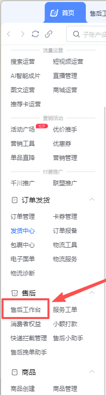
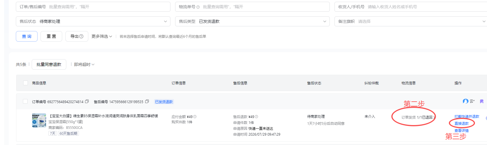
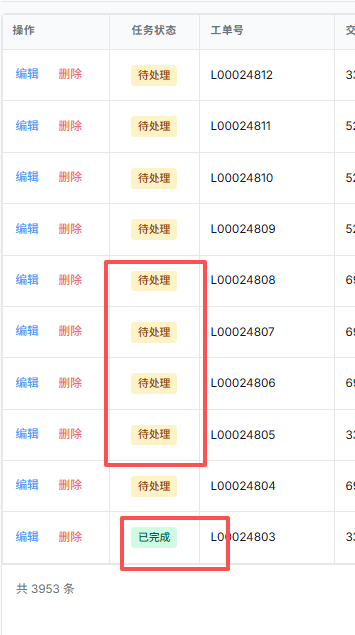
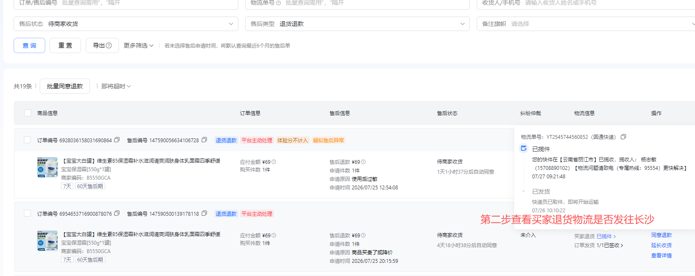
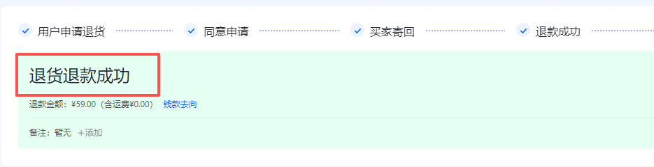
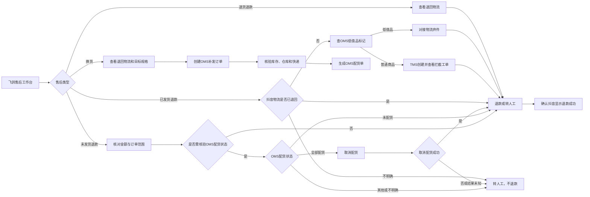
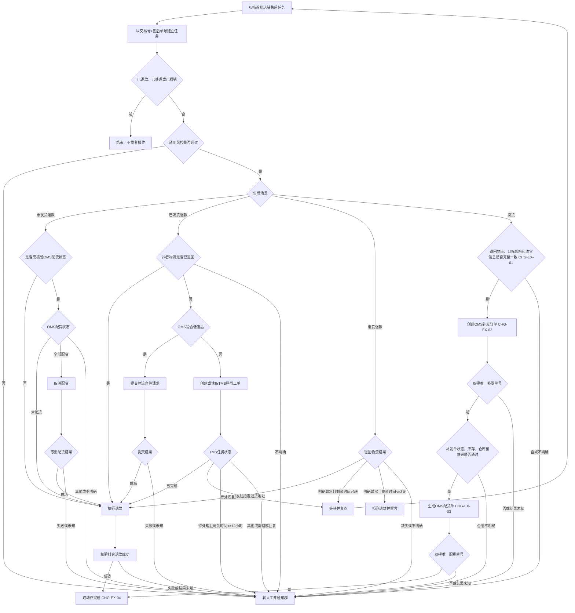
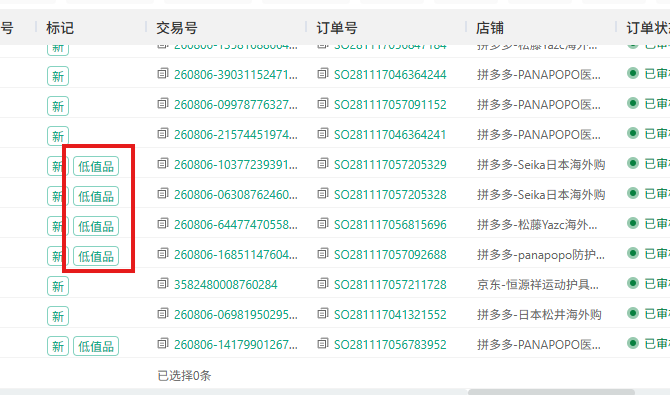
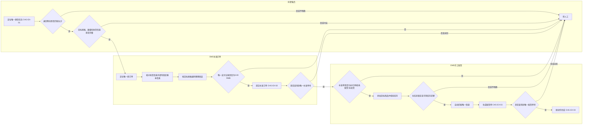
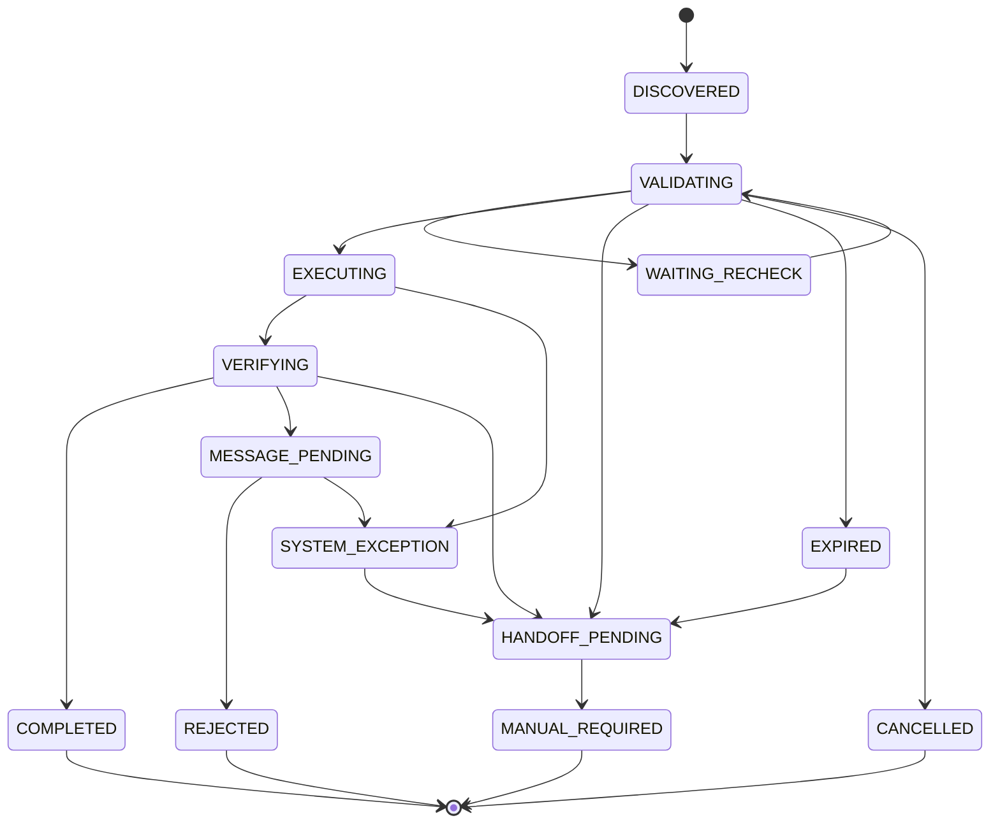

# 抖音退款 Agent 产品需求文档（PRD）V1.0

> 文档状态：待研发评审  
> 业务规则状态：已确认  
> 版本：V1.0  
> 编制日期：2026-08-14  
> 增量更新：2026-08-28（精确店名内部键、长沙城市匹配规则及换货双动作流程）  
> 适用平台：抖音  
> 金额边界：本次退款金额 `>=500元`，转管理人员处理  
> 首批试运行店铺：Panapopo护肤旗舰店、Panapopo官方旗舰店、Panapopo陆吾个人护理专卖店  
> 事实优先级：规则确认稿 > SOP > 截图证据  

## 0. 本期换货流程增量与 CHG 索引

### 0.1 版本记录

| 版本 | 日期 | 状态 | 变更摘要 |
|---|---|---|---|
| V1.0 | 2026-08-14 | 待研发评审 | 首版退款、退货退款与换货规则 |
| V1.0换货流程增量 | 2026-08-28 | 已融合PRD/待真实UAT | 根据11张内部流程截图补齐抖音换货入口、OMS补发订单、手工配货、双回执完成口径及失败关闭验收 |

### 0.2 本期需求与 AI 能力概览及 CHG 索引

| CHG编号 | 功能模块 | 本期功能点 | 变更类型 | AI能力变化 | 预期价值 |
|---|---|---|---|---|---|
| CHG-EX-01 | 换货任务识别 | 从抖音“换货待收货/发货”唯一任务读取退回物流、目标规格、数量和收货信息 | 优化 | 理解与识别、工作流自动化 | 减少错单、错规格和串店风险 |
| CHG-EX-02 | OMS补发订单 | 从唯一原订单创建补发草稿，核对收货信息，按目标规格替换商品并校验零元支付 | 优化 | Agent工具调用、工作流自动化 | 将人工补发步骤固化为可验证动作 |
| CHG-EX-03 | OMS手工配货 | 对唯一补发订单核验状态、库存、仓库和快递后生成配货单 | 调整 | Agent工具调用、工作流自动化 | 补齐仓库实际履约前的配货动作 |
| CHG-EX-04 | 双动作恢复与完成 | 补发订单和配货单分别落账、分别查询恢复，取得两个唯一单号后完成 | 调整 | AI治理与安全、人工接管 | 防止重复补发或重复生成配货单 |

## 1. 文档目的

本文档用于指导抖音退款 Agent V1.0 的研发、联调、测试和验收。Agent 在首批店铺内识别并处理未发货退款、已发货退款、退货退款和换货待收货/发货任务；当业务规则、系统信息或执行结果不明确时，不自行推断，统一转人工兜底。

本文档描述的是待开发能力，不代表功能已开发、已部署或已上线。

## 2. 事实来源与冲突处理

### 2.1 事实来源

| 优先级 | 来源 | 日期 | 用途 |
|---|---|---|---|
| 1 | 《抖音退款Agent_规则确认稿_V1.0.md》 | 2026-08-14 | 业务范围、判断规则、阈值、人工兜底、通知和完成口径 |
| 2 | 《抖音退款sop2.0_项目基线0806.xlsx》 | 2026-08-06 | 客服当前操作入口、跨系统操作路径、所需信息和原始话术 |
| 3 | 客服补充及OMS未发货配货状态截图 | 2026-08-10 | 未发货仅退款的配货状态判断、取消配货入口和动作顺序 |
| 4 | SOP内嵌截图、OMS低值品截图、TMS工单状态截图 | 2026-08-06至2026-08-07 | 页面入口、字段位置和系统状态证据 |
| 5 | 用户明确指令 | 2026-08-14 | 确认最终规则及人工兜底通知配置，并授权更新PRD |
| 6 | 原始SOP、授权测试单页面复验及用户确认 | 2026-08-26 | 已发货“已退回”优先直退、未知转人工和退款前复读 |
| 7 | 抖音换货流程截图11张及当前代码基线 | 2026-08-20至2026-08-28 | 换货入口、目标规格、OMS补发订单、零元支付、手工配货、库存/仓库/快递核验和双动作恢复边界 |

### 2.2 已处理的来源差异

| 事项 | SOP口径 | 本PRD采用口径 | 依据 |
|---|---|---|---|
| 首批店铺 | SOP列出7家店铺 | 仅首批3家店铺 | 规则确认稿优先 |
| 金额阈值 | 金额大于等于500元需管理操作 | 本次退款金额大于等于500元转管理人员 | 规则确认稿明确字段与边界 |
| 店铺身份 | SOP列出店铺名称 | 首批三家按精确店名识别，店名同时作为内部任务、台账、策略和地址规则键 | 2026-08-28业务确认，不依赖平台稳定店铺ID |
| 退货目的地 | SOP示例为具体城市 | V1只读取结构化目的地或签收地址，规范化后包含“长沙/长沙市”即匹配 | 2026-08-28业务再次确认“退回物流只要包含长沙” |
| 退货退款时点 | SOP含“运输中等待到货” | 物流显示发往指定退货地址即可退款，无需签收或入库 | 规则确认稿优先 |
| 换货补发时点 | SOP含“等待到货” | 物流显示发往指定退货地址即可创建OMS补发单 | 规则确认稿优先 |
| 聊天与协商记录 | SOP要求查看 | V1不识别；依赖聊天判断时转人工 | 规则确认稿优先 |
| TMS拦截结果 | SOP表述“拦截后退款” | 仅拦截工单任务状态为“已完成”时自动退款 | 规则确认稿优先 |
| 未发货配货状态 | 原PRD仅按未发货状态直接退款 | 需要核验OMS时：未配货直接退款；全部配货先取消，取消成功后退款 | 2026-08-10规则确认稿优先 |
| 低值品弃件退款 | 原PRD要求取得受理回执或工单号后退款 | 弃件工单提交成功并取得工单号后，每30分钟只复查该工单；状态明确完成后再续跑退款 | 2026-08-27业务最新确认，覆盖2026-08-10旧口径 |
| 人工兜底通知 | 原通知配置 | 以新群号为唯一投递标识；固定逐一@9位指定人员 | 2026-08-14业务最新确认 |
| 已发货且物流已退回 | SOP明确可直接退款，原PRD仍先查OMS/TMS | 抖音结构化状态明确“已退回”时跳过OMS/TMS直接退款；未知转人工，退款前复读 | 2026-08-26原始SOP与授权页面复验后确认 |
| 换货完成口径 | 原PRD仅写“生成补发单号后完成” | 必须先取得唯一补发单号，再完成手工配货并取得唯一配货单号；两个动作均成功后完成，不等待实际出库或签收 | 11张流程截图、现有双动作代码与2026-08-28用户更新指令 |
| 换货商品搜索 | 人工截图标注复制商品名称搜索 | Agent按抖音目标规格编码唯一匹配，不按商品名称、尺码文本或行位置模糊选择 | 防止同名商品或相似尺码错配；沿用现有失败关闭规则 |

## 3. 背景与问题

客服当前需要在抖音飞鸽售后工作台、OMS和TMS之间切换，人工读取订单、金额、发货状态、低值品标记、退回物流和工单状态，再执行退款、拒绝、补发或转人工。该流程存在以下问题：

- 重复查询和跨系统操作较多，处理周期受人工排队影响。
- 售后存在24小时、33小时、7天等平台时效，等待任务需要持续复查。
- 退款、拒绝和补发均包含不可逆或高风险动作，需要严格控制重复执行和误判。
- 快递回复、聊天协商和异常物流存在语义不确定性，V1不适合自动判断。

当前单量、人工耗时、超时率和误操作率尚未形成可核验基线。上线前由业务与研发补采基线，试运行后再确认量化改善目标。

## 4. 产品目标与非目标

### 4.1 产品目标

1. 自动处理规则明确且风险可控的退款与换货任务，减少客服重复查询和跨系统操作。
2. 对等待类任务按阈值持续复查，避免遗漏平台时效。
3. 对高金额、部分售后、规则不清、系统异常和执行结果未知的任务及时转人工。
4. 对每次判断、系统动作、复查和通知保留可审计记录。
5. 沉淀可复用的退款规则、任务状态机、异常原因码和验收用例。

### 4.2 非目标

- V1不识别或理解客服聊天、人工协商记录。
- V1不理解快递自由文本回复，不自动判断拒收、赔付、丢件责任等语义。
- V1不处理纠纷、平台介入、仲裁待协商、仲裁待举证、补寄和维修。
- V1不自动处理部分商品、部分数量或部分金额的退款/换货。
- V1不自动处理本次退款金额大于等于500元的任务。
- V1不新增独立客服工作台页面，操作结果通过现有系统和钉钉通知承载。
- V1不等待OMS补发单实际出库或签收；补发订单号与配货单号均唯一生成后完成Agent任务。

## 5. 适用范围

### 5.1 首批店铺

1. Panapopo护肤旗舰店
2. Panapopo官方旗舰店
3. Panapopo陆吾个人护理专卖店

其他SOP店铺不进入首批运行范围。店铺范围必须配置化，未经业务确认不得自行扩店。

### 5.2 售后场景

| 场景 | V1处理方式 |
|---|---|
| 未发货退款 | 自动退款或转管理人员 |
| 已发货退款 | 已退回直接退款；未退回时再进入低值品弃件或普通商品TMS拦截流程 |
| 退货退款 | 核验退回物流，自动退款、等待复查、拒绝退款或转人工 |
| 换货待收货/发货 | 核验退回物流，依次在OMS创建补发订单和配货单，或转人工 |

## 6. 用户与角色

| 角色 | 职责 |
|---|---|
| 客服 | 接收转人工任务，继续在抖音、OMS或TMS处理 |
| 管理人员 | 处理本次退款金额大于等于500元的高金额任务 |
| 退款 Agent | 扫描、判断、执行、复查、校验完成状态和发送异常通知 |
| 业务规则负责人 | 维护店铺范围、指定退货地址、规则版本和例外口径 |
| 研发/运维 | 维护账号、接口或RPA、任务调度、日志、告警和故障恢复 |

## 7. 客服当前操作流程

> 以下截图来自抖音退款SOP及业务补充截图，保留原始清晰度，未额外做遮罩处理，仅限公司内部需求评审和开发使用。截图用于说明当前操作路径，不作为字段坐标或页面选择器的长期技术契约。

### 7.1 进入抖音飞鸽售后工作台

客服进入“飞鸽工作台 → 售后 → 售后工作台”，查看待商家审核、待商家收货/发货等任务。



### 7.2 查看仅退款订单和发货详情

客服在“待商家审核”中选择未发货退款或已发货退款，进入售后详情并查看发货状态、物流信息及可执行操作。



### 7.3 未发货订单核验OMS配货状态【本次更新】

当抖音售后流程提示需要进入OMS核验订单配货状态时，客服按OMS结果处理：显示“未配货”可直接退款；显示“全部配货”需先取消配货，确认取消成功后再退款。取消失败、结果未知、其他配货状态或状态无法明确判断时转人工，不执行退款。


### 7.4 已发货订单创建TMS拦截工单

对于已发货、非低值品订单，客服进入“TMS → 物流快递工单 → 客服登记”，创建快递拦截工单。


客服持续查看TMS任务状态。拦截工单“已完成”表示快递已处理回复；“待处理”表示尚未完成。



### 7.5 退货退款或换货核验退回物流

客服在“待商家收货/发货”中进入订单详情，查看买家退回物流是否发往商家指定退货地址，再决定退款、补发、等待或异常处理。



### 7.6 确认退款完成

退款操作后，客服返回售后详情确认页面显示“退款成功”。仅点击退款按钮不视为完成。



### 7.7 换货完整操作流程【本次更新】

#### 7.7.1 换货任务入口与抖音信息核验

1. 在抖音飞鸽“售后工作台 → 待商家收/发货 → 换货待收货/发货”筛选唯一待处理任务。
2. 进入售后详情，复核订单号、售后号、当前换货状态、买家申请的目标商品规格、数量、收货信息和退货物流。
3. 只有结构化退回目的地或签收地址规范化后包含“长沙/长沙市”、目标规格和数量唯一、收货信息完整，且任务仍允许商家处理时，才进入OMS补发步骤。
4. 抖音截图中的订单号、联系人、物流单号和地址属于内部业务数据，PRD仅引用原图，不抄录字段原值，不得外传。


#### 7.7.2 OMS创建补发订单

1. 在OMS订单管理按原交易号精确查询唯一原订单，仅使用该订单行的“补发”入口，不使用批量补发入口。
2. 基本信息固定选择订单类型“补发订单”、业务类型“15 买家原因补发”，卖家备注填写“换货”；OMS自动带出的收货人、手机号、国家/地区、街道和详细地址必须与抖音当前换货申请逐项一致，Agent不得猜测或改写。
3. 在商品明细中对原规格执行“替换”，使用抖音读取的目标规格编码精确搜索并选择，数量与换货申请数量一致。人工截图中的商品名称搜索只说明人工现状，不是Agent选择契约。
4. 进入支付信息后，唯一支付记录必须为`0.00 RMB`；支付行缺失、重复、非零或币种不一致时停止提交。
5. 最终“确认”是第一个不可逆动作；动作前再次复读抖音任务和OMS草稿，提交后必须按原交易号查询唯一带“补”标记的补发订单并取得补发单号。


#### 7.7.3 OMS手工配货与生成配货单

1. 仅对第一步回执中的唯一补发单操作；该订单必须带“补”标记，且结构化状态同时为“已审核、未配货、未发货”。
2. 选择补发订单后进入“更多操作 → 手工配货”，复核目标规格编码和数量，再将全部目标商品加入配货明细。
3. 以OMS当前唯一发货仓库为准检查目标规格库存；可用库存必须覆盖换货数量且仓库不得锁定。仓库为空、重复、库存不足、库存结果冲突或只能凭经验选择时转人工。
4. OMS“自动匹配快递”必须得到唯一明确结果；快递为空、重复或匹配失败时不生成配货单。
5. “生成配货单”是第二个不可逆动作；提交后按补发单号查询唯一配货单号。补发单号和配货单号均取得后，Agent任务才进入完成，不等待仓库实际发货或买家签收。


### 7.8 当前人工流程摘要【本次更新】



## 8. Agent目标流程



## 9. 功能范围与优先级

```text
抖音退款 Agent V1.0
├── P0 任务发现与唯一标识
├── P0 通用风控与场景分流
├── P0 未发货OMS配货核验、取消配货与退款【本次更新】
├── P0 OMS低值品识别、弃件与退款
├── P0 TMS拦截工单创建、查询与复查
├── P0 退货物流判断、退款与异常拒绝
├── P0 换货OMS补发订单与配货单生成【本次更新】
├── P0 完成状态校验、幂等与并发控制
├── P0 转人工、钉钉通知与失败告警
├── P0 操作日志与审计
└── P1 运营指标与原因分布报表
```

V1不新增独立页面，因此不设计新页面线框图。研发需复用现有Agent任务框架、抖音飞鸽、OMS、TMS和钉钉群能力。

## 10. 通用判断规则

### 10.1 判断顺序

Agent必须按以下顺序判断，后续场景规则不得绕过前置风控：

1. 校验平台、店铺和售后类型是否在范围内。
2. 以“交易号 + 售后单号”查询是否已有任务及最终执行结果。
3. 重新读取售后状态；已退款成功、已处理完成或买家已撤销则结束。
4. 读取本次退款金额；大于等于500元转管理人员。
5. 判断是否为部分商品、部分数量或部分金额售后；是则转人工。
6. 判断是否需要聊天记录、协商记录或快递自由文本语义；是则转人工。
7. 进入未发货、已发货、退货退款或换货场景规则。
8. 任何字段缺失、冲突、系统状态未知或规则无法唯一匹配时转人工。

### 10.2 金额与部分售后

- 金额字段使用抖音当前售后单的“本次退款金额”，不是订单原价、商品标价或历史累计退款金额。
- 本次退款金额小于500元才可进入自动处理。
- 本次退款金额等于500元时转管理人员。
- V1只消费平台明确的“部分退款/部分售后”结构化标记，不根据优惠、历史退款、商品、数量或金额自行推算。
- 结构化标记缺失、字段映射未确认或结果冲突时转人工。

## 11. 场景详细规则

### 11.1 未发货退款

| 条件 | Agent动作 | 完成口径 |
|---|---|---|
| 全量售后、本次退款金额<500元、平台显示未发货，且无需进入OMS核验配货状态 | 直接同意退款 | 抖音页面显示退款成功 |
| 抖音售后流程提示需核验OMS，OMS显示“未配货” | 直接同意退款 | 抖音页面显示退款成功 |
| 抖音售后流程提示需核验OMS，OMS显示“全部配货” | 先取消配货；OMS明确显示取消成功后再同意退款 | 取消配货成功，且抖音页面显示退款成功 |
| 取消配货失败、结果未知、OMS显示其他配货状态或状态无法明确判断 | 转人工，不执行退款 | 通知发送成功，Agent停止处理 |
| 本次退款金额>=500元 | 转管理人员 | 通知发送成功，Agent停止处理 |
| 部分售后或字段不明确 | 转人工 | 通知发送成功，Agent停止处理 |

【本次更新】自动退款和取消配货前必须再次读取发货状态。若已变为已发货，则重新进入已发货退款分支，不得沿用旧判断。取消配货是退款前置动作，未取得明确成功结果时禁止继续退款。现状截图见第7.3节。

### 11.2 已发货退款：统一前置判断与低值品

所有已发货退款先读取抖音结构化物流状态，该判断优先于OMS低值品和TMS分支：

| 抖音物流状态 | Agent动作 | 约束 |
|---|---|---|
| 明确“已退回” | 跳过OMS和TMS，直接退款 | 最终退款前必须复读同一业务键仍为“已退回” |
| 明确未退回 | 继续下方低值品或普通商品拦截流程 | 不沿用历史快照 |
| 缺失、冲突或无法明确判断 | 转人工 | 不把未知状态推断为未退回 |

只有明确未退回时，才读取OMS低值品标记；OMS订单列表中的“低值品”标记是唯一低值品判断依据。



| 条件 | Agent动作 | 约束 |
|---|---|---|
| OMS低值品标记存在，金额<500元 | 提交物流弃件请求并保存工单号；每30分钟复查该工单，明确完成后续跑退款 | 待处理/处理中不重跑抖音、OMS或建单流程，不重复提交弃件 |
| 弃件提交超时或结果未知 | 先按任务业务键查询；仍无法确认提交成功则转人工，不继续退款 | 不直接重放弃件请求 |
| 弃件明确失败 | 转人工，不继续退款 | 避免物流动作未受理时误退款 |
| OMS无低值品标记 | 进入普通已发货拦截流程 | 不允许通过商品价格自行推断低值品 |
| OMS低值品字段缺失或读取失败 | 转人工 | 规则不明确兜底 |

### 11.3 已发货退款：普通商品拦截

1. 在TMS创建“快递拦截”类型客服登记工单；已存在同一交易号、售后单号的有效拦截工单时复用，不重复创建。
2. 仅当`work_order_type=快递拦截`时消费结构化任务状态“待处理/已完成”；需要理解快递回复内容时转人工。
3. 工单状态与动作如下：

| TMS状态 | 售后剩余时间 | Agent动作 |
|---|---:|---|
| 已完成 | 任意 | 返回抖音同意退款，并校验退款成功 |
| 待处理 | >12小时 | 进入等待复查，不退款 |
| 待处理 | <=12小时 | 转人工 |
| 结构化物流状态为拒收/已签收 | 任意 | 转人工 |
| 拒收/签收信息仅存在于自由文本回复 | 任意 | 转人工，原因码为`COURIER_REPLY_REQUIRED` |
| 状态缺失、冲突或结果未知 | 任意 | 转人工 |

“已完成”仅适用于已创建的快递拦截工单。工单类型不是快递拦截，或拒收类及其他物流问题即使存在快递回复，也不自动套用“已完成可退款”，统一转人工。

### 11.4 退货退款

| 退回物流结果 | 售后剩余时间 | Agent动作 |
|---|---:|---|
| 物流明确显示发往商家指定退货地址 | 任意 | 直接同意退款，无需等待签收或入库 |
| 未发往指定退货地址 | >3天 | 暂不处理，等待复查 |
| 未发往指定退货地址 | <=3天 | 拒绝退款并发送已确认留言 |
| 签收地址不是指定退货地址 | >3天 | 暂不处理，等待复查 |
| 签收地址不是指定退货地址 | <=3天 | 拒绝退款并发送已确认留言 |
| 物流明确标记长期未更新或停滞异常 | >3天 | 暂不处理，等待复查 |
| 物流明确标记长期未更新或停滞异常 | <=3天 | 拒绝退款并发送已确认留言 |
| 物流单号无法查询、信息缺失或结果不明确 | 任意 | 转人工 |

“长期未更新或停滞”仅在物流系统提供明确异常状态或已配置可核验状态码时自动使用。仅凭更新时间推测异常但没有已确认阈值时，转人工。

物流判断顺序如下：

1. 已产生签收地址时，先判断签收地址；签收地址不是指定退货地址时优先判为异常，即使此前运输方向曾匹配也不得自动退款。
2. 尚未产生签收地址时，运输目的地明确匹配指定退货地址才可判为发往指定地址。
3. 运输目的地与签收地址相互冲突、任一关键字段未知或存在多个匹配结果时，转人工。

V1退货目的地按精确店名配置并版本化，业务已确认匹配范围为`city=长沙`，不要求为了自动化虚构省、区、详细地址、联系人或手机号。首批三家店铺直接按精确名称识别，店名同时作为内部任务、台账、策略和地址规则键，不依赖平台稳定店铺ID，也不做别名、大小写或包含匹配。退回物流的结构化目的地或签收地址规范化后只要包含“长沙/长沙市”即得到`MATCH`；多规则、多版本、重复命中、配置缺失、结构化字段缺失，或只能根据物流轨迹、聊天、备注等自由文本猜测时返回`UNKNOWN`并转人工。目标环境完成配置发布和真实UAT前，退货退款及换货自动动作保持关闭。

### 11.5 换货待收货/发货

#### 11.5.1 跨系统主流程



#### 11.5.2 规则与完成口径

| 条件 | Agent动作 | 完成口径 |
|---|---|---|
| 物流明确发往指定退货地址，目标规格、数量和收货信息完整一致 | 在OMS依次创建补发订单、生成配货单 | 唯一补发单号和唯一配货单号均已取得 |
| 补发订单已创建并取得单号，配货尚未完成 | 只从该补发单继续手工配货 | 不重新创建补发订单 |
| 补发订单提交后未取得唯一单号 | 只按原交易号查询原动作结果；仍未知则转人工 | 不重复提交补发订单 |
| 配货单提交后未取得唯一单号 | 只按补发单号查询原动作结果；仍未知则转人工 | 不重复点击“生成配货单” |
| 商品、数量或收货信息缺失/不一致 | 转人工 | 不创建补发订单 |
| 补发单状态、库存、仓库或快递不满足唯一明确条件 | 转人工 | 保留已成功补发订单，不生成配货单，不自动删除或撤销外部订单 |
| 退回物流异常、缺失或结果不明确 | 转人工 | 不自动拒绝换货 |

#### 11.5.3 固定字段与校验

- 关联变更：`CHG-EX-01`至`CHG-EX-04`。
- 补发商品、目标规格、数量和收货信息只从抖音当前换货申请的结构化字段读取；每个不可逆动作前重新复读同一交易号和售后号。
- OMS补发订单固定为：订单类型“补发订单”、业务类型“15 买家原因补发”、卖家备注“换货”、唯一支付记录`0.00 RMB`。
- OMS自动带出的收货信息必须与抖音当前换货申请逐项一致；Agent不得自行填写、补齐或修改。敏感收货字段只允许在单次页面操作内存中流转，不写入任务、日志、审计、截图或动作证据。
- 商品替换以目标规格编码为唯一选择依据，数量必须与换货申请一致；商品名称和尺码文本仅用于人工阅读，不作为自动选择依据。
- 手工配货只接受唯一带“补”标记且处于“已审核、未配货、未发货”的补发订单。OMS当前发货仓库必须唯一，可用库存必须大于等于换货数量且仓库未锁定，快递必须自动匹配为唯一明确结果。
- 补发订单和配货单分别建立动作台账并保存各自外部单号。只有两个动作均为明确成功且单号可查询时任务完成；不等待仓库实际发货或买家签收。

## 12. 时效与复查规则

### 12.1 时效口径

所有时效从买家发起本次售后申请的时间开始计算。

| 场景 | 处理时效 | 关键阈值 |
|---|---:|---|
| 未发货退款 | 24小时 | 按通用风控后处理 |
| 已发货退款 | 33小时 | TMS待处理且剩余时间<=12小时转人工 |
| 退货退款 | 7天 | 物流异常且剩余时间<=3天拒绝退款 |
| 换货 | 7天 | 规则不清或执行失败转人工 |

以买家发起本次售后的申请时间计算内部SLA；页面唯一“请在...内处理”商家倒计时作为平台硬截止。33小时是已发货退款的内部SLA，不是平台倒计时的固定校验值；平台硬截止也不得统一写死为36小时。Agent基于同一采集时刻使用两者较早值，并将剩余时间和实际生效截止时间保持一致。页面倒计时缺失、重复、格式异常或数值越界时转人工，不允许只使用内部SLA继续自动动作。旧5分钟差值容差和跨业务区间冲突规则不再适用。

### 12.2 任务扫描与复查

- 首次扫描和增量扫描间隔需配置化，研发评审建议默认5分钟。
- 等待任务必须记录`next_check_at`。计算口径为“常规复查间隔”和“阈值时间减安全缓冲”中的较早时间，默认常规复查间隔建议30分钟。
- 12小时和3天阈值前必须预留可配置安全缓冲；调度延迟或服务恢复后立即重新计算剩余时间。
- 进入阈值后必须执行对应动作，不得继续沿用旧的等待状态。
- 售后剩余时间小于等于0时标记`EXPIRED`并告警转人工，不再自动退款、拒绝或补发。
- 买家撤销售后、人工已处理或任务已终态时，停止后续复查。
- 调度参数属于研发联调项，不改变业务阈值。

## 13. 客户留言与内部通知

### 13.1 退货物流异常留言

仅在退货退款物流明确异常且售后剩余时间小于等于3天时使用：

> 亲，我这边查到您填写的退货物流未发往或未签收至商家指定退货地址，因此本次退款申请暂时无法通过。辛苦您核实退货地址及物流信息，如有异常请联系发件快递确认哦～

V1只使用这一条已确认模板，不基于聊天上下文自行改写。

### 13.2 钉钉通知范围

- 通知群：以群号为唯一投递标识，群名称以钉钉实际显示为准。
- 钉钉群号：`193120000457`。
- 所有转人工、转管理人员和系统异常均通知。
- 自动处理成功不通知。
- 每次通知固定逐一 @9 位指定人员，不使用“@所有人”：狄云、青顾、行云、今夏、婉安、子宁、霜寒、听竹、梨花。
- 成员手机号映射按业务 2026-08-14 提供的受控配置维护，不在 PRD、HTML、普通配置或日志中明文展示。

### 13.3 通知模板

```text
【抖音退款Agent转人工】
店铺：{store_name}
售后场景：{after_sale_type}
交易号：{trade_no}
售后单号：{after_sale_no}
本次退款金额：{refund_amount}
售后剩余时间：{remaining_time}
转人工原因：{handoff_reason}
当前任务状态：{task_status}
处理入口：{task_link_or_system_path}
@固定9位人员
```

系统异常使用标题“【抖音退款Agent系统异常】”，并增加异常阶段、错误码和最后一次成功动作。通知中不得包含买家姓名、手机号、详细地址、聊天内容或支付信息。

### 13.4 通知去重

- 同一任务、同一原因码只发送一次通知。
- 原因码变化或任务从等待状态进入人工接管状态时可再次通知。
- 每次通知记录`delivery_id`、群消息投递结果和9位人员映射完整性。仅当群消息投递成功且9位人员均可@时，任务进入`MANUAL_REQUIRED`终态。
- 通知发送失败需按同一`delivery_id`幂等重试；多次失败后进入系统告警，但不得因此重复执行退款、拒绝或补发。
- 若钉钉接口不支持客户端幂等键或消息查询，采用本地outbox至少一次投递：优先保证不漏报，极端超时未知场景允许出现带同一`delivery_id`的重复通知，客服可据此去重。
- 通知中的处理链接必须为需要登录鉴权的内部地址，不得携带明文token。
- V1不要求人工认领回执；是否增加客服ACK由业务在试运行后评估。

## 14. 任务状态机



| 状态 | 含义 | 是否允许Agent再次执行不可逆动作 |
|---|---|---|
| DISCOVERED | 已发现新售后任务 | 否 |
| VALIDATING | 正在读取并校验规则字段 | 否 |
| WAITING_RECHECK | 等待TMS或物流状态更新 | 否 |
| EXECUTING | 正在提交取消配货、退款、拒绝、弃件、补发订单或配货单 | 仅持有有效租约和fencing token的任务允许 |
| VERIFYING | 已提交动作，正在读取并验证最终结果 | 否 |
| MESSAGE_PENDING | 拒绝已确认，固定买家留言待发送或待确认 | 只允许幂等重试留言，不允许重复拒绝 |
| COMPLETED | 退款成功，或换货补发单号与配货单号均已生成并可查询 | 否 |
| REJECTED | 已确认拒绝成功且固定留言发送成功 | 否 |
| CANCELLED | 买家撤销或任务已失效 | 否 |
| EXPIRED | 售后剩余时间<=0，停止自动动作并准备告警转人工 | 否 |
| HANDOFF_PENDING | 转人工通知待投递或待补齐@人员映射 | 否 |
| MANUAL_REQUIRED | 转人工或管理人员通知已成功投递 | 否 |
| SYSTEM_EXCEPTION | 系统或页面异常，执行结果未知 | 否，进入通知流程 |

## 15. 幂等、并发与异常恢复

### 15.1 唯一标识与幂等

- 唯一任务键：`platform + store_id + trade_no + after_sale_no`。
- 同一任务只允许存在一个进行中的Agent实例。
- 每类外部动作使用数据库唯一约束`task_key + action_type`，动作台账状态为`PENDING/SUCCEEDED/UNKNOWN/FAILED`，并记录`operation_id`、外部`request_id`、尝试次数和结果证据。
- 任务状态更新使用版本号或CAS原子更新，不能依赖先查后写。
- 执行锁采用带TTL的租约并支持续租；外部动作提交前校验fencing token，避免旧Worker在锁过期后继续执行。
- 取消配货、创建TMS工单、物流弃件、同意退款、拒绝退款、发送买家留言、创建OMS补发订单、生成OMS配货单前均需分别创建或读取动作台账。
- 每次不可逆动作前重新读取平台状态和人工处理标记。
- 已退款成功、已拒绝、换货双动作均完成、已撤销或已转人工的任务不得再次执行；只有补发订单完成时，只允许继续或恢复配货动作。

### 15.2 并发控制

- Agent执行前获取任务租约；租约失效、进程崩溃或超时恢复后，必须先查询动作台账和各系统最终状态，禁止直接重放动作。
- 发现平台结构化人工处理标记、售后状态版本变化或外部动作已由人工完成时，Agent停止自动操作并记录`MANUAL_TAKEOVER`；无法可靠读取人工接管证据时转人工。
- 多店铺任务不得共用错误的店铺会话、指定退货地址或OMS配置。

### 15.3 结果未知

- 已点击退款但抖音未显示成功：不重复点击，转人工。
- OMS补发订单提交后未返回单号：按原交易号查询唯一补发订单；仍无法唯一确认则不重复创建并转人工。
- OMS配货单提交后未返回单号：按补发单号查询唯一配货单；仍无法唯一确认则不重复生成并转人工。
- TMS工单提交后未返回工单号：先按交易号和售后单号查询；仍无法唯一确认则转人工。
- OMS取消配货提交后结果未知：按交易号查询最新配货状态和取消动作结果；仍无法确认取消成功时转人工，不执行退款。
- 拒绝退款已确认但留言失败：只重试同一留言动作，不重复拒绝；留言最终失败时告警并转人工。
- 拒绝退款请求超时或结果未知：先按售后单号查询抖音最终状态；仍未知时不重复拒绝、不发送买家留言，转人工。
- 低值品弃件提交超时：按业务键查询是否已受理；仍未知则不退款并转人工。
- 页面超时、登录失效、验证码、字段无法读取或接口返回未知：停止当前动作并转人工。

## 16. 数据字段与系统映射

### 16.1 必需字段

| 字段 | 来源 | 类型/示例 | 必填 | 用途 | 缺失处理 |
|---|---|---|---|---|---|
| platform | 配置 | `douyin` | 是 | 平台隔离 | 系统异常 |
| store_id/store_name | 抖音/配置 | 字符串 | 是 | 店铺范围与账号路由 | 转人工 |
| trade_no | 抖音 | 字符串 | 是 | 任务唯一标识 | 转人工 |
| after_sale_no | 抖音 | 字符串 | 是 | 任务唯一标识 | 转人工 |
| after_sale_type | 抖音 | 枚举 | 是 | 场景分流 | 转人工 |
| after_sale_status | 抖音 | 枚举 | 是 | 判断是否可处理 | 转人工 |
| shipment_status | 抖音 | 枚举 | 是 | 未发货/已发货分流 | 转人工 |
| allocation_check_required | 抖音售后流程/Agent | 布尔 | 未发货必需 | 判断是否需进入OMS核验配货状态 | 缺失、冲突或无法读取则转人工 |
| oms_allocation_status | OMS | 未配货/全部配货/其他/未知 | 需核验OMS时必需 | 决定直接退款、取消配货或转人工 | 其他或未知转人工 |
| oms_cancel_allocation_result | OMS | 成功/失败/未知 | 全部配货时必需 | 作为退款前置条件 | 失败或未知转人工，不退款 |
| refund_amount_fen | 抖音/转换 | 整数分 | 是 | 与50000分比较金额阈值 | 转人工 |
| partial_after_sale_flag | 抖音 | 布尔/枚举，结构化字段 | 是 | 部分售后风控 | 缺失、未映射或冲突则转人工 |
| applied_at | 抖音 | 带时区时间戳，统一Asia/Shanghai | 是 | 时效起点 | 转人工 |
| deadline_at/remaining_seconds | 抖音/计算 | 带时区时间戳/整数秒 | 是 | 12小时、3天阈值 | 转人工 |
| shipment_returned | 抖音列表物流信息 | 布尔/未知 | 已发货必需 | 决定直接退款或继续OMS/TMS | 缺失、冲突或未知转人工 |
| low_value_flag | OMS | 布尔/标记 | 已发货且明确未退回时必需 | 低值品分流 | 转人工 |
| buyer_return_tracking_no | 抖音 | 字符串 | 退货/换货必需 | 查询退回物流 | 转人工 |
| return_route_destination_result | 物流系统 | MATCH/MISMATCH/UNKNOWN | 退货/换货必需 | 运输目的地判断 | UNKNOWN转人工 |
| return_signed_address_result | 物流系统 | MATCH/MISMATCH/NOT_AVAILABLE/UNKNOWN | 退货/换货必需 | 签收地址优先判断 | MISMATCH判异常，UNKNOWN转人工 |
| logistics_exception_status | 物流系统 | 正常/明确异常/未知 | 退货必需 | 等待或拒绝 | 未知转人工 |
| tms_work_order_no | TMS | 字符串 | 普通已发货必需 | 查询拦截任务 | 未知转人工 |
| tms_work_order_type | TMS | 快递拦截/其他 | 普通已发货必需 | 限定可自动退款的工单类型 | 缺失或其他类型转人工 |
| tms_task_status | TMS | 待处理/已完成/其他 | 普通已发货必需 | 退款或等待 | 其他转人工 |
| replacement_items | 抖音 | 原规格编码、目标规格编码、数量 | 换货必需 | 按目标规格编码唯一替换OMS补发商品 | 缺失、不一致或无法唯一匹配转人工 |
| replacement_address | 抖音/OMS | 结构化收货信息 | 换货必需 | OMS自动带出后与抖音逐项核对；仅在单次页面操作内存中流转 | 缺失、不一致或需人工改写转人工 |
| oms_replacement_order_type | OMS固定值 | `补发订单` | 创建补发订单必需 | 校验订单类型 | 不一致转人工 |
| oms_replacement_business_type | OMS固定值 | `15 买家原因补发` | 创建补发订单必需 | 校验业务类型 | 不一致转人工 |
| oms_replacement_seller_note | OMS固定值 | `换货` | 创建补发订单必需 | 校验卖家备注 | 不一致转人工 |
| oms_replacement_payment | OMS | `0.00 RMB`且唯一支付记录 | 创建补发订单必需 | 防止换货补发产生应收金额 | 非零、缺失或多条支付记录转人工 |
| oms_replacement_no | OMS | 字符串 | 换货配货必需 | 唯一定位补发订单并恢复后续动作 | 未生成或无法唯一查询时转人工 |
| oms_replacement_status | OMS | 补/已审核/未配货/未发货 | 生成配货单必需 | 校验补发订单可进入手工配货 | 任一状态不一致转人工 |
| oms_dispatch_warehouse | OMS | 发货仓库 | 生成配货单必需 | 校验目标规格的履约仓库 | 缺失或不唯一转人工 |
| oms_dispatch_inventory | OMS | 库存数、可用数、锁定状态 | 生成配货单必需 | 校验目标规格可配货 | 库存不足、不可用、已锁定或未知转人工 |
| oms_dispatch_carrier | OMS | 自动匹配快递结果 | 生成配货单必需 | 校验可生成配货单 | 缺失、冲突或需人工猜测转人工 |
| oms_dispatch_no | OMS | 字符串 | 换货完成必需 | 换货任务完成判断及配货动作恢复 | 未生成或无法唯一查询时转人工 |
| rule_version | 规则配置 | 字符串 | 是 | 审计本次判断口径 | 系统异常 |
| source_snapshot_hash | Agent | 字符串 | 是 | 证明判断输入版本 | 系统异常 |
| task_version | Agent | 整数 | 是 | CAS并发控制 | 系统异常 |
| operation_id/request_id | Agent/外部系统 | 字符串 | 执行动作必需 | 外部动作幂等与查询 | 结果未知则转人工 |
| operation_status | Agent | 枚举 | 执行动作必需 | PENDING/SUCCEEDED/UNKNOWN/FAILED | 系统异常 |
| destination_evidence | 物流/配置 | 发往/签收地址ID、仓库码、规范化字段摘要 | 退货/换货必需 | 分别证明MATCH/MISMATCH/UNKNOWN | UNKNOWN转人工 |

### 16.2 配置数据

| 配置 | 要求 |
|---|---|
| 首批店铺白名单 | 仅3家，支持配置化增减并记录变更人和版本 |
| 商家指定退货目的地 | 按店铺版本化维护`city=长沙`；结构化城市唯一匹配才放行，配置缺失或冲突时转人工 |
| 金额阈值 | 默认500元，规则为`>=500`转管理人员 |
| 即将超时阈值 | 12小时，包含等于12小时 |
| 退货异常拒绝阈值 | 3天，包含等于3天 |
| 钉钉群与@人员 | 群号固定；展示名需映射为钉钉userId或手机号 |
| 扫描与复查间隔 | 配置化，不得改变业务时效阈值 |

## 17. 权限、安全与审计

- 抖音、OMS、TMS和钉钉账号使用最小权限，凭证不得明文写入代码、日志或PRD。
- 运行账号只能读取已发布规则，不得修改店铺白名单、地址、阈值或通知人员。
- 规则、店铺、地址、阈值和钉钉人员配置实行查看、编辑、审批发布、回滚分权；修改必须版本化并记录审批人与生效时间。
- 多店铺账号和会话必须隔离，操作前校验当前店铺。
- 日志不记录买家姓名、完整手机号、详细地址、聊天内容和支付账号；必要订单标识按内部权限展示。
- 每个任务记录规则版本、输入快照摘要、判断分支、动作、结果、操作者、时间和异常原因码。
- 不可逆动作需保留请求ID或页面操作证据，便于追溯但不得保存未脱敏截图到公开位置。
- 日志保留时长、访问角色和导出权限由公司数据治理与研发评审确认。

## 18. 埋点与运营指标

| 指标 | 定义 | 目的 |
|---|---|---|
| 发现任务数 | 首批店铺扫描到的唯一售后任务数 | 统计任务规模 |
| 自动可处理率 | 通过通用风控并命中自动规则的任务数/发现任务数 | 评估规则覆盖 |
| 自动处理成功率 | 完成退款，或换货补发单号与配货单号均生成并可查询的任务数/自动执行任务数 | 评估稳定性 |
| 转人工率 | MANUAL_REQUIRED任务数/发现任务数 | 识别自动化缺口 |
| 转人工原因分布 | 按原因码统计 | 后续规则优化 |
| 平均处理时长 | 申请时间至Agent终态时间 | 评估周期改善 |
| 时效内完成率 | 平台截止时间前进入终态的任务数/应处理任务数 | 评估超时风险 |
| 重复动作拦截数 | 被幂等或并发锁阻止的重复动作次数 | 评估安全性 |
| 系统异常率 | SYSTEM_EXCEPTION任务数/发现任务数 | 评估系统可靠性 |
| 通知成功率 | 成功发送的转人工/异常通知数/应发送数 | 评估人工接管链路 |
| 取消配货成功率 | OMS取消配货成功任务数/取消配货执行任务数 | 评估未发货退款链路稳定性 |

业务上线前补采至少一周人工基线；试运行目标值在基线形成后确认。安全底线为：高金额和部分售后自动处理数为0，重复退款、重复OMS补发订单和重复OMS配货单均为0。

## 19. 验收标准

### 19.1 核心验收场景

| 编号 | 前置条件 | 预期结果 |
|---|---|---|
| AC-01 | 未发货、全量、本次退款金额499.99元，且无需核验OMS配货状态 | 自动退款并确认抖音显示退款成功 |
| AC-02 | 未发货、本次退款金额500元 | 不退款，转管理人员并通知 |
| AC-03 | 任意场景、本次退款金额大于500元 | 不执行自动动作，转管理人员 |
| AC-04 | 部分商品、部分数量或部分金额售后 | 转人工，不执行退款/拒绝/补发 |
| AC-05 | 已发货、OMS低值品、金额<500元 | 只创建或复用一张弃件工单；保存工单号后每30分钟复查，明确完成后续跑退款 |
| AC-06 | 已发货、OMS低值品字段缺失 | 转人工，不推断低值品 |
| AC-07 | 已发货、非低值品、无既有拦截工单 | 创建一个TMS拦截工单，不重复创建 |
| AC-08 | TMS待处理、剩余时间>12小时 | 进入等待复查，不退款、不通知成功 |
| AC-09 | TMS待处理、剩余时间=12小时 | 转人工并通知 |
| AC-10 | TMS拦截工单已完成 | 自动退款并确认退款成功 |
| AC-11 | 需要理解快递回复、拒收或已签收 | 转人工 |
| AC-12 | 退货物流发往指定退货地址且仍在运输 | 直接退款，无需等待签收或入库 |
| AC-13 | 退货物流明确异常、剩余时间>3天 | 等待复查，不拒绝、不退款 |
| AC-14 | 退货物流明确异常、剩余时间=3天 | 拒绝退款并发送固定留言 |
| AC-15 | 退货物流单号无法查询或结果未知 | 转人工，不自动拒绝 |
| AC-16 | 换货物流发往指定地址，目标规格、数量和收货信息完整，且OMS状态、库存、仓库、快递均通过门禁 | 先创建唯一OMS补发订单并取得补发单号，再生成唯一OMS配货单并取得配货单号；两个单号均可查询后完成 |
| AC-17 | 换货补发订单或配货单提交后结果未知 | 仅按原交易号查询补发订单，或按补发单号查询配货单；不重复创建对应动作，仍无法唯一确认则转人工 |
| AC-18 | 换货物流异常 | 转人工，不自动拒绝换货 |
| AC-19 | 售后已退款成功或买家已撤销 | 结束任务，不重复操作 |
| AC-20 | 点击退款后结果未知 | 不重复点击，转人工 |
| AC-21 | 人工与Agent同时处理 | Agent重新校验后停止，记录人工接管 |
| AC-22 | 转人工或系统异常 | 群号`193120000457`对应群收到通知，并固定逐一@9人 |
| AC-23 | 自动处理成功 | 不发送钉钉通知 |
| AC-24 | 同一任务被重复扫描 | 仅存在一条任务，不重复取消配货、弃件、退款、拒绝、建工单、创建补发订单或生成配货单 |
| AC-25 | 低值品弃件提交失败或查询后仍未知 | 不退款，转人工；不重复提交弃件 |
| AC-26 | 退货拒绝成功但买家留言失败 | 不重复拒绝；仅幂等重试留言并告警 |
| AC-27 | 转人工通知首次失败或结果未知 | 支持幂等/查询时只产生一条有效消息；不支持时outbox至少一次投递，不漏报且重复消息使用同一delivery_id |
| AC-28 | Worker锁过期或执行中崩溃 | 新Worker先查动作台账和外部结果，旧Worker不能继续提交动作 |
| AC-29 | TMS工单已完成但类型不是快递拦截 | 转人工，不自动退款 |
| AC-30 | 指定退货地址发生版本变更或匹配多条地址 | 返回UNKNOWN并转人工，不自动退款、不创建补发订单或配货单 |
| AC-31 | 剩余时间<=0或服务停机后恢复 | 标记EXPIRED并告警转人工，不执行过期自动动作 |
| AC-32 | 店铺会话与任务店铺不一致 | 阻止外部动作并告警，不得串店操作 |
| AC-33 | 运行账号尝试修改规则配置 | 权限拒绝并记录审计日志 |
| AC-34 | 运输方向曾匹配，但签收地址不是指定退货地址 | 按物流异常处理，不自动退款、不创建补发订单或配货单 |
| AC-35 | 内部SLA与页面平台硬截止不同 | 使用两者较早值，并让剩余时间与生效截止时间保持一致 |
| AC-36 | 平台未提供明确部分售后结构化标记 | 转人工，不自行推算是否为部分售后 |
| AC-37 | 拒绝退款请求超时或结果未知 | 查询平台最终状态；仍未知则不重复拒绝、不发送留言并转人工 |
| AC-38 | 页面商家倒计时缺失、重复、格式异常或数值越界 | 转人工，不只依赖内部SLA继续自动动作 |
| AC-39 | 未发货、金额<500元、需核验OMS且显示“未配货” | 直接退款并确认抖音显示退款成功 |
| AC-40 | 未发货、金额<500元、需核验OMS且显示“全部配货” | 仅取消配货成功后退款，并分别记录两个动作结果 |
| AC-41 | OMS取消配货失败或结果未知 | 转人工并通知，不执行退款，不重复取消配货 |
| AC-42 | OMS显示其他配货状态或状态无法明确判断 | 转人工并通知，不执行退款 |
| AC-43 | 已发货、结构化物流明确“已退回”、其他通用门禁通过 | 不读取OMS、不查询或创建TMS工单，直接进入退款并确认成功 |
| AC-44 | 已退回直退任务在最终退款前复读为未退回、缺失或冲突 | 不点击退款，转人工；不沿用首次扫描快照 |

### 19.2 发布门槛

- P0验收用例通过率100%。
- 每个P0功能至少覆盖正常、边界、失败、超时、重试、并发、恢复和权限场景。
- 高金额、部分售后、规则不清和结果未知场景无自动执行。
- 重复取消配货、重复弃件、重复退款、重复拒绝、重复TMS工单、重复OMS补发订单和重复OMS配货单均为0。
- 所有转人工与系统异常通知可达群号`193120000457`对应群，并正确@固定9人。
- 日志可追溯到规则版本、判断分支、动作和最终结果。
- 首批只允许3家店铺，其他店铺任务不进入自动处理。
- 业务完成UAT并书面确认后，才能进入试运行；试运行不等于正式上线。

## 20. 转人工原因码

| 原因码 | 含义 |
|---|---|
| MANAGER_REVIEW_AMOUNT | 本次退款金额>=500元 |
| PARTIAL_AFTER_SALE | 部分商品/数量/金额售后 |
| UNSUPPORTED_SCENARIO | 纠纷、平台介入、仲裁、补寄、维修等非V1场景 |
| CHAT_CONTEXT_REQUIRED | 需要聊天或协商记录判断 |
| COURIER_REPLY_REQUIRED | 需要理解快递回复或拒收语义 |
| FIELD_MISSING_OR_CONFLICT | 必需字段缺失或冲突 |
| LOW_VALUE_UNKNOWN | OMS低值品标记无法读取 |
| OMS_ALLOCATION_STATUS_UNKNOWN | OMS配货状态为其他、未知、缺失或冲突 |
| OMS_CANCEL_ALLOCATION_FAILED_OR_UNKNOWN | 取消配货失败或无法确认成功 |
| TMS_PENDING_NEAR_DEADLINE | TMS待处理且剩余时间<=12小时 |
| RETURN_LOGISTICS_UNKNOWN | 退回物流无法查询或结果不明确 |
| EXCHANGE_INFO_INVALID | 换货原规格、目标规格、数量、收货信息或零元支付记录缺失/不一致 |
| OMS_REPLACEMENT_DISPATCH_NOT_READY | 补发订单状态、目标规格库存、发货仓库或自动匹配快递不满足生成配货单条件 |
| ACTION_RESULT_UNKNOWN | 取消配货、退款、拒绝、买家留言、弃件、建工单、OMS补发订单或OMS配货单结果未知 |
| MANUAL_TAKEOVER | 检测到人工已进入或已处理 |
| LOGIN_OR_PAGE_ERROR | 登录失效、验证码、页面或接口异常 |
| AFTER_SALE_EXPIRED | 售后剩余时间<=0，停止自动动作并告警转人工 |
| RULE_NOT_MATCHED | 规则无法唯一匹配 |

自动处理审计原因码（非转人工）：`ELIGIBLE_SHIPPED_RETURNED`表示已发货且抖音结构化物流状态明确已退回，可进入直接退款门禁。

## 21. 研发联调确认项

以下为技术与系统映射项，不改变已确认业务规则：

- [ ] 抖音任务获取方式、店铺切换方式及各字段稳定标识。
- [ ] 抖音“本次退款金额”、部分售后标记、售后截止时间和完成状态的字段映射。
- [x] 抖音已发货列表“已退回”结构化状态及退款前复读契约；其他新状态仍需逐项UAT后才能加入映射。
- [ ] 抖音售后流程中“需进入OMS核验配货状态”的稳定触发字段或页面信号。
- [ ] OMS“未配货/全部配货/其他”状态映射、取消配货入口、取消原因、成功结果证据及幂等查询方式。
- [ ] OMS“低值品”字段的接口或页面标识，以及物流“弃件”动作的提交成功口径；不得等待快递确认后才退款。
- [ ] TMS创建拦截工单所需字段、工单去重查询和“待处理/已完成”状态码映射。
- [x] V1退货目的地业务口径确认为“发往长沙即可”，实现按店铺、版本和有效期维护的城市级`city=长沙`匹配；未发布真实店铺配置。
- [ ] 由配置维护责任人在目标环境为各专用profile写入唯一精确店名白名单，并发布同版本城市级规则；配置缺失、重复、别名、模糊、多规则或多版本冲突时保持UNKNOWN。
- [ ] 物流系统明确异常/停滞状态码；没有明确状态码时保持转人工。
- [ ] OMS创建补发订单契约：原交易号唯一定位、目标规格编码/数量替换、OMS自动带出收货信息逐项核对、固定订单类型/业务类型/卖家备注、唯一`0.00 RMB`支付记录、提交结果查询和补发单号回执字段。
- [ ] OMS生成配货单契约：按补发单号唯一定位，核验“补/已审核/未配货/未发货”、目标规格库存、发货仓库和自动匹配快递，提交结果查询和配货单号回执字段。
- [ ] 钉钉机器人接入方式，以及9位指定人员的受控手机号/userId映射；映射不得写入业务代码、普通配置或日志。
- [ ] 钉钉接口是否支持客户端幂等键或消息查询；不支持时按outbox至少一次投递口径验收。
- [ ] 任务扫描间隔、复查间隔、锁超时和重试参数。
- [ ] 账号权限、凭证托管、日志保留时长和审计访问权限。
- [x] 已补充并核验11张换货流程截图，覆盖抖音换货详情、OMS创建补发单、手工配货和生成配货单；截图仅限公司内部使用。该项完成不代表动态页面字段或真实动作UAT通过。
- [ ] 使用可操作的实时整单换货测试单，分别验证创建补发订单、生成配货单两次最终提交，以及两个动作各自的UNKNOWN只查询恢复；截图核验不替代真实UAT。
- 本轮由用户直接要求增量更新既有PRD，默认不进入公司需求池，不补建REQ。

## 22. 上线与回滚

1. 先在测试账号或影子模式运行，只做判断和记录，不执行不可逆动作。
2. 使用本PRD验收场景完成测试和业务UAT。
3. 首批仅开启3家店铺，可按店铺独立开关。
4. 试运行期间重点监控转人工原因、系统异常、时效和幂等拦截。
5. 出现重复动作、高风险误处理、账号串店、完成状态无法确认或通知链路失效时，立即关闭对应店铺自动执行，保留只读扫描或全量转人工。
6. 回滚只停止后续Agent动作，不撤销已完成的退款、拒绝、OMS补发订单或OMS配货单；已执行任务交由人工核查。
7. 若OMS补发订单已成功但配货单未成功，保留补发单号与动作台账，转人工核查或仅恢复配货动作，禁止重建补发订单。

## 23. 可追溯产物

| 产物 | 状态 | 用途 |
|---|---|---|
| 抖音退款SOP 2.0项目基线 | 已提供 | 客服现状与原始业务输入 |
| 抖音退款Agent规则确认稿V1.0 | 已业务确认 | 业务规则事实源 |
| 抖音退款Agent PRD V1.0 | 待研发评审 | 开发、测试和验收依据 |
| 原始现状流程截图 | 已整理 | 流程说明与联调参考，仅限公司内部使用 |
| OMS未发货配货状态与取消入口截图 | 已提供 | 未配货、全部配货及取消配货操作证据 |
| 抖音换货流程截图11张 | 已核验 | 抖音换货详情、OMS补发订单与配货单流程依据，仅限公司内部使用；不代表真实UAT通过 |
| 字段映射表/API文档 | 待研发补充 | 系统联调依据 |
| UAT记录与试运行数据 | 待后续产生 | 上线决策证据 |
