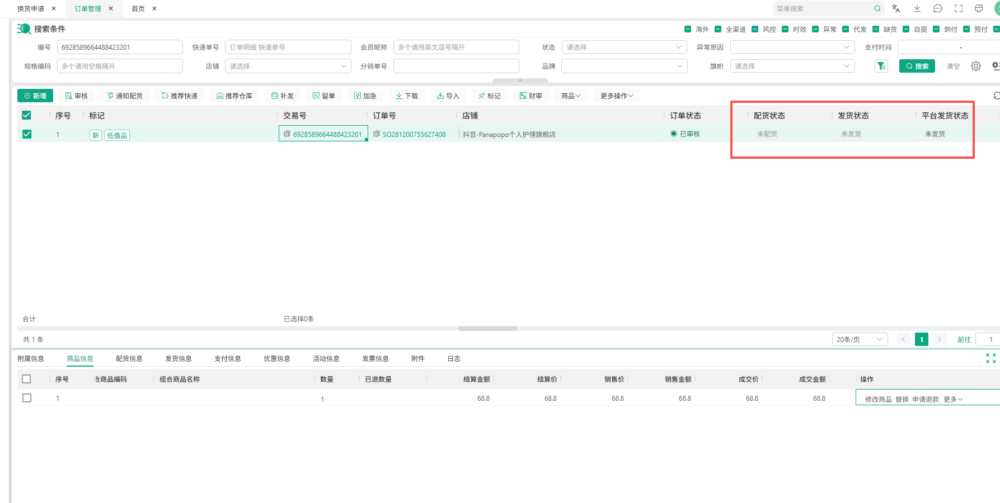
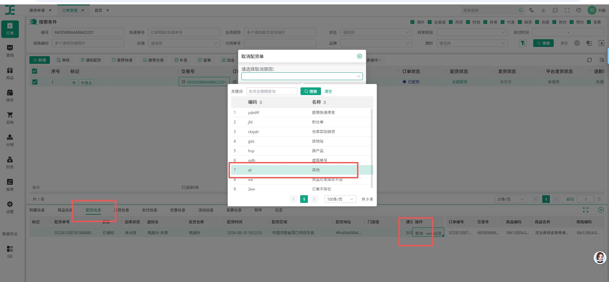

# 抖音退款 Agent 规则确认稿 V1.0

> 状态：已业务确认，可进入研发评审  
> 规则基线：《抖音退款sop2.0_项目基线0806.xlsx》  
> 本次补充来源：客服补充的抖音未发货仅退款流程（2026-08-10）、业务确认的人工兜底通知配置（2026-08-14）、原始SOP与授权测试单页面复验后确认的已退回直退规则（2026-08-26）、业务再次确认的店铺名称与长沙城市规则（2026-08-28）  
> 更新日期：2026-08-28

## 一、适用范围

- 平台：抖音。
- 首批店铺：Panapopo护肤旗舰店、Panapopo官方旗舰店、Panapopo陆吾个人护理专卖店。
- 首批店铺直接按上述精确名称识别，精确店名同时作为任务、台账、策略和地址规则的内部键；不依赖平台稳定店铺ID，不做别名、大小写或包含匹配。
- SOP 中其余店铺暂不进入首批运行范围。
- 自动化场景：未发货退款、已发货退款、退货退款、换货待收货/发货。
- 纠纷、平台介入、仲裁待协商、仲裁待举证、补寄及维修订单转人工。

## 二、通用优先规则

1. 使用“交易号 + 售后单号”作为唯一任务标识。
2. 本次退款金额大于等于 500 元，转管理人员处理。
3. 部分商品、部分数量或部分金额的退款/换货，转人工。
4. V1 不识别客服聊天及人工协商记录；依赖聊天记录判断的订单转人工。
5. 规则无法明确匹配、信息缺失或冲突、系统结果不明确、需要理解快递回复时转人工。
6. 已处理完成、已退款成功或买家已撤销的售后，不重复操作。

## 三、通知规则

- 通知群：以群号为唯一投递标识，群名称以钉钉实际显示为准。
- 钉钉群号：`193120000457`。
- 所有转人工和系统异常场景均发送群通知；自动处理成功不通知。
- 每次通知固定逐一 @ 以下 9 位指定人员，不使用“@所有人”：狄云、青顾、行云、今夏、婉安、子宁、霜寒、听竹、梨花。
- 成员手机号映射按业务 2026-08-14 提供的受控配置维护，不在规则确认稿、PRD、HTML、普通配置或日志中明文展示。

## 四、场景规则

### 4.1 未发货退款

- 本次退款金额小于 500 元：按以下规则处理。
  - 无需进入 OMS 核验配货状态：直接退款。
  - 抖音售后流程提示需要进入 OMS 核验配货状态时，以 OMS 显示结果为准：
    - OMS 显示“未配货”：直接退款。
    - OMS 显示“全部配货”：先取消配货；OMS 明确显示取消配货成功后，再处理退款。
    - 取消配货失败、取消结果未知、OMS 显示其他配货状态或状态无法明确判断：转人工，不执行退款。
- 本次退款金额大于等于 500 元：转管理人员。

操作截图：

### 4.2 低值品退款

- 本节仅适用于抖音结构化物流状态明确未退回的已发货订单；明确已退回时按4.3的优先规则直接退款。
- 以 OMS 订单列表“低值品”标记为判断依据。
- 退款金额小于 500 元：创建或复用物流弃件工单并保存工单号；每30分钟只复查该工单，状态明确完成后再继续退款。待处理/处理中不得重新执行前置判断或重复建单。
- 退款金额大于等于 500 元：转管理人员。

### 4.3 已发货退款

- 进入OMS低值品判断和TMS拦截前，先读取抖音结构化物流状态：
  - 明确显示“已退回”：跳过OMS和TMS，直接退款。
  - 明确未退回：继续原低值品或普通商品拦截流程。
  - 状态缺失、冲突或无法明确判断：转人工，不推断为未退回。
- 最终退款前必须重新读取同一交易号和售后单号的物流状态；原判断为“已退回”但复读不再明确成立时，不执行退款并转人工。
- 非低值品订单在 TMS 创建快递拦截工单。
- 工单“待处理”且售后剩余时间大于 12 小时：等待并复查。
- 工单“已完成”：视为快递已处理拦截，可以退款。
- 工单“待处理”且售后剩余时间小于等于 12 小时：转人工。
- 拒收、商品已签收、需要理解快递回复或结果不明确：转人工。

### 4.4 退货退款

- 只读取退回物流的结构化目的地或签收地址；规范化后只要包含“长沙”或“长沙市”即视为发往指定退货地址，可以直接退款，无需等待签收或入库。
- 不从物流轨迹、聊天、备注或其他自由文本推断城市；结构化字段缺失、重复或冲突时转人工。
- 以下情况视为物流异常：未发往指定退货地址、签收地址不是指定退货地址、物流长期未更新或停滞。
- 物流异常且售后倒计时大于 3 天：暂不处理，继续复查。
- 物流异常且售后倒计时小于等于 3 天：拒绝退款并留言。
- 物流单号无法查询、物流信息缺失或结果不明确：转人工。

### 4.5 换货

- 物流显示发往商家指定退货地址：无需等待签收，在 OMS 创建补发单。
- 商品、数量和收货地址从抖音售后申请的结构化信息读取。
- 信息缺失或不一致：转人工。
- OMS 补发单创建成功并生成补发单号：Agent 任务完成，无需等待仓库发货。
- 创建失败、未生成补发单号或结果不明确：转人工。
- 换货退回物流异常：转人工，不自动拒绝换货。

## 五、时效规则

- 所有时效从买家发起本次售后申请时开始计算。
- 未发货退款：24 小时内处理。
- 已发货退款：33 小时内完成拦截及退款处理。
- 退货退款及换货：7 天内处理完成。
- “系统时间即将超时”：售后剩余时间小于等于 12 小时。

## 六、完成及异常判断

- 退款订单：抖音订单页面显示“退款成功”后完成。
- 依据“已退回”直接退款的订单，点击退款前必须再次确认结构化物流状态仍为“已退回”。
- 换货订单：OMS 补发单创建成功并生成补发单号后完成。
- 已点击退款但未显示成功、退款失败或结果未知：不重复操作，转人工。
- 人工与 Agent 同时操作、登录失效、页面异常或字段无法读取：停止自动处理并转人工。

## 七、退货物流异常留言

> 亲，我这边查到您填写的退货物流未发往或未签收至商家指定退货地址，因此本次退款申请暂时无法通过。辛苦您核实退货地址及物流信息，如有异常请联系发件快递确认哦～
