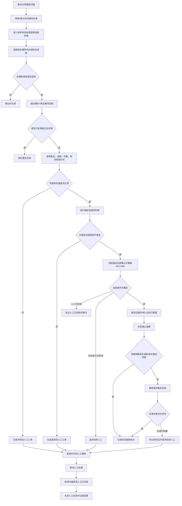
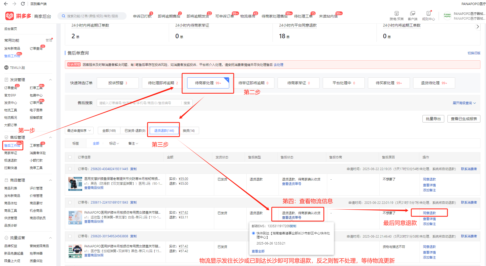
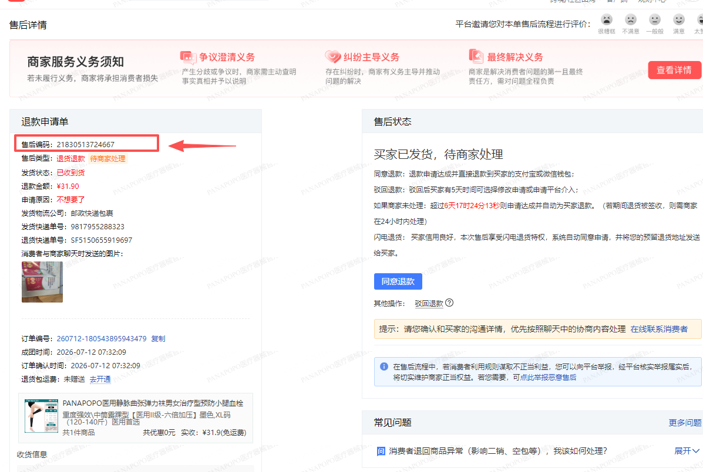
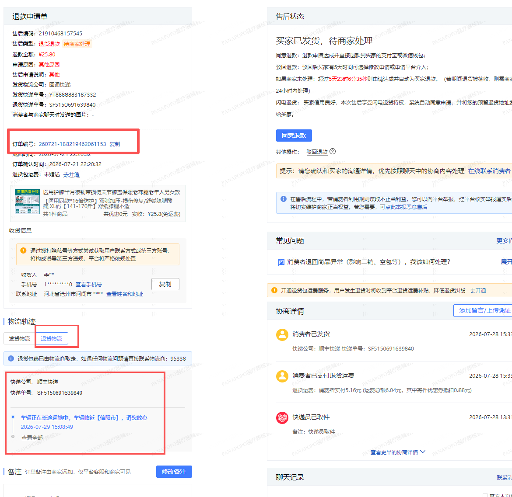
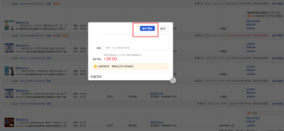

# 拼多多退货退款 Agent 产品需求文档（PRD）V1.0

> 文档状态：待研发评审  
> 业务规则状态：已确认  
> 版本：V1.0  
> 编制日期：2026-08-10  
> 适用平台：拼多多  
> 金额边界：本次售后申请退款金额 `>=500元`，转人工处理  
> 首批试运行店铺：PANAPOPO医疗保健官方旗舰店、松藤Yazc海外好物馆、PANAPOPO医疗器械官方旗舰店  
> 事实优先级：规则确认稿 > SOP > 截图证据  

---

## 1. 产品概述

### 1.1 一句话定位

拼多多退货退款 Agent 是接入现有拼多多工单自动化系统的新增业务场景，用于定时扫描“退货退款-待商家确认收货”售后单，按确定性规则自动完成低风险退款，并将不满足条件或无法可靠处理的订单转交人工。

### 1.2 背景

当前拼多多退货退款需要客服进入商家后台，逐单查看退款金额、退货件数、退货物流方向、物流更新时间和平台处理倒计时，再决定自动退款或人工核查。该流程规则明确但操作重复，适合复用现有拼多多浏览器自动化、钉钉通知和运营看板能力。

现有业务 SOP 已确认以下关键事实：

- 本期处理类型为“退货退款”。
- 平台超过 7 天未处理可能自动同意退款。
- 同一订单可能产生多次售后，售后编号是单次售后的唯一标识。
- 低风险订单可直接确认退款，高金额、多件、物流异常和临近超时订单需要人工处理。
- 退款成功后，货款、优惠券和红包由平台按原支付路径处理，Agent 不执行额外资金操作。

### 1.3 用户与角色

| 角色 | 核心诉求 | 本期职责 |
|---|---|---|
| 客服人员 | 减少重复查询和低风险退款操作 | 接收并处理钉钉转人工工单 |
| 客服负责人 | 控制退款风险和人工处理边界 | 确认业务规则、试点店铺及人工处理结果 |
| 运营人员 | 查看自动化运行效果和异常 | 通过现有看板查看工单、日志、转人工和店铺状态 |
| 系统管理员 | 保证账号、权限和系统可用 | 维护店铺白名单、场景开关、PDD 登录状态及钉钉配置 |
| 开发人员 | 实现稳定、可审计的自动退款能力 | 复用现有框架完成场景接入、测试和故障处理 |

### 1.4 产品价值

| 价值方向 | 预期结果 | 度量方式 |
|---|---|---|
| 人效 | 自动完成规则明确的低风险退款 | 自动退款成功量、人工协助量、自动化成功率 |
| 时效 | 定时扫描并优先处理剩余时间更短的售后单 | 平均处理时长、超时单量、临近超时转人工量 |
| 质量 | 通过确定性规则、幂等和执行前复核降低误操作 | 重复退款数、执行结果未知数、异常中断数 |
| 可追溯 | 每次判断和操作均可回看 | 日志完整率、关键截图留存率、原因码覆盖率 |
| 可复用资产 | 将退款 SOP 固化为规则和标准人工兜底模板 | 规则配置、场景状态机、转人工原因码、验收用例 |

### 1.5 当前基线

以下经营基线暂无可靠数据，不能在本文中编造。上线后由看板按“退货退款”业务场景独立统计：

- 每日待处理退货退款单量；
- 当前人工平均单笔处理时长；
- 当前超时自动退款单量；
- 当前人工误操作或重复处理量；
- 自动退款覆盖率和人工兜底比例。

---

## 2. 目标与非目标

### 2.1 V1.0 目标

1. 在现有拼多多工单自动化系统中新增“退货退款”业务场景。
2. 对 3 家试点店铺全天定时扫描退货退款售后单。
3. 对同时满足全部自动退款条件的售后单执行真实退款。
4. 对不满足条件、信息缺失或系统异常的售后单停止自动化并发送钉钉转人工通知。
5. 复用现有工单中心、运行日志、转人工、验证定位、店铺管理和运营总览能力。
6. 保证同一售后单不会被 Agent 重复提交退款。
7. 保留场景级紧急暂停能力。

### 2.2 非目标

- 不处理拼多多仅退款、部分退款、换货、补寄、维修、纠纷、平台介入和仲裁。
- 不处理抖音、天猫或其他平台退款。
- 不自动拒绝任何退款申请。
- 不新增独立运营看板、独立导航或独立店铺管理体系。
- 不重新建设 PDD 登录、钉钉消息和验证码处理能力。
- 本场景不查询或登记 OMS，也不依赖 TMS；OMS、TMS 异常均不得阻塞本场景。
- 不等待买家支付账户实际到账，平台售后状态成功即视为 Agent 操作完成。
- 不建设影子模式或分阶段放量流程。

---

## 3. 核心业务规则

### 3.1 规则原则

1. 自动退款必须同时满足全部放行条件。
2. 任一条件不满足、字段无法可靠读取或执行状态不明确时，Agent 必须停止自动化。
3. 转人工不等于拒绝退款。V1.0 中 Agent 不得点击“拒绝退款”。
4. 退款属于不可逆高风险操作，最终执行必须使用确定性规则，不允许大模型自由推断或补全缺失字段。
5. 所有金额、件数和时间边界按下表精确判断。

### 3.2 自动退款放行条件

只有同时满足下列全部条件，才允许进入自动退款执行：

| 规则编号 | 判断项 | 自动放行条件 | 不满足时处理 |
|---|---|---|---|
| R01 | 店铺范围 | 店铺 ID 在 3 家试点白名单内，且“退货退款”场景开关已启用 | 跳过，不创建转人工工单 |
| R02 | 平台与售后类型 | 拼多多平台，售后类型为“退货退款”，状态为“待商家确认收货” | 非本期售后类型直接跳过；已完成/已撤销直接跳过；同一退货退款单出现其他未完成状态则高风险转人工 |
| R03 | 退款金额 | 本次售后申请退款金额 `<500元` | `≥500元`高风险转人工 |
| R04 | 退货件数 | 本次售后申请退货件数为 `1-4件` | `≥5件`高风险转人工；`≤0`或非法值按信息识别失败转人工 |
| R05 | 物流方向 | 退货物流轨迹中出现“长沙”字段 | 未出现“长沙”则高风险转人工 |
| R06 | 物流更新时间 | 当前时间减去最新物流节点时间 `<72小时` | `≥72小时`高风险转人工 |
| R07 | 平台处理倒计时 | 剩余处理时间 `≥72小时` | `<72小时`高风险转人工 |
| R08 | 必要字段 | 售后编号、订单号、店铺、退款金额、退货件数、退货物流单号、物流轨迹、最新物流时间、处理倒计时均可可靠读取 | 中风险转人工 |
| R09 | 幂等与执行前复核 | 任务未被其他 Agent 占用，且点击前已重新校验 R01-R08 与场景开关 | 按 7.4、7.5 节处理 |

### 3.3 边界定义

- 金额 `499.99元`可继续判断，`500元`必须转人工。
- 本次售后申请退货 `4件`可继续判断，`5件`必须转人工。
- 物流最新节点距当前 `72小时`整时，按“≥72小时”转人工。
- 平台剩余处理时间 `72小时`整时，按“≥72小时”可继续判断。
- “发往长沙”只要求退货物流轨迹中出现“长沙”字段，不要求已到达长沙、物流签收或仓库确认到货。
- 本场景不访问 OMS，仓库信息不参与自动退款判断、转人工通知或看板健康检查。
- “最新物流节点”取平台当前展示的最后一条有效物流轨迹时间，不按创建售后时间或上传物流单号时间计算。
- 同一订单可有多个售后单，必须按售后编号分别处理。
- 时间计算统一使用北京时间（Asia/Shanghai）和经过时间同步的系统时间源；同一轮判断及执行前复核必须分别使用单一校验时刻。

### 3.4 范围与状态映射

| 平台/售后类型/状态 | 处理结果 |
|---|---|
| 非拼多多平台 | 跳过 |
| 拼多多非“退货退款”类型 | 跳过 |
| 退货退款已完成、已关闭或买家已撤销 | 跳过并记录最终状态 |
| 退货退款“待商家确认收货” | 进入 R03-R09 判断 |
| 退货退款其他未完成状态 | 高风险转人工，不自动操作 |

#### 3.4.1 【本次更新】首批试点店铺

| 序号 | 已确认店铺名称 | 店铺 ID | 本期处理 |
|---:|---|---|---|
| 1 | PANAPOPO医疗保健官方旗舰店 | 待业务在上线前提供并由技术校验 | 启用“退货退款”场景 |
| 2 | 松藤Yazc海外好物馆 | 待业务在上线前提供并由技术校验 | 启用“退货退款”场景 |
| 3 | PANAPOPO医疗器械官方旗舰店 | 待业务在上线前提供并由技术校验 | 启用“退货退款”场景 |

店铺名称与店铺 ID 必须一一匹配。账号、密码、手机号等凭据不写入 PRD、普通配置或日志；上线配置应通过现有受控方式提供。

### 3.5 规则优先级

从高到低依次为：

1. 已完成、已撤销或不在试点范围：跳过。
2. 重复任务、并发锁、售后状态变化：阻止执行。
3. 必要字段、PDD 或页面异常：转人工。
4. 金额、件数、物流方向、物流 72 小时、处理倒计时规则：转人工或放行。
5. 全部条件满足：执行自动退款。

---

## 4. 核心流程



### 4.1 当前人工操作流程（SOP）

当前客服在拼多多商家后台按以下路径处理退货退款：

#### 步骤1：进入售后工作台

进入“商家后台 → 售后工作台”，在“待商家处理”中选择“退货退款”，进入待处理售后列表。



#### 步骤2：查看售后详情

打开待处理售后单，查看售后编号、本次退款金额、退货件数和退货物流单号等本次处理所需信息。



#### 步骤3：查看退货物流

切换到“退货物流”，查看最新物流轨迹。物流轨迹中出现“长沙”字段即可进入退款确认，不要求物流已到达或已签收长沙。



#### 步骤4：确认退款

确认符合第 3 章自动退款规则后，点击“同意退款”，并在确认弹窗中完成退款操作。



**异常分支：** 物流轨迹未显示发往长沙，或任一自动退款条件不满足时，不执行退款，转人工处理；当前流程不点击“拒绝退款”，也不在自动任务内持续等待物流更新。

> 图片来源：《拼多多退货退款SOP_项目基线0730.xlsx》“操作步骤-退货退款”。4张图片分别对应售后入口、售后详情、退货物流和确认退款，保留 SOP 原始清晰度，仅用于公司内部需求评审和开发交接。图片仅说明现有页面路径与关键操作位置，不覆盖第 3 章的 Agent 业务规则。

---

## 5. 功能清单

```text
拼多多退货退款 Agent V1.0
├── P0 业务场景接入
│   ├── 新增“退货退款”场景类型
│   ├── 三家试点店铺场景白名单
│   └── 场景级启停开关
├── P0 售后任务扫描
│   ├── 全天每30分钟定时扫描
│   ├── 按处理倒计时排序
│   └── 售后唯一键去重与加锁
├── P0 数据读取
│   ├── PDD售后字段读取
│   └── 退货物流轨迹读取
├── P0 规则决策
│   ├── 金额与件数判断
│   ├── 长沙物流方向判断
│   ├── 两类72小时时间判断
│   └── 标准转人工原因码
├── P0 自动退款执行
│   ├── 执行前状态复核
│   ├── 确认退款
│   ├── 成功状态核验
│   └── 结果不明确时禁止盲目重试
├── P0 人工兜底
│   ├── 高/中风险分级
│   ├── 钉钉群通知
│   ├── 单次通知去重
│   └── 人工完成后自动闭环
├── P0 看板复用
│   ├── 运营总览新增业务场景
│   ├── 工单中心场景筛选
│   ├── 运行日志与转人工记录
│   └── 验证定位复用
└── 非本期
    ├── 其他平台与售后类型
    ├── 自动拒绝退款
    ├── 新建独立看板
    └── 影子模式
```

---

## 6. 现有看板改造要求

### 6.1 改造原则

- 不新增侧边导航和独立页面。
- 将“退货退款”作为现有工单模型中的第 4 个业务场景接入。
- 顶部汇总指标继续统计全部场景，同时支持通过现有店铺、日期和业务场景条件查看退货退款数据。
- 场景展示名称固定为“退货退款”；内部场景代码由开发按现有命名规范确定并在技术评审时记录。
- 本场景仅依赖 PDD、钉钉和现有看板，不查询或登记 OMS，也不依赖 TMS。健康检查和执行前置条件必须按场景依赖判断，不能因 OMS 或 TMS 异常暂停退货退款。

### 6.2 运营总览

“业务场景分布”从 3 个场景增加为 4 个场景，新增“退货退款”一行，至少展示：

- 工单总量；
- 自动退款成功量；
- 人工协助量；
- 自动化成功率；
- 尚未成功量。

“处理结构”与顶部指标自动纳入退货退款数据，不另建指标卡。

### 6.3 工单中心、日志与转人工

- 工单中心支持按“退货退款”筛选。
- 工单详情展示第 8 节定义的核心业务字段、规则命中结果和证据。
- 运行日志记录扫描、加锁、读取、判断、执行、复核、通知和关闭全过程。
- 转人工列表展示工单问题、风险等级、通知状态、人工处理状态和关闭时间。
- 验证定位继续用于“退款执行结果未知”等待核实任务，不承载影子模式。

### 6.4 关键页面线框图

```text
┌────────────────────────────────────────────────────────────────────┐
│ 店铺筛选 | 日期筛选 | 业务场景筛选 | 实时连接 | 刷新 | 场景启停      │
├────────────────────────────────────────────────────────────────────┤
│ 工单总量 | 自动化成功 | 人工协助 | 处理中 | 等待中 | 异常 | 待验证  │
├─────────────────────────────────────┬──────────────────────────────┤
│ 业务场景分布                        │ 处理结构                     │
│ 在途无理由退款                      │ 自动化成功 / 人工协助 / 失败 │
│ 已发货无轨迹退款                    │                              │
│ 异常网点预警                        │                              │
│ 退货退款  ← 本期新增                │                              │
├─────────────────────────────────────┴──────────────────────────────┤
│ 店铺运行健康：每家店铺按场景检查 PDD 依赖，不检查 OMS / TMS          │
└────────────────────────────────────────────────────────────────────┘
```

---

## 7. 核心功能详细需求

### 7.1 任务扫描与排序

**触发方式**：系统全天运行，每 30 分钟触发一次，扫描频率作为场景配置项保留。

**扫描范围**：

- 【本次更新】仅扫描 3.4.1 节已确认的 3 家店铺及其上线前校验通过的店铺 ID；
- 仅扫描拼多多“退货退款-待商家确认收货”状态；
- 按平台剩余处理时间从短到长处理；
- 店铺未启用、场景暂停或 PDD 登录不可用时，不进入自动退款判断。

**扫描结果**：

- 无任务：记录本次扫描完成，不创建空工单；
- 发现任务：生成或复用唯一任务；
- 同一售后已存在未关闭任务：不重复创建；
- 已由人工或平台处理完成：标记跳过并记录最新状态。

### 7.2 字段读取

Agent 必须读取并结构化保存以下信息：

- 店铺 ID、店铺名称；
- 售后编号、订单号；
- 售后类型、售后状态；
- 本次售后申请退款金额；
- 本次售后申请退货件数；
- 退货物流单号；
- 完整物流轨迹及最新节点时间；
- 平台剩余处理时间。

读取原则：

- 页面没有展示、字段为空或无法可靠识别时，不允许使用默认值猜测；
- 拼多多退货退款不访问 OMS，不读取或保存仓库字段；
- 多物流单号、异常格式或无法确定最新有效节点时，按“信息识别失败”转人工。

### 7.3 确定性规则判断

规则判断必须输出：

- 每条规则的输入值；
- 每条规则的通过/不通过结果；
- 最终决策：自动退款、转人工或跳过；
- 命中的标准原因码；
- 规则版本和判断时间。

同一售后同时命中多个转人工原因时：

1. 风险等级取最高等级；
2. “工单问题”展示优先级最高的主原因；
3. “转人工原因”列出全部命中事实；
4. 只发送一条钉钉消息。

### 7.4 自动退款执行

执行前必须再次读取：

- 店铺白名单和场景开关；
- 售后编号；
- 当前售后状态；
- 本次退款金额；
- 本次退货件数；
- 退货物流轨迹及最新节点时间；
- 平台剩余处理时间；
- 平台确认退款按钮是否可用。

执行规则：

1. 在持有任务锁的状态下，以同一校验时刻重新计算 R01-R09，而不是只比较部分字段。
2. 任一条件不再满足时，禁止点击退款，并按最新条件跳过或转人工。
3. 留存执行前页面截图、规则判断快照和场景开关状态。
4. 生成唯一 `attempt_id`，先持久化“不可逆操作准备执行”的执行意图，再点击“确认退款”。
5. 点击后立即将执行阶段更新为“已发起，结果待确认”，不得等到页面成功后才首次落库。
6. 页面明确显示“退款成功”或“售后完结”，记录自动退款成功。
7. 页面超时、断网、进程崩溃或结果不明确时，恢复流程必须先按售后编号重新查询平台状态，不得直接重放点击动作；任何遗留 `prepared` 记录也必须视为“可能已点击”。
8. 复查仍无法确认结果时，状态改为“待验证”，同步发起高风险人工接管。
9. Agent 不检查买家账户是否实际到账。

### 7.5 幂等、并发与状态变化

**任务唯一键**：`店铺ID + 售后编号`。

**并发要求**：

- 同一唯一键同一时间只允许一个执行实例持有锁；
- 锁实现方式和超时时间由技术方案确定，但不得允许锁超时后直接重复退款；
- 人工和 Agent 可能同时打开售后单，因此点击前必须复核平台状态。
- 每次不可逆执行必须有唯一 `attempt_id` 和持久化执行阶段；任务恢复、锁过期或进程重启后，只要存在 `prepared/submitted/unknown` 任一执行记录，均只允许查询平台结果，不允许新建退款尝试或再次点击。查询后仍无法确认时进入待验证并转人工。

**状态变化处理**：

| 场景 | 处理方式 | 是否发钉钉 |
|---|---|---|
| 人工已完成退款 | 标记“人工已完成”，关闭 Agent 任务 | 否 |
| 买家撤销售后 | 标记“售后已撤销”，关闭任务 | 否 |
| 状态变化且尚未完成 | 停止自动化，高风险转人工 | 是 |
| 另一 Agent 正在处理 | 跳过本轮，禁止重复执行 | 否 |
| 已存在待人工任务 | 不再自动判断，不重复通知 | 否 |

### 7.6 人工兜底与任务生命周期

转人工后：

1. 自动化流程立即停止；
2. 任务状态改为“待人工处理”；
3. 同一售后单只发送一次钉钉通知；
4. Agent 后续只检查是否已由人工处理完成，不再自动退款；
5. 发现人工处理完成后自动关闭任务并记录实际结果；
6. 只有授权人员主动重置任务，才允许重新进入规则判断。

人工接单和处理时效复用现有拼多多工单的人工协作 SLA；若现有系统未配置 SLA，业务必须在上线前提供。系统不重复发送同一钉钉消息，但应在现有看板持续展示未接单和临近平台截止时间的人工任务。

**待验证状态守卫**：

- `pending_verification` 任务不得直接重置为可自动执行；
- 必须由授权人员先在拼多多平台确认“未退款”，上传或关联核验凭证，并记录核验人、核验时间和结论；
- 若人工确认已退款，直接关闭任务并记录实际完成方式。

### 7.7 场景开关与紧急暂停

- 支持全局“退货退款”场景开关；
- 支持按店铺启停该场景；
- 关闭开关后不得创建新的自动退款执行任务；
- 正在执行的任务应在下一次不可逆操作前检查开关状态；
- 出现误退款、重复提交、平台风控或页面异常时，运营可立即暂停该场景；
- 暂停后已有人工任务继续保留并可跟踪关闭。

**自动熔断建议（待业务/技术评审，不属于当前已冻结规则）**：

当前已确认能力为“场景级/店铺级紧急暂停”。下表是对直接上线真实退款的安全增强建议，是否启用及阈值须在评审后单独确认；未确认前不得写成现行业务规则。

| 条件 | 自动暂停范围 | 告警与恢复 |
|---|---|---|
| 发现确认误退款 | 全局退货退款场景 | 立即高优先级告警；完成原因分析、影响核查和双人复核后恢复 |
| 检测到同一售后重复提交退款 | 全局退货退款场景 | 立即高优先级告警；核对全部试点店铺后恢复 |
| 单笔退款执行结果未知 | 受影响店铺 | 立即暂停该店；人工核验该售后结果后恢复 |
| 同一店铺连续3个任务出现关键字段/按钮定位失败 | 受影响店铺 | 判定页面契约可能失效；修复并通过页面回归后恢复 |
| 钉钉消息连续3次发送失败 | 受影响店铺 | 确认群机器人和网络恢复后再启用 |
| 拼多多账号触发风控 | 受影响店铺 | 复用现有账号告警；人工解除风控后恢复 |

如后续启用自动熔断，熔断不得删除或关闭已有任务；恢复必须按第 12.1 节权限矩阵执行并记录证据。

---

## 8. 数据规范

### 8.1 核心字段

| 字段 | 类型 | 必填 | 来源 | 说明/校验 |
|---|---|---:|---|---|
| scene_code | string | 是 | 系统配置 | 退货退款场景内部代码，待技术确认 |
| store_id | string | 是 | 店铺配置/PDD | 参与任务唯一键，不展示敏感凭据 |
| store_name | string | 是 | 店铺配置/PDD | 看板和钉钉展示 |
| aftersale_no | string | 是 | PDD | 售后编号，参与任务唯一键 |
| order_no | string | 是 | PDD | 订单号，不作为任务唯一键 |
| aftersale_type | enum | 是 | PDD | 必须为退货退款 |
| aftersale_status | string | 是 | PDD | 保存判断时、执行前、执行后三次状态 |
| refund_amount | decimal | 是 | PDD | 人民币，单位元，最多两位小数且必须 `>0`；非法值转人工 |
| return_quantity | integer | 是 | PDD | 本次售后申请退货件数，必须为正整数；`1-4`可继续判断，其他值转人工 |
| logistics_no | string | 是 | PDD | 退货物流单号 |
| logistics_trace | json/text | 是 | PDD | 保存用于判断的物流轨迹 |
| logistics_has_changsha | boolean | 是 | 规则引擎 | 任一有效轨迹出现“长沙”则为 true |
| latest_logistics_time | datetime | 是 | PDD | 最新有效物流节点时间 |
| logistics_stale_hours | decimal | 是 | 系统计算 | 当前时间减最新物流节点时间 |
| handling_deadline | datetime | 是 | PDD/系统换算 | 平台处理截止时间 |
| remaining_hours | decimal | 是 | 系统计算 | 截止时间减当前时间 |
| decision | enum | 是 | 规则引擎 | auto_refund/manual/skip |
| reason_codes | array | 是 | 规则引擎 | 支持多个标准原因码 |
| risk_level | enum | 否 | 规则引擎 | high/medium；自动成功或跳过时为空 |
| rule_version | string | 是 | 系统配置 | 便于规则追溯 |
| task_status | enum | 是 | 工单系统 | 见第 9 节 |
| execution_phase | enum | 是 | Agent | not_started/prepared/submitted/confirmed/unknown |
| attempt_id | string | 条件必填 | Agent | 每次不可逆执行的唯一标识，执行前必须落库 |
| handoff_status | enum | 是 | 工单系统 | none/pending/accepted/closed |
| completion_mode | enum | 条件必填 | 工单系统 | pure_auto/manual_assisted，任务完成时二选一且互斥 |
| manual_outcome | enum | 条件必填 | 人工处理 | refunded/rejected/buyer_cancelled/other |
| verification_result | enum | 条件必填 | 人工核验 | not_refunded/refunded/unknown |
| verification_evidence | attachment | 条件必填 | 人工核验 | 待验证任务恢复或关闭的证据 |
| pre_action_snapshot | attachment | 条件必填 | Agent | 自动退款前页面证据 |
| result_snapshot | attachment | 条件必填 | Agent | 成功、失败或结果未知页面证据 |
| ding_status | enum | 条件必填 | 钉钉接口 | 未发送/发送成功/发送失败 |
| created_at | datetime | 是 | 系统 | 任务创建时间 |
| updated_at | datetime | 是 | 系统 | 最后更新时间 |

### 8.2 数据最小化

- 业务判断不需要的买家姓名、手机号、详细地址、聊天原文不得写入普通运行日志。
- 页面截图可能包含敏感信息，必须沿用现有系统的受控访问权限和存储策略。
- 账号、密码、Cookie、Token 和钉钉密钥不得出现在工单字段、日志或截图说明中。
- 钉钉消息只允许发送到公司批准的现有内部群，群成员和机器人权限沿用现有配置并在上线前核验。
- 截图应裁剪到完成判断所需的最小区域；账号、Cookie、Token、买家手机号和详细地址等区域不得入图或必须脱敏。
- 日志、截图和导出文件必须使用现有内部存储、传输加密、访问控制和下载审计能力。
- 日志和截图保留时间复用现有拼多多工单系统配置；若现有系统无明确的保留期限和到期删除策略，则视为上线阻塞项，必须在技术评审中补齐。

---

## 9. 状态与看板映射

不新增一套看板状态体系，但数据模型必须把“主任务状态、人工接管状态、钉钉通知状态”拆成三条状态轴，避免结果未知与人工接管互相覆盖。

| 任务状态 | 触发条件 | 看板归类 | 后续动作 |
|---|---|---|---|
| discovered | 扫描发现新售后 | 等待中 | 加锁并读取字段 |
| processing | 正在读取、判断或执行 | 处理中 | 禁止重复处理 |
| auto_succeeded | 平台明确显示退款成功/售后完结 | 自动化成功 | 关闭任务 |
| manual_pending | 已发送钉钉，等待人工 | 其中人工协助/等待中 | 只跟踪人工结果 |
| manual_closed | 人工处理完成 | 人工协助完成 | 按 `manual_outcome` 记录退款、拒绝、买家撤销或其他结论 |
| paused | 店铺或场景被停用 | 已暂停 | 不执行退款 |
| interrupted | 登录、页面、PDD或通知异常 | 异常中断 | 按原因重试或转人工 |
| pending_verification | 点击后退款结果不明确 | 待验证 | 禁止再次退款，人工核实 |
| skipped | 不在范围、已撤销或已完成 | 不计入成功/失败 | 关闭任务并记录原因 |

影子模式不在本期范围，“待验证”只用于退款执行结果不明确的真实任务。

状态轴规则：

- `task_status=pending_verification` 时，可以同时存在 `handoff_status=pending/accepted`；
- `ding_status`独立记录未发送、发送中、发送成功、发送失败，不改变业务判断结果；
- 只有平台结果明确或人工完成核验后，`pending_verification` 才允许关闭；
- 看板“待验证”按主任务状态统计，“其中人工协助”按人工接管状态统计，同一任务可以同时进入两个指标，但工单总量只计算一次。
- 未经人工介入即由 Agent 明确核验成功的任务，完成方式为 `pure_auto`；进入人工接管或待验证后再由人工完成/确认的任务，完成方式统一为 `manual_assisted`，不得同时计入纯自动完成。

---

## 10. 转人工规则

### 10.1 风险分级与原因码

| 风险 | 原因码 | 工单问题 | 触发条件 |
|---|---|---|---|
| 高 | REFUND_AMOUNT_LIMIT | 退款金额超限 | 本次退款金额 ≥500元 |
| 高 | RETURN_QUANTITY_LIMIT | 退货件数超限 | 本次退货件数 ≥5件 |
| 高 | LOGISTICS_NOT_TO_CHANGSHA | 退货物流方向异常 | 物流轨迹未出现“长沙” |
| 高 | LOGISTICS_STALE_72H | 退货物流长时间未更新 | 最新物流节点距当前 ≥72小时 |
| 高 | DEADLINE_LT_72H | 退款处理临近超时 | 平台剩余处理时间 <72小时 |
| 高 | EXECUTION_RESULT_UNKNOWN | 退款执行结果未知 | 点击后无法确认是否成功 |
| 高 | AFTERSALE_STATUS_CHANGED | 售后状态发生变化 | 执行前状态变化且尚未完成 |
| 中 | REQUIRED_FIELD_MISSING | 退款信息缺失 | 必要字段为空 |
| 中 | FIELD_PARSE_FAILED | 信息识别失败 | 字段存在但无法可靠读取 |
| 中 | PLATFORM_PAGE_ERROR | 平台页面异常 | 页面改版、元素缺失、加载或平台报错 |
| 中 | LOGIN_STATE_ERROR | 登录状态异常 | 登录失效、验证码、风控或权限不足 |
| 中 | DINGTALK_SEND_FAILED | 钉钉通知失败 | 转人工消息发送失败 |

### 10.2 钉钉通知

**【本次更新】通知配置**：

| 配置项 | 已确认值 | 实现要求 |
|---|---|---|
| 通知群 | 天猫抖音退款Agent通知群 | 复用现有内部群配置 |
| 钉钉群号 | `189925002005` | 作为受控配置项，不在业务逻辑中散落硬编码 |
| 成功订单 | 自动处理成功不通知 | 不发送成功消息，不触发 @ |
| 转人工/系统异常 | 发送通知 | 使用下述固定标题、模板和 @ 规则 |
| @ 方式 | 固定逐一 @10 位指定人员 | 不使用“@所有人”，群内其他成员不 @ |

**固定 @ 人员**：张欣（子宁）、易嘉豪（狄云）、何紫辉（婉安）、陈姣群（梨花）、蔡妍（今夏）、彭心雨（听竹）、彭玉洁（青顾）、曾昶（霜寒）、刘敏（秦桑）、崔志文（行云）。

人员显示名称为业务确认口径；开发应复用现有钉钉成员映射或配置对应用户标识，不得使用手机号、账号密码等敏感信息进行明文配置。人员调整属于通知配置变更，不要求修改业务判断代码，但必须记录变更前后值和确认人。

**标题固定为**：`拼多多退款工单转人工`

**消息模板**：

```text
拼多多退款工单转人工
自动化流程已停止，请人工核查并继续处理。

工单信息
• 店铺：{store_name}
• 工单问题：{issue_type}
• 售后编号：{aftersale_no}
• 订单号：{order_no}
• 物流单号：{logistics_no}

转人工说明
• 转人工原因：{handoff_reason}
• 风险等级：{risk_level_cn}

{configured_mentions}
```

**字段规则**：

- `工单问题`填写标准分类名称；
- `转人工原因`填写实际命中值，不只写原因码；
- 同时命中多个原因时合并为一条说明；
- `风险等级`显示“高”或“中”；
- 自动退款明确成功时不发送钉钉消息；
- 转人工和系统异常通知必须发送至群号 `189925002005`，逐一 @ 已确认的 10 位人员，不得 @所有人或额外 @ 群内其他成员；
- 拼多多退货退款不读取仓库信息，转人工消息不展示`仓库`字段；
- 售后编号用于区分同一订单的多次售后，在原有字段基础上新增，不删除原模板字段；
- “退款执行结果未知”必须在转人工原因中明确提示“先核查平台状态，禁止直接再次退款”；
- 消息发送成功后保存平台返回标识，避免重复发送；
- 必须先持久化人工工单，再发送钉钉通知，防止通知失败导致任务丢失；
- 发送失败时使用同一消息幂等标识重试，优先复用现有重试次数和间隔；若现有系统没有明确策略，由技术评审补充可配置的重试上限和退避间隔；
- 达到最终失败条件后，在现有看板产生高优先级告警，由授权人员决定是否暂停该店铺；恢复前必须确认钉钉发送能力正常。
- 因业务已确认仅使用钉钉群作为人工通知渠道，最终发送失败时不再调用其他外部渠道；上线前必须指定负责监控现有看板告警的运营/系统管理员值班角色，并在看板中记录告警确认状态。未指定值班角色时不得上线真实退款。

---

## 11. 异常与恢复策略

| 异常场景 | 自动处理 | 最终状态/人工动作 |
|---|---|---|
| PDD登录失效或验证码 | 作为店铺级系统事件停止该店全部新任务，复用现有登录/验证能力；无法读取售后字段时不创建伪造的逐单工单 | 店铺异常中断并在看板告警；恢复登录后继续扫描 |
| 页面改版或关键按钮缺失 | 禁止猜测按钮或坐标继续点击 | 中风险转人工并暂停受影响场景 |
| 必要字段为空 | 不使用默认值 | 中风险转人工 |
| 物流轨迹格式异常或多单号无法判断 | 不判断“长沙”和最新时间 | 中风险转人工 |
| 执行前状态变化 | 重新分类 | 已完成则跳过，否则高风险转人工 |
| 点击退款后网络超时 | 重新查询售后状态 | 成功则闭环；不明确则待验证并转人工 |
| 同一任务重复触发 | 使用唯一键和锁拦截 | 跳过，不发钉钉 |
| 钉钉发送失败 | 人工工单先落库，按同一消息标识执行现有或评审确认的重试策略，不能重复创建人工工单 | 最终失败后看板告警，由授权人员决定是否暂停该店场景 |
| 场景紧急暂停 | 在不可逆操作前停止 | 已有人工任务继续保留 |

禁止事项：

- 禁止在结果未知时直接再次点击退款；
- 禁止因页面元素相似而推测按钮；
- 禁止缺失金额、件数、物流或倒计时仍自动退款；
- 禁止自动点击拒绝退款；
- 禁止 TMS 异常影响本场景；
- 禁止将真实订单数据复制到未批准的外部 AI 或第三方服务。

---

## 12. 权限与安全

1. 【本次更新】只允许 3.4.1 节已确认店铺名称及其校验通过的店铺 ID 启用真实退款权限。
2. 场景开关、店铺白名单和重置人工任务操作必须受角色权限控制。
3. 退款账号权限、登录态和密钥沿用现有安全管理，不写入 PRD、日志或配置页面明文。
4. 自动退款操作必须可追溯到店铺、售后编号、规则版本、执行实例和时间。
5. 自动退款前、执行结果和异常页面均需留存证据。
6. 人工重置任务必须记录操作人、时间和原因。
7. 页面或平台规则发生变化时，应先暂停场景再评估，禁止在未知页面继续真实退款。
8. 业务已确认三家试点店铺直接上线风险，并于 2026-08-10 补充确认具体店铺名称和通知配置；该事实不替代系统的幂等、审计和紧急暂停要求。

### 12.1 权限矩阵

| 操作 | 客服人员 | 客服负责人 | 运营人员 | 系统管理员 | 审计要求 |
|---|---:|---:|---:|---:|---|
| 查看普通工单和处理结果 | 是 | 是 | 是 | 是 | 记录访问日志 |
| 查看含敏感信息的截图 | 否 | 是 | 否 | 是 | 默认拒绝；技术方案必须映射到具体角色并记录访问日志 |
| 下载含敏感信息的截图 | 否 | 否 | 否 | 经客服负责人确认后执行 | 记录申请人、确认人、用途和下载日志 |
| 处理人工工单 | 是 | 是 | 否 | 否 | 记录处理人、时间和结论 |
| 修改试点店铺白名单 | 否 | 确认 | 否 | 执行 | 记录变更前后值和确认人 |
| 启用真实自动退款 | 否 | 确认 | 否 | 执行 | 记录变更前后值和确认人 |
| 紧急暂停场景 | 否 | 是 | 是 | 是 | 记录暂停人、时间和原因 |
| 暂停后恢复自动执行 | 否 | 确认 | 否 | 执行 | 记录恢复人、时间、依据和确认人 |
| 重置普通待人工任务 | 否 | 是 | 否 | 是 | 记录重置人、时间和原因 |
| 恢复待验证任务 | 否 | 核验/确认 | 否 | 执行 | 授权人员核验平台状态并上传证据 |
| 修改规则阈值 | 否 | 确认 | 否 | 执行 | 视为需求变更，记录规则版本 |

权限名称与现有系统角色不一致时，可在技术方案中映射，但不得降低上述最小权限和审计要求。

### 12.2 上线风险接受记录

本轮已确认“三家试点店铺直接开放真实自动退款、不经过影子模式”，但上线前仍需形成独立、可审计的风险接受记录。记录至少包含：

- 确认日期和审批责任角色（无需在 PRD 中写个人姓名）；
- 三家试点店铺范围；
- 已知风险：误退款、重复退款、页面变化、账号风控、钉钉通知失败和结果未知；
- 已具备的控制：人工兜底、幂等、执行前复核、证据留存和紧急暂停；
- 证据位置或会议/审批记录编号。

该记录当前状态为`待业务归档`；归档完成是上线前置条件，不能仅以 PRD 内文字替代审批证据。

---

## 13. 非功能性需求

### 13.1 可靠性

- 重复退款提交数必须为 0。
- 同一售后单的钉钉转人工消息不得重复发送。
- 自动退款明确成功的任务不得发送钉钉通知。
- 转人工和系统异常通知必须发往已确认群，并仅逐一 @ 已确认的 10 位人员。
- 退款结果未知时不得自动重试不可逆操作。
- 任一必要依赖不可用时，系统必须安全停止而非继续猜测。

### 13.2 可观测性

- 每轮扫描记录开始时间、结束时间、店铺、发现任务数和处理结果。
- 每个任务记录完整状态流转和规则命中明细。
- 运营总览可查看该场景的工单量、自动成功、人工协助、异常和待验证。
- 支持按日期、店铺、业务场景、售后编号、订单号和状态检索。

### 13.3 性能与调度

- 默认每 30 分钟扫描一次，全天运行。
- 扫描必须在下一调度周期前完成；若无法完成，系统不得并发启动相同店铺的重复扫描。
- 实际并发数和单轮超时由技术评审根据现有系统容量确定。

### 13.4 兼容性

- 复用现有拼多多工单系统支持的运行环境和浏览器版本。
- PDD 页面结构变化必须可被监控和告警。
- PDD、钉钉和看板接口按现有能力接入，不新增不必要的第三方依赖。

---

## 14. 验收标准

### 14.1 业务规则用例

除指定变量外，以下用例均假设：试点店铺已启用、售后类型正确、字段完整、PDD 正常、未被重复处理。

| 用例 | 退款金额 | 退货件数 | 物流含长沙 | 距最新物流 | 剩余时间 | 期望结果 |
|---|---:|---:|---|---|---|---|
| A01 | 499.99 | 4 | 是 | 71小时59分 | 72小时 | 自动退款 |
| A02 | 500.00 | 4 | 是 | 10小时 | 100小时 | 高风险转人工：退款金额超限 |
| A03 | 100.00 | 5 | 是 | 10小时 | 100小时 | 高风险转人工：退货件数超限 |
| A04 | 100.00 | 1 | 否 | 10小时 | 100小时 | 高风险转人工：退货物流方向异常 |
| A05 | 100.00 | 1 | 是 | 72小时 | 100小时 | 高风险转人工：物流72小时未更新 |
| A06 | 100.00 | 1 | 是 | 10小时 | 71小时59分 | 高风险转人工：临近超时 |
| A07 | 500.00 | 5 | 否 | 80小时 | 20小时 | 只生成一条高风险消息，列出全部原因 |
| A08 | 缺失 | 1 | 是 | 10小时 | 100小时 | 中风险转人工：退款信息缺失 |
| A09 | 100.00 | 1 | 是 | 10小时 | 100小时 | 平台明确成功，记录自动退款成功 |
| A10 | 100.00 | 0 | 是 | 10小时 | 100小时 | 中风险转人工：退货件数非法 |
| A11 | 100.00 | 1 | 是 | 10小时 | 100小时 | 售后类型非退货退款时直接跳过 |
| A12 | 0.00 | 1 | 是 | 10小时 | 100小时 | 中风险转人工：退款金额非法 |

### 14.2 幂等与异常用例

> **说明：什么是幂等？** 同一店铺、同一售后编号的任务，即使被定时扫描重复发现、被多个执行实例同时获取，或在网络超时、进程重启后再次恢复，系统也只能真正发起一次退款。实现时以“店铺 ID + 售后编号”作为任务唯一键；如果点击退款后的结果不明确，只能先查询拼多多平台的最终状态，仍无法确认时必须转人工，禁止再次点击“同意退款”。

| 用例 | 场景 | 期望结果 |
|---|---|---|
| B01 | 同一店铺和售后编号被两个实例同时发现 | 仅一个实例获得执行权 |
| B02 | 人工已完成退款 | Agent跳过，不发钉钉，不重复退款 |
| B03 | 执行前售后状态变化但未完成 | 高风险转人工 |
| B04 | 点击退款后网络超时，复查已完结 | 记录自动成功，不再次点击 |
| B05 | 点击退款后网络超时，复查仍不明确 | 待验证、高风险转人工，禁止再次点击 |
| B06 | 同一售后已转人工，下轮再次扫描 | 不重复判断，不重复发钉钉 |
| B07 | 钉钉首次发送超时 | 使用同一幂等标识重试，不创建第二条人工工单 |
| B08 | OMS或TMS不可用但PDD正常 | 退货退款场景正常运行 |
| B09 | 全局场景开关关闭 | 不创建新的自动执行任务 |
| B10 | 单店场景开关关闭 | 只停止该店，不影响其他试点店铺 |
| B11 | 点击退款后、写入submitted前进程崩溃，记录仍为prepared | 将prepared视为可能已点击；根据 `attempt_id` 先查平台结果，禁止重放点击 |
| B12 | 锁过期但存在 prepared/submitted/unknown 执行记录 | 只进入结果核验，不创建新执行尝试 |
| B13 | 首次判断后跨过金额、件数或72小时边界 | 点击前重算R01-R09并按最新结果停止或转人工 |
| B14 | 首次判断后、点击前关闭场景开关 | 禁止点击退款，任务进入暂停/重新分类 |
| B15 | PDD登录失败且无法读取售后列表 | 产生店铺级异常，不创建字段不完整的伪工单 |
| B16 | 钉钉达到评审确认的最终失败条件 | 人工工单保留，看板告警；由授权人员决定是否暂停该店场景 |
| B17 | 待验证任务被尝试直接重置 | 系统拒绝；必须由授权人员先核验平台状态并上传证据 |
| B18 | Agent点击后结果未知，人工核验为已退款 | 任务只计入人工协助完成，不得同时计入纯自动完成 |
| B19 | 已确认店铺名称与配置店铺 ID 唯一匹配 | 允许进入扫描；非三家试点店铺或名称/ID映射不一致时跳过并告警 |
| B20 | 自动退款明确成功 | 不发送钉钉通知，不触发任何 @ |
| B21 | 转人工或系统异常且钉钉可用 | 仅向群号 `189925002005` 发送一条通知，逐一 @ 固定 10 人，不使用“@所有人”且不 @ 其他群成员 |

### 14.3 看板验收

- 运营总览的业务场景分布新增“退货退款”。
- 顶部汇总和处理结构正确纳入退货退款数据。
- 工单中心、运行日志、转人工和验证定位均可按“退货退款”筛选。
- 三家试点店铺可独立启停该场景。
- 店铺健康检查对本场景只校验 PDD，不校验 OMS 或 TMS。
- “待验证”只统计真实退款结果不明确的任务。

### 14.4 上线验收门槛

本期按业务决定直接向 3 家试点店铺开放真实自动退款，不设置影子模式和样本准确率门槛。上线前仍必须满足：

1. 本文 P0 功能全部完成并通过测试；
2. A01-A12、B01-B21 验收用例全部通过；
3. 三家店铺 ID、退款权限和场景开关配置完成；
4. PDD、钉钉和现有看板联调通过；
5. 唯一键、执行前复核、结果未知禁止重试和紧急暂停能力可用；
6. 【本次更新】钉钉群名称、群号、成功不通知和固定 @10 人配置验证通过；
7. 真实退款操作日志和证据截图可查询；
8. 权限矩阵、紧急暂停和待验证状态守卫可用；
9. 日志、截图和钉钉数据的访问、脱敏、保留及删除策略已验证；
10. 金额核对责任角色和误退款处理路径已明确。

---

## 15. 上线与运营

### 15.1 上线方式

- 【本次更新】PANAPOPO医疗保健官方旗舰店、松藤Yazc海外好物馆、PANAPOPO医疗器械官方旗舰店同时启用“退货退款”场景；
- 上线即执行真实自动退款；
- 不运行影子模式；
- 业务在上线前提供准确店铺 ID；
- 开发复用现有 PDD、钉钉和看板配置。

### 15.2 紧急停止条件

如评审确认启用自动熔断，则按第 7.7 节建议执行；当前已冻结规则是：出现以下任一情况时，运营或系统管理员应立即关闭场景开关：

- 发生误退款；
- 发现重复退款提交；
- 拼多多触发账号或自动化风控；
- 页面结构变化导致关键字段或按钮无法可靠识别；
- 产生退款结果未知任务；
- 日志或证据缺失，无法追溯真实退款操作。

关闭后所有新增任务停止自动执行，不影响已生成的人工工单继续处理。恢复前必须完成影响核查和问题修复，由具备权限的系统管理员执行、客服负责人确认，并记录恢复人、确认人、时间和依据。

### 15.3 运营指标

统计按任务 `created_at` 归属所选日期区间，状态取查询时最新状态；同一唯一键只计一个工单。

| 指标 | 口径 |
|---|---|
| 工单总量 | 日期区间内创建的退货退款唯一任务数 |
| 纯自动完成量 | `completion_mode=pure_auto` 的唯一任务数 |
| 人工协助完成量 | `completion_mode=manual_assisted` 的唯一任务数 |
| 自动化成功合计 | 按任务唯一键计算纯自动完成与人工协助完成的去重并集；两类由 `completion_mode` 保证互斥 |
| 自动化成功率 | 自动化成功合计 / 工单总量；工单总量为0时显示“-” |
| 尚未成功量 | 工单总量 - 自动化成功合计 |
| 人工协助量 | `handoff_status`不为 none 的任务数，按原因码和风险等级分布 |
| 自动退款金额 | 自动成功任务的 `refund_amount` 合计 |
| 人工处理金额 | 人工关闭任务的 `refund_amount` 合计，并按 `manual_outcome`拆分 |
| 异常中断量 | 当前或最终进入 interrupted 的任务数 |
| 待验证量 | 当前 `task_status=pending_verification` 的任务数 |
| 待验证滞留时长 | 当前时间 - 进入待验证状态的时间 |
| 重复任务拦截量 | 被唯一键或锁拦截的重复触发次数，不计入工单总量 |
| 平均处理时长 | 任务首次创建至自动成功或人工关闭的平均时长 |
| 钉钉送达率 | 发送成功的人工工单数 / 需通知的人工工单数 |
| 人工接单时长 | 钉钉发送成功至 `handoff_status=accepted` 的时长 |
| 误退款数 | 经人工确认的错误自动退款任务数 |
| 超时率 | 超过平台截止时间仍未闭环的任务数 / 工单总量 |
| 系统可用性 | 分别统计 PDD、钉钉在调度周期内的成功检查比例 |

“Agent操作成功”仅表示拼多多售后状态成功，不表示买家支付账户实际到账；两者不得混用。

### 15.4 金额核对与误退款闭环

- 核对频率待业务确认；安全建议为上线首周至少每日核对一次 Agent 自动退款记录与拼多多实际完成状态、退款金额，后续频率根据首周结果调整。该建议不得在未确认前写成现行业务规则。
- 核对范围至少包含店铺、售后编号、订单号、`attempt_id`、申请退款金额、平台完成状态和操作时间。
- 业务必须在上线前指定核对责任角色；核对结果和差异记录作为项目运行证据保留。
- 发现状态或金额差异时，立即暂停受影响店铺场景并创建高风险事件，核查是否存在误退款、重复退款或平台状态延迟。
- 确认误退款后，应保留完整证据并按公司现有客服追偿、平台申诉或内部损失处理流程执行；若现有流程不存在，业务必须在上线前补充责任人和处理路径。

---

## 16. 责任与证据链

| 目标 | 当前基线 | 动作与责任角色 | 可衡量结果 | 可复用资产 | 证据来源 |
|---|---|---|---|---|---|
| 降低重复退款操作 | 待上线后补充 | Agent自动退款；产品/客服确认规则 | 自动退款量、人工协助比例 | 拼多多退款规则集 | 拼多多SOP、工单日志 |
| 降低超时风险 | 待上线后补充 | 30分钟扫描；开发保障调度 | 平均处理时长、临近超时量 | 定时扫描与排序能力 | 看板、运行日志 |
| 控制误退款与重复 | 当前无可靠量化基线 | 唯一键、锁、执行前复核；开发负责 | 重复退款=0、未知结果可追溯 | 幂等状态机、异常SOP | 验收记录、执行截图 |
| 保证人工兜底 | 现有拼多多工单钉钉能力 | Agent发送；客服接管 | 通知成功量、人工闭环量 | 原因码与通知模板 | 钉钉记录、转人工列表 |
| 复用现有平台 | 已有运营看板和 PDD 能力 | 开发进行场景接入 | 新增场景可独立统计和启停 | 场景化工单模型 | 看板截图、技术评审记录 |

---

## 17. 依赖与待提供项

### 17.1 待业务提供

- 3.4.1 节三家已确认店铺各自的准确店铺 ID；
- 上线操作时间和人工兜底值班安排；
- 上线首周金额核对责任角色；
- 金额核对频率（安全建议为上线首周每日一次）；
- 钉钉最终发送失败时负责监控并确认看板告警的值班角色；
- 现有误退款追偿、平台申诉或内部损失处理路径；若尚无流程，则需指定责任人和处置方式。
- 现有拼多多工单人工协作 SLA；若尚无统一 SLA，则需提供高风险/中风险工单的接单和处理时限。
- 三家店铺直接上线真实退款的独立风险接受记录及证据位置。

### 17.2 待技术确认

- 现有拼多多工单项目的代码仓库、部署环境和接口位置；
- 新业务场景内部代码；
- PDD 售后列表与详情页的稳定定位方式；
- 任务锁、幂等记录、截图存储和日志保留的现有实现；
- 钉钉消息幂等与发送失败告警机制；
- 已确认群号 `189925002005`、成功不通知及固定 @10 人映射的上线前技术验证；
- 场景开关关闭时对执行中任务的安全停止实现。
- 现有日志/截图的访问权限、脱敏、加密、下载审计、保留期限和到期删除能力。
- 是否启用第 7.7 节自动熔断建议及具体阈值；未确认时只实现已冻结的手动紧急暂停。

以上待技术确认项不得改变本文已经确认的金额、件数、物流、时间、人工兜底、直接上线和系统复用规则。若实现需要扩大业务范围或改变规则，必须重新发起需求确认。
