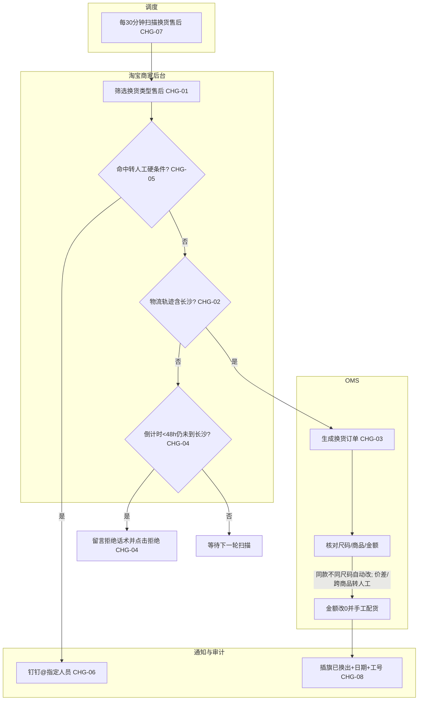

# 《先马客服Agent｜淘宝场景｜换货Agent自动处理 增量 PRD》

## 0. 文档信息

| 项目 | 内容 |
|---|---|
| 所属项目/模块 | 先马电商 · 客服自动化 · 退款Agent（淘宝平台） |
| 目标版本 | V1.0（换货场景首次正式交付） |
| 需求类型 | 新增 |
| 文档版本与状态 | V1.0 / 业务已确认，可进入研发评审（2026-09-19） |
| 当前有效PRD | 《退款Agent多平台_PRD_V1.0.html》淘宝tab · 退款PRD（未收货退款+退货退款） |
| 对应方案/原型 | 《天猫换货Agent_规则确认稿_V1.0.md》《天猫换货Agent_规则确认板_V1.0.html/.pdf》（业务已确认） |
| 当前实现证据 | 未核验；客服自动化系统已有淘宝退款Agent扫描/操作/通知/看板能力可复用 |

### 版本记录

| 版本 | 日期 | 状态 | 变更摘要 | 确认依据 |
|---|---|---|---|---|
| V1.0 | 2026-09-19 | 已确认 | 新增淘宝换货Agent自动处理场景；首批11家店铺；OMS生成换货订单→改尺码→金额改0→配货→插旗；转人工/拒绝/协商兜底 | 《天猫换货Agent_规则确认稿_V1.0》业务确认（C1生成换货单即点同意，其余按建议口径） |

---

## 1. 本期需求与 AI 能力概览及 CHG 索引

| CHG编号 | 功能模块 | 本期功能点 | 变更类型 | AI 能力变化 | 预期价值（简述） |
|---|---|---|---|---|---|
| CHG-01 | 售后扫描入口 | 淘宝商家后台定时扫描换货类型售后单 | 新增 | 工作流自动化 | 自动发现待处理换货单，替代人工逐单查看 |
| CHG-02 | 物流方向判断 | 退货物流轨迹含"长沙"即视为发往长沙，无需签收 | 新增 | 推理与决策 | 统一物流判断口径，与退款场景一致 |
| CHG-03 | OMS换货操作链路 | OMS生成换货订单→核对尺码→金额改0→手工配货→插旗备注 | 新增 | Agent工具调用 | 跨系统自动完成换货主链路，C1生成换货单即点同意 |
| CHG-04 | 临期拒绝 | 平台倒计时<48h且物流未到长沙，自动拒绝并留言 | 新增 | 工作流自动化 | 避免超时被平台自动同意导致误换货 |
| CHG-05 | 转人工规则集 | 件数/金额/异地签收/物流停滞/缺货/跨商品/同买家上限等场景转人工 | 新增 | 人工接管 | 高风险/异常场景不自动处理，保障业务安全 |
| CHG-06 | 钉钉通知 | 转人工/异常推送钉钉群并固定@指定人员 | 调整 | 工作流自动化 | 复用退款场景通知通道，换货异常可及时响应 |
| CHG-07 | 调度与幂等 | 每30分钟扫描，按临期排序；售后单号维度防重复 | 新增 | 工作流自动化 | 稳定调度、不重复操作 |
| CHG-08 | 操作审计与工号 | Agent专用工号插旗、操作可追溯到售后单/规则版本/时间 | 新增 | AI治理与安全 | 全程可审计，出问题可回溯 |

---

## 2. 背景、目标与成功标准

### 2.1 当前问题和基线

当前淘宝换货需客服在淘宝商家后台与OMS间人工切换：逐单筛选换货售后、查看退货物流方向、判断是否到长沙、核对换货尺码、在OMS生成换货订单、改尺码、结算金额改0、手工配货、返回平台插旗备注。流程跨系统、受平台倒计时约束、规则明确重复，人工处理易遗漏临期单。

**当前基线（已确认）：**
- 淘宝退款Agent已上线未收货退款+退货退款两个场景（首批3家试点），已有：淘宝后台自动化操作能力、OMS/TMS对接、钉钉群193120000457+固定@9人通知、30分钟扫描调度、人工接管与幂等机制、Agent专用工号。
- 换货SOP：《天猫换货流程.xlsx》（业务输入，单sheet"换货"，A1:I17）。
- 业务已确认规则：《天猫换货Agent_规则确认稿_V1.0》24项问题全部确认。

### 2.2 本次目标与非目标

**目标：**
- 在首批11家店铺内自动处理换货售后，覆盖待收货、交易成功两种订单状态。
- 完成"筛选→物流判断→OMS生成换货单→改尺码→金额改0→配货→插旗"主链路。
- 临期未到长沙自动拒绝；异常/高风险/不明确场景转人工并通知。

**非目标：**
- 不处理仅退款、退货退款（已有独立场景）、补寄、维修、平台介入/仲裁。
- 不处理海外店（zeamo海外旗舰店、dranlove海外旗舰店）。
- 不处理皆花旗舰店、prowaves旗舰店（已移出客服范围）。
- V1.0不自动发起平台"协商退款"流程，仅留言话术并转人工。
- 换货成功后仓库发货环节由仓库执行，Agent不跟踪发货物流。

### 2.3 成功标准与统计口径

- 正常换货单（物流到长沙、件数≤10、无价差、同款）可在无人工介入下完成配货并插旗。
- 临期单自动拒绝结果可在平台侧复查到。
- 命中转人工条件的单均推送钉钉且Agent停止自动操作。
- 统计口径：换货自动处理量、转人工量、拒绝量、成功率按售后单号维度计数；自动处理量与转人工量分母为扫描到的换货售后总量；人工接管率=转人工量/换货售后总量。基线与目标值待上线后补证。

---

## 3. 当前能力与差异基线

| 编号 | 当前能力/规则 | 产品状态 | 当前实现 | 事实来源 | 本次处理 |
|---|---|---|---|---|---|
| BASE-01 | 淘宝后台换货售后筛选、物流查看、留言、插旗 | 已确认（退款场景已具备） | 已实现 | 退款Agent PRD | 沿用，扩展换货类型筛选 |
| BASE-02 | OMS生成订单/修改商品/配货 | 已确认具备权限 | 未核验 | 业务确认2026-09-19 | 新增换货申请链路对接 |
| BASE-03 | 钉钉群193120000457+@9人通知 | 已确认 | 已实现 | 退款场景 | 沿用 |
| BASE-04 | 每30分钟扫描、按临期排序、幂等防重 | 已确认 | 已实现 | 退款场景 | 沿用，换货加入调度 |
| BASE-05 | Agent专用工号 | 已确认 | 已实现 | 退款场景 | 沿用 |
| BASE-06 | 换货操作流程（C1~C6规则） | 已确认 | 未实现 | 换货规则确认稿 | 本期新增 |
| BASE-07 | 11家店铺账号凭证 | 已确认 | 受控配置 | 业务账号表 | 受控接入，不写入PRD |

### 事实冲突与原型差异

| 编号 | 冲突/差异 | 高优先级事实 | 当前表现 | 本次处理 | 影响 |
|---|---|---|---|---|---|
| DIFF-01 | SOP"处理类型"写"退货退款"但全文为换货流程 | 规则确认稿A1：本期为换货 | SOP表格文字笔误 | 按换货处理 | 规则匹配入口 |
| DIFF-02 | 换货SOP列15家，退款场景已剔除皆花/prowaves | 业务账号表11家 | SOP仍含15家 | 按账号表11家，海外店不处理 | 扫描范围 |
| DIFF-03 | 退款场景7天倒计时 vs 换货SOP 10天 | D1确认：以平台实时倒计时为准 | 两处口径不一致 | 以平台实时倒计时为准 | 拒绝节点判断 |

---

## 4. 本期范围边界

### 4.1 明确不做

| 不做事项 | 原因/依据 |
|---|---|
| 仅退款/退货退款/补寄/维修/平台介入 | 已有独立场景或非本期范围 |
| 海外店换货（zeamo海外、dranlove海外） | 不在业务账号表内（A3确认） |
| 皆花旗舰店、prowaves旗舰店 | 已移出客服范围 |
| 自动发起平台"协商退款" | B6确认：V1.0仅留言话术并转人工 |
| 跟踪仓库发货物流 | D3确认：发货由仓库执行，Agent不跟踪 |
| 个人客服工号操作 | C6确认：使用Agent专用工号 |

### 4.2 限制事项

| 限制事项 | 适用范围 | 限制说明/依据 |
|---|---|---|
| 店铺外不扫描 | 非11家店铺 | 严格按业务账号表过滤 |
| 信息不明确不猜测 | 所有场景 | 缺字段/冲突/结果不明一律转人工 |
| 人工已处理不重复操作 | 所有场景 | 识别人工接管标记后停止自动操作并记录MANUAL_TAKEOVER |

### 4.3 店铺适用范围

| 店铺 | 换货 | 说明 |
|---|---|---|
| zeamo旗舰店 | 适用 | 首批试运行 |
| 恒源祥先马专卖店 | 适用 | 首批试运行 |
| 艾漫旗舰店 | 适用 | 首批试运行 |
| pakeqi医疗器械旗舰店 | 适用 | 首批试运行 |
| 恒源祥鸿远专卖店 | 适用 | 首批试运行 |
| 冈朴制药旗舰店 | 适用 | 首批试运行 |
| veevco医疗器械旗舰店 | 适用 | 首批试运行 |
| drboja旗舰店 | 适用 | 首批试运行 |
| draddo旗舰店 | 适用 | 首批试运行 |
| dranlove旗舰店 | 适用 | 首批试运行 |
| zeamo快马专卖店 | 适用 | 首批试运行 |
| zeamo海外旗舰店 | 不适用 | 本期不处理海外店 |
| dranlove海外旗舰店 | 不适用 | 本期不处理海外店 |

已移出本期：皆花旗舰店、prowaves旗舰店（已退回运营，客服不再承接）。海外店不在11家账号表内，本期不处理。店铺外不扫描；店铺名单调整属配置变更，需记录审批人与生效时间。

---

## 5. 用户、角色与完整流程

### 5.1 角色和权限前提

| 角色 | 使用入口 | 可见数据范围 | 可执行操作 | 限制 |
|---|---|---|---|---|
| 一线客服 | 钉钉通知+淘宝后台 | 转人工的换货售后单 | 接管处理 | 不修改自动判断规则 |
| Agent | 淘宝后台+OMS | 11家店铺内换货售后 | 筛选/判断/生成换货单/改尺码/金额改0/配货/插旗/拒绝/留言 | 命中转人工条件即停止 |
| 运营/业务 | 配置后台 | 规则/阈值/店铺/话术 | 配置变更（需审批记录） | 变更需记录版本与确认人 |

### 5.2 主流程

### 5.3 分支、异常和再次使用

- **拒绝后重新申请**：买家拒绝后重新申请换货，可再次进入自动判断流程；异常重复申请（同买家短时间多次）转人工（E3）。
- **人工并发处理**：检测到人工已处理标记时Agent停止并记录`MANUAL_TAKEOVER`，不重复操作。
- **平台/OMS报错**：不重试点击，记录异常码并转人工。
- **配货失败/缺货**：留言缺货话术、插旗"缺货引导退款"，转人工跟进退款（C5）。
- **幂等**：同一售后单号已处理过（已插旗/已生成换货单）的不重复执行，以售后单号为唯一键防重。

### 5.4 当前人工操作流程（SOP）

> 截图来源：《天猫换货流程.xlsx》内嵌 7 张原始截图（已提取至 产品输出/assets/天猫换货Agent/image1~7.png），仅限公司内部评审与开发使用。人工路径用于说明现状，Agent 自动化后的规则口径以本文第 3、7 节为准。

| 步骤 | 系统 | 操作 | 关键按钮/位置 |
|---|---|---|---|
| 1 | 淘宝后台 | 交易 → 退款管理 → 售后单查询 → 点【换货】页签，查看待处理换货单与剩余倒计时 | 操作列【确认收货并发货】按钮 |
| 2 | OMS | 订单 → B2C售后 → 换货申请，准备按交易号搜索 | 换货申请菜单 |
| 3 | OMS | 输入交易号搜索换货申请 → 勾选记录 → 点【生成换货订单】→ 弹窗"商品未退回是否继续"点【确定】 | 生成换货订单 / 确定 |
| 4 | OMS | 订单管理按交易号搜索，找到带"换"标记的新建换货单，核对下方商品规格颜色/尺码 | 商品信息-规格名称 |
| 5 | OMS | 商品行点【修改商品】，弹窗中将结算金额改为 0，点【保存】；同款不同尺码在此改规格，价差转人工 | 修改商品 / 结算金额改0 / 保存 |
| 6 | 淘宝后台 | 返回换货售后列表，点该单右侧旗帜图标，备注"已换出+日期"（Agent 操作用专用工号）→ 确定 | 旗帜备注 |
| 7（异常） | 淘宝后台 | OMS 感知缺货时，备注旗帜填"缺货引导退款+时间"，留言买家并转人工跟进退款 | 旗帜备注示例 |

---

## 6. 页面与交互变化

本期为后台自动化操作，无新增用户可见页面。一线客服通过既有钉钉群接收转人工通知，通过淘宝后台处理接管单。

### 用户可见文案（客服侧）

| 场景 | 文案要点 | 展示方式 | 状态/来源 |
|---|---|---|---|
| 物流停滞>72h | 告知买家退货物流停滞，提醒核对快递单号 | 淘宝后台留言 | 沿用SOP话术① |
| 异地签收 | 告知退货仓在长沙，请核对快递单号 | 淘宝后台留言 | 沿用SOP话术② |
| 拒绝申请 | 未收到退回产品，暂拒绝，重新申请或联系人工 | 淘宝后台留言+点击拒绝 | 沿用SOP话术③ |
| 缺货 | 产品瑕疵返厂，先处理退款 | 淘宝后台留言+插旗 | 沿用SOP话术④ |

---

## 7. 功能与业务规则

### R-01 扫描入口（CHG-01）
- 关联变更：CHG-01
- 规则状态与来源：已确认，换货规则确认稿第3节
- 触发条件：每30分钟调度触发（D2）
- 前置条件：当前店铺在11家名单内；售后类型为"换货"；订单状态为待收货或交易成功
- 处理规则：售后单号（退款编号）为唯一标识；同一订单多产品按多售后单独立处理
- 系统反馈：命中转人工/拒绝/自动换货分支
- 影响范围：11家店铺换货售后

### R-02 物流方向判断（CHG-02）
- 关联变更：CHG-02
- 规则状态与来源：已确认B1
- 触发条件：退货物流轨迹更新
- 前置条件：售后单为换货类型
- 处理规则：物流轨迹出现"长沙"字段即视为发往长沙，无需等待签收或入库
- 与原规则差异：与退款场景口径一致
- 影响范围：所有换货单物流判断

### R-03 自动换货放行（CHG-03）
- 关联变更：CHG-03
- 规则状态与来源：已确认C1/C2/C3
- 触发条件：物流到长沙且未命中转人工硬条件
- 前置条件：OMS换货申请列表可查该交易号
- 处理规则：
  1. OMS搜索交易号→生成换货订单→确定（C1：生成即视为平台侧同意，无需单独点击"同意换货"）
  2. 核对换货尺码与平台申请是否一致；不一致点击"修改商品"
  3. 结算金额修改为0；存在价差转人工
  4. 手工配货；感知缺货转人工
  5. 返回淘宝后台插旗"已换出+日期+Agent专用工号"
- 影响范围：OMS换货申请、修改商品、结算、配货模块

### R-04 临期拒绝（CHG-04）
- 关联变更：CHG-04
- 规则状态与来源：已确认D1/B4
- 触发条件：平台实时倒计时<48小时，且退货物流仍未显示到长沙
- 处理规则：留言拒绝话术（SOP话术③），并点击"拒绝换货"按钮
- 影响范围：淘宝后台拒绝按钮

### R-05 转人工规则集（CHG-05）
- 关联变更：CHG-05
- 规则状态与来源：已确认B2/B3/B5/C2/C5/E1
- 触发条件：命中以下任一条件
- 处理规则（命中即停止自动操作、按场景留言话术、推送钉钉）：
  1. 退货物流签收地与长沙不一致（异地签收）
  2. 订单商品件数>10件
  3. 换货件数=2需拆分发货
  4. 换货金额或价差>500元；存在价差
  5. 跨商品换货/客服备注需换其他商品或修改件数
  6. 上传单号后>72h无物流更新
  7. OMS配货感知缺货
  8. 同买家24h内换货售后>3单
  9. 平台报错/原因不明
  10. 信息缺失、冲突或结果不明确
- 优先级（B7）：转人工硬条件 > 异地签收 > 临期拒绝 > 同意/等待；命中多条时转人工与拒绝优先

### R-06 钉钉通知（CHG-06）
- 关联变更：CHG-06
- 规则状态与来源：已确认，复用退款场景
- 触发条件：转人工/拒绝/异常
- 处理规则：推送钉钉群193120000457，固定逐一@9人（狄云、青顾、行云、今夏、婉安、子宁、霜寒、听竹、梨花）；人员映射走受控配置，不写入PRD；成功换货不通知

### R-07 调度与幂等（CHG-07）
- 关联变更：CHG-07
- 规则状态与来源：已确认D2
- 处理规则：每30分钟扫描一次；按剩余倒计时从短到长排序处理；同一售后单号不重复处理

### R-08 操作审计（CHG-08）
- 关联变更：CHG-08
- 规则状态与来源：已确认C6
- 处理规则：插旗备注与操作日志使用Agent专用工号；每次真实操作记录店铺、售后单号、规则版本、执行实例、时间、动作、结果、异常原因码

---

## 8. 状态、边界与异常

### 8.1 状态模型

| 业务状态 | 枚举标识 | 进入条件 | 用户可见表现 | 可执行操作 | 退出条件 |
|---|---|---|---|---|---|
| 待扫描 | PENDING | 新换货售后单入队 | 后台正常展示 | 等待调度 | 进入判断 |
| 判断中 | JUDGING | 调度扫描命中 | 无用户可见变化 | Agent内部判断 | 命中分支 |
| 自动换货中 | AUTO_EXCHANGING | 物流到长沙+未命中转人工 | 无 | OMS自动操作 | 配货成功/缺货/异常 |
| 已换货 | EXCHANGED | 配货成功+插旗 | 售后单完结 | 无 | — |
| 已拒绝 | REJECTED | 临期未到长沙 | 平台显示拒绝 | 买家可重新申请 | — |
| 转人工 | MANUAL | 命中R-05任一条件 | 钉钉通知客服 | 客服接管 | 人工处理完结 |
| 缺货待退款 | OUT_OF_STOCK | OMS配货感知缺货 | 留言+插旗 | 客服跟进退款 | 退款处理完结 |

### 8.2 边界规则

| 边界场景 | 处理规则 | 用户反馈 | 验收关联 |
|---|---|---|---|
| 件数>10 | 转人工 | 钉钉通知 | AC-03 |
| 件数=2拆分 | 转人工 | 钉钉通知 | AC-03 |
| 金额>500/价差 | 转人工 | 钉钉通知 | AC-03 |
| 跨商品 | 转人工 | 钉钉通知 | AC-03 |
| 物流停滞>72h | 留言停滞话术+转人工 | 留言+钉钉 | AC-04 |
| 同买家>3单/24h | 转人工 | 钉钉通知 | AC-05 |
| 重复扫描同一单 | 跳过，不重复操作 | 无 | AC-06 |
| 人工已处理 | 停止自动操作，记录MANUAL_TAKEOVER | 无 | AC-07 |

### 8.3 异常与恢复

| 异常 | 已产生外部影响 | 自动处理 | 用户操作 | 最终状态 | 审计/通知 |
|---|---|---|---|---|---|
| 淘宝后台登录失效/验证码 | 无 | 停止扫描，告警 | 人工重新登录 | 暂停调度 | 钉钉告警 |
| OMS操作超时/报错 | 可能已部分操作 | 复查结果，不重复点击 | 人工核验 | 视复查结果转人工 | 钉钉通知 |
| 平台页面结构变化 | 无 | 告警 | 人工介入 | 暂停该场景 | 钉钉告警 |
| 插旗失败 | 换货已完成但备注未写 | 重试一次 | 人工补备注 | 记录失败原因 | 钉钉通知 |

---

## 9. 数据对象与字段契约

| 对象 | 字段名 | 业务含义 | 类型 | 必填 | 来源/状态 |
|---|---|---|---|---|---|
| 换货售后任务 | aftersale_no | 售后单号（退款编号），唯一键 | string | 是 | 淘宝后台 |
| 换货售后任务 | shop_name | 店铺名（11家之一） | string | 是 | 受控店铺配置 |
| 换货售后任务 | order_status | 订单状态（待收货/交易成功） | enum | 是 | 淘宝后台 |
| 换货售后任务 | refund_countdown_seconds | 平台实时倒计时（秒） | number | 是 | 淘宝后台 |
| 换货售后任务 | logistics_track | 退货物流轨迹文本 | string | 是 | 淘宝后台 |
| 换货售后任务 | item_count | 订单商品件数 | number | 是 | 淘宝后台 |
| 换货售后任务 | exchange_amount | 换货申请金额 | number | 是 | 淘宝后台 |
| 换货售后任务 | buyer_id | 买家标识（用于同买家计数） | string | 是 | 淘宝后台 |
| 换货售后任务 | task_status | 任务状态（见8.1枚举） | enum | 是 | 系统内部 |
| 换货售后任务 | rule_version | 本次执行规则版本 | string | 是 | 规则配置 |
| 换货售后任务 | attempt_id | 执行实例ID，幂等键 | string | 是 | 系统内部 |
| OMS换货单 | trade_no | 交易号 | string | 是 | OMS |
| OMS换货单 | exchange_sku | 换货SKU/尺码 | string | 是 | OMS |
| OMS换货单 | settle_amount | 结算金额（自动改0） | number | 是 | OMS |

> 具体表结构、接口字段与数据类型为技术待确认项（见15节），本契约仅定义产品层业务字段。

---

## 10. AI 产品契约

### 10.1 AI 职责、输入与输出

| 关联CHG/R | AI负责 | AI不负责 | 输入与上下文 | 工具来源 | 输出 | 用户可见说明 |
|---|---|---|---|---|---|---|
| CHG-01~08/R-01~R-08 | 按确定性规则判断换货单走向并执行操作 | 不做模糊判断、不猜测、不处理规则外场景 | 售后单全字段+物流轨迹+规则版本 | 淘宝后台浏览器自动化+OMS操作 | 动作决策（同意/拒绝/转人工）+执行结果+插旗备注 | 客服通过钉钉接收转人工通知，通过后台看到插旗 |

### 10.2 不确定性、失败与人工控制

| 场景 | 系统判断/触发条件 | 自动处理 | 用户确认/人工接管 | 最终状态 | 记录与审计 |
|---|---|---|---|---|---|
| 物流轨迹字段缺失 | 无法判断是否到长沙 | 转人工 | 客服人工查看 | MANUAL | 记录原因码 |
| 点击后结果不明 | 页面无明确成功/失败提示 | 复查而非重复点击 | 复查仍不明则转人工 | MANUAL | 记录复查过程 |
| 命中转人工条件 | R-05任一规则 | 停止自动操作+留言+钉钉 | 客服接管 | MANUAL | 完整任务记录 |
| 规则外场景 | 未匹配任何已确认规则 | 转人工 | 客服判断 | MANUAL | 记录未匹配原因 |

### 10.3 AI 专项约束（Agent/自动执行）

| 约束项 | 要求 |
|---|---|
| 工具权限 | Agent仅可在11家店铺内执行筛选/查看/留言/插旗/拒绝/OMS生成换货单/改商品/改金额/配货，不得执行规则外操作 |
| 用户确认 | C1已确认：OMS生成换货单即视为平台侧同意，无需用户额外确认；拒绝换货为自动执行（临期保护） |
| 人工接管 | 命中R-05即停止，推送钉钉；人工处理后Agent识别并停止重复操作 |
| 部分成功 | OMS操作部分成功（如已生成换货单但配货失败）时记录中间状态并转人工，不回滚已生成单据 |
| 重试与审计 | 同一动作点击后结果不明时复查，不盲目重试；所有动作记录attempt_id、规则版本、时间、操作人（Agent工号） |

### 10.4 AI 效果与产品价值指标

| 指标类型 | 指标/口径 | 基线 | 目标或验证计划 | 数据来源 | 关联验收 |
|---|---|---|---|---|---|
| AI效果 | 换货自动处理成功率 | 待上线后补证 | 上线首周统计 | 任务记录 | AC-01 |
| AI效果 | 转人工率 | 待上线后补证 | 监控异常飙升 | 任务记录 | AC-03 |
| 产品价值 | 临期单自动拒绝覆盖率 | 待上线后补证 | 100%临期单被处理 | 任务记录 | AC-02 |

---

## 11. 依赖、联动与历史兼容

| 维度 | 是否影响 | 现有入口/契约 | 本次处理 | 历史数据/任务兼容 | 负责人/待确认 |
|---|---|---|---|---|---|
| 账号权限 | 是 | 退款场景Agent工号 | 沿用，扩展换货权限 | 无 | 已确认具备 |
| 钉钉通知 | 是 | 群193120000457+@9人 | 复用，换货消息模板新增 | 无 | 消息模板字段待确认 |
| OMS系统 | 是 | 退款场景OMS对接 | 新增换货申请链路 | 无 | 待技术确认接口 |
| 调度调度器 | 是 | 每30分钟扫描退款场景 | 复用调度，换货入队 | 无 | 待技术确认 |
| 看板 | 是 | 退款看板 | 新增换货场景筛选维度 | 无 | 待技术确认 |
| 11家店铺账号凭证 | 是 | 受控配置 | 受控接入，不写入PRD | 无 | 业务已提供账号表 |

---

## 12. 数据取值、统计、埋点与经营结果

| 数据项 | 业务含义 | 取数方式 | 统计/取值规则 | 补充条件 |
|---|---|---|---|---|
| 换货扫描量 | 单轮扫描到的换货售后单数量 | 聚合统计 | 按调度周期计数 | 仅11家店铺 |
| 自动换货成功量 | Agent自动完成配货并插旗的单数 | 聚合统计 | task_status=EXCHANGED计数 | 按日/店铺 |
| 自动拒绝量 | Agent自动拒绝的单数 | 聚合统计 | task_status=REJECTED计数 | 按日 |
| 转人工量 | Agent转人工的单数 | 聚合统计 | task_status=MANUAL计数 | 按日/原因码 |
| 自动处理成功率 | 自动成功占比 | 计算指标 | 自动换货成功量 / (自动换货成功量+转人工量) | 按日 |
| 转人工率 | 转人工占比 | 计算指标 | 转人工量 / 换货扫描量 | 按日 |

---

## 13. 非功能、安全与技术待确认

| 维度 | 产品约束 | 当前依据 | 技术待确认 | 不确认的影响 |
|---|---|---|---|---|
| 调度频率 | 每30分钟一轮 | 已确认D2 | 单轮并发与超时策略 | 扫描积压或重复执行 |
| 幂等 | 售后单号唯一键+attempt_id | 已确认 | 任务锁与CAS实现 | 重复操作 |
| 数据保留 | 操作日志/截图可审计 | 已确认 | 保留期限与存储位置 | 审计追溯 |
| 权限安全 | Agent专用工号；账号凭证受控配置 | 已确认 | 凭证注入与脱敏方案 | 凭证泄露 |
| 停机回退 | 场景开关可紧急停止 | 沿用退款 | 关闭时对执行中任务的安全停止 | 误操作继续 |
| 页面兼容 | 淘宝/OMS页面变化可监控 | 沿用 | 页面元素定位稳定性方案 | 自动化失效 |

---

## 14. 验收标准

| 编号 | 关联CHG/R | 前置条件 | 操作步骤 | 可观察预期结果 | 类型 | 证据 |
|---|---|---|---|---|---|---|
| AC-01 | CHG-03/R-03 | 11家店铺内换货单，物流轨迹含长沙，件数≤10，无价差，同款同尺码 | 调度扫描命中该单 | Agent自动在OMS生成换货单、金额改0、配货成功、淘宝后台插旗"已换出+日期+Agent工号"，全程无人工介入 | 正常 | 任务记录+后台截图 |
| AC-02 | CHG-04/R-04 | 换货单倒计时<48h，物流仍未显示长沙 | 调度扫描命中该单 | Agent留言拒绝话术并点击"拒绝换货"，平台显示拒绝成功 | 正常 | 后台截图 |
| AC-03 | CHG-05/R-05 | 分别构造：件数>10、件数=2、金额>500、价差、跨商品、异地签收 | 调度扫描命中 | 每种场景均转人工、推送钉钉、Agent不执行自动换货 | 边界 | 钉钉通知截图 |
| AC-04 | CHG-05/R-05 | 换货单上传单号后>72h无物流更新 | 调度扫描命中 | Agent留言停滞话术并转人工、推送钉钉 | 异常 | 留言+钉钉截图 |
| AC-05 | CHG-05/R-05 | 同买家24h内>3单换货售后 | 调度扫描命中 | 超出上限的单转人工 | 边界 | 任务记录 |
| AC-06 | CHG-07 | 同一售后单连续两轮扫描 | 第二轮扫描 | 不重复生成换货单、不重复插旗 | 异常 | 任务记录 |
| AC-07 | CHG-05/R-05 | 人工已在淘宝后台处理该售后 | 调度扫描命中 | Agent识别人工接管标记，停止自动操作并记录MANUAL_TAKEOVER | 异常 | 任务记录 |
| AC-08 | CHG-03/R-03 | 同款不同尺码换货单 | 调度扫描命中 | Agent自动在OMS修改尺码后继续配货 | 正常 | OMS截图 |
| AC-09 | CHG-03/R-03 | OMS配货时感知缺货 | 配货步骤执行 | Agent留言缺货话术、插旗"缺货引导退款"、转人工跟进 | 异常 | 留言+钉钉截图 |
| AC-10 | CHG-08/R-08 | 任一次自动操作 | 查看审计日志 | 可追溯到店铺、售后单号、规则版本、执行实例、时间、动作、结果 | 正常 | 审计记录 |

---

## 15. 待确认与开发交接

| 编号 | 类型 | 问题/事项 | 当前建议 | 不确认的影响 | 责任角色 | 状态 |
|---|---|---|---|---|---|---|
| TBD-01 | 技术待确认 | 11家店铺准确店铺ID（用于扫描过滤） | 业务提供 | 扫描范围不准 | 业务 | 待提供 |
| TBD-02 | 技术待确认 | 淘宝换货售后列表/详情/物流/倒计时/插旗/拒绝按钮的稳定定位方式 | 研发评估 | 自动化稳定性 | 研发 | 待确认 |
| TBD-03 | 技术待确认 | OMS换货申请列表/生成换货单/修改商品/结算改0/配货接口或页面操作 | 研发评估 | 主链路实现 | 研发 | 待确认 |
| TBD-04 | 技术待确认 | 任务锁、幂等、attempt_id、人工并发处理实现 | 复用退款场景方案 | 重复操作风险 | 研发 | 待确认 |
| TBD-05 | 产品待确认 | 换货转人工钉钉通知模板标题与字段口径 | 复用退款模板，标注换货 | 通知可读性 | 业务 | 待确认 |

### 开发交付边界

- **本次必须实现**：CHG-01~08全部规则（R-01~R-08）、11家店铺扫描、OMS换货主链路、临期拒绝、转人工规则集、钉钉通知、Agent专用工号、审计追溯。
- **明确沿用现有**：每30分钟调度、钉钉群与@9人配置、幂等与人工接管机制、Agent工号体系。
- **技术方案待设计**：淘宝/OMS页面元素定位、任务锁实现、看板换货维度扩展（TBD-02~04）。
- **禁止自由扩展**：不处理海外店/皆花/prowaves；不自动发起平台协商退款；不跟踪仓库发货；不使用个人工号；不写入账号密码/验证码/个人手机号。
