# 淘宝退款 Agent 产品需求文档（PRD）V1.0

> 文档状态：待研发评审  
> 业务规则状态：已确认  
> 版本：V1.0  
> 编制日期：2026-08-15  
> 适用平台：淘宝  
> 金额边界：本次退款金额或整单金额任一 `≥500元`，转人工处理  
> 首批试运行店铺：zeamo旗舰店、恒源祥先马专卖店、PAKEQI医疗器械旗舰店  
> 事实优先级：业务最新确认 > 淘宝 SOP > 已确认 REQ > 早期沟通材料  

## 0. 文档说明

### 0.1 状态说明

- **已确认**：淘宝 SOP 或业务规则确认版已明确，可作为开发和验收依据。
- **待业务提供**：业务口径尚未明确；涉及上线安全的项目必须在上线前补齐。
- **待技术确认**：由开发结合现有系统实现确认，不得改变已确认业务规则。
- **非本期**：明确不在 V1.0 开发范围内。

### 0.2 事实来源与优先级

1. 2026-08-14 业务最新确认：人工兜底通知群号调整为新群号，固定逐一 @9 位指定人员，优先级最高。
2. 2026-08-10 业务确认：本次退款金额或整单金额任一`≥500元`转人工，并在文档信息中明确首批 3 家店铺。
3. 2026-08-07 业务确认及《天猫退款 Agent 规则确认板 V1.0》。
4. 《天猫退款流程_项目基线0807.xlsx》，项目基线日期 2026-08-07。
5. `REQ-20260806-001 天猫未收货退款机器人试运行`，确认日期 2026-08-06。
6. 《退款 Agent 客服沟通内容》，编写日期 2026-07-07，仅用于风险与完整性检查。
7. 《拼多多退货退款 Agent PRD V1.0》，仅用于章节结构、异常兜底、验收和证据链检查，不作为淘宝业务规则来源。

命名说明：自 2026-08-15 起，当前产品、平台页签和业务场景统一使用“淘宝”名称；既有 SOP、REQ、规则确认板及截图资产仍保留原“天猫”文件名，仅用于历史证据追溯，不代表另一套业务规则。

事实冲突处理原则：最新业务确认 > 最新淘宝 SOP > 已确认 REQ > 早期沟通材料。低优先级资料不得覆盖高优先级事实。

### 0.3 已解决的资料冲突

| 冲突点 | 早期资料 | 最新确认口径 | 本 PRD 采用 |
|---|---|---|---|
| 店铺数量 | SOP 原列 15 家退货退款店铺 | 皆花旗舰店、prowaves旗舰店已退回运营，客服不承接 | 本期 13 家；两店不扫描 |
| 非低值品拦截后退款 | SOP 部分文字可理解为发起拦截后立即退款 | 按物流是否仍在长沙拆分两条路径 | 长沙内工单成功后立即退；离开长沙须等明确拦截/退回记录 |
| 未填写退货物流 | 早期讨论曾考虑临期拒绝 | 业务明确无需处理，平台超时自动关闭 | Agent 不处理、不拒绝 |
| OMS/TMS 名称 | 客服习惯曾混称 TMS | OMS 与 TMS 是两个独立系统 | OMS 只核验低值品；TMS 只处理快递工单 |
| 退货退款拒绝节点 | 早期讨论存在 18/48 小时混淆 | 业务确认退货退款以 `<48小时`为拒绝节点 | 未到目标城市且 `<48小时`自动拒绝 |
| 运行模式 | 早期资料建议影子模式 | 业务确认无影子模式，直接真实操作 | 首批 3 店直接真实执行 |

### 0.4 版本记录

| 文档版本 | 日期 | 说明 |
|---|---|---|
| V1.0 | 2026-08-15 | 产品名称由“天猫”统一调整为“淘宝”；历史证据文件名与截图资产路径保持不变 |
| V1.0 | 2026-08-14 | 更新人工兜底钉钉群号及固定 @9 位人员配置；群名称以钉钉实际显示为准 |
| V1.0 | 2026-08-10 | 按业务最新确认将金额边界调整为本次退款金额或整单金额任一`≥500元`转人工；文档信息补充首批 3 家店铺；删除未复核基线、试运行成功口径和责任与证据链章节 |
| V1.0 | 2026-08-07 | 根据最新淘宝 SOP、业务规则确认版、试运行与通知配置形成开发版 PRD；补充 10 张人工 SOP 原始截图 |

---

## 1. 产品概述

### 1.1 一句话定位

淘宝退款 Agent 是接入现有淘宝退款看板的两个自动化业务场景，用于每 30 分钟扫描淘宝未收货退款和退货退款售后单，按已确认的确定性规则执行真实退款、拒绝、协商及 TMS 快递工单；规则不明确、信息缺失或系统异常时停止自动化并转人工。

### 1.2 背景

当前客服需要在淘宝、OMS 和 TMS 间切换，人工完成退款筛选、金额与件数核验、物流判断、低值品核验、快递工单、买家通知、备注、退款或拒绝等操作。流程重复、跨系统且受平台倒计时约束，适合固化为可审计的确定性 Agent 流程。

当前已确认：

- 本期包含“未收货退款”和“退货退款”两个独立场景。
- 首批 3 家店铺同时开启两个场景并直接执行真实操作。
- Agent 可处理的确定性场景均由 Agent 处理，人工只承担异常和规则外兜底。
- 金额、件数、物流、时效和店铺范围必须精确匹配，不能由模型自由推断。
- 开发已有淘宝看板，本期只接入两个新场景，不重建独立看板。

### 1.3 用户与角色

| 角色 | 核心诉求 | 本期职责 |
|---|---|---|
| 客服人员 | 减少重复退款和跨系统操作 | 接收钉钉通知，处理异常、超边界及规则不明确任务 |
| 客服负责人 | 控制退款风险和人工兜底 | 确认规则、人工 SLA、试运行及恢复条件 |
| 运营人员 | 查看运行效果并控制风险 | 通过现有淘宝看板查看任务、日志、异常和场景状态 |
| 系统管理员 | 保证账号、权限和依赖可用 | 维护店铺/场景开关、登录态、OMS/TMS 与钉钉配置 |
| 开发人员 | 实现稳定、可审计的真实操作 | 复用现有 Agent/看板框架，实现规则、幂等、监控和恢复 |

### 1.4 产品价值

| 价值方向 | 预期结果 | 度量方式 |
|---|---|---|
| 人效 | 自动完成规则明确的退款判断与操作 | 纯自动完成量、人工协助量、人工兜底比例 |
| 时效 | 每 30 分钟扫描并按临近超时排序 | 平均处理时长、超时率、待处理积压量 |
| 质量 | 减少误退款、误拒绝、重复操作和漏处理 | 误退款数、误拒绝数、重复提交数、结果未知数 |
| 可追溯 | 每次判断和不可逆操作均有证据 | 规则明细完整率、操作前后截图完整率、原因码覆盖率 |
| 可复用资产 | 将淘宝退款 SOP 固化为场景规则 | 规则集、状态机、原因码、通知模板、验收用例 |

---

## 2. 目标与非目标

### 2.1 V1.0 目标

1. 在现有淘宝看板中接入“淘宝未收货退款”和“淘宝退货退款”两个独立业务场景。
2. 对首批 3 家店铺全天每 30 分钟扫描一次，并按平台剩余时间从短到长处理。
3. 对规则完全匹配的售后执行真实同意退款、自动拒绝、协商或 TMS 快递工单。
4. 对超边界、字段缺失、结果不明或系统异常任务停止自动化并转人工。
5. 保证同一售后单及同一不可逆动作不会重复执行。
6. 支持店铺级、场景级独立启停和紧急暂停。
7. 保留完整的字段、规则、操作、结果、截图和人工闭环证据。
8. 首批稳定后，按业务确认的门槛逐步扩展至已确认 13 家店铺范围。

### 2.2 非目标

- 不处理淘宝以外的平台。
- 不处理部分退款、换货、补寄、维修、投诉、纠纷、平台介入或仲裁。
- 不处理不在第 3.4 节店铺矩阵内的店铺。
- 未收货退款不覆盖两家海外店铺。
- 退货退款不处理买家尚未填写退货物流的等待阶段，也不自动处理“同意退货”阶段的品退原因审核。
- 不由大模型自行解释模糊物流、猜测缺失字段或决定未确认规则。
- 不新建独立看板、独立导航或另一套店铺管理体系。
- 不建设影子模式。
- 不判断买家支付账户是否实际到账；淘宝页面明确成功即视为 Agent 操作完成。

---

## 3. 核心业务规则

### 3.1 全局规则原则

1. 先判断平台是否已完结，再判断人工边界，最后执行场景规则。
2. 所有自动动作必须来自确定性规则；不得让模型自由推断退款、拒绝或快递工单类型。
3. 任一必要字段为空、无法可靠读取、相互冲突或规则无法唯一匹配时，停止并转人工。
4. 所有不可逆操作前必须重新读取关键字段、平台状态、场景开关和任务锁。
5. 同意退款、拒绝退款、发起协商和 TMS 快递工单的结果不明确时，禁止盲目重试。
6. 规则不明确时一律不猜测；人工只作为异常、超边界和规则外兜底。

### 3.2 全局业务边界

| 规则编号 | 判断项 | 自动处理边界 | 不满足时处理 |
|---|---|---|---|
| G01 | 店铺与场景 | 店铺在启用白名单内，且对应场景开关开启 | 不在范围则跳过；配置异常则转人工/告警 |
| G02 | 平台状态 | 售后仍处于可处理状态 | 已完结/已关闭/已撤销则记录后关单 |
| G03 | 本次退款金额 | `0 < 金额 < 500元` | `≥500元`转人工；缺失或非法值转人工 |
| G04 | 整单金额 | `0 < 整单金额 < 500元` | `≥500元`转人工；缺失或非法值转人工 |
| G05 | 本次售后件数 | 正整数且 `≤10件` | `>10件`转人工；缺失或非法值转人工 |
| G06 | 整单总件数 | 正整数且 `≤10件` | `>10件`转人工；缺失或非法值转人工 |
| G07 | 同买家多单 | 同一买家当前同时存在的退款订单 `≤3个` | `>3个`时该买家当前退款订单全部转人工 |
| G08 | 唯一键与锁 | 同一任务未被其他 Agent 或人工占用 | 重复任务跳过；状态冲突则转人工 |
| G09 | 必要字段 | 当前场景所需字段均可可靠读取 | 不使用默认值，直接转人工 |
| G10 | 执行前复核 | 点击前重新校验 G01-G09 和场景规则 | 任一变化则停止、重分类或转人工 |

边界说明：

- 金额 `499.99元`允许继续判断，`500.00元`及以上转人工。
- 件数 `10件`允许继续判断，`11件`转人工。
- 本次售后与整单两个口径必须同时满足，任一超限即转人工。
- 售后单号（退款编号）是售后的业务唯一标识；系统任务唯一键使用`店铺ID + 场景代码 + 售后单号`。

### 3.3 系统职责边界

| 系统 | 已确认职责 | 禁止混用 |
|---|---|---|
| 淘宝商家后台 | 读取售后、订单、物流、备注、倒计时并执行退款/拒绝/协商 | 不把 OMS/TMS 结果视为淘宝操作成功 |
| OMS（先马-巨益 OMS） | 仅通过订单号核实是否存在“低值品”标记 | 不创建快递工单；不按金额推断低值品 |
| TMS（智能用户服务平台） | 在未收货退款中创建弃件、拦截、拒收快递工单 | 不用于低值品判断；退货退款不依赖 TMS |
| 钉钉 | 向指定内部群发送转人工与异常通知 | 不作为业务状态事实源 |
| 现有淘宝看板 | 独立统计、筛选、记录、转人工和启停两个场景 | 不重新建设另一套看板 |

### 3.4 店铺适用范围

| 店铺 | 未收货退款 | 退货退款 | 上线批次 |
|---|---:|---:|---|
| zeamo旗舰店 | 适用 | 适用 | 首批试运行 |
| 冈朴制药旗舰店 | 适用 | 适用 | 后续铺开 |
| drboja旗舰店 | 适用 | 适用 | 后续铺开 |
| veevcc医疗器械旗舰店 | 适用 | 适用 | 后续铺开 |
| 恒源祥先马专卖店 | 适用 | 适用 | 首批试运行 |
| 艾漫旗舰店 | 适用 | 适用 | 后续铺开 |
| PAKEQI医疗器械旗舰店 | 适用 | 适用 | 首批试运行 |
| 恒源祥鸿远专卖店 | 适用 | 适用 | 后续铺开 |
| dranlove旗舰店 | 适用 | 适用 | 后续铺开 |
| draddo旗舰店 | 适用 | 适用 | 后续铺开 |
| zeamo快马专卖店 | 适用 | 适用 | 后续铺开 |
| zeamo海外旗舰店 | 不适用 | 适用 | 后续铺开 |
| dranlove海外旗舰店 | 不适用 | 适用 | 后续铺开 |

已移出本期：皆花旗舰店、prowaves旗舰店。原因：已退回运营，客服不再承接处理，不进入 Agent 扫描和自动处理范围。

### 3.5 全局处理优先级

从高到低：

1. 平台已完结、已关闭、已撤销或不在启用范围：跳过并记录。
2. 重复任务、执行记录、并发锁、场景暂停或售后状态变化：阻止执行。
3. 命中金额、件数、同买家多单或其他人工边界：转人工。
4. 必要字段、页面、OMS/TMS 或物流结果不明确：停止并转人工。
5. 场景规则唯一匹配：执行对应自动动作。
6. 动作结果不明确：进入待验证并转人工，禁止重放。

### 3.6 未收货退款规则

**适用前提**：11 家非海外店铺；订单状态为待收货；售后类型为未收货退款。

#### 3.6.1 低值品

| 条件 | Agent 动作 |
|---|---|
| OMS 明确存在低值品标记，物流未到买家所在地 | TMS 创建“弃件”工单；工单提交成功后立即同意退款 |
| OMS 明确存在低值品标记，物流已到买家所在地，包含派送、待取件或已签收 | 不对接 TMS，直接同意退款 |
| OMS 低值品标记缺失、读取失败或结果冲突 | 停止并转人工，不按金额猜测 |

退款后需添加低值品红旗备注；备注名称在“低值品处理/低值品退款”中由业务统一，见第 16.1 节。

#### 3.6.2 非低值品

| 条件 | Agent 动作 |
|---|---|
| 尚未在买家当地派件/签收，发货物流仍在长沙 | TMS 创建拦截工单并插旗备注；工单提交成功后立即同意退款 |
| 尚未在买家当地派件/签收，发货物流已离开长沙 | TMS 发起拦截；等待物流出现明确“拦截/退回”信息后同意退款；无明确记录则继续复查 |
| 已到买家所在地并派件/待取件 | TMS 提交拒收，发送旺旺提醒并添加红旗备注；等待退回 |
| 已提交拦截/拒收且物流出现明确退回记录 | 同意退款 |
| 已提交拦截/拒收、物流无退回记录且淘宝倒计时 `<18小时` | 执行前二次校验后自动拒绝退款 |
| 原发货物流已签收且倒计时 `≥18小时`，买家仍申请未收到货 | 发起“协商退货退款”，发送协商话术并持续监控 |
| 原发货物流已签收且倒计时 `<18小时` | 转人工，不自动拒绝 |
| 已有拦截/拒收备注 | 不重复创建 TMS 工单，只跟踪物流并按上述规则处理 |

#### 3.6.3 未收货退款时效

| 节点 | 平台时效/动作 |
|---|---|
| 未点击“拦截快递” | 平台退款处理倒计时为 36 小时 |
| 已点击“拦截快递” | 平台倒计时延长至 3 天，以页面实时显示为准 |
| 自动拒绝判断 | 无明确退回记录且倒计时 `<18小时`，执行前二次校验 |
| 平台倒计时归零 | 平台自动退款；Agent 不再重复操作，记录最终状态后关单 |

### 3.7 退货退款规则

**适用前提**：13 家店铺；订单状态为待收货或交易成功；买家已进入退货退款流程。

#### 3.7.1 处理阶段

| 条件 | Agent 动作 |
|---|---|
| 同意退货阶段，尤其品退原因 | 原则上由人工处理，不进入本期自动流程 |
| 买家未填写退货物流 | Agent 不处理、不拒绝，等待平台超时自动关闭买家退货申请 |
| 买家已填写有效退货物流 | 进入物流、目标城市和倒计时判断 |
| 物流单号、轨迹、倒计时或平台状态无法可靠判断 | 转人工 |

#### 3.7.2 目标城市与动作

| 店铺类型 | 目标城市 | 到达标准 | Agent 动作 |
|---|---|---|---|
| 11 家非海外店铺 | 长沙 | 最新有效物流轨迹显示已到达长沙，不要求签收 | 同意退款 |
| zeamo海外旗舰店、dranlove海外旗舰店 | 义乌或金华 | 最新有效物流轨迹显示已到达任一目标城市，不要求签收 | 同意退款 |

#### 3.7.3 退货退款判断优先级

对已填写有效退货物流的任务，按以下顺序判断：

1. 已到目标城市：同意退款。
2. 未到目标城市且退款申请实时倒计时 `<48小时`：自动拒绝退款。
3. 未到目标城市、尚未进入 `<48小时`，且上传单号超过 3 天无物流更新：发送物流停滞话术并转人工。
4. 未到目标城市、尚未进入 `<48小时`，且退货物流签收地与退货地址不一致：发送地址异常话术并转人工。
5. 其他状态：继续复查；结果不明确则转人工。

“48 小时拒绝规则优先”是指：在物流未到目标城市的前提下，命中 `<48小时`时先执行自动拒绝，不再因“物流停滞/地址异常”改为等待人工。

#### 3.7.4 退货退款时效

| 节点 | 平台时效/动作 |
|---|---|
| 同意退货阶段 | 品退原因处理时效 36 小时，原则上由人工处理 |
| 买家填写退货物流后 | 平台退款处理倒计时 7 天 |
| 退货物流签收后 | 平台倒计时缩短至 48 小时 |
| 自动拒绝节点 | 已填有效物流、未到目标城市且实时倒计时 `<48小时` |

---

## 4. 核心流程

### 4.1 未收货退款 Agent 流程

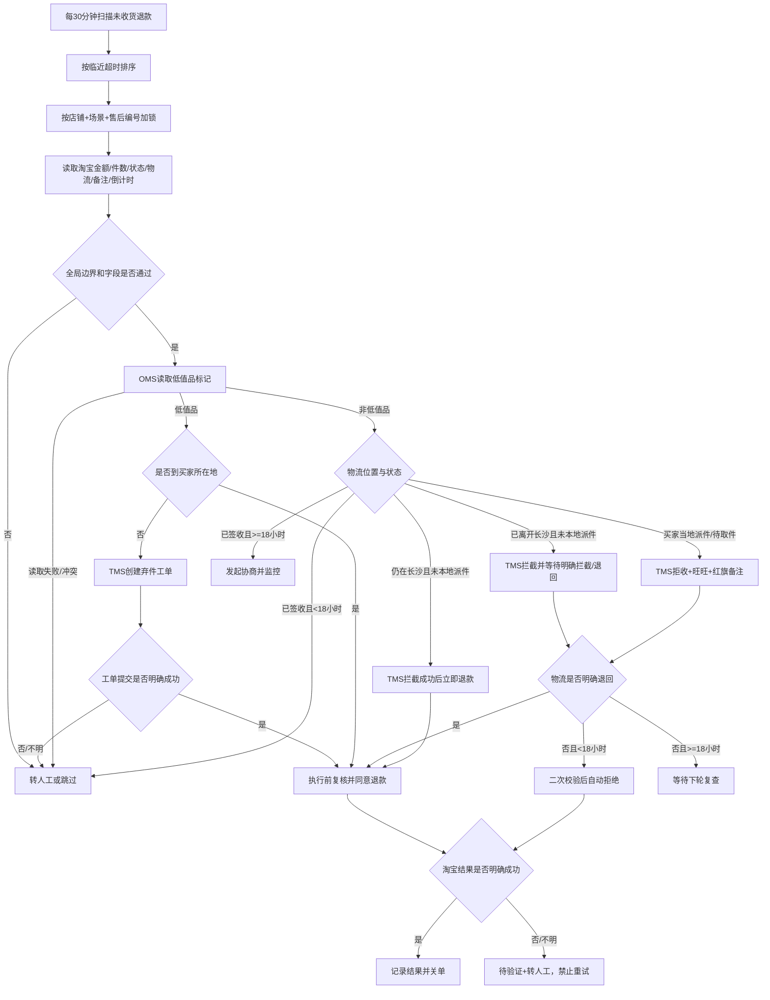

### 4.2 退货退款 Agent 流程

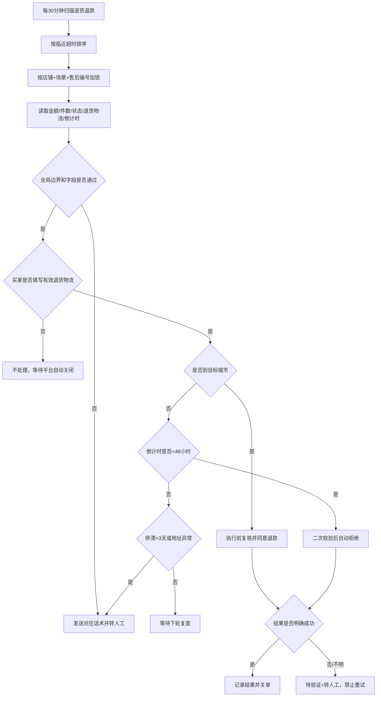

### 4.3 当前人工操作流程（SOP）

#### 4.3.1 未收货退款人工 SOP

**步骤 1：进入淘宝退款管理并筛选任务**

进入“淘宝商家后台 → 交易 → 退款管理 → 待处理售后 → 未收货退款”，按“临近超时排序”。

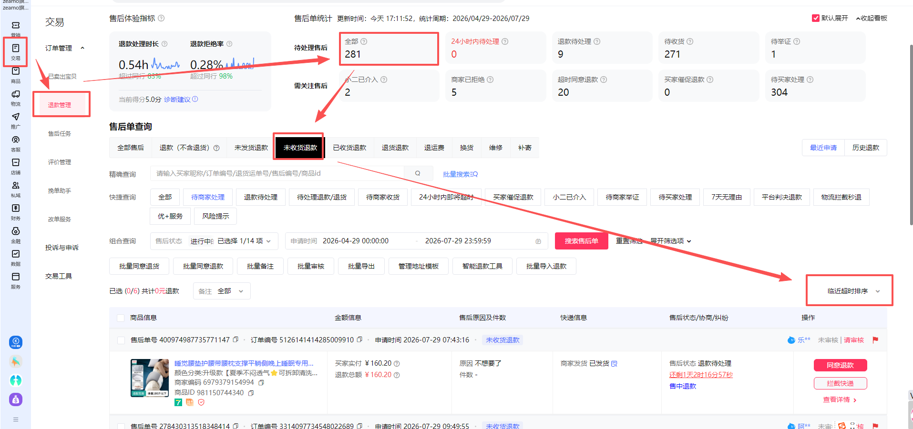

**步骤 2：打开退款详情并核验淘宝信息**

打开退款单，读取售后编号、订单号、金额、件数、售后状态、物流、平台倒计时和现有备注；确认是否已有拦截/拒收记录。

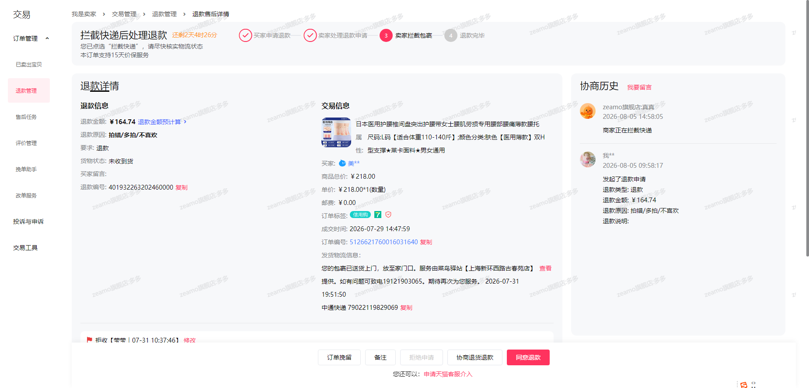

**步骤 3：在 OMS 核验低值品标记**

复制淘宝订单号进入“先马-巨益 OMS”，以订单现有“低值品”标记作为唯一依据；OMS 只负责低值品核验。

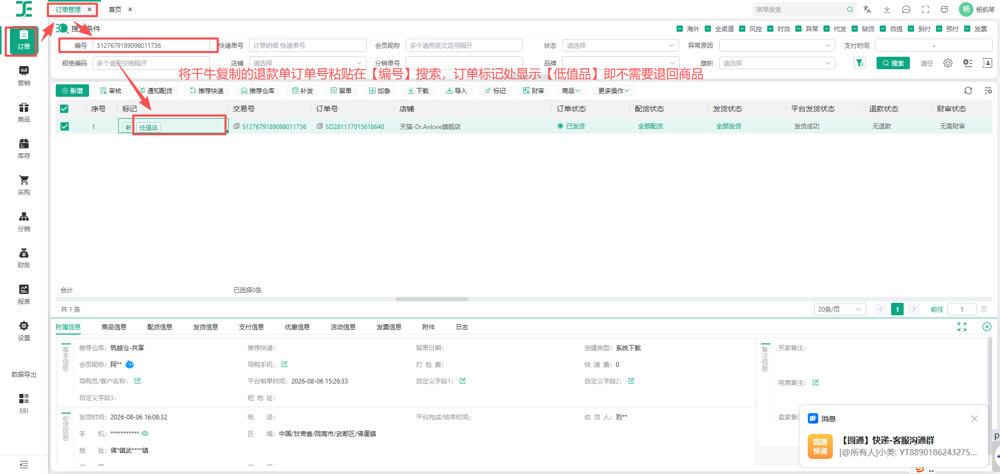

**步骤 4：进入 TMS 物流快递工单**

需要弃件、拦截或拒收时，进入“智能用户服务平台 → 智能工单管理 → 物流快递工单 → 客服登记”，点击“新建”。

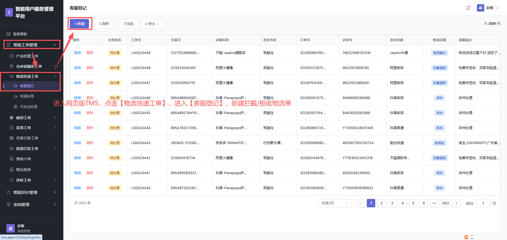

**步骤 5：填写 TMS 工单**

粘贴订单号拉取信息，根据物流状态选择弃件、拦截或拒收，填写必填信息和客服备注。OMS 与 TMS 不得混用。

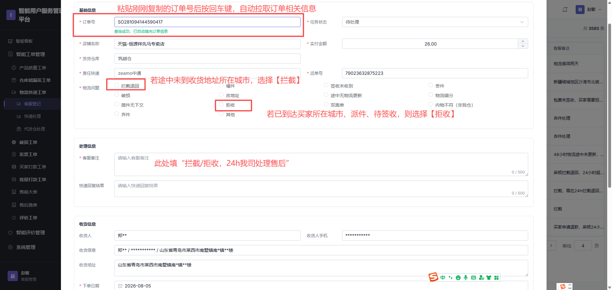

**步骤 6：上传订单价值凭证并提交**

上传淘宝订单价值截图，提交 TMS 工单；只有页面明确显示提交成功，才可进入后续退款判断。

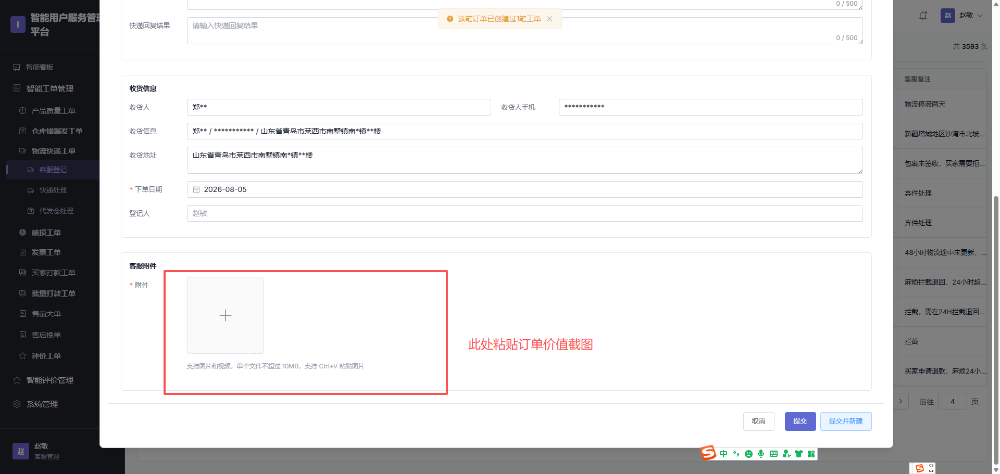

**步骤 7：返回淘宝留言、插旗并执行退款动作**

按场景发送旺旺话术、添加红旗备注；满足规则时同意退款，命中拒绝规则时拒绝，已签收协商场景进入“协商退货退款”。

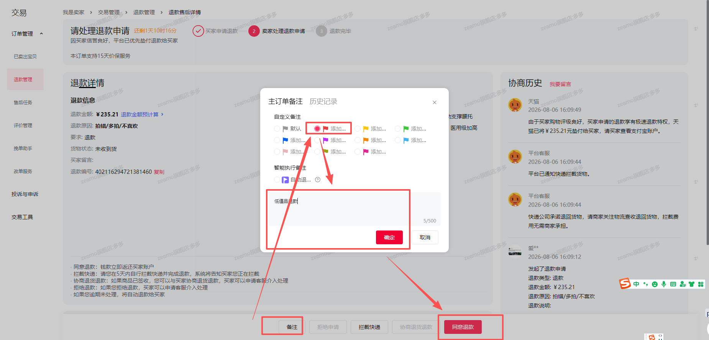

#### 4.3.2 退货退款人工 SOP

**步骤 1：进入退货退款列表**

进入“淘宝商家后台 → 交易 → 退款管理 → 待处理售后 → 退货退款”，按“临近超时排序”。

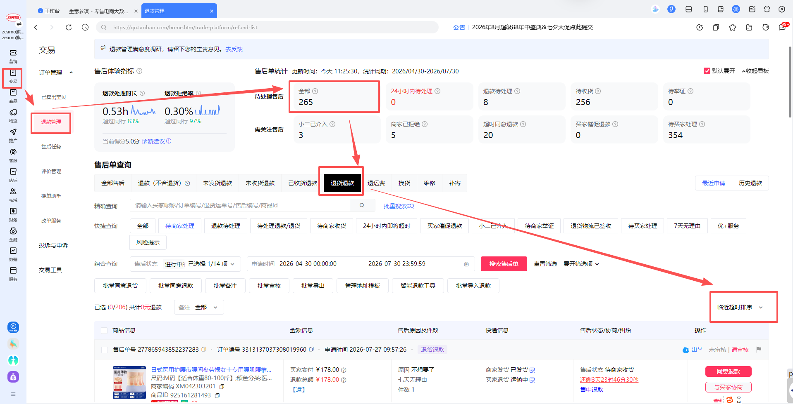

**步骤 2：核验退货物流是否到达目标城市**

打开退货单查看最新有效物流轨迹。普通店铺到达长沙、两家海外店铺到达义乌或金华即可同意退款，无需等待签收。

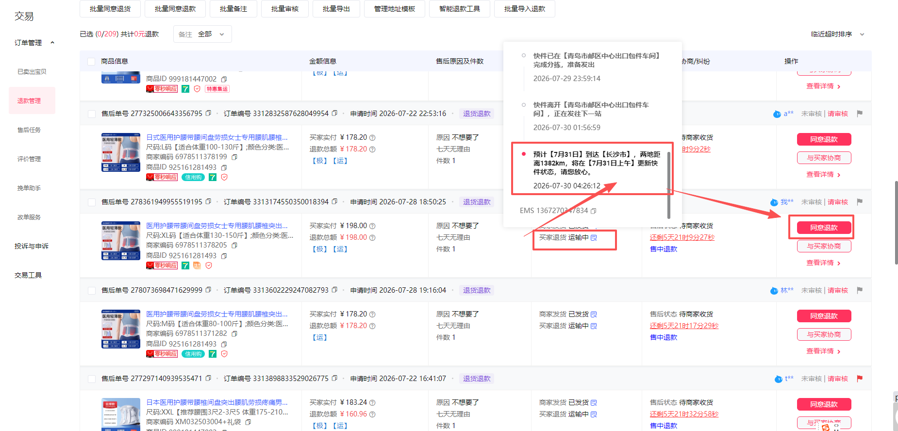

**步骤 3：确认同意退款**

重新核验金额、件数、物流和售后状态后，点击“同意退款”，在确认弹窗中完成退款。

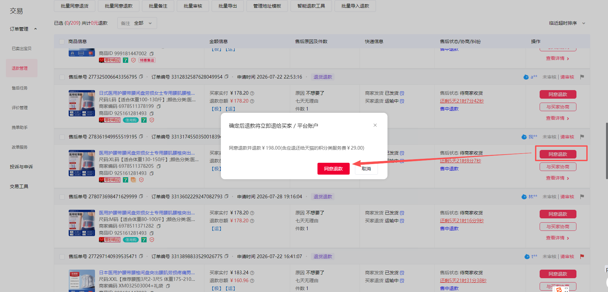

> 截图来源：《天猫退款流程_项目基线0807.xlsx》。以上 10 张图片使用业务 SOP 原始截图，仅限公司内部需求评审和开发使用，不得对外传播；截图只用于说明人工页面路径和关键操作位置，不覆盖第 3 章的最新业务规则。

---

## 5. 功能清单

```text
淘宝退款 Agent V1.0
├── P0 双场景接入
│   ├── 淘宝未收货退款
│   ├── 淘宝退货退款
│   ├── 店铺/场景独立白名单
│   └── 店铺/场景独立启停
├── P0 定时扫描
│   ├── 每30分钟扫描
│   ├── 临近超时优先
│   └── 售后唯一键去重与加锁
├── P0 字段与依赖读取
│   ├── 淘宝售后/订单/物流/备注/倒计时
│   ├── OMS低值品标记
│   └── TMS弃件/拦截/拒收工单
├── P0 确定性规则决策
│   ├── 金额/件数/同买家多单边界
│   ├── 未收货退款低值品/非低值品路径
│   ├── 18小时时效与退回判断
│   ├── 退货退款目标城市判断
│   └── 48小时拒绝优先规则
├── P0 真实操作执行
│   ├── 同意退款
│   ├── 拒绝退款
│   ├── 协商退货退款
│   ├── 旺旺消息与红旗备注
│   └── TMS快递工单
├── P0 安全与恢复
│   ├── 执行前复核
│   ├── 不可逆动作attempt_id
│   ├── 结果未知禁止重试
│   ├── 人工接管
│   └── 紧急暂停
├── P0 现有淘宝看板接入
│   ├── 两个独立场景统计
│   ├── 工单、日志、转人工和待验证
│   └── 场景/店铺健康状态
└── 非本期
    ├── 其他售后类型与平台
    ├── 新建独立看板
    ├── 模糊规则AI决策
    └── 影子模式
```

---

## 6. 现有淘宝看板改造要求

### 6.1 改造原则

- 复用开发已建设的淘宝看板，不新增另一套导航和页面框架。
- 接入“淘宝未收货退款”和“淘宝退货退款”两个独立业务场景。
- 两个场景分别统计、筛选、记录日志、转人工和启停。
- 未收货退款健康检查依赖淘宝、OMS、TMS 和钉钉；退货退款不依赖 OMS/TMS。
- 单一场景或单一店铺异常不得影响另一场景或其他店铺。

### 6.2 运营总览

至少展示：

- 工单总量；
- 纯自动完成量；
- 人工协助量；
- 自动同意退款量；
- 自动拒绝量；
- 协商/等待复查量；
- 异常中断量；
- 待验证量；
- 退款金额合计；
- 误退款/误拒绝数量。

### 6.3 工单、日志与转人工

- 支持按日期、店铺、业务场景、售后编号、订单号、状态和原因码筛选。
- 工单详情展示第 8 节字段、规则输入、命中结果、动作和证据。
- 运行日志记录扫描、加锁、读取、判断、TMS 操作、淘宝操作、结果核验、通知和关闭全过程。
- 转人工列表展示主原因、全部命中原因、风险等级、通知状态、接单状态和平台剩余时间。
- 待验证任务必须单独可查，禁止从普通“重试”入口重新执行不可逆动作。

### 6.4 关键页面线框图

```text
┌──────────────────────────────────────────────────────────────────────┐
│ 店铺筛选 | 日期筛选 | 业务场景 | 实时连接 | 刷新 | 场景/店铺启停      │
├──────────────────────────────────────────────────────────────────────┤
│ 工单总量 | 自动同意 | 自动拒绝 | 人工协助 | 等待复查 | 异常 | 待验证 │
├──────────────────────────────────────┬───────────────────────────────┤
│ 业务场景分布                         │ 处理结构                      │
│ 淘宝未收货退款                       │ 纯自动 / 人工 / 等待 / 异常   │
│ 淘宝退货退款                         │                               │
├──────────────────────────────────────┴───────────────────────────────┤
│ 店铺运行健康：按场景显示淘宝 / OMS / TMS / 钉钉依赖状态              │
└──────────────────────────────────────────────────────────────────────┘
```

---

## 7. 核心功能详细需求

### 7.1 任务扫描与排序

**触发方式**：系统全天运行，默认每 30 分钟触发一次；频率作为场景配置保留。

**扫描范围**：

- 首批仅扫描 3 家试运行店铺；后续按业务确认扩展。
- 未收货退款仅扫描 11 家非海外店铺范围内的待收货订单。
- 退货退款仅扫描 13 家店铺范围内、进入对应退款流程的任务。
- 按淘宝页面实时剩余时间从短到长处理。
- 店铺未启用、场景暂停或依赖不可用时，不进入不可逆操作。

**扫描结果**：

- 无任务：记录扫描完成，不创建空工单。
- 新任务：按唯一键创建或复用任务。
- 已存在未关闭任务：不重复创建。
- 已由人工、买家或平台完成：更新最终状态后关闭。
- 等待复查任务：按下一轮扫描重新读取物流和倒计时，不重复创建 TMS 工单或重复通知。

### 7.2 字段读取

Agent 必须读取并结构化保存：

- 店铺 ID、店铺名称、场景代码；
- 售后编号、订单号、同买家当前退款订单数；
- 售后类型、售后状态、订单状态；
- 本次退款金额、整单金额；
- 本次售后件数、整单总件数；
- 淘宝实时倒计时；
- 发货/退货物流单号、完整有效轨迹、最新节点、节点城市和更新时间；
- 订单备注、拦截/拒收/低值品旗标；
- OMS 低值品标记（仅未收货退款）；
- TMS 工单类型、编号、状态和结果（仅未收货退款）。

读取原则：

- 页面无展示、字段为空、多个值冲突或无法可靠解析时，不使用默认值。
- 物流状态以最新有效轨迹为准，不以页面文案猜测。
- 退货退款不访问 OMS/TMS；相关系统异常不得阻塞退货退款场景。
- 买家标识只用于同买家多单判断，普通日志不保存姓名、手机号或详细地址。

### 7.3 确定性规则判断

每次判断必须输出：

- 每条规则的输入值和来源；
- 每条规则通过/不通过/不可判定结果；
- 最终决策：自动同意、自动拒绝、协商、等待复查、转人工或跳过；
- 命中的标准原因码；
- 规则版本、判断时间和下一次允许动作。

同时命中多个原因时：

1. 先执行第 3.5 节优先级；
2. 退货退款按第 3.7.3 节处理 48 小时优先规则；
3. 转人工工单展示一个主原因并保留全部命中原因；
4. 同一任务只发送一条钉钉通知。

### 7.4 TMS 快递工单执行

适用于未收货退款的弃件、拦截和拒收：

1. 执行前确认场景、店铺、售后状态和订单备注未变化。
2. 已有同类型拦截/拒收备注或 TMS 工单时不得重复创建。
3. 生成唯一 `attempt_id`，先记录执行意图，再提交 TMS 工单。
4. 工单类型必须由第 3.6 节规则唯一确定。
5. 页面明确显示提交成功并可读取工单编号/状态，才视为成功。
6. 页面超时、断网或结果不明时，先查询 TMS 现有工单，不得直接再次提交。
7. 复查仍不明时进入待验证并转人工。

### 7.5 淘宝不可逆动作执行

适用于同意退款、拒绝退款和发起协商：

执行前必须重新读取：

- 店铺和场景开关；
- 售后编号和当前状态；
- 金额、件数及同买家多单结果；
- 最新物流、备注、OMS/TMS 结果和平台倒计时；
- 目标按钮是否存在且可用。

执行规则：

1. 持有任务锁并重新计算 G01-G10 和当前场景规则。
2. 任一条件变化时停止并按最新状态重分类。
3. 留存操作前页面快照、规则快照和场景开关状态。
4. 每个不可逆动作生成唯一 `attempt_id`，先落库`prepared`再点击。
5. 点击后立即记录`submitted`，不得等成功页面后才首次写入。
6. 页面明确显示成功或售后完结，记录相应完成状态。
7. 超时、断网、进程崩溃或结果未知时，恢复流程只能先查淘宝最终状态。
8. 存在`prepared/submitted/unknown`记录时不得新建同类执行尝试。
9. 复查仍不明确时进入`pending_verification`并转人工。

### 7.6 幂等、并发与状态变化

**任务唯一键**：`store_id + scene_code + aftersale_no`。

**操作唯一键**：`task_id + action_type + attempt_id`。

| 场景 | 处理方式 | 是否通知 |
|---|---|---:|
| 人工已完成售后 | 标记人工完成并关闭任务 | 否 |
| 买家撤销/平台关闭 | 记录最终状态并关闭 | 否 |
| 状态变化且尚未完成 | 停止并转人工 | 是 |
| 另一实例持锁 | 跳过本轮 | 否 |
| 已有待人工任务 | 只跟踪人工结果 | 否 |
| 已有 TMS 工单/备注 | 不重复建单，只查结果 | 否 |
| 已有不可逆执行记录但结果未知 | 只核验结果，禁止重试 | 是 |

### 7.7 人工兜底与任务生命周期

转人工后：

1. 自动化立即停止。
2. 任务状态改为“待人工处理”。
3. 先持久化人工工单，再发送钉钉通知。
4. 同一任务只通知一次；发送失败不得创建第二个人工工单。
5. Agent 后续只检查人工或平台是否已完成，不再自动执行不可逆动作。
6. 发现人工处理完成后关闭任务并记录人工结论。
7. 只有授权人员按证据重置普通人工任务，才允许重新判断。
8. 待验证任务必须先核验平台状态，不得直接重置。

人工接单与处理 SLA 当前待业务确认；未确认前看板必须持续展示未接单任务和实时平台剩余时间，不得伪造超时升级规则。

### 7.8 场景开关与紧急暂停

- 支持全局场景开关、单场景开关和单店场景开关。
- 关闭开关后不得创建新的不可逆执行任务。
- 执行中任务在下一不可逆动作前必须再次检查开关。
- 出现误退款、误拒绝、重复提交、平台风控、页面规则失效、结果未知或证据缺失时，可立即暂停受影响店铺/场景。
- 暂停未收货退款不得影响退货退款，反之亦然。
- 暂停后已有人工任务继续保留并可闭环。

### 7.9 业务话术与备注

文案风格：简洁、明确、礼貌；只发送业务确认的固定模板，不允许模型自由生成。

| 场景 | 固定模板/规则 |
|---|---|
| 拦截/拒收提醒 | 亲亲，看到您的退款申请了，我们已通知快递退回，万一快递还是送到并通知亲的话，麻烦您拒收一下哟，感谢亲的理解跟配合/:086 |
| 已签收协商 | 亲亲，您的物流显示已签收，若要退款请修改退款类型为【退货退款】，原因选择与商家协商一致；若确实未收到货，请您联系店铺人工客服处理哦 |
| 未收货退款拒绝 | 亲亲，商品退回后才可退款哦，目前您的订单物流未拦截成功，小店暂时拒绝您的退款，后续退回后您重新申请一下就行哟 |
| 退货物流停滞 | 亲亲，您的退货单号已经停滞几天无物流更新了，还麻烦您核对下快递单号是否正确，或与寄出的快递员联系了解下物流什么情况，以免耽误您的退款进度，感谢亲的理解跟配合/:086 |
| 退货地址异常 | 亲亲，您上传的退货快递单号显示在其他地址签收，我们的退货仓在湖南长沙哦，辛苦您尽快核对下快递单号是否填错了，避免耽误您的退货申请，核对后可联系店铺人工客服提供正确退回单号哦 |
| 退货退款拒绝 | 亲亲，商品退回后才可退款哦，目前您的退货物流存在异常，小店未收到您退回的产品，退款即将超时暂时拒绝您的申请，后续找到正确单号了您重新申请一下或者联系人工客服处理哦 |

备注模板：

- 拦截：`拦截-{子账号简称}-{日期}`。
- 拒收：`拒收-{子账号简称}-{日期}`。
- 低值品：名称待业务在“低值品处理/低值品退款”中统一。

---

## 8. 数据规范

### 8.1 核心字段

| 字段 | 类型 | 必填 | 来源 | 说明/校验 |
|---|---|---:|---|---|
| scene_code | string | 是 | 系统配置 | 未收货退款/退货退款内部代码，待技术确认 |
| store_id | string | 是 | 店铺配置/淘宝 | 参与任务唯一键 |
| store_name | string | 是 | 店铺配置/淘宝 | 看板和通知展示 |
| aftersale_no | string | 是 | 淘宝 | 售后编号，参与任务唯一键 |
| order_no | string | 是 | 淘宝 | OMS/TMS 查询依据，不作为任务唯一键 |
| buyer_key | string/hash | 条件必填 | 淘宝/系统 | 仅用于同买家多单判断，不保存明文身份信息 |
| buyer_active_refund_count | integer | 是 | 淘宝/系统计算 | `>3`全部转人工 |
| aftersale_type | enum | 是 | 淘宝 | unreceived/return_refund |
| aftersale_status | string | 是 | 淘宝 | 保存判断前、执行前、执行后状态 |
| order_status | string | 是 | 淘宝 | 场景适用状态校验 |
| refund_amount | decimal | 是 | 淘宝 | 本次申请金额，`0<金额<500` |
| order_total_amount | decimal | 是 | 淘宝 | 整单金额，`0<金额<500` |
| aftersale_quantity | integer | 是 | 淘宝 | 本次售后件数，正整数且`≤10` |
| order_total_quantity | integer | 是 | 淘宝 | 整单总件数，正整数且`≤10` |
| remaining_seconds | integer | 是 | 淘宝/系统换算 | 以页面实时倒计时为准 |
| logistics_no | string | 条件必填 | 淘宝 | 当前场景对应物流单号 |
| logistics_trace | json/text | 条件必填 | 淘宝 | 保存用于判断的有效轨迹 |
| latest_logistics_time | datetime | 条件必填 | 淘宝 | 最新有效物流节点时间 |
| current_logistics_city | string | 条件必填 | 淘宝/规则引擎 | 长沙、买家所在地、义乌、金华等 |
| logistics_status | enum/string | 条件必填 | 淘宝 | 在途、派件、待取件、签收、退回等 |
| target_city_reached | boolean | 条件必填 | 规则引擎 | 退货退款目标城市判断 |
| logistics_stale_hours | decimal | 条件必填 | 系统计算 | 退货退款判断是否超过3天无更新 |
| existing_order_remark | string/boolean | 条件必填 | 淘宝 | 判断是否已有拦截/拒收备注 |
| oms_low_value_flag | boolean/null | 条件必填 | OMS | 未收货退款必填；null/冲突转人工 |
| tms_ticket_type | enum | 条件必填 | 规则引擎/TMS | discard/intercept/refuse |
| tms_ticket_id | string | 条件必填 | TMS | 工单提交成功后保存 |
| tms_ticket_status | string | 条件必填 | TMS | submitted/confirmed/unknown 等 |
| decision | enum | 是 | 规则引擎 | approve/reject/negotiate/wait/manual/skip |
| reason_codes | array | 是 | 规则引擎 | 支持多个原因码 |
| rule_version | string | 是 | 系统配置 | 便于追溯 |
| task_status | enum | 是 | 工单系统 | 见第 9 节 |
| execution_phase | enum | 是 | Agent | not_started/prepared/submitted/confirmed/unknown |
| attempt_id | string | 条件必填 | Agent | 每个不可逆动作的唯一标识 |
| handoff_status | enum | 是 | 工单系统 | none/pending/accepted/closed |
| manual_outcome | enum | 条件必填 | 人工处理 | approved/rejected/negotiated/buyer_cancelled/other |
| pre_action_snapshot | attachment | 条件必填 | Agent | 操作前最小必要页面证据 |
| result_snapshot | attachment | 条件必填 | Agent | 成功、失败或结果未知证据 |
| ding_status | enum | 条件必填 | 钉钉 | not_sent/sent/failed |
| created_at | datetime | 是 | 系统 | 任务创建时间 |
| updated_at | datetime | 是 | 系统 | 最后更新时间 |

### 8.2 数据最小化

- 普通日志不得保存买家姓名、手机号、详细地址和无关聊天原文。
- 截图只保留判断和操作所需最小区域；敏感区域必须裁剪或脱敏。
- 账号、密码、Cookie、Token、钉钉密钥不得写入工单、日志、截图说明或 PRD。
- 钉钉消息只发送至公司批准的内部群，不包含地址、手机号和无关商品信息。
- 日志、截图、导出文件必须使用公司内部存储、访问控制、传输加密和下载审计能力。
- 数据保留期限和到期删除策略待技术确认；若现有系统无明确策略，视为真实上线阻塞项。

---

## 9. 状态与看板映射

主任务状态、人工接管状态、钉钉通知状态和不可逆执行阶段必须分轴保存。

| 任务状态 | 触发条件 | 看板归类 | 后续动作 |
|---|---|---|---|
| discovered | 扫描发现新售后 | 等待中 | 加锁并读取字段 |
| processing | 正在读取、判断或执行 | 处理中 | 禁止重复处理 |
| waiting_recheck | 等待物流、倒计时或协商结果 | 等待复查 | 下轮只重新读取必要字段 |
| auto_approved | 淘宝明确显示同意退款成功/售后完结 | 自动同意 | 关闭任务 |
| auto_rejected | 淘宝明确显示拒绝成功 | 自动拒绝 | 关闭或按平台状态跟踪 |
| negotiating | 已发起协商，等待买家或人工结果 | 协商中 | 继续监控，不重复发起 |
| platform_closed | 平台自动关闭/自动退款 | 平台完结 | 记录后关闭 |
| manual_pending | 已创建人工工单 | 人工协助/等待中 | 只跟踪人工结果 |
| manual_closed | 人工处理完成 | 人工协助完成 | 保存人工结论 |
| paused | 店铺或场景停用 | 已暂停 | 禁止新不可逆动作 |
| interrupted | 登录、页面或依赖异常 | 异常中断 | 告警、恢复或转人工 |
| pending_verification | 动作结果不明确 | 待验证 | 禁止重试，人工核验 |
| skipped | 不在范围、重复、已撤销或已完成 | 跳过 | 记录原因并关闭 |

状态规则：

- `pending_verification`可同时存在`handoff_status=pending/accepted`。
- `ding_status`独立记录，不改变业务决策。
- 只有平台结果明确或人工完成核验后，待验证任务才允许关闭。
- 未经人工介入且结果正确的任务记为`pure_auto`；进入人工接管后完成的任务记为`manual_assisted`，两者互斥。
- 等待复查不是影子模式，任务已在真实生产流程中运行。

---

## 10. 转人工规则

### 10.1 风险分级与原因码

| 风险 | 原因码 | 工单问题 | 触发条件 |
|---|---|---|---|
| 高 | REFUND_AMOUNT_LIMIT | 退款金额超限 | 本次或整单金额`≥500元` |
| 高 | QUANTITY_LIMIT | 件数超限 | 本次或整单件数`>10件` |
| 高 | BUYER_MULTIPLE_REFUNDS | 同买家多单 | 当前同时退款订单`>3个` |
| 高 | SIGNED_LT_18H | 已签收临期 | 非低值品已签收且倒计时`<18小时` |
| 高 | RETURN_LOGISTICS_STALE | 退货物流停滞 | 尚未进入`<48小时`且超过3天无更新 |
| 高 | RETURN_ADDRESS_MISMATCH | 退货地址异常 | 尚未进入`<48小时`且签收地与退货地址不一致 |
| 高 | EXECUTION_RESULT_UNKNOWN | 操作结果未知 | 淘宝/TMS点击后无法确认结果 |
| 高 | AFTERSALE_STATUS_CHANGED | 售后状态变化 | 执行前状态变化且尚未完结 |
| 中 | REQUIRED_FIELD_MISSING | 必要字段缺失 | 金额、件数、物流、倒计时等为空 |
| 中 | FIELD_PARSE_FAILED | 字段识别失败 | 字段存在但无法可靠解析 |
| 中 | LOGISTICS_UNCLEAR | 物流无法判断 | 多单号、轨迹冲突、城市/状态不明 |
| 中 | OMS_RESULT_UNKNOWN | OMS结果不明 | 低值品标记缺失或冲突 |
| 中 | TMS_OPERATION_ERROR | TMS操作异常 | 工单创建失败或结果未知 |
| 中 | PLATFORM_PAGE_ERROR | 淘宝页面异常 | 页面改版、按钮缺失、加载/平台报错 |
| 中 | LOGIN_STATE_ERROR | 登录/权限异常 | 登录失效、验证码、风控或权限不足 |
| 中 | FUNDING_ERROR | 资金异常 | 退款额度不足、支付宝代扣协议等提示 |
| 中 | DINGTALK_SEND_FAILED | 钉钉发送失败 | 转人工通知最终失败 |

### 10.2 钉钉通知配置

- 通知群：以群号为唯一投递标识，群名称以钉钉实际显示为准。
- 群号：`193120000457`。
- @人员：固定逐一 @9 位指定人员，不使用“@所有人”：狄云、青顾、行云、今夏、婉安、子宁、霜寒、听竹、梨花。
- 成员手机号映射按业务 2026-08-14 提供的受控配置维护，不在 PRD、HTML、普通配置或日志中明文展示。
- 人工处理 SLA：待业务确认。
- 群与 @人员必须使用配置，不得在业务代码中硬编码。

**标题**：`淘宝退款工单转人工`

```text
淘宝退款工单转人工
自动化流程已停止，请人工核查并继续处理。

工单信息
• 业务场景：{scene_name}
• 店铺：{store_name}
• 工单问题：{issue_type}
• 售后编号：{aftersale_no}
• 订单号：{order_no}
• 物流单号：{logistics_no_or_dash}
• 平台剩余时间：{remaining_time}

转人工说明
• 转人工原因：{handoff_reason}
• 风险等级：{risk_level_cn}

{configured_mentions}
```

通知规则：

- 先创建人工工单，再发送钉钉。
- 同时命中多个原因时合并成一条消息。
- 结果未知必须明确提示“先核查平台状态，禁止直接再次操作”。
- 发送成功后保存返回标识，避免重复发送。
- 发送失败使用同一消息幂等标识重试；重试次数和退避间隔待技术确认。
- 最终失败时保留人工工单并在看板高优先级告警，不调用未批准的外部渠道。

---

## 11. 异常与恢复策略

| 异常场景 | 自动处理 | 最终状态/人工动作 |
|---|---|---|
| 淘宝登录失效、验证码或账号风控 | 停止受影响店铺新任务 | 店铺异常告警；人工恢复后继续扫描 |
| 页面改版或关键按钮缺失 | 禁止猜测坐标继续点击 | 转人工并暂停受影响场景 |
| OMS低值品标记无法读取 | 不推断低值品 | 未收货退款转人工；不影响退货退款 |
| TMS不可用/工单结果未知 | 不重复建单 | 未收货退款转人工或待验证；不影响退货退款 |
| 必要字段为空/冲突 | 不使用默认值 | 转人工 |
| 物流单号或轨迹异常 | 不做城市/状态判断 | 转人工 |
| 执行前状态变化 | 重新分类 | 已完结则跳过，否则转人工 |
| 点击淘宝动作后网络超时 | 重新查询售后状态 | 成功则闭环；不明则待验证并转人工 |
| 同一任务重复触发 | 唯一键和锁拦截 | 跳过，不重复通知 |
| 钉钉发送失败 | 人工工单先落库，幂等重试 | 最终失败后看板告警 |
| 场景紧急暂停 | 在下一不可逆动作前停止 | 已有人工任务继续处理 |

禁止事项：

- 禁止在结果未知时重复点击同意退款、拒绝退款或重新创建 TMS 工单。
- 禁止缺失金额、件数、物流、倒计时或关键状态仍自动处理。
- 禁止把 OMS 当作 TMS 或把 TMS 当作 OMS。
- 禁止将两场景的依赖故障互相扩散。
- 禁止将真实订单、买家或系统数据上传到未批准的外部 AI/第三方服务。

---

## 12. 权限与安全

1. 首批只允许 3 家试运行店铺启用真实操作权限。
2. 场景开关、店铺白名单、任务重置和恢复操作必须受角色权限控制。
3. 退款账号、OMS/TMS 账号、Cookie、Token 和钉钉密钥不得明文记录。
4. 每次真实操作必须追溯到店铺、场景、售后编号、规则版本、执行实例和时间。
5. 操作前、结果和异常页面均需留存最小必要证据。
6. 人工重置或恢复必须记录操作人、时间、原因和核验证据。
7. 页面或规则变化时先暂停，再评估，禁止继续真实操作。

### 12.1 权限矩阵

| 操作 | 客服人员 | 客服负责人 | 运营人员 | 系统管理员 | 审计要求 |
|---|---:|---:|---:|---:|---|
| 查看普通工单和结果 | 是 | 是 | 是 | 是 | 访问日志 |
| 查看含敏感信息证据 | 否 | 是 | 否 | 是 | 默认拒绝、访问审计 |
| 处理人工工单 | 是 | 是 | 否 | 否 | 处理人、时间、结论 |
| 修改店铺白名单 | 否 | 确认 | 否 | 执行 | 变更前后值和确认依据 |
| 启用真实操作 | 否 | 确认 | 否 | 执行 | 记录确认人与时间 |
| 紧急暂停 | 否 | 是 | 是 | 是 | 暂停人、时间、原因 |
| 暂停后恢复 | 否 | 确认 | 否 | 执行 | 恢复依据和确认人 |
| 重置普通人工任务 | 否 | 是 | 否 | 是 | 重置原因和时间 |
| 恢复待验证任务 | 否 | 核验/确认 | 否 | 执行 | 必须先查平台并上传证据 |
| 修改规则阈值 | 否 | 确认 | 否 | 执行 | 需求变更和规则版本 |

### 12.2 AI 风险接受

业务已明确首批 3 家店铺不运行影子模式，直接执行真实退款、拒绝退款及 TMS 快递工单。上线前必须形成可审计的风险接受记录，至少包含：

- 试运行店铺和两个场景范围；
- 已知风险：误退款、误拒绝、重复操作、漏处理、物流延迟、页面变化、人工并发、账号风控和结果未知；
- 已具备控制：确定性规则、执行前复核、幂等、证据、人工兜底和紧急暂停；
- 业务确认角色、日期和审批/会议证据位置。

AI/自动化无法保证 100% 准确。上述控制只能降低风险，不能完全消除风险。

---

## 13. 非功能性需求

### 13.1 可靠性

- 同一售后重复退款、重复拒绝、重复协商或重复 TMS 建单数必须为 0。
- 结果未知时不得自动重试不可逆操作。
- 同一人工任务不得重复发钉钉消息。
- 任一必要依赖不可用时，相关场景必须安全停止，不得继续猜测。

### 13.2 可观测性

- 每轮扫描记录开始/结束时间、店铺、场景、发现数和处理结果。
- 每个任务记录完整状态流转、规则输入、命中结果、动作和证据。
- 看板可按两个场景独立查看工单、自动同意、自动拒绝、人工、等待、异常和待验证。
- 支持按日期、店铺、场景、售后编号、订单号、状态和原因码检索。

### 13.3 性能与调度

- 默认每 30 分钟扫描一次，全天运行。
- 单轮扫描应在下一周期前完成；未完成时不得并发启动相同店铺/场景的重复扫描。
- 实际并发、单轮超时和重试策略由技术评审按现有系统容量确定。

### 13.4 兼容性

- 复用现有淘宝 Agent/看板支持的运行环境和浏览器版本。
- 淘宝、OMS、TMS 页面结构变化必须可监控和告警。
- 只接入公司现有依赖，不新增未经批准的第三方服务。

---

## 14. 验收标准

### 14.1 未收货退款业务用例

除指定变量外，假设店铺/场景启用、字段完整、状态可处理且不存在并发。

| 用例 | 场景 | 期望结果 |
|---|---|---|
| U01 | 本次与整单金额均为499.99元，件数均为10件 | 继续业务规则判断 |
| U02 | 本次金额或整单金额任一为500.00元 | 转人工：金额超限 |
| U03 | 本次或整单件数11件 | 转人工：件数超限 |
| U04 | 同买家当前3个退款订单 | 继续业务规则判断 |
| U05 | 同买家当前4个退款订单 | 该买家当前退款订单全部转人工 |
| U06 | 低值品、未到买家所在地、TMS弃件成功 | 立即同意退款 |
| U07 | 低值品、已到买家所在地或已签收 | 不建TMS工单，直接同意退款 |
| U08 | OMS低值品标记无法确认 | 转人工，不按金额猜测 |
| U09 | 非低值品、未在买家当地派件、物流仍在长沙、TMS拦截成功 | 插旗后立即同意退款 |
| U10 | 非低值品、已离开长沙、TMS已拦截但无明确记录 | 等待复查，不退款 |
| U11 | U10后物流出现明确拦截/退回记录 | 同意退款 |
| U12 | 非低值品、买家当地派件/待取件 | TMS拒收+旺旺+备注，等待退回 |
| U13 | 已发起拦截/拒收、无退回记录、倒计时17小时59分 | 二次校验后自动拒绝 |
| U14 | 非低值品已签收、倒计时18小时 | 发起协商并监控 |
| U15 | 非低值品已签收、倒计时17小时59分 | 转人工 |
| U16 | 已有拦截/拒收备注 | 不重复建TMS工单，只跟踪物流 |
| U17 | 平台倒计时归零并已自动退款 | 记录平台完结，禁止重复操作 |

### 14.2 退货退款业务用例

| 用例 | 场景 | 期望结果 |
|---|---|---|
| R01 | 买家未填写退货物流 | 不处理、不拒绝，等待平台关闭 |
| R02 | 普通店铺物流到达长沙但未签收 | 同意退款 |
| R03 | zeamo海外旗舰店物流到达义乌 | 同意退款 |
| R04 | dranlove海外旗舰店物流到达金华 | 同意退款 |
| R05 | 已填有效物流、未到目标城市、倒计时47小时59分 | 二次校验后自动拒绝 |
| R06 | 未到目标城市、物流超过3天无更新、倒计时48小时及以上 | 发送停滞话术并转人工 |
| R07 | 未到目标城市、地址不一致、倒计时48小时及以上 | 发送地址异常话术并转人工 |
| R08 | 同时命中物流停滞和倒计时47小时59分 | 48小时规则优先，自动拒绝 |
| R09 | 已到目标城市且倒计时47小时59分 | 到达规则优先，同意退款 |
| R10 | 物流单号或轨迹无法可靠读取 | 转人工 |
| R11 | 仍处于同意退货/品退原因审核阶段 | 不进入本期自动处理，转人工/跳过 |
| R12 | 本次或整单金额/件数超限 | 转人工 |

### 14.3 幂等与异常用例

| 用例 | 场景 | 期望结果 |
|---|---|---|
| B01 | 同一任务被两个实例发现 | 仅一个实例获得执行权 |
| B02 | 人工已完成 | Agent跳过，不重复通知/操作 |
| B03 | 点击前售后状态变化 | 重新分类；未完结则转人工 |
| B04 | 淘宝点击后超时，复查已完结 | 记录成功，不再次点击 |
| B05 | 淘宝点击后超时，复查仍不明 | 待验证+转人工，禁止重试 |
| B06 | TMS提交后超时，查询到已有工单 | 复用工单，不再次创建 |
| B07 | TMS提交后结果仍不明 | 待验证+转人工 |
| B08 | 已转人工任务被下轮扫描发现 | 不重复判断和通知 |
| B09 | 钉钉首次发送超时 | 同一消息幂等重试，不创建第二人工工单 |
| B10 | OMS/TMS异常但退货退款场景正常 | 退货退款继续运行 |
| B11 | 单店未收货退款开关关闭 | 只停止该店该场景 |
| B12 | 首次判断后跨过18/48小时边界 | 点击前按最新倒计时重算 |
| B13 | 存在prepared/submitted/unknown记录 | 只核验结果，不创建新尝试 |
| B14 | 待验证任务直接重置 | 系统拒绝，要求平台核验证据 |
| B15 | 页面关键按钮定位失败 | 停止并告警，不猜测点击 |

### 14.4 看板验收

- 可独立筛选“淘宝未收货退款”和“淘宝退货退款”。
- 两个场景的工单、日志、人工、等待、异常、待验证和启停互相独立。
- 首批 3 家店铺可分别启停两个场景。
- 未收货退款展示淘宝/OMS/TMS/钉钉健康；退货退款不检查 OMS/TMS。
- 待验证只统计真实操作结果不明确的任务。

### 14.5 上线验收门槛

1. 本文 P0 功能全部完成并通过测试。
2. U01-U17、R01-R12、B01-B15 全部通过。
3. 首批 3 家店铺 ID、账号权限和两个场景开关配置完成。
4. 淘宝、OMS、TMS、钉钉和现有看板联调通过。
5. 唯一键、执行前复核、结果未知禁止重试和紧急暂停可用。
6. 钉钉群、@人员、人工 SLA 和值班安排验证通过。
7. 真实操作日志、规则快照和证据可查询。
8. 数据访问、脱敏、保留和删除策略验证通过。
9. AI 风险接受记录、金额核对责任和误操作处理路径已归档。

---

## 15. 上线与运营

### 15.1 上线方式

- 首批 3 家店铺同时开启两个场景。
- 上线即执行真实退款、拒绝、协商和 TMS 快递工单。
- 不运行影子模式。
- 后续扩展至其他已确认店铺的门槛、顺序和时间由业务另行确认。
- 每个店铺、每个场景必须可独立暂停和恢复。

### 15.2 紧急停止条件

出现以下任一情况时立即暂停受影响店铺/场景：

- 发现误退款或误拒绝；
- 发现重复退款、重复拒绝或重复 TMS 建单；
- 淘宝/OMS/TMS 触发账号或自动化风控；
- 页面变化导致字段或按钮无法可靠识别；
- 产生不可逆操作结果未知任务；
- 日志或证据缺失，无法追溯；

恢复前必须完成影响核查、问题修复和验证，由系统管理员执行、客服负责人确认，并记录恢复证据。

### 15.3 运营指标

| 指标 | 口径 |
|---|---|
| 工单总量 | 日期区间内两个场景创建的唯一任务数 |
| 纯自动完成量 | `completion_mode=pure_auto`的唯一任务数 |
| 人工协助完成量 | `completion_mode=manual_assisted`的唯一任务数 |
| 自动同意量 | `task_status=auto_approved`的唯一任务数 |
| 自动拒绝量 | `task_status=auto_rejected`的唯一任务数 |
| 等待复查量 | 当前`waiting_recheck`任务数 |
| 人工协助量 | `handoff_status`不为none的唯一任务数 |
| 异常中断量 | 当前或最终进入`interrupted`的任务数 |
| 待验证量 | 当前`pending_verification`任务数 |
| 重复操作拦截量 | 唯一键/锁/执行记录拦截次数，不计入工单总量 |
| 平均处理时长 | 任务创建至自动完结或人工关闭的平均时长 |
| 钉钉送达率 | 通知成功人工工单数 / 需通知人工工单数 |
| 人工接单时长 | 钉钉发送成功至人工接单的时长 |
| 自动退款金额 | 自动同意成功任务的退款金额合计 |
| 误退款/误拒绝数 | 经人工确认的错误自动操作数 |
| 超时率 | 超过平台截止时间仍未闭环任务数 / 工单总量 |
| 依赖可用性 | 分别统计淘宝、OMS、TMS、钉钉的成功检查比例 |

### 15.4 金额核对与误操作闭环

- 上线首周金额核对频率和责任角色待业务确认；建议至少每日核对一次，但未确认前不作为现行业务规则。
- 核对范围至少包含店铺、售后编号、订单号、`attempt_id`、申请金额、平台状态和操作时间。
- 发现状态或金额差异时暂停受影响店铺/场景并创建高风险事件。
- 确认误退款/误拒绝后保留完整证据，按公司现有客服追偿、平台申诉或内部损失流程处理；现有流程不存在时，业务必须在上线前补充。

---

## 16. 依赖与待提供项

### 16.1 待业务提供

- 13 家店铺的准确店铺 ID；首批 3 家 ID 优先。
- 低值品红旗备注最终名称：“低值品处理”或“低值品退款”。
- 人工工单接单 SLA、处理 SLA、超时升级和责任角色。
- 上线值班安排，以及钉钉最终发送失败时负责看板告警的角色。
- 后续铺开门槛、店铺顺序、时间和暂停/恢复审批人。
- 上线首周金额核对责任角色与频率。
- 误退款、误拒绝、平台申诉和内部损失处理路径。
- 首批 3 店直接真实操作的独立风险接受记录及证据位置。

### 16.2 待技术确认

- 现有淘宝 Agent/看板的代码仓库、部署环境和场景接入位置。
- 两个业务场景内部代码和状态映射。
- 淘宝售后列表、详情、物流、倒计时、备注及按钮的稳定定位方式。
- OMS 低值品标记读取方式、失败状态和访问权限。
- TMS 弃件/拦截/拒收工单的页面/API、结果状态和查询方式。
- 任务锁、操作幂等、`attempt_id`、任务恢复和人工并发处理实现。
- 钉钉消息幂等、重试、告警及配置管理。
- 截图、日志的访问权限、脱敏、加密、下载审计、保留期限和到期删除。
- 单轮扫描并发、超时、跨周期防重和依赖健康检查策略。
- 场景开关关闭时对执行中任务的安全停止实现。

以上待确认项不得改变已确认的店铺、金额、件数、物流、18/48 小时时效、OMS/TMS 边界、直接真实操作和人工兜底规则。实现需要扩大范围或改变规则时，必须重新发起业务确认。
