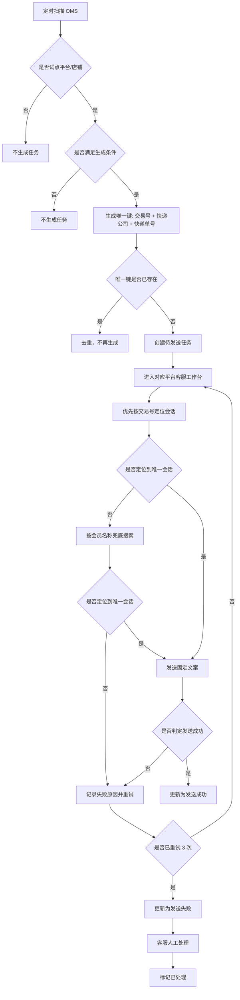

# 自动发送补发通知 Agent 开发 PRD

## 1. 文档信息

| 项目 | 内容 |
| --- | --- |
| 需求名称 | 自动发送补发通知 Agent |
| 文档类型 | 开发需求文档 |
| 版本 | V1.0 |
| 参考输入 | [7.5_自动发送补发通知_业务PRD.md](./7.5_%E8%87%AA%E5%8A%A8%E5%8F%91%E9%80%81%E8%A1%A5%E5%8F%91%E9%80%9A%E7%9F%A5_%E4%B8%9A%E5%8A%A1PRD.md)；[补发通知Agent页面原型.html](./%E8%A1%A5%E5%8F%91%E9%80%9A%E7%9F%A5Agent%E9%A1%B5%E9%9D%A2%E5%8E%9F%E5%9E%8B.html) |
| 适用范围 | 内部客服管理后台 + Agent 自动发送服务 |
| 目标平台 | 拼多多、淘宝/天猫、京东试点店铺 |

## 2. 产品概述

本需求建设一个“补发通知 Agent”，自动识别 OMS 中新增的补发订单或补发物流信息，按唯一键去重后，进入平台客服工作台自动发送固定补发通知文案；同时在内部管理后台提供任务列表、筛选、详情、失败处理和已处理标记能力。

本期只做试点平台和试点店铺，不做 OMS 改造，不做统一客服消息系统，不做客服会话历史校验。

## 3. 目标与边界

### 3.1 目标

1. 自动生成补发通知任务。
2. 自动发送补发物流通知。
3. 记录发送结果、失败原因、重试次数。
4. 通过管理页面支持客服处理失败任务。
5. 保证同一 `交易号 + 快递公司 + 快递单号` 仅发送一次。

### 3.2 不做

1. 不处理 Agent 上线前历史补发订单。
2. 不支持文案编辑。
3. 不读取客服会话历史。
4. 不判断客户是否已读或最终触达。
5. 不做页面角色权限控制。

## 4. 目标用户与场景

### 4.1 目标用户

1. 客服/售后运营：查看失败任务、人工处理、标记已处理。
2. 业务管理员：查看整体任务量、成功率、失败原因分布。

### 4.2 典型场景

1. OMS 出现红色“补”标签且补发物流已生成，系统自动生成任务并自动发送。
2. 平台账号未登录，任务重试后仍失败，客服在后台查看详情并人工补发。
3. 同一交易号后续出现新的补发单号，系统生成新任务，但不会重复处理旧单号。

## 5. 核心流程



## 6. 功能需求

### 6.1 任务生成与发送

#### 6.1.1 扫描规则

1. Agent 按配置频率扫描 OMS，默认频率为每 10 分钟一次。
2. 扫描时间为北京时间 08:00-24:00。
3. 00:00-08:00 不生成任务、不发送消息。
4. 仅做增量扫描，不做全量历史重扫。
5. 24:00 后不再开始新的发送任务；若 24:00 前已开始执行的发送动作，可完成当前动作。

#### 6.1.2 任务生成条件

订单同时满足以下条件才生成任务：

1. 平台和店铺在试点清单内。
2. 存在红色“补”标签。
3. 订单状态为已发货。
4. 配货状态为全部配货。
5. 发货状态为全部发货。
6. 取到的是红色“补”标签对应的补发快递公司和补发快递单号，不得取原订单物流。
7. 存在补发快递公司。
8. 存在补发快递单号。
9. 店铺、平台、交易号、快递公司、快递单号不为空。
10. 属于 Agent 上线后新增的补发订单或新增补发物流信息。

#### 6.1.3 去重规则

1. 唯一键为 `交易号 + 快递公司 + 快递单号`。
2. 唯一键在系统内只允许存在一条任务记录。
3. 任务状态无论是待发送、发送成功、发送失败、已处理，后续扫描到相同唯一键都不再生成。
4. 同一交易号出现不同快递单号时，允许生成新任务。
5. 需保留任务首次入库时间、OMS 更新时间或补发物流生成时间、水位游标等增量扫描依据，用于稳定识别上线后新增数据。

#### 6.1.4 自动发送规则

1. 优先按交易号定位会话。
2. 交易号定位失败后，使用会员名称兜底搜索。
3. 若会员名称为空、找不到会话、匹配多个会话，则判定失败。
4. 成功发送固定模板文案：

```text
亲，这是给您补发的物流信息，{快递公司}：{快递单号}，请注意查收哦
```

5. 系统仅发送文本消息。
6. 平台展示的商品卡片、订单卡片不由系统生成。

#### 6.1.5 成功判定

以下任一页面级信号可作为发送成功证据：

1. 平台出现发送成功提示。
2. 输入框清空且消息进入会话区。
3. 其他可稳定识别的发送完成信号。

#### 6.1.6 重试规则

1. 首次失败后最多自动重试 3 次。
2. 总尝试次数最多 4 次。
3. 每次失败都要记录失败原因。
4. 第 4 次仍失败后，状态更新为发送失败。
5. 每次失败需记录尝试级日志，至少包含尝试序号、失败时间、失败原因、失败页面或错误摘要。

### 6.2 任务状态

状态定义如下：

| 状态 | 含义 |
| --- | --- |
| 待发送 | 已生成，等待执行；包含排队、发送中、自动重试中 |
| 发送成功 | 已完成发送并获取成功证据 |
| 发送失败 | 自动重试 3 次后仍失败 |
| 已处理 | 客服人工处理完成 |

状态流转：

```text
待发送 -> 发送成功
待发送 -> 发送失败 -> 已处理
```

说明：

1. 页面不单独展示“发送中”。
2. 重试进度通过“重试次数”展示。
3. 后端需保留逐次重试明细，页面可仅展示汇总值。

### 6.3 失败原因字典

系统至少支持以下失败原因：

| 失败原因 | 说明 |
| --- | --- |
| 账号未登录 | 对应平台客服账号未登录 |
| 登录失效 | 登录状态过期 |
| 交易号找不到会话 | 交易号无法定位客户会话 |
| 会员名称为空 | 交易号失败后无兜底条件 |
| 会员名称找不到会话 | 无法通过会员名称定位 |
| 会员名称匹配多个会话 | 无法唯一确认目标客户 |
| 页面异常 | 页面加载或控件异常 |
| 发送受限 | 频控、风控或平台限制 |
| 系统异常 | Agent、网络或系统异常 |

### 6.4 管理页面

页面名称：`补发通知管理`

页面定位：内部客服管理后台中的独立列表页。

#### 6.4.1 页面结构

```text
┌──────────────────────────┬──────────────────────────────────────────────────────────────┐
│ 左侧导航                 │ 顶部栏：页面标题 / 通知 / 用户信息                            │
│ ┌──────────────────────┐ │ ┌──────────────────────────────────────────────────────────┐ │
│ │ 工单管理             │ │ │ 筛选区：状态、交易号、订单号、店铺、快递单号、创建日期   │ │
│ │ 京东运营             │ │ │        应用 / 重置                                         │ │
│ │ 智能运营             │ │ └──────────────────────────────────────────────────────────┘ │
│ │ Agent 监控           │ │ ┌──────────────────────────────────────────────────────────┐ │
│ │  └ 补发通知智能体    │ │ │ 概览区：今日生成 / 待发送 / 发送成功 / 发送失败 / 已处理 │ │
│ │ 系统管理             │ │ └──────────────────────────────────────────────────────────┘ │
│ └──────────────────────┘ │ ┌──────────────────────────────────────────────────────────┐ │
│ 用户信息区               │ │ 提示区：试点范围说明                                       │ │
└──────────────────────────┴─┼──────────────────────────────────────────────────────────┤
                              │ 表格区：任务列表（店铺、平台、交易号、订单号、会员名称、   │
                              │         快递公司、快递单号、状态、失败原因、重试次数、     │
                              │         任务生成时间、发送时间、操作）                     │
                              ├──────────────────────────────────────────────────────────┤
                              │ 分页区                                                     │
                              └──────────────────────────────────────────────────────────┘

右侧抽屉：
┌──────────────────────────────────────┐
│ 任务详情 / 关闭                      │
├──────────────────────────────────────┤
│ 基础信息                             │
│ 补发物流                             │
│ 发送信息                             │
│ 消息文案                             │
│ [复制文案] [标记已处理]              │
└──────────────────────────────────────┘

确认弹窗：
┌──────────────────────────────┐
│ 确认标记已处理               │
│ 标记后不会再自动发送         │
│ [取消] [确认标记]            │
└──────────────────────────────┘
```

#### 6.4.2 筛选项

1. 状态：全部 / 待发送 / 发送成功 / 发送失败 / 已处理。
2. 交易号：支持精确或模糊查询。
3. 订单号：支持精确或模糊查询。
4. 店铺：支持模糊查询。
5. 快递单号：支持精确或模糊查询。
6. 创建日期：按任务生成时间筛选，支持起止日期。

#### 6.4.3 概览指标

顶部展示以下统计：

1. 今日生成
2. 待发送
3. 发送成功
4. 发送失败
5. 已处理

口径：按北京时间自然日统计当前全量任务数，筛选条件不影响概览区口径，仅影响列表数据。

#### 6.4.4 列表字段

列表展示字段必须包括：

| 字段 | 说明 |
| --- | --- |
| 店铺名称 | 任务所属店铺 |
| 平台类型 | 拼多多 / 淘宝/天猫 / 京东 |
| 交易号 | 平台交易号 |
| 订单号 | OMS 订单号 |
| 会员名称 | 用于兜底搜索 |
| 快递公司 | 补发物流公司 |
| 快递单号 | 补发物流单号 |
| 状态 | 当前任务状态 |
| 失败原因 | 失败时展示 |
| 重试次数 | 已重试次数 / 3 |
| 任务生成时间 | 创建时间 |
| 发送时间 | 成功发送时间 |
| 操作 | 查看详情 / 复制文案 / 标记已处理 |

#### 6.4.5 操作规则

1. 查看详情：全部状态可用。
2. 复制文案：仅发送失败 / 已处理任务可用，复制系统生成文案，便于客服人工发送。
3. 标记已处理：仅发送失败任务可用。
4. 标记已处理前必须二次确认。
5. 标记成功后记录处理人和处理时间。

#### 6.4.6 详情抽屉

详情抽屉至少展示：

1. 基础信息：店铺、平台、交易号、会员名称、唯一键。
2. 补发物流：快递公司、快递单号、来源说明。
3. 发送信息：状态、重试次数、失败原因、处理人、处理时间。
4. 消息文案：发送失败 / 已处理任务可复制。
5. 唯一键需展示实际拼接值，而不是占位说明。

#### 6.4.7 确认弹窗

标记已处理弹窗文案需明确提示：

1. 标记后该任务不会再被自动发送。
2. 标记后同一唯一键不会再次自动生成。
3. 需要记录标记人和标记时间。

### 6.5 数据字段

#### 6.5.1 任务实体字段

| 字段 | 类型 | 说明 |
| --- | --- | --- |
| id | string/int | 任务主键 |
| platform | string | 平台类型 |
| shop_name | string | 店铺名称 |
| trade_no | string | 交易号 |
| order_no | string | OMS 订单号 |
| member_name | string | 会员名称 |
| express_company | string | 补发快递公司 |
| express_no | string | 补发快递单号 |
| unique_key | string | `trade_no + express_company + express_no` |
| status | string | 任务状态 |
| failure_reason | string | 失败原因 |
| retry_count | int | 已重试次数 |
| retry_logs | array | 每次失败尝试的明细日志 |
| created_at | datetime | 任务创建时间 |
| sent_at | datetime/null | 成功发送时间 |
| processed_by | string/null | 处理人 |
| processed_at | datetime/null | 处理时间 |
| oms_updated_at | datetime/null | OMS 最近更新时间 |
| source_scan_cursor | string/null | 增量扫描游标或水位 |
| record_source_time | datetime/null | 补发订单或补发物流生成时间 |

#### 6.5.2 配置实体字段

| 字段 | 类型 | 说明 |
| --- | --- | --- |
| platform | string | 平台类型 |
| shop_name | string | 店铺名称 |
| shop_id | string/null | 店铺 ID |
| agent_account | string | 客服账号 |
| account_owner | string | 账号维护人 |
| login_status | string | 登录状态 |
| account_note | string/null | 账号备注 |
| enabled | boolean | 是否启用发送 |

#### 6.5.3 列表接口返回建议

列表接口至少返回：

1. 当前页数据列表。
2. 总条数。
3. 各状态汇总数。
4. 失败任务数。
5. 失败原因分布（可选，用于运营观察）。

## 7. 开发实现要求

### 7.1 后端

1. 任务生成必须幂等。
2. 去重必须基于唯一键在服务端完成。
3. 发送失败原因必须可追踪。
4. 标记已处理必须落库处理人、处理时间。
5. 列表查询必须支持筛选和分页。
6. 必须支持平台、店铺、客服账号、账号维护人、登录状态、账号备注的配置维护。
7. 必须支持失败尝试明细记录，不能只保留最终失败原因。

### 7.2 Agent

1. 支持按配置频率轮询。
2. 支持按平台和店铺映射进入对应客服工作台。
3. 支持交易号优先、会员名称兜底。
4. 支持页面级成功信号识别。
5. 支持失败后自动重试。
6. 支持读取 OMS 增量游标或更新时间，避免重复扫入历史数据。

### 7.3 前端

1. 页面首屏必须包含筛选、概览、列表。
2. 支持空状态展示。
3. 支持详情抽屉展开/关闭。
4. 支持复制成功反馈。
5. 支持标记已处理确认弹窗。
6. 支持发送失败任务快捷筛选入口，并展示失败任务数量。
7. 概览区口径固定，不随列表筛选变化。

## 8. 验收标准

### 8.1 任务识别

1. 符合条件的 OMS 补发订单可生成任务。
2. 不符合条件的订单不生成任务。
3. 历史订单不生成任务。
4. 同一唯一键不会重复生成。

### 8.2 自动发送

1. 能优先按交易号定位。
2. 交易号失败后能按会员名称兜底。
3. 定位失败、账号异常、页面异常时能记录失败原因。
4. 成功后状态更新为发送成功。

### 8.3 失败处理

1. 自动重试次数为 3 次。
2. 失败任务可查看详情、复制文案。
3. 标记已处理需二次确认。
4. 已处理后同一唯一键不再自动生成或发送。

### 8.4 页面

1. 页面支持状态、交易号、订单号、店铺、快递单号、创建日期筛选。
2. 页面展示业务要求的全部字段。
3. 页面包含任务详情抽屉和确认弹窗。
4. 页面支持发送失败任务快捷筛选入口，并展示失败任务数量。
5. 概览区口径固定，不随列表筛选变化。

## 9. 待确认项

1. 平台/店铺试点清单与客服账号清单是否由配置表维护。
